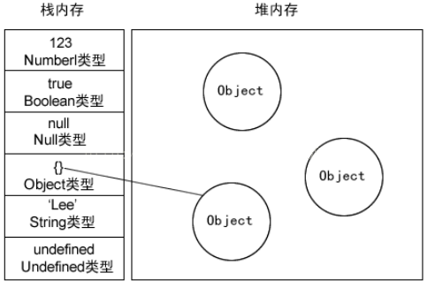

## 1.7.1 原始类型变量与普通类型变量区别

### 内存存放  
原始类型在heap内存中定义变量，并将值复制给变变量，而引用类型在heap内存中定义变量，并在stack内存中定义了值，再讲该值得引用赋给heap内存中的变量。如下图：<br>
<br>

### 动态属性
原始类型是不能添加动态属性的，而引用类型可以添加属性，方法。
```javascript
var a = "originstr";
a.length = 10; // 会创建一个String包装类的临时对象，执行完毕销毁临时对象
console.log(a.length); // undefined 

var b = new Object();
b.name = "yeziTesting";
console.log(b.name); // yeziTesting
```
### 复制变量值
- 原始变量复制：是在heap中新创建一个变量，将值copy一份给新创建的变量。
- 引用变量复制：在heap中新创建一个变量，将地址引用copy一份给新创建的变量。因此两个变量指向的内容实际是同一个。<br>
<br>
<br>

### 参数传递
通常我们在函数中，会从外传递不同类型的参数给调用函数。函数有自己的作用域，而函数的参数即使函数自己的局部变量，函数局部变量 = 参数拷贝。而参数拷贝的是在heap内存中变量存放的值。如下：
- 原始类型传递
```javascript
function originType(count) {
    return count + 1;
}
var count = 10;
console.log(count); // 11
```

- 引用类型传递
以下举了2个函数例子：
1. refType中的局部变量refAddress 复制了外部传入的refAddress的地址。由此两个值指向同一个地址。修改了后，外部同样更改。  
1. refType2中，复制了外部传入的refAddress的地址。但是又自己new了个对象，因此它没有影响到外部的值。
```javascript
function refType(refAddress) {
    refAddress.name = "update";
}
var refAddress = {name:"origin"};
refType(refAddress);
console.log(refAddress); // update

function refType2(refAddress) {
    refAddress = new Object();
    refAddress.name = "mySelf";
}
refType2(refAddress);
console.log(refAddress); // update
```
- 类型检测
原始类型的检测可以使用typeof直接检测出来，如下：
```javascript
console.log(typeof true); // boolean
console.log(typeof "string"); // string
typeof 10; // number
typeof undefined; // undefined
typeof null; // object
```
引用类型的检测使用typeof会都返回object.因此无法具体区分出来是哪个。可以使用instanceof进行判断。
```
var a = new String(10);
var b = "10";
console.log(a instanceof String); // true
conosole.log(b instanceof String); // false
```

## 1.7.2 作用域
### 作用域链
Javascript的，执行环境分为全局执行环境与函数执行环境。没有代码块执行环境(es6中添加了)。 每一个执行环境有对应的变量对象(varaible object)，保存着该环境所有的变量与函数。这个变量对象是无法访问的。但是解析器处理数据时会在后台使用到。
-  全局执行环境：在web浏览器中，我们认为时window对象。因此所全局函数，变量都是添加在window对象的。当关闭网页，应用退出时，全局作用域销毁。
-  函数执行环境：当执行流进入某个函数，该函数被压入环境栈中，执行完毕后，栈将其弹出，并将控制权交还给之前执行的环境。

在执行代码过程中，当执行到某一给环境(当前执行环境)，便会产生作用于域链。生成规则如下：
- 将当前(activation object)激活对象作为作用域前端(当前执行环境)
- 包含当前环境的外部环境
- 循环执行以上两个步骤，直到达到全局执行环境(即为最后一个对象)<br>
<br>
    
```javascript
var globalColor = "red";
function second() {
    var secondColor = "blue";
    var last = function() {
        var lastColor = "yellow";
        console.log("can use lastColor", lastColor);
    }
    last();
    <!-- console.log("can't use lastColor"， lastColor); // lastColor is not defined -->
    console.log("can use secondColor", secondColor);
}
second();
console.log("can use globalColor", globalColor);
<!-- console.log("can't use secondColor", secondColor); -->
```
上面例子解析图如下：<br>
<br>

### 无块级作用域
javascript不像其他语言，它没有块级作用域。因此当我们在一个块定义变量的时候，会将变量添加它所在的函数或全局作用域。
```javascript
for (i = 10; i < 11; i++) {

}
console.log(i); // 10

function varaible() {
    if (true) {
    var a = 1
    }
    console.log(a); // 1
}
varaible();
```
### 变量提升
1. 变量声明：
- 变量声明后，会被添加到所处位置最近的环境中。
- 没有使用var 定义的变量，会直接添加到全局环境。
- 没有使用var进行声明的变量，可以使用delete进行删除
```javascript
(function() {
    var a = 10;
    b = 11;
    delete b;
    delete a;
    console.log(a); // 10
    console.log(b); // b is not defined
})();
```
2. 变量提升
- 将变量替身到函数顶部(只是提升声明，不会提升值).
```javascript
var a = "global";
(function() {
    console.log(a); // undefined. 由自己的作用域查找开始，没找到再往外部作用域查找。在函数作用域的变量对象中(varaible object)a变量，只是还没有被赋值。所以为undefined.
    var a = "part";
})();
```
3. 函数提升
- 将函数提升到函数顶部(函数创建三种方式: 函数声明，函数表达式，构造函数，只有函数声明方式能函数提升)

```javascript
function external() {
    internal(); // internal ， 函数提升
    console.log(internalVariable); // undefined， 变量提升
    console.log(internalFunc); // undefined， 变量提升
    function internal() {
        console.log("internal");
    }
    var internalVariable = "internalVariable";
    var internalFunc = function () {
        console.log("internalFunc");
    }
}
```
当同一个函数多次声明，则以最后一次声明为准的被调用
```javascript
foo(); // 调用，最终以最后一次声明为准：输出1
var foo; // 变量提升
function foo() { // 函数提升
    console.log(1);
}

foo = function() {
    console.log(2);
}
```
当然，如果后面还出现一次foo()函数的定义，那么以最后一次声明为准
```javascript
foo(); // 调用，最终以最后一次声明为准：输出3
var foo; // 变量提升
function foo() { // 函数提升
    console.log(1);
}

foo = function() {
    console.log(2);
}
function foo() { // 函数提升
    console.log(3);
}
```
## 1.7.3 垃圾回收
JavaScript是自动垃圾垃圾回收机制(Garbage Collecation)。不需要我们关心内存使用问题，也不需要手动回收垃圾，程序会周期性地找出哪些是不再需要使用的变量，然后释放内存，自动回进行回收处理。
### 内存生命周期
局部变量：在函数调用时，会在栈（或堆）中分配内存，等待函数执行完毕，变量不再有用，需要回收内存。
### 垃圾回收清除策略 
垃圾回收机制需要跟踪哪些变量没有使用，然后需要对未使用的变量打上标记，等待将来回收占用内存。对变量打标识的策略有两种：
-  标记清除(mark-and-sweep)
当执行流进入到当前执行环境，当前环境的变量都被标记为‘进入环境’，当该作用域执行完毕，将当前环境变量标记为‘离开环境’，等待垃圾回收。
```javascript
function a() {
    var a = 10; // 进入环境标记
    var b = "str"; // 进入环境标记
}
a(); // 执行完毕后，a,b标记为离开环境，等待回收
```
垃圾回收器在运行的时候，会给内存中所有变量打上标记(清理标记)，然后会去掉当前环境的变量以及在其他地方被引用的变量(例如闭包)，被打标记的变量，会被清除掉。这也会出现一个问题：所clear的内存并不是连续的空间，有很多空隙在相互之间，一般会在垃圾回收之后，进行“标记整理”，让不连续的内存往一端复制，使其连续起来。

- 引用计数
引入计数：跟踪每一个变量被引用的次数，当一个变量被引用1次，那么计数就增加1次。取消引用一次，就减1次。当引用次数为0的时候，将会被回收。
```javascript
function test() {
    var a = {}; // a创建，引用次数0
    var b = a; // a 引用 + 1
    var c = a; // a 引用 + 2
    var b = {}; // a 引用 -1
}
test(); // 执行完毕，销毁所有
```
计数引用会有一个相互引用的严重问题。
```javascript
function test() {
    var a = new Object();
    var b = new Object();
    b.nameObject = a; // a 指向的值引用+1
    a.nameObject = b; // b 指向的值引用+1
}
```
a 和 b通过各自的属性相互引用，这两个对象的引用次数都是2.如果采用标记清除，函数离开了作用域，那么就会被垃圾回收。但是使用引用计数，他们的引用次数永远都是2，因此不会被垃圾回收。

## 1.8 闭包
- 在函数内部定义的函数
- 能够访问作用域链(函数内部)上的变量。并始终将访问到的变量值保存到内存中
```javascript
var num = 20;
function a () {
    var num = 10;
    return function () {
        console.log(num++);
    }
}
a()(); // 10
var temp = a();
temp(); // 10
temp(); // 11
```
使用闭包实现计数器
```javascript
function cal() {
    var count = 0;
    return function () {
        console.log(count++);
    };
}
var fun = cal();
fun();
fun();
```
闭包使用注意点
- 使用闭包会将函数中的变量都被保存到内存中，内存消耗大。不能滥用闭包，否则容易内存泄漏。解决办法：退出函数钱，将不使用的局部变量删除或设置为null,让垃圾进行回收。
- 闭包会在复函数外部，改变复函数内部的值。如果将父函数作为对象，拜闭包作为公用方法，把内部属性作为私有变量，小心使用，不要胡乱修改父函数的内部值。
### 1.8.1 this
- 作为函数： this是window
- 作为对象方法： this是对象
- 作为构造函数： this是创建的对象
- call ,apply: this是传入的上下文
- bind: 传入函数的对象即是this.但是如果bind的函数作为构造器调用，则忽略该上下文。
- eval: this是执行eval当前的上下文
- 作为闭包：匿名函数执行环境具有全局性，this指向window
```javascript
// 作为函数
(function a() {
    console.log(this); // window
})();

// 作为对象
var a = {
    x: 1,
    y: function() {
        console.log(this); 
    }
};
a.y(); // a
(a.y)(); // a ,对a.y加上括号，也是对a.y的引用的，this得到位置
(a.y = a.y)(); // window， 执行赋值语句， 这个赋值表达式的值执行后的结果是函数本身，所以this的值得不到维持。

function add() {
    console.log(this);
}
a.add = add;
a.add(); // a对象

// (a.add = b.add), 返回的是目标函数的引用，因此调用位置是add()而不是a.add()或者b.add(), 因此这里引用默认绑定
(a.add = add)(); // window

// 作为构造器
function A() {
    console.log(this);
}
var b = new A(); // A

// 作为call ,apply
var c = {x: 3};
a.y.call(c); // c

// bind
var d = {x: 5};
var f = a.y.bind(d);
f(); // d

// 作为闭包
var name = "the window";
var obj = {
    name: 'my Name',
    getName: function() {
        var that = this;
        return function() {
            console.log(this.name);  // this 是window
            console.loog(that.name); // my Name
        } 
    }
};
obj.getName()();
```

函数里面调用别的函数不算闭包
```javascript
var scope = 'global';
function a() {
    console.log(scope);
}
function b() {
    var scope = "local";
    return a;
}
b()();
```