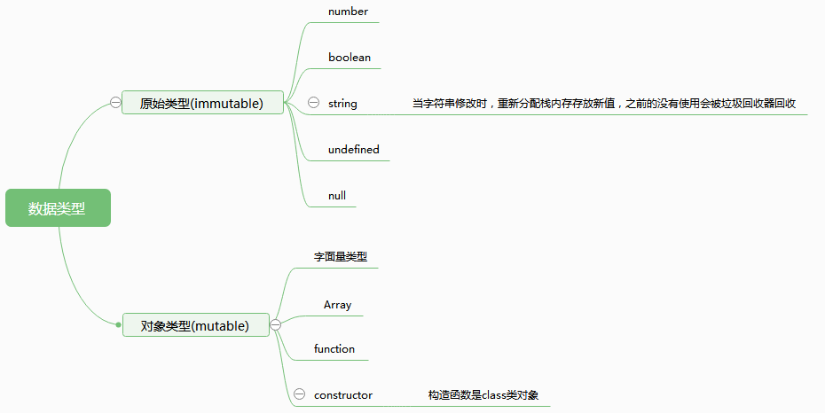

# 1 数据类型分类

在javascript中，数据一般分为两种类型，叫原始类型与对象类型，或叫可变类型或不可变（immutable and mutable\)，或叫有方法与没有方法类型。数据分类见下图：  
<br>

每一个原始类型(除去undefined, null),都有基本包装类型。基本包装类型归类划分到引用类型。包装类与一般的引用类型的区别就是生存周期。调用生成，调用完毕销毁。下面是基本类型与包装类型的对应。
| 基本类 | 包装类型 | 创建方式 |
| :--- | :--- | :--- | :--- |
| boolean | Boolean | var bool = new Boolean(true) |
| string | String | var str = new String('string') |
| number | Number | var num = new Number(10) |

## 原始类型调用方法原理

我们可以在原始类型上调用包装类的方法，但是不能给原始类型添加属性。例如：

```javascript
    var a = 'hello,world';
    a.len = 11;
    console.log(a.len); 
```
上面结果为undefined,我们明明给它添加了方法，但是却没有在调用的时候却没有生效，这是为什么？执行过程如下(2,3,4步骤为调用原始类型方法时执行)：
- 1.创建一个原始类型字符串a
- 2.当调用包装类方法时：会临时创建一个包装类
- 3.给包装类设置len属性
- 4.删除临时包装类
- 5.打印原始类a身上的len属性(undefined) 

## 使用原始类做参数创建包装类

我们在创建包装类是，一般使用包装类构造函数进行创建，但是需要注意一点，如果直接使用构造函数结果类型并不是包装类，必须使用new方法创建。

```javascript
var a = "origin";
var b = new String(a);
var c = String(a);
console.log(typeof b); // object
console.log(typeof c); // string
```
## 引用类型与原始类型（可变类型与不可变类型）值比较
我们在比较的时候，基本类型对比的是值，引用类型对比的是地址。可以认为对比的是存储于栈内存的存放的是否相等。
- 基本类型的值存放于栈内存，按值来访问。
- 引用类型的地址存放于栈内存，该地址指向堆(heep)中的对象。按引用访问。
<br>
```javascript
var a = "string1";
var b = "string1";
console.log(a === b); // true
var c = new String(a);
var d = new String(b); 
var e = c;
console.log(c === d); // false
console.log(c === e); // true
```
# undeclared
undeclared: 是代码中未声明的变量
undefined: 是代码中未赋值的变量
```javascript
typeof undeclared_var; //  undefined
type undefined_var; // undefined
```