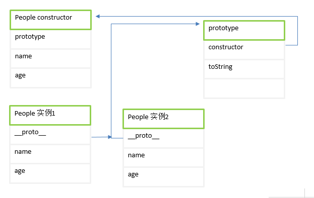

类使用new关键字通过构造函数进行创建。新创建的对象都有prototype属性指向构造函数.prototype上定义的方法在所有创建的实例中时共享的。图解：
- People.prototype 指向原型对象
- 原型对象的constructor指向People构造函数：People.prototype.constructor == People
- People每个实例的__proto__指向原型对象。(注意存在于实例与原型对象，不是实例与构造函数之前)<br>
<br>

```javascript
function People(name, age) {
    this.name = name;
    this.age = age;

    // 不建议在构造函数内部添加方法，因此这样会在每次new的过程中，每个方法都要在每个实例上重新创建一遍，这将非常损耗性能。
    this.toString2 = function() {
        console.log('this: innter function' + this.name);
    }
}

var people = new People('yezi', 20);
console.log(people.constructor == People);  // true
console.log(people instanceof People); // true

// 要修改原型第一种：需要设置constructor
People.prototype = {
    toString: function () {
        return "name: " + this.name + ", age:" + this.age;
    }
};
Object.defineProperty(People.prototype, 'constructor', {
    value: People,
    enumerable: false,
    writable: true,
    configurable: true
});
// 因为此时的prototype已经重写，而定义people时，时使用的prototype的地址已经和现在的不一样了
var people2 = new People("prototype modify and have the new toString()", 20); 
console.log(people2.toString()); // name: prototype modify and have the new toString(), age:20
console.log(people.toString()); // [object Object]

// 第二种：直接添加方法
People.prototype.toString = function() {
    return "name: " + this.name + ", age:" + this.age;
}
```
获取对象的原型与判断
- Object.getPropertyOf()
- ClassName.isPropertyOf(instanceObject)
- instanceObject.propertyIsEnumerable(propertyName)
- instanceObject.hasOwnProperty(propertyName)
- in： 原型链也能检测,`enumerable 为false时，也能检测`
- for in: 原型链都会遍历,如果`enumerable设置为false,则不能遍历`
- Object.keys(instanceObject):用于获取对象自身所有的`可枚举`的属性值，但不包括原型中的属性，然后返回一个由属性名组成的数组。
- Object.getOwnPropertyNames()： 返回对象的所有自身属性的属性名（`包括不可枚举的属性`）组成的数组，但不会获取原型链上的属性。
```javascript
function People(name, age) {
    this.name = name;
    this.age = age;
}
People.prototype.toString = function() {
    return "name: " + this.name + ", age:" + this.age;
};
var people = new People("yezi", 20);
console.log(Object.getPrototypeOf(people));
console.log(People.prototype.isPrototypeOf(people)); // true
console.log(people.hasOwnProperty('name')); // true
console.log(people.propertyIsEnumerable('age')); // true
console.log(people.constructor); // constructor属性是在原型链上的，不是对象自身的属性

console.log('toString' in people); // true
for(var item in people) {
    console.log(item); // name age toString
}

Object.defineProperty(people, 'job', {value: "doctor"， enumerable: true})
console.log(Object.keys(people)); // [name, age, doctor],
```
屏蔽属性： 当给一个对象新增一个属性或者修改属性值 `a.x = 'bar';`, 经历了什么！
- 访问`a`中是否包含`x`属性，`prototype`也会被遍历查找，找不到直接添加到`a`上
```javascript
var a = {x: 1};
var b = Object.create(a);
b.x = 10; // 会在b上新增一个x属性
```
- 当`b`没有`x`属性，在`prototype`上存在,但是`writable:false`, 则不能添加到`b`上，也不能修改`a`
```javascript
var a = {};
Object.defineProperty(a, 'x', {
    writable: false
});
var b = Object.create(a);
b.x = 20; // 严格模式下会报错。 费严格模式下行 a，b 都没有任何变化
```
- 当`b`没有`y`属性，在`prototype`上存在，但是一个`setter`函数,会在`b`身上添加自己的`y`属性。【在我不知道的javascript】书中，结论是否反的。
```javascript
var a = {x: 10};
Object.defineProperty(a,'y' ,{
    get: function () { return this.x * 2;},
    set: function(value) { this.x = value},
    enumerable: true,
    configurable:false
})
var b = Object.create(a);
b.y = 30; 
console.log(b.y); // 输出60 
console.log(a.y); // 输出20， b增加了自己的y属性 
```
