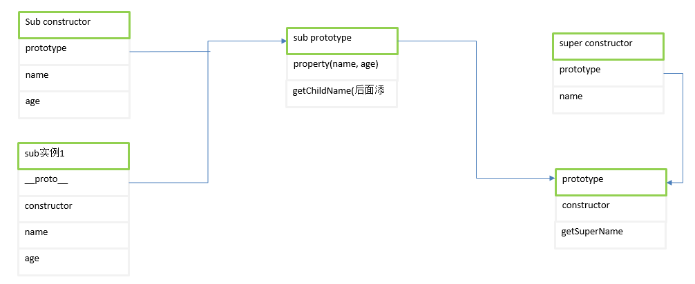
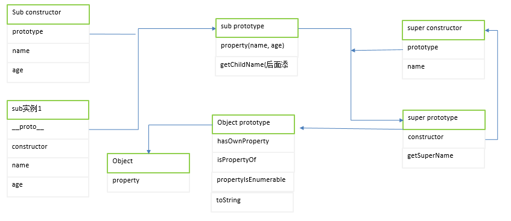
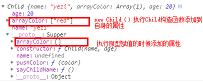
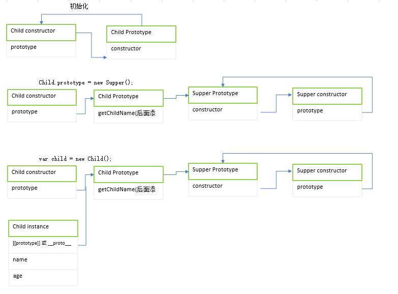

## 封装
```javascript
function People(name, age) {

    // 公有属性，添加到对象身上，外部能够访问
    this.name = name;

    // 私有属性，外部不能访问
    var newAge = undefined;

    // 共有方法，能够通过这个方法访问私有属性
    this.getAge = function() {
        return newAge;
    }

    // 私有方法，外部不能访问，内部可操作
    function updateAge() {
        newAge = age + 10;
    }
    // 内部调用
    updateAge();
}

var people = new People("yezi", 10);

// 调用共有属性
console.log(people.name); // yezi
// 调用私有属性 
console.log(people.newAge); // undefined
console.log(people.getAge()); // 20
console.log(people.updateAge()); // people.updateAge is not a function
```

## 继承
### 原型链继承
问题：
- 原型的构造函数指向父类，原型实际变成另一个类型的实例，父类中的属性顺理成章变成现在的原型属性。父类中的属性会被不同实例共享。
- 创建子类型的实例时，不能向父类型中传递参数。没办法在不影响所有对象实例的情况下给父类传递参数。
```javascript
function Supper() {
    this.name = "Supper";
    this.arrColor = [];
}
Supper.prototype.getSupperName = function() {
    return this.name;
}
function Child() {
    this.name = "child";
    this.age = 10;
}
Child.prototype = new Supper();

// 添加方法或重写要放在替换原型之后
Child.prototype.getChildName = function() {
    return this.name + this.age;
};
Child.prototype.getSupperName = function() {
    return this.age;
}

var c = new Child();
console.log(c.__proto__);
console.log(Child.prototype);
console.log(c.getChildName());

console.log(c instanceof Object); // true
console.log(c instanceof Supper); // true
console.log(c instanceof Child); // true

// 只要原型链中出现过的都是实例的原型
console.log(Object.prototype.isPrototypeOf(c)); // true
console.log(Supper.prototype.isPrototypeOf(c)); // true
console.log(Child.prototype.isPrototypeOf(c)); // true

// 父类中的属性会被不同实例共享。
Supper.prototype.setColor = function (color) {
    this.arrColor.push(color);
};
c.setColor('red');
var b = new Child();
console.log(b.arrColor); // ['red']
```
此时Child的实例的constructor是指向的Supper.因此Child的prototype重写的原因。变量搜索如下：<br>
- 搜索Child的实例对象
- 搜索Child的prototype
- 搜索Supper的prototype<br>
<br>
下面时加上object继承的图解：<br>
<br>

### 借用构造函数
- 借用构造函数，是利用call或apply在子构造函数中进行调用父类。这样就会有自己的父类副本，不父类中的值不会公用。问题：所有子类需要的方法都需要在构造函数中创建，达不到复用。
- 借用构造函数能够传参数
```javascript
function Supper(name) {
    this.name = name;
}
function Child(name, age) {
    Supper.call(this, name)
    this.age = age;
}

```
### 组合式继承
组合继承是最常用的继承方式，但是它的问题在于会调用两次父类构造函数。
- 第一次是在子类构造器中 Supper.call(this, ...param)
- 第二次是在设置子类的prototyp: Child.prototype = new Supper();
```javascript
function Supper(name) {
    this.name = name;
    this.arrayColor = [];
}
Supper.prototype.saySpperName = function() {
    console.log(this.name);
};
function Child(name, age) {
    Supper.call(this, name)
    this.age = age;
}
Child.prototype = new Supper();
Child.prototype.constructor = Child;
Child.prototype.sayChildName = function() {
    console.log("child:" + this.name);
}
Child.prototype.pushColor = function(color) {
    this.arrayColor.push(color);
}

var c1 = new Child('yezi', 20);
c1.pushColor('red');
var c2 = new Child('yezi', 20);
c2.pushColor('yellow');
console.log(c1.arrayColor); // ['red']
console.log(c2.arrayColor); // ['yellow']
```
上面的代码中：
- 设置Child的原型为new Supper()时，Child.prototype会新增name 和arrayColor(是Supper的实例属性，现在位于Child的原型中)。
- 当调用Child的构造函数时，又一次在新对象上创建实力属性name和arrayColor,但是会屏蔽原型中的同名属性。
c1的数据图解：<br>
<br>

### 原型式继承
想继承已经有的对象，并且不需要创建自定义类型。
- Child方法会继承Super所有的内容
- Child原型指向Supper的对象
```javascript
function extend(o) {
    function Child() {
    }
    Child.prototype = o; 
    // 在这里定义的内容无法在外部访问
    <!--Child.prototype.setColor = function(color) {
        this.arrayColor.push(color);
    }-->
    return new Child();
}
function Supper() {
    this.name = "supper";
    this.arrayColor = [];
}
var child = extend(new Supper());

// 等同于 Es5的Object.create
var c1 = Object.create(new Supper());
```
### 寄生继承
寄生式继承的思路与继承式构造函数和工厂模式类似，创建一个封装继承过程的函数，在函数内部用某种方式增强对象，最后再像真的是它做了所有工作一样返回对象。
```javascript

// 原型式继承
function extend(o) {
    function Child() {
    }
    Child.prototype = o; 
    return new Child();
}

// 寄生继承： 使用了原型式继承
function createExtend(o) {
    
    // 也可以使用Object.create()
    var clone = extend(o);
    clone.sayHi = function() {
        console.log("hi");
    }
    return clone;
}

// 使用
var a = {x: 1};
var b = createExtend(a);
b.sayHi();
```
在主要考虑对象而不是自定义类型和构造函数的情况下，寄生式继承也是一种有用的模式。前面的extend(o)不是必须的，任何能返回一个新对象的函数都能适应此模式。

### 寄生组合式继承
解决组合继承的方式，就是寄生组合式继承。借用构造函数来继承属性，通过原型链的混成形式来继承方法,实现方式如下：
- 不必为指定子类型的原型而调用超类构造函数。我们需要的只是超类型的一个副本而已，本质就是使用寄生式继承来继承超类的原型，然后再将结果指定给子类型的原型。
```javascript
function inheritPrototype(Supper, Child) {
    var prototype = Object.create(supper.prototype);
    prototype.constructor = Child;
    Child.prototype = prototype;
}

function Supper(name) {
    this.name = name;
}
function Child(name, age) {
    Supper.call(this, name);
    this.age = age;
}
inheritPrototype(Supper, Child);
Child.prototype.sayHi = function() {
    console.log("hi");
}

```
<br>

## 多态
多态实现形式包括：接口，抽象类，重载，重写。
- js中不支持接口和抽象类/方法，把接口和抽象类中需要实现的方法都抛出异常，如果没有被实现就会报错。
- js中不支持函数重载，根据arguments来判断参数个数和类型，然后再函数体中分情况执行不同的代码。
- js唯一支持的就是函数的重写了，子类重写父类的方法是完全没有问题的。所以说，js原生实现的多态就只有函数重写，其他的形式可以通过某些技巧来模拟。