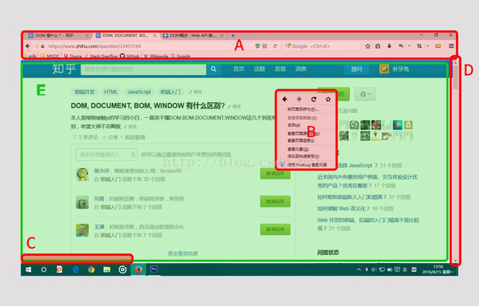
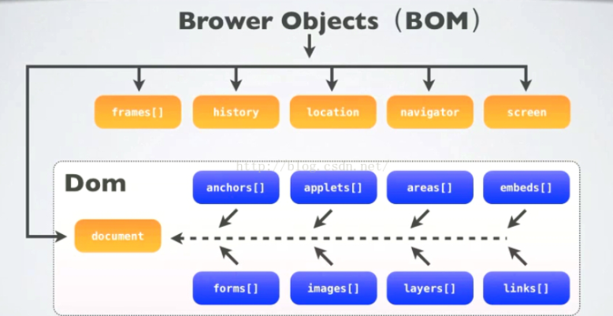
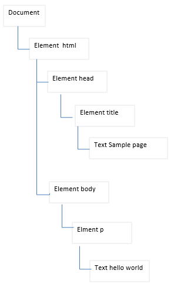
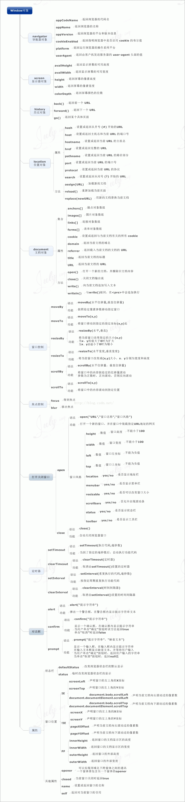
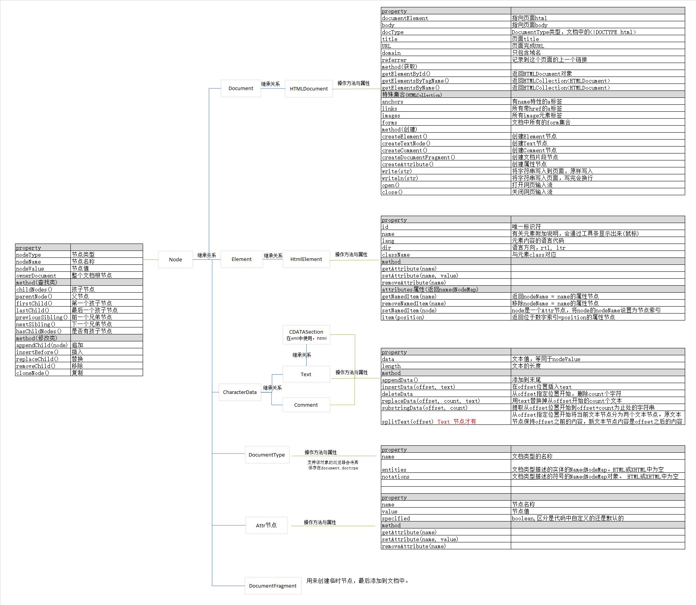

## javascript的组成
javascript组成为ECMAScript，DOM, BOM组成。根据宿主(浏览器)不同，具体表现也不同。<br>
| 组成元素 | 描述|
| :--- | :--- |
| ECMAScript(核心) | 描述js语法和基本对象 |
| 浏览器对象模型(BOM) | 与浏览器交互的方法和接口 |
| 文档对象模型(DOM) | 处理网页内容的方法和接口 |
- DOM: W3C标准，所有浏览器共同遵守的标准
- BOM: 各个浏览器厂商根据DOM在各自的浏览器上的实现。不同浏览器之间有差异。
- window是BOM对象。而非js对象。javascrip可以根据访问BOM对象来访问，控制，修改客户端(浏览器)

ECMAScript知识拓展：
- ECMAScript时标准，js知识它的一个实现，而其他的实现包括ActionScript
- “ECMAScript可以为不同种类的宿主环境提供核心的脚本编程能力……”，即ECMAScript不与具体的宿主环境相绑定，如JS的宿主环境是浏览器，AS的宿主环境是Flash。
- ECMAScript描述了以下内容：语法、类型、语句、关键字、保留字、运算符、对象。

## DOM, BOM, document, window的区别
DOM是为了操作文档出现的api,document时其的要给对象。<br>
BOM是为了操作浏览器出现的api,window是它的一个对象。<br>
BOM是浏览器对象模型，DOM是文档对象模型，前者是对浏览器本身进行操作，而后者是对浏览器（可看成容器）内的内容进行操作！<br>
<br>
BOM管：
- E区： 是document，开发写出来的文件夹。部署在服务器上，可以在浏览器中输入地址回车，将这个document加载到本地浏览，右键还能查看源代码。
DOM管
- A区： 浏览器的标签页，地址栏，搜索栏，书签栏，窗口放大还原关闭按钮，菜单栏.
- B区： 浏览器右键菜单
- C区： document加载时的状态栏，显示http状态吗等
- D区： 滚动条scrollbar

### BOM与DOM的关系
由于BOM中包含了document对象，而document对象时DOM的对象，通过window.document可以操作DOM的文档。可以认为BOM中包含了DOM(对象)。浏览器提供来给予访问BOM对象，从BOM对象再访问到DOM对象，从而js可以操作浏览器以及浏览器读取到的文档。<br>
<br>
window对象包含属性： document, location, history, screen, navigator, frames<br>
document对象包含属性：forms, location, anchors, images, links.<br>
### DOM
DOM(document object model)文档对象模型。针对XML的基于树的API,处理页面的方法和接口，是html和xhtml的api,DOM把整个页面规划成由节点层级构成的文档。<br>
DOM定义了一个HTMLDoducment和HTMLElement作为这种实现的基础，也就是说为了能够以编程方式操作这个HTML的内容(添加，修改，删除元素)，我们把这个HTML看成是一个对象树，它本身和里面的所有东西(如`<div></div>`)这些标签都看做一个对象，每个对象叫做一个节点(node),节点可以理解为DOM中所有的Object的父类。<br>
<br>
Dom 想操作HTML元素的时候，比如我们把js title修改：
```javascript
document.title = 'hello, you update me';
```
### document
当下载一个网页，通常时html,这个html就叫`document`(这也是DOM书中的一个node).从上图看出，document是整个DOM树的根节点。这个document包含标题`document.title`,URL`document.URL`等属性，可以直接在js中访问。
一个浏览器可以有多个document,例如包含其他的iframe界面，每一个窗口就是一个document.可以通过document访问其子节点：
```javascript
document.body;
document.getElementById('xxx')
```
### BOM
BOM时为了控制浏览器行为而出现的接口。例如浏览器url变化，页面的前进后退，屏幕的大小等。BOM对象的核心是window,window又具有双重特性：
- 它既是BOM核心，可以通过js访问浏览器的接口
- 它又是Global全局对象，在页面中定义的任何对象，函数，变量，都能够从window访问到。
由于BOM的window对象包含了document,因此可以直接使用window操作document属性。相当于直接访问，检索，修改xhtml文档内容和结构。
### window
window是BOM的一个对象，除去能够通过document进行操作文档结构以外，还能获取窗口位置，确定窗口大小，弹出对话框等。

## window 和 document的思维导图
window思维导图
<br>
document思维导图
<br>