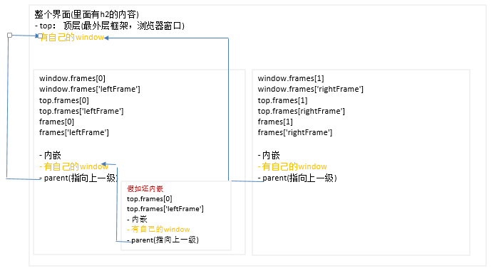

ECMAScript是javascript的核心，但是在web中使用javascript,BOM(Broswer Object Model)浏览器对象模型才是核心。<br>
BOM的核心对象是window,表示浏览器的一个实例。单window又是ECMAScript中Global的对象，因此在网页中定义任何对象，函数，变量，window作为Global的对象，都可以访问。
<br> 
window 对象属性 <br>

| 对象属性 | 描述 | 
| :--- | :--- |
| document | Doducment对象的引用，DOM的根节点。 |
| screen | Screen 对象的只读引用 |
| navigator | Navigator 对象的只读引用 |
| location | 用于窗口或框架的Location对象的只读引用 |
| history | History 对象的只读引用 |

<br>BOM的window上还有一些属性，如下列表所示：<br>

| 基本属性 | 描述 |
| :--- | :--- |
| closed | 返回窗口是否已经被关闭 |
| defaultStatus | 设置或返回窗口状态栏的默认文本 |
| status | 设置窗口状态栏的文本 | 
| innerheight | 返回窗口的文档显示区的高度 |
| innerwidth | 返回窗口的文档显示区的宽度 |
| outerheight | 返回窗口的外部高度 |
| outerwidth | 返回窗口的外部宽度 |
| pageXOffset | 设置或返回当前页面相对于窗口显示区左上角的 X 位置 |
| pageYOffset | 设置或返回当前页面相对于窗口显示区左上角的 Y 位置 |
| length | 设置或返回窗口中的框架数量 |
| name | 设置或返回窗口的名称 |
| opener | 返回对创建此窗口的窗口的引用 |
| parent | 父窗口 |
| self | 返回对当前窗口的引用，等价于 Window 属性 |
| window | window 等价于self属性，包含对窗口自身的引用 |
| screenLeft screenTop screenX screenY | 只读整数。声明了窗口的左上角在屏幕上的的 x 坐标和 y 坐标。IE、Safari 和 Opera 支持 screenLeft 和 screenTop，而 Firefox 和 Safari 支持 screenX 和 screenY | 


## window 对象
### 全局作用域
window作为Global的对象的角色，在全局作用域定义的变量，函数会变为window对象的函数，变量。全局变量与直接定义在window身上的变量的区别：
- 使用var定义的属性，会将configurable设置为false， 因此不能删除。全局变量delete会失败，定义在window身上的属性能删除成功。

```javascript
// 定义全局变量与函数(会添加到window身上，但是configurable为false，不能删除)
var name = 'hello,global';
function getName () {
	console.log(this.name);
}
console.log(window.name);
window.getName();
var deleteName = delete name;
console.log(deleteName); // false

// 定义window身上的变量与函数
window.name2 = 'hello, global2';
window.getName2 = function() {
	console.log(this.name2);
}
console.log(window.name2);
window.getName2();
var deleteName2 = delete window.name2; 
console.log(deleteName2); // true
```
属性的查询不会报错，但是未申明的变量，会报错。
```javascript
console.log(window.a); // undifined
console.log(a); // a is not defined
```
### 窗口关系与框架
一个页面拥有自己的window对象，但是当一个页面中嵌套了另外的框架，此时这些框架也会有自己的window对象。例如下面的例子：
```html
<html>
    <head>
        <title>Frameset Example</title>
    </head>
    <body>
		<h2>the top title</h2>
		<iframe src="https://www.baidu.com"  name="leftFrame"></iframe>
		<iframe src="https://www.gitbook.com"  name="rightFrame"></iframe>
	</body>
</html>
```
上面的页面，会将框架保存在frames集合中，索引从0开始（从左到右，从上到下存储）。每个框架有自己的window对象。`top`指向最顶层的框架。改界面的关系如下：
<br>
- 在内嵌的window对象中，有`parent`属性，指向当前库降价的直接上层框架。如果没有任何内嵌框架，那么`window == top`.
- 在框架中海油一个对象self,始终指向window.self和window对象可以互换使用。
- 不同层次的window链接可以通过：`window.parent.parent.frame[0];`方式使用链接起来。
- 因为内嵌窗口，都有自己的window,而window的object不一定相等(window.Object 不等于window.frames[0].Object)。影响到对跨框架传递对象使用instanceof操作符。
### 窗口位置
窗口相对于屏幕左上角的位置，通过以下方法获取：
- IE,Opera,Safari,Chrome: ScreenLeft, screeenTop（IE我尝试了，已经支持ScreenX, ScreenY）
- firefox: ScreenX, ScreenY
```javascript
var left = window.screenLeft || window.screenX;
var right = window.screeenTop || window.screenY;
```
注意点（以下是我的测试结果，其他地方描述不一样）：
- IE, Opera: screenLeft，screenTop保存从屏幕左边和上边到由window对象表示的页面可见区域的距离。
- Chrome,Firefox,Safari:screenY,screenTop保存的是整个浏览器窗口相对于屏幕的坐标值。
无法精确地做到跨浏览器的条件下取得窗口的左边和上边的精确坐标值。
我自己的实践情况：
1. ie的screenLeft，screenTop图解：
<br>
1. ie和firefox: screenX与ie的ScreenY: 返回-8px。当按F11全屏，返回0.
1. Chrome都返回0
```javascript
// 位置相关方法
moveBy(); //可相对窗口的当前坐标把它移动指定的像素。
moveTo(); //把窗口的左上角移动到一个指定的坐标。
open(); //打开一个新的浏览器窗口或查找一个已命名的窗口。
print(); //打印当前窗口的内容。
```
### 窗口大小
```javascript
var pageWdth = window.innerWidth || document.documentElement.clientWidth || document.body.clientWidth;
var pageHeight = window.innerHeight || document.documentElement.clientHeight || document.body.clientHeight;
```
关于outerheight,outerwidth等尺寸相关的，后面总结
- resizeTo(needX, needY): 调整浏览器窗口到width= needX, height = needY
- resizeBy(addPxX, addPxY): 对现有的浏览器添加width = currentWidth + addPxX, heigth = currentHeight + addPxY;
- scrollBy(xnum, ynum): 把文档向右滚动的xnum像素,想下滚动ynum像素。
- scrollTo(xnum, ynum): xnum是窗口文档显示区左上角x坐标, ynum是y坐标。

### 导航和打开窗口
window.open(url, target, str, boolValue)
- url: 页面路径
- target: _self, _blank, _parent, _top
- boolValue: 是否取代浏览器历史记录中当前加载页面的布尔值
- str: 当第二个参数没有，或者写的框架不存在，会按照str里面设置的规则打开一个新的窗口。
<br>

```javascript
// 如果有'topFrame'的窗口或框架，则会在改窗口或框架中加载url。
window.open('http://www.baidu.com', 'topFrame'); 
// 等价于
// <a href="http://www.baidu.com" target="topFrame">

var openWindow = window.open('www.baidu.com', '_blank', "height=300,width=400,top=30,status=true", true)

// 新打开窗口的opener属性指向Top
console.log(openWindow.opener == top); // true
// 关闭新打开的窗口
openWindow.close();
// 查看窗口状态
console.log(openWindow.closed); // true
```
#### 弹出窗口屏蔽程序

曾经有一段时间，广告商在网上使用弹出窗口达到了肆无忌惮的程度。他们经常把弹出窗口打扮成系统对话框的模样，引诱用户去点击其中的广告。由于看起来像是系统对话框，一般用户很难分辨是真是假。为了解决这个问题，大多数浏览器内置有弹出窗口屏蔽程序，将绝大多数用户不想看到弹出窗口屏蔽掉。
于是，在弹出窗口被屏蔽时，就应该考虑两种可能性。如果是浏览器内置的屏蔽程序阻止的弹出窗口，那么 `window.open()` 很可能会返回 `null`，如果是浏览器扩展或其他程序阻止的弹出窗口，那么 `window.open()` 通常会抛出一个错误。因此，要想准确地检测出弹出窗口是否被屏蔽，必须在检测返回值的同时，将对 `window.open()` 的调用封装在一个 `try-catch` 块中，如下所示。
``` javascript
var blocked = false;

try {
    var win = window.open("http://shijiajie.com", "_blank");
    if (win == null){
        blocked = true;
    }
} catch (ex){
    blocked = true;
}
if (blocked){
    console.log("The popup was blocked!");
}
```
### 计时器（间歇性调用setInternal ,超时调用setTimeout）
- setInternal(function or functionStr, 1000): 每隔1000毫秒执行你想执行的内容
- clearInteral: 清除定时器
- setTimeout(function or functionStr, 1000): 1000毫秒以后执行你想执行的内容
- clearTimeout: 清楚超时调用

```javascript
// 第一个参数最好传入函数，不要写字符串
setTimeout('alert("hello")', 1000);
setTimeout(function() {
	console.log('hello');
}, 1000);
```
javascript是单线程。一定的时间内只能执行一段代码。为了控制代码的执行，会有要给执行队列。计时器的第二个参数时表示等待多长时间的毫秒数，并不代表过了这段时间会立马执行。而是过了这段时间将这段代码添加到执行队列中。如果队列是空的，立马执行，否则会等前面的代码执行完毕后再执行。
```javascript
console.log(1);
function a() {
	console.log(2);
	setTimeout(function() {
		console.log(3);
	}, 0);
	console.log(4);
}
a();
console.log(5); 

// 执行结果：1 2 4 5 3
```
setTimeout和setInterval 会返回一个数值Id,表示本次任务的唯一表示。可以用来取消还未执行的任务。
```javascript
var timeOutId = setTimeout(function(){
	console.log('cancel');
}, 1000);
clearTimeout(timeOutId);

var intervalId = setInterval(function() {
	console.log('cancel');
}, 1000);
clearInterval(intervalId);

```
利用超时实现间隔调用
```javascript
var i = 0;
function timeout() {
	if (i < 10) {
	setTimeout(timeout, 1000);
	} else {
		console.log('completed');
	}
	
}
timeout();
```
### 系统对话框
- alert()
- prompt(): 提示框，用户在输入框中输入内容，点击ok,返回输入的内容，点击取消，返回null.
- confirm():  确认对话框，点击ok返回true,cancel(或X)按钮返回false。
```javascript
alert("i am alert");
var input = prompt();
if (input) {
	console.log('welcome '+ input);
} else {
	var result = confirm('you don\'t input prompt content');
	console.log('you choose :' + result);
}
```
- print(): 显示打印对话框
- find(): 显示查找对话框

## Location对象实例location
location是BOM的最有用的对象之一。提供了与当前窗口中加载的文档有关的信息。还提供一些导航功能。
- window的属性
- document的属性
```javascript
console.log(window.location == document.location); // true
```
### 属性
<br>


获取url参数函数
```javascript
function getParam() {
    var url = location.search.slice(1);
	var paramUrl =  url && url.split(/&/) || [];
    let reuslt = [];
    paramUrl.map(function(item, index) {
		var regExp = /(.+)=(.+)/;
        item.search(regExp);
  		reuslt[decodeURIComponent(RegExp.$1)] = decodeURIComponent(RegExp.$2);
	})
	console.log(reuslt);

}
```

### 方法
- assign(): 使当前窗口载入并显示指定的url中的文档。不会清除当前文档。会在历史记录中生成一条记录。
- replace()：是当前窗口载入并显示指定url的文档，并且删除当前文档不会记录到历史记录中。只会影响到跳转前的当前文档。对于已经记录在历史记录中的记录，不会影响。
- reload(boolValue)： 浏览器重新载入当前文档。如果参数时true,强制从服务端下载。默认为先加载缓存。

通过`window.location = 'xxxx'`和`location.herf= 'xxxx'`实际时调用assgin方法。
```javascript
location.assign('www.baidu.com');
location.replace('www.baidu.com');
location.reload();

// 更直接的跳转方式
location = 'www.baidu.com';
// 相对路径给lcation
location = 'page.html';
```
纯粹的片段标识符（hash）是相对url的一种。不会让浏览器重新载入页面，只是滚动当当前页面的某个位置。`#top`是一个特殊的例子：如果页面没有id为`top`的元素，则会让浏览器滚动到文档开始处。
```javascript
location = 'https://translate.google.com/#top';
```
<br>


## navigator
navigator`对象：包含大量有关Web浏览器的信息，在检测浏览器及操作系统上非常有用.
```javascript
window.navigator.appCodeName //浏览器代码名
window.navigator.appName //浏览器步伐名
window.navigator.appMinorVersion //浏览器补钉版本
window.navigator.cpuClass //cpu类型 x86
window.navigator.platform //操作体系类型 win32
window.navigator.plugins
window.navigator.opsProfile
window.navigator.userProfile
window.navigator.systemLanguage //客户体系语言 zh-cn简体中文
window.navigator.userLanguage //用户语言,同上
window.navigator.appVersion //浏览器版本(包括 体系版本)
window.navigator.userAgent//用户代理头的字符串表示
window.navigator.onLine //用户否在线
window.navigator.cookieEnabled //浏览器是否撑持cookie
window.navigator.mimeTypes
```

## screen
screen不常用。表示一客户端的额能力，包含浏览器窗口外部的显示器信息，例如像素宽度和高度等。常用属性：
```javascript
window.screen.width //屏幕宽度
window.screen.height //屏幕高度
window.screen.colorDepth //屏幕颜色深度
window.screen.availWidth //可用宽度(除去任务栏的高度)
window.screen.availHeight //可用高度(除去任务栏的高度)
```
## History
- back(): 像后退一格。(url)
- forward(): 向前退一个。(url)
- go(): 指定页数。正数向前，负数向后。
对于在一个界面中内嵌的iframe，也会计入history的历史记录中。因此可能你点击back()后，主题框架没有任何变化，只是iframe里面的内容修改了。

## Document
HTMLDocument继承于Document,进行了拓展，定义了HTML专用的属性和方法
### 属性
```javascript
document.cookie	返回与当前文档有关的所有 cookie。
document.body//提供对 <body> 元素的直接访问。对于定义了框架集的文档，该属性引用最外层的 <frameset>。
document.title //返回文档标题等价于HTML的title标签
document.domain	返回当前文档的域名。
document.URL //设置URL属性从而在同一窗口打开另一网页
document.referrer	返回载入当前文档的文档的 URL。
document.lastModified	返回文档被最后修改的日期和时间。
```

### 常用对象方法
```javascript
document.write(); //动态向页面写入内容
document.writeln();	//等同于 write() 方法，不同的是在每个表达式之后写一个换行符。
// document.createElement(<Tag>); //用指定标签类型创建一个新的element对象)
document.getElementById(ID); //获得指定ID值的对象
document.getElementsByName(Name); //获得指定Name值的对象
document.getElementsByTagName()	;返回带有指定标签名的对象集合。
```

### body-主体子对象
```javascript
document.body //指定文档主体的开始和结束等价于body>/body>
document.body.bgColor //设置或获取对象后面的背景颜色
document.body.link //未点击过的链接颜色
document.body.alink //激活链接(焦点在此链接上)的颜色
document.body.vlink //已点击过的链接颜色
document.body.text //文本色
document.body.innerText //设置body>…/body>之间的文本
document.body.innerHTML //设置body>…/body>之间的HTML代码
document.body.topMargin //页面上边距
document.body.leftMargin //页面左边距
document.body.rightMargin //页面右边距
document.body.bottomMargin //页面下边距
document.body.background //背景图片
document.body.appendChild(oTag) //动态生成一个HTML对象
```
### HTMLElement犯法
方法里有a,b的参数仅仅是为了加深说明,其他元素没有a,b不代表是无参方法
node属性
- element.nodeName	返回元素的名称。
- element.nodeType	返回元素的节点类型。
- element.nodeValue	设置或返回元素值。
node方法
- element.childNodes	返回元素子节点的 NodeList。
- element.firstChild	返回元素的首个子。
- element.lastChild	返回元素的最后一个子元素。
- element.nextSibling	返回当前元素之后的兄弟元素
- element.appendChild()	向元素添加新的子节点，作为最后一个子节点。
- element.insertBefore(<a>,<b>)	在指定的已有的子节点之前插入新节点。A插到b前
- element.cloneNode()	克隆元素。
- element.removeChild(a)	从元素中移除子节点。
- element.replaceChild(a,b)	替换元素中的子节点。
- element.hasChildNodes()	如果元素拥有子节点，则返回 true，否则 false。
- element.normalize()	合并元素中相邻的文本节点，并移除空的文本节点。
- element.ownerDocument	返回元素的根元素（文档对象）。
- element.parentNode	返回元素的父节点。
- element.previousSibling	返回当前元素之前的兄弟元素
- nodelist.item()	返回 NodeList 中位于指定下标的节点。
- nodelist.length	返回 NodeList 中的节点数。

element属性
- element.id	设置或返回元素的 id。
- element.innerHTML	设置或返回元素的内容。
- element.lang	设置或返回元素的语言代码。
- element.dir	设置或返回元素的文本方向。
- element.namespaceURI	返回元素的 namespace URI。
- element.tabIndex	设置或返回元素的 tab 键控制次序。
- element.tagName	返回元素的标签名。
- element.title	设置或返回元素的 title 属性。
- element.textContent	设置或返回节点及其后代的文本内容。
- element.style	设置或返回元素的 style 属性。
- element.accessKey	设置或返回元素的快捷键。
- element.attributes	返回元素属性的集合。
- element.hidden 获取或设置hidden属性的存在状态
- element.className	设置或返回元素的 class 属性。

element方法
- element.getElementsByTagName()	返回拥有指定标签名的所有子元素的集合。
- element.hasAttribute()	如果元素拥有指定属性，则返回true，否则返回 false。
- element.hasAttributes()	如果元素拥有属性，则返回 true，否则返回 false。
- element.removeAttribute()	从元素中移除指定属性。
- element.removeAttributeNode()	移除指定的属性节点，并返回被移除的节点。
- element.getAttribute()	返回元素节点的指定属性值。
- element.getAttributeNode()	返回指定的属性节点。
- element.setAttribute()	把指定属性设置或更改为指定值。
- element.setAttributeNode()	设置或更改指定属性节点。
- element.setIdAttribute()
- element.setIdAttributeNode()
- Element.add(<class>)给元素添加指定的类
- Element.remove(<class>) 从元素移除指定的类
- Element.toggle(<class>)如果类不存在就添加它存在就移除它

element DOM3 支持
- element.isEqualNode(<a>)	检查a元素是否与当前元素相等。
- element.isSameNode(a)	检查指定元素是否就是当前元素.
- element.isSupported()	如果元素支持指定特性，则返回 true。
- element.getUserData()	返回关联元素上键的对象。
- element.setUserData()	把对象关联到元素上的键。

- element.clientHeight	返回元素的可见高度。
- element.clientWidth	返回元素的可见宽度。

- element.offsetHeight	返回元素的高度。
- element.offsetWidth	返回元素的宽度。
- element.offsetLeft	返回元素的水平偏移位置。
- element.offsetParent	返回元素的偏移容器。
- element.offsetTop	返回元素的垂直偏移位置。

- element.scrollHeight	返回元素的整体高度。
- element.scrollLeft	返回元素左边缘与视图之间的距离。
- element.scrollTop	返回元素上边缘与视图之间的距离。
- element.scrollWidth	返回元素的整体宽度。


- element.compareDocumentPosition()	比较两个元素的文档位置。
- element.contentEditable	设置或返回元素的文本方向。
- element.getFeature()	返回实现了指定特性的 API 的某个对象。
- element.isContentEditable	设置或返回元素的内容。
- element.isDefaultNamespace()	如果指定的 namespaceURI 是默认的，则返回 true，否则返回 false。
- element.toString()	把元素转换为字符串。
- contentWindow 属性    如果文档里有iframe属性利用此属性可以返回iframe的内容。