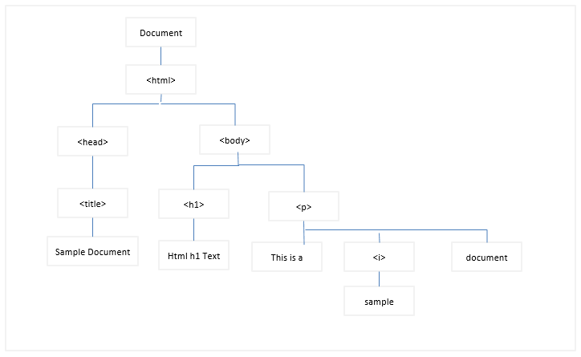
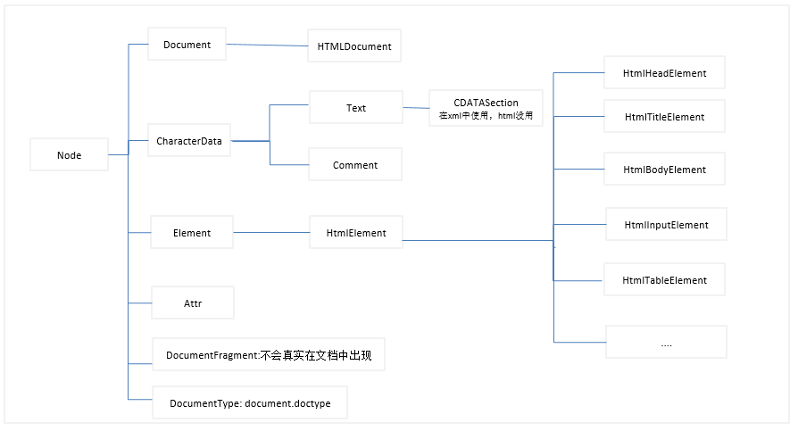
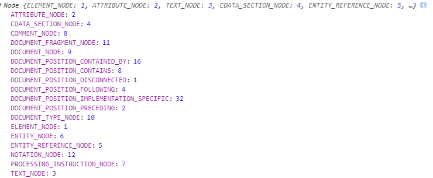
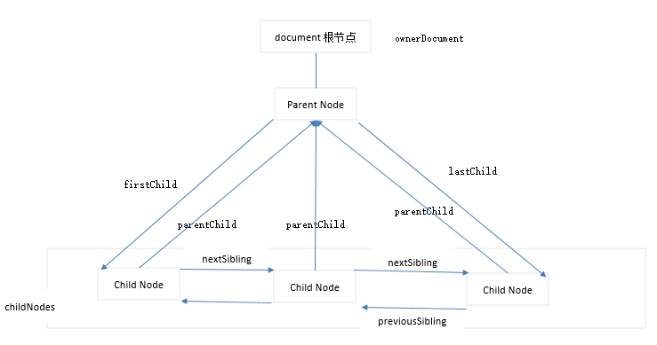
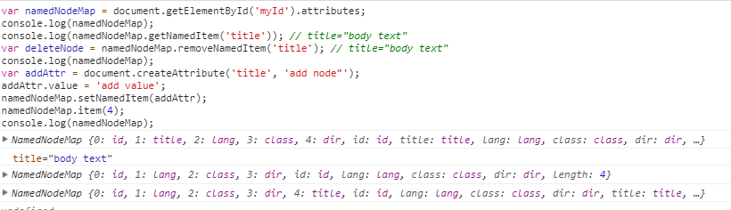
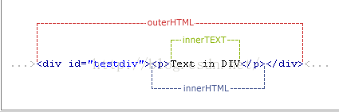
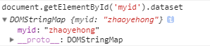

# 1 DOM简介
DOM是针对HTML和XML文档的API(应用程序编程接口).DOM描绘了要给层次化的节点数。允许开发人员进行添加，修改，删除页面的某一部分。
```html
<html>
    <head>
        <title>
            Sample Document
        </title>
    </head>
    <body>
        <h1>Html h1 Text</h1>
        <p>This is a <i>sample</i>document</p>
    </body>
</html>
```
该html对应的DOM树如下：
<br>
DOM1级定义了Node接口，DOM中的所有节点都是实现于该接口。在javascript中作为Node类型实现。除IE之外可以直接访问。DOM中所有节点都继承自Node类型，因此拥有Node类共享的相同基本属性和方法。文档节点的部分层次结构：
- Document类型: 代表一个HTML或则XML文档
- Element类型：代表document文档中的一个元素
- HTMLDocument类型： 针对HTML的文档
- HTMLElment类型： 代表HTML文档中的元素
- CharacterData: Text和Comment的祖先，定义这样中节点所有的共享方法。
- Comment节点：代表HTML或XML的注释(字符串)
- Text: 文档中显示文本的Text节点
- Attr节点：代表HTML和XML的属性。它几乎不适用。因为和文档节点不同，Element类型定义了将属性作为`键/值`对使用的方法。
- DocumentFragment: 在文档中并不存在。
<br>

## 1.1 Node类型
Node 节点在IE中是无效的。
### 1.1.1Node节点属性
- nodeType属性： 代表节点类型，由12个数值常量表示
- nodeName属性： 元素的标签名称(最好先判断是否是element元素再获取)
- nodeValue属性: 对于element元素，始终存储为null
```javascript
Node.ELEMENT_NODE; // 1,代表Element节点
Node.ATTRIBUTE_NODE; // 2, 代表Attr属性节点
Node.TEXT_NODE; // 3, 代表Text文本节点   
Node.CDATA_SECTION_NODE; // 4
Node.ENTITY_REFERENCE_NODE; // 5
Node.ENTITY_NODE; // 6
Node.PROCESSING_INSTRUCTION_NODE; // 7
Node.COMMENT_NODE; // 8 
Node.DOCUMENT_NODE; // 9，表示document

Node.DOCUMENT_TYPE_NODE; // 10
Node.DOCUMENT_FRAGMENT_NODE; // 11
Node.NOTATION_NODE; // 12
```
节点类型| nodeType | nodeName | nodeValue | parentNode | ownerDocument | 子节点 | 
| :---| :--- | :--- | :--- | :--- | :--- | :--- |
| Document | 9 | '#document' | null | null | 整个文档根节点或null | 子节点可能时DocumentType(最多一个)，Element(最多一个)， ProcessingInstruction或comment |
| Element | 1 | 元素标签名称 | null | 可能是Document或Element | 整个文档根节点 | 可能是Element, text, Comment,ProcessingInstruction,CDATASection,EntityReference |
| Text | 3 |  '#text' |  节点所包含的文本 | Element | 整个文档根节点 | 无子节点 |
| Attr | 2 | 特性的名称 | 特性的值 | null | XX | 无 |
| Comment | 8 |  '#comment' | 注释的内容 | Document 或 Element | XX | 无子节点 |
| CDATASection | 4 |  '#cdata-section' | CDATA区域中的内容 | Document 或 Element | XX | 无子节点 |
| DocumentType | 10 |  'doctype的名称' | null | Document | XX | 无子节点 |
| DocumentFragment | 11 |  '#document-fragment' | null | Document | XX | Element,ProcessingInstruction, Comment, Text, CDATASection, EntityReference |

<br>    
```javascript
// 判断节点的nodeTpe
if (someNode.nodeType === Node.ELEMENT_NODE) {
    console.log('node is an element');
}

// IE没有Node函数，可以通过下面方式
if (someNode.nodeType === 1) {
    console.log('node is an element');
    console.log(someNode.nodeName); 
    console.log(someNode.nodeValue);
}
```
### 1.1.2 节点查询
- childNodes： 保存一个NodeList对象。NodeList是类数组,保存一组有序的节点，可以通过位置访问节点。NodeList时基于DOM结构动态执行查询的结果，DOM结构的变化能够自动反应在NodeList对象中。注意：动态，会变化。
- parentNode：指向文档树中父节点。
- previousSibling: 同层级的前面的前一个兄弟节点, 没有为null
- nextSibling: 同层级的后面相邻的一个兄弟节点，没有为null
- firstChild: 指向childNodes的第一个子节点
- lastChild: 指向childNodes的最后一个子节点
- ownerDocument： 整个文档的文档根结点，不必通过层层回溯到达顶端，可以直接访问文档节点。
- hasChildNode(): 有child,返回true,无返回false
```javascript
var childs = someNode.childNodes();
var firstChild = childs[0]; // 使用类数组索引方式访问
var secondChild = childs.item(1); // 使用item方法访问
var count = childs.length;
```
<br>
NodeList是类数组，可以使用call or apply执行Array的所有方法。
```javascript
function nodeToArray(nodes) {
    try {
        return Array.prototype.slice.apply(node, 0);
    } catch (e) {
        var arrs = Array();
        for (var i = 0; i < nodes.length; i++) {
            arrs.push(nodes[i]);
        }
        return arrs;
    }
}

// es6
new Array(...document.getElementById('home').childNodes);
```

### 1.1.3 节点增加，伤处，修改，复制
- appendChild()： 在childNodes末尾添加子节点，父节点的引用指针、childNodes最后一个子节点的关系指针都会更新。返回新增的子节点。如果添加的是文档中已有的节点，则相当于是移动已有节点的位置到最后。相当于移动，不是复制。
- insertBefore(insertNode, referNode): 将insertNode插入到referNode的前面。如果第二个参数为null,则相当于appendChild.插入后，将insertNode作为referNode的previousSibling.
- replaceChild(insertNode, deleteNode): 将deleteNode移除文档作为操作结果返回，将insertNode替换到删除的位置,并复制被删除节点的所有关系指针。
- removeChild(node): 移除节点，移除的节点仍然为文档所有，但是在文档中已经没有自己的位置。
- cloneNode(bool): 创建一个节点完全相同的副本。bool:true表示深度克隆(复制节点即整个子节点)。false浅度克隆，只复制节点本身。复制后返回节点副本，没有指定父节点。
- normalize(): 由于解析器原因，DOM中可能出现不包含文本，或者包含两个文本节点的请看。如果找到空文本节点，会删除，如果两个连续的文本节点，会合并。
```javascript
// 创建新节点
var newNode = document.createTextNode('hello, wold');
var parent = document.getElementById('home');
var returnNode = parent.appendChild(newNode);
console.log(newNode === returnNode); // true
console.log(parent.lastChild === newNode); // true

// 移动已存在的节点
var needMove = parent.firstChild;
var returnNeedMove = parent.appendChild(needMove);
console.log(needMove == returnNeedMove); // true: needMove地址引用，值没有改变
console.log(returnNeedMove == parent.firstChild); // false
console.log(returnNeedMove == parent.lastChild); // true

// intertBefore
var insertNode = parent.insertBefore(newNode, null); 
console.log(newNode === parent.lastChild);
var insertNode2 = parent.insertBefore(newNode, parent.childNodes[2]);
console.log(insertNode == parent.childNodes[2]);

// replaceChild
var replace = document.createTextNode('replace node');
var replaceNode = parent.replaceChild(replace, parent.firstChild);

// removeChild
var removeChild = parent.removeChild(parent.firstChild);

// cloneNode
var cloneNode = parent.firstChild.cloneNode(true);
parent.insertBefore(parent.firstChild);
```

## 1.2 Document类型
Javascrip使用Document类型表示文档，web浏览器中，document对象时HTMLDocument的实例。document对象时window对象的一个属性。因此可以作为全局对象访问。
```javascript
console.log(window.document.childNodes);
```

- documentElement属性： 始终指向html元素。
- body属性： 始终指向页面元素body
- docType属性： DocumentType类型。`<!DOCTYPE>`标签，看成与要给文档其他部分不同的实体。
- title: 浏览器的标题
- URL: 页面完整的URL，不可修改
- domain: 只包含域名，可修改，但只能修改为当前域所包含的域。
- referrer： 在a页面，点击某个操作到了当前页面，保存a页面的链接。没有为空字符串。
```html
<!DOCTYPE html>
<html>
    <head></head>
    <body></body>
</html>
```
```javascript
// documentElment
var html = document.documentElement;
console.log(html === document.childNodes[1]);
console.log(html === document.lastChild);

// body属性
var body = document.body;
console.log(body === html.lastChild);

// docType属性
console.log(document.docType);

// title 属性
document.title = "yezi update";

// URL属性
console.log(document.URL);

// domain属性
console.log(document.domain);

// referrer属性
console.log(document.referrer);
```
### 1.2.2 document查找页面元素方法
NodeList => Node实例的集合， HTMLCollection => HTMLElement实例的集合
- getElementById(idName): 根据id查找元素，返回HTMLElement子对象。Document上的方法。
- getElementsByTagName(tagName): 根据标签名称获取元素，返回HTMLCollection集合。Document上的方法。 
- getElementsByName(name): 返回HTMLCollection集合, HTMLDocument的方法。

HTMLCollection:
- item(): 数字索引访问 
- namedItem(name): 根据名称访问。多个符合结果只会返回第一个。
; // HTMLCollection集合
var namedItemMethod = spans.namedItem('imageName'); // 根据名字获取
console.log(images['imageName']); // 通过名称访问。可传入数字或字符串索引值。数值索引后台会使用item(),字符串索引会使用namedItem()
```
### 1.2.3 document的特殊集合
返回的都是HTMLCollemction
- anchors:  返回文档中所有带name特性的`<a>`元素
- applets: 返回文档中所有`<applets>`.现已不使用
- forms: 返回文档中包含的所有<form>元素，相当于document.getElementsByTagName('form');
- images: 返回文档中所有``元素
- links: 返回文档中所有带href的`<a>`元素
### 1.2.4 document文档写入
- write(str): 将字符串写入到页面，原样写入。
- writeln(str):  将字符串写入页面，写完会换行
- open()： 打开网页输入流
- close()： 关闭网页输入流
```html
<html>
    <body>
		<p>the p content is origin</p>
		<script type='text/javascript'>
			document.writeln('<strong>document,writelin</strong>');
			document.write('write can\'t wrap');
			document.write('write can\'t wrap');
		</script>
	</body>
</html>
```
### 1.2.5 页面元素创建
- createElement(标签名): 创建新元素，传入参数标签名
- createTextNode(str):  传入字符串，如果参数是html字符串，会将其进行转义。当两个文本节点相邻，显示会链接起来，之前不会有空格。父元素使用normalize会合并两个text节点。
- createComment(str): 创建注释节点
- createDocumentFragment(): 创建文档片段。不能直接添加到文档中，但是可以保存需要添加到文档中的节点。
- createAttribute()： 创建属性节点
```javascript
// createElement创建，并添加属性，节点。还没有将其放入文档流中，对文档的显示无影响。
var el = document.createElement('div');
el.lang = 'cn';

// 创建两个文本节点，并添加到el最前面
var textNode = document.createTextNode('hello, my love');
el.insertBefore(textNode, el.firstChild);
var textNode2 = document.createTextNode('hello, my sister');
el.insertBefore(textNode2, el.firstChild);


// 将相邻的文本节点合成同一个text节点
console.log(el.childNodes.length); // 2
el.normalize(); 
console.log(el.childNodes.length); // 1

// 创建注释节点
var comment = document.createComment("hello, i am comment");
el.appendChild(comment);

// 创建要给Attr节点，并添加到el身上
var attr = document.createAttribute('current');
attr.value = "myself";
el.setAttributeNode(attr);
// console.log(el.attributes('current'));
// console.log(el.getAttributeNode('current').value);
// console.log(el.getAttribute('current'));

// DocumentFragment
var fragment = document.createDocumentFragment();
fragment.appendChild(el);
console.log(fragment);

// 将fragment追加到body后，fragment的childs会移除掉
document.body.appendChild(fragment);
```

## 1.3 Element类型
除了Document外，Element是web编程中最常用的类型了。Element类型用于表现XML,HTML元素，提供对元素标签，子节点以及特性的访问。
元素的标签名可以使用nodeName，也可以使用tagName.
```javascript
// <div i9d="myDiv"></div>
var div = document.getElementById('myDiv');
console.log(div.tagName === div.nodeName);  // html中返回大写，xml中返回小写
```
web中，所有的html元素都是使用HTMLElement进行表示的，HTMLElement继承于Element.但是又进行了拓展，如下属性：
- id: 元素在文档唯一标识符
- title： 有关元素的附加说明信息，一般通过工具提示条显示出来
- lang： 元素内容的语言代码，很少使用
- dir： 语言方向。 ltr: left to right, rtl: right to left.很少用
- className： 与元素的class特性对应，元素css类的名称
```html
<div id="myId" title="body text" lang="en" class="bd" dir="rtl">
```
<br>
```javascript
var els = document.getElementsByTagName('div');
var el = document.getElementById('myId');
var els = document.getElementsByName('namestr');

// 对属性设置新值
el.lang = "cn";
el.dir = 'ltr';
el.title = 'my title change';
```

### 1.3.1 Element特性获取
- getAttribute(attr): 根据属性返回值。针对style属性，getAttribute获取返回css字符串，直接通过el.style属性获取返回对象针对onClick这样的事件，getAttribute获取返回相应代码字符串，通过属性el.onClick访问返回函数。一般都是使用属性调用方式，自定义的属性才使用这个方法。
- setAttribute(attr, value)： 给属性attr设置value值
- removeAttribute(attr): 移除attr属性，不仅删除值，还会从元素中移除属性。
- attributes: 返回一个类似NodeList的NamedNodeMap
    - getNamedItem(name): 返回nodeName=name的节点
    - removeNamedItem(name): 从列表中移除nodeName=name的节点
    - setNamedItem(node): 想列表中添加节点，以node的nodeName为节点索引
    - item(position): 返回位于数字=position位置处的节点
```javascript
// <div id="myId" title="body text" lang="en" class="bd" dir="rtl">
// 以上面的为例
var namedNodeMap = document.getElementById('myId').attributes;
console.log(namedNodeMap);
console.log(namedNodeMap.getNamedItem('title')); // title="body text"
var deleteNode = namedNodeMap.removeNamedItem('title'); // title="body text"
console.log(namedNodeMap);
var addAttr = document.createAttribute('title', 'add node"');
addAttr.value = 'add value';
namedNodeMap.setNamedItem(addAttr);
namedNodeMap.item(4);
console.log(namedNodeMap);
```
<br>
元素的 `childNodes` 属性中包含了它的所有子节点，这些子节点有可能是元素、文本节点、注释或处理指令。不同浏览器在看待这些节点方面存在显著的不同，以下面的代码为例。
```html
<ul id="myList">
    <li>Item 1</li>
    <li>Item 2</li>
    <li>Item 3</li>
</ul>
```
如果是 IE8 来解析这些代码，那么 `<ul>` 元素会有3个子节点，分别是3个 `<li>` 元素。但如果是在其他浏览器中，`<ul>` 元素都会有7个元素，包括3个 `<li>` 元素和4个文本节点（表示 `<li>` 元素之间的空白符）。如果像下面这样将元素间的空白符删除，那么所有浏览器都会返回相同数目的子节点。用下面的方式处理：
```javascript
for (var i=0, len=element.childNodes.length; i < len; i++){
    if (element.childNodes[i].nodeType == 1){
        //执行某些操作
    }
}
```
还可以通过元素获取子元素，再获取子元素的后代节点
```javascript
var ul = document.getElementById("myList");
var items = ul.getElementsByTagName("li");
```

## Text类型
文本节点用Text类型表示,纯文本内容，可以包含转义后的html字符。但是不能包含HTML代码。
获取Text节点文本：使用nodeValue 或 data属性。操作节点中的文本：
- appendData: 将text添加到末尾
- deleteData(offset, count):  从offset指定位置开始，删除count个字符
- insertData(offset, text): 在offset指定位置插入text字符
- replaceData(offset, count, text): 用text替换从offset开始的count个文本
- splitText(offset): 从offset指定位置开始将当前文本节点分为两个文本节点。原文本节点保持offset之前的内容，新文本节点内容是offset之后的内容
- substringData(offset, count): 提取从offset位置开始到offset+count为止处的字符串
- length：文本的长度
```html
<!-- 无空格，没有text文本 -->
<div></div>  

<!-- 有text节点，nodeValue或data为空字符串 -->
<div> </div> 

<!-- 下面的例子使用 -->
<div>hello,world</div> 
```
```javascript
var parent = document.getElementsByTagName('div')[0];
var textNode = parent.firstChild; // 获取文本节点
textNode.nodeValue = "update, my love";
textNode.nodeValue; //"hello,world"
textNode.data; // "hello,world"
textNode.data = "update my love";
textNode.data; // "update my love".会立马显示到文档中

// splitText
var secondText = textNode.splitText(5); 
console.log(parent.firstChild); // updat
console.log(parent.lastChild); // 'e my love'
```

## Comment类型
注释在DOM中是通过Comment进行表示的。Comment和Text继承相同的基类CharactorData。使用nodeValue或data属性获注释内容。

方法和Text基本一样，知识没有splitText方法
- appendData: 将text添加到末尾
- deleteData(offset, count):  从offset指定位置开始，删除count个字符
- insertData(offset, text): 在offset指定位置插入text字符
- replaceData(offset, count, text): 用text替换从offset开始的count个文本
- substringData(offset, count): 提取从offset位置开始到offset+count为止处的字符串
- length：文本的长度
```html
<div id="myId"><!-- comment content--></div>
```
内容操作
```javascript
var el = document.getElementById('myId');
var comment = el.firstChild;
console.log(comment.data); // comment content
```

## CDATASection类型
CDATASection只针对基于XML的文档。表示CDATA区域。继承至Text类型。类似于Comment,没有SplitText方法。只会出现在XML，web浏览器html中无法解析。

## DocumentType类型
DOM1中无法创建DocumentType节点，支持它的浏览器会将DocumentTYpe对象保存在document.doctype中。属性：
- name: 文档类型的名称
- entities：文档类型描述的实体的NamedNodeMap。HTML or XHTML中为空
- notations: 文档类型描述的符号的NamedNodeMap对象。 HTML or XHTML中为空
以下面严格型HTML4.0.1的文档声明为例：
```html
// DocumentType 的name 是HTML : document.doctype.name => HTML
<!DOCTYPE HTML PUBLIC "-//W3C/DTD HTML 4.0.1//EN" "httpL//www.w3.org/TR/html4/strict.dtd">
```

## DocumentFragment类型
在所有节点中，只有DocumentFragment在文档中没有对应的标记。DOM规定文档片段(document fragment)是一种‘轻量级’的文档。可以包含和控制节点，但是不会像完整的文档那样占用额外资源。
虽然不能把文档片段直接添加到文档中，但是可以作为‘仓库’使用 。里面保存将来可能添加到文档中的节点。文档片段继承所有Node的方法。若果将文档中的节点放入文档片段，则会从文档中移除节点，不能再文档中看到。可以将文档片段作为参数传入Node的方法例如appendChild(), insertBefore()中，实际操作只是把文档片段的所有子节点添加到相应位置，并且文档片段中的内容也会移除掉，文档片段不会成为文档树的部分。
- 将文档节点(DocumentFragment)的内容移动到文档(document)中，文档节点(DocumentFragment)内容没有了，文档(document)会显示。
- 将文档(document)的节点添加到文档节点(DocumentFragment)中，文档(document)中的节点移除不显示，文档节点(DocumentFragment)中有了

## Attr类型
元素的特性使用DOM中的Attr类型表示。特性都存在于元素的attributes属性中的节点。
虽然它们也是节点，但是特性却不被认为是DOM树中的一部分。操作使用如下方法：
- getAttribute(key)
- setAttribute(key, value)
- removeAttribute()
Attr对象有三个属性属性：
- name: 特性名称，与nodeName一致
- value： 特性的值，与nodeValue一致
- specified： boolean值，用于区分是代码中自定义的，还是默认的。
创建新属性节点：document.createAttribute(name).
```javascript
var attr = document.createAttribute('current');
attr.value = "myself";
element.setAttributeNode(attr);
console.log(el.attributes('current'));
console.log(el.getAttributeNode('current').value);
console.log(el.getAttribute('current'));
```
# 元素内容

innerText: 表示起始标签和结束标签之间的文本
innerHTML: 表示元素的所有元素和文本的HTML代码
outerText: 与前者的区别是替换的是整个目标节点，问题返回和innerText一样的内容
outerHTML: 与前者的区别是替换的是整个目标节点，返回元素完整的HTML代码，包括元素本身
<br>

# DOM拓展
## 选择器新增
根据css选择符进行查询元素。
- querySelector()： 查询第一个匹配，返回HTMLElment,没有返回null。Document查找(从文档范围内查找匹配元素),Element类型上查找(从该后代元素范围内开始查找)
- querySelectors()： 查询所有匹配的元素.返回带有属性和方法的NodeList。调用者为Document，Element,DocumentFragment。底层实现类似于一组元素快照，并非对文档进行搜索的动态查询。这样可以避免使用NodeList对象通常会引起大多数性能问题。
- matchesSelector(css选择器): 调用者Element,查找与选择器匹配的元素，有返回true
```javascript
var aHTMElement = docuemnt.querySelector("div .myId");
var bNodeList = document.body.querySelectorAll("div > span");

// 浏览器不支持，各自有各自的实现
let x = document.documentElement;  
HTMLElement.prototype.matchesSelector = x.webkitMatchesSelector || x.mozMatchesSelector || x.oMatchesSelector || x.msMatchesSelector;  
var isExist = document.body.matchesSelector('body'); // true
```
## 元素遍历新增
都是增对Element，不包含Comment和Text节点。
- childElementCount：子元素个数
- firstElementChild：第一个子元素
- lastElementChild： 最后一个子元素
- previousElementSibling：前一个同辈元素
- nextElementSibling: 后一个同辈元素

## HTML5新增
### 类扩充
- getElementByClassName(): 调用者Document(文档中符合条件的元素)、Element(在子元素中查找符合的元素)。返回NodeList。
- classList： 是新集合类型DOMTokenLisst的实例。
    1. add(value)： 新增样式
    1. contains(value)： 判断是否包含样式
    1. remove(value)： 移除样式
    1. toggle(value): 有删除，无添加
```javascript
var els = document.getElemmentById('username').getElementsByClassName('selected');
```
### 焦点
页面焦点的获取通常在页面加载，用户输入，或按Tab建和代码中调用focus()方法。document.activeElement始终指向当前DOM中获取到焦点的元素。相关方法
- focus(): 本来存在的方法，获取焦点
- hasFocus(): 判断元素是否拥有焦点
```javascript
var btn = document.getElementById('.cancelBtn');
btn.focus();
console.log(btn === document.activeElement); // true
btn.hasFocus(); // true
```
### HTMLDocument的变化
- readyState属性： loading(正在加载文档), complete(已经加载完毕)
- compatMode属性： CSS1Compat表示标准模式，BackCompat表示混杂模式(IE6吧)
- head属性： 作为document.body,document.documentElement补充。引用文档<head>元素
- charset属性： 表示当前文档中实际使用的字符集。可以修改作为页面新的字符集
- defaultCharset属性： 表示根据默认浏览器及操作系统的设置。如果文档没有使用默认字符集，那么charset和defaultCharset属性的值可能不一样。

```javascript
if (document.readyState === 'complete') {
    console.log('page is completed');
}

if (document.compatMode == 'CSS1Compat') {
    console.log('standards mode');
} else {
    console.log('back compat');
}

var head = document.head || document.getElementsByTagName[0];

if (document.charset != document.defaultCharset) {
    console.log('custom character set being used.');
}
```

### HTMLElement
- data-xxx:  Element节点自定义属性，存储在dataset集合中
- dataset: 存储自定义属性,是DOMStringMap实例。也就是一个名值对儿的映射。
- innerHTML: 设置值时替换元素的所有子节点，获取值时返回元素所有的子节点。当添加内容有`script`元素，不会执行其中的脚本。`style`元素会执行。`head,html,style,table,thead,tfoot,tr`不支持innerHTML
- outterHTML:获取时返回调用它的元素及其所有子节点，设置时根据指定的HTML生成新的DOM子树，然后用这个DOM子树完全替换调用元素。
- insertAdjacentHTML(param): param参数为（beforebegin,afterbegin,beforeend,afterend之一，相继对应添加previosSibling, firstChild,lastChild,lastSibling）
```javascript
var div = document.getElementById('myDiv');
var myId = div.dataset.myId; // 获取自定义属性
var myName = div.dataset.myname;

// 设置值
div.dataset.appId = 2010;
div.dataset.myName = 'hello';
```
<br>
对于插入标记相关的使用：
```html
<div id="content">
    hello,<p>world</p>
</div>
```
```javascript
var el = document.getElementById('content');
var contentInnerHTML = el.innerHTML(); // hello,<p>world</p>
el.innerHTML = "Hello & welcome, <b>\"reader\"</b>"; 
// 将字符串设置给DOM后，会经过DOM树序列化，返回的字符串与原输入的字符串值不一样。"Hello &amp; welcome, <b>&quot;reader&quot;!</b>"

el.innerHTML = "<script>alert('hello,world')</script>"; // 脚本中的内容不执行
el.innerHTML = "<style type=\"text/css\"> body { background: red; }</style>";

el.outerHTML = "<p id=\"content1\">hello, world</p>"; // 完全替换掉el标签及其内容。连id都没有了
console.log(document.getElementById('content')); // null

el.insertAdjacentHTML("beforebegin", "<p>hello,world</p>")
el.insertAdjacentHTML("afterbegin", "<p>hello,world</p>")
el.insertAdjacentHTML("beforeend", "<p>hello,world</p>")
el.insertAdjacentHTML("afterend", "<p>hello,world</p>")
```
使用innerHTML,outerHTML,adjacentHTML方法时，存在的性能问题：
当创建一个节点需要添加时，会替换掉文档原有的节点，原有的节点可能存在某些事件等，替换时仅仅是将节点内容替换，元素与事件之间的绑定关系在内存中并没有得到删除与释放，频繁这样操作会使得内存不断增加出现问题。因此之前需要将事件关系解除。
```javascript
// 不推荐
for(i = 0; i < 10; i++) {
    el.innerHTML += "<li>hello</li>";
}

// 推荐
var innerHTML = "";
for(i = 0; i < 10; i++) {
    innerHTML += "<li>hello</li>";
}
el.innerHTML = innerHTML;
```
### 没被纳入规范的方法
非标准化模式方法：
- children: 返回HTMLCollection实例集合。返回等同于childNode的节点但是不包括Comment和Text节点的子节点。
- contains(childNode): 判断调用节点是否包含子节点.
- innerText: 返回操作元素中包含所有文本内容，包含子文档树中的文本(由浅入深地将子节点的文本内容串联起来)。
- textContent: firefox支持的类似于innerText
- outerText: 获取等价于innerText.设置会替换自身
```html
<ul id="myId">
    <li>1</li>
    <li>10</li>
    <li>12</li>
</ul>

<!-- 上面的innerText为 ：不同浏览器返回空格问题不一样
1
10
12 -->
```
```javascript
document.documentElement.contains(document.body); // true

// innerText, firefox不支持，但是支持textContent
function getInnerText(el) {
    return el.innerText || el.textContent;
}

// outerText
var el = document.getElementById('myId');
console.log(el.outerText); // 11012
el.outerText = "hello,word";
console.log(el); // null
```