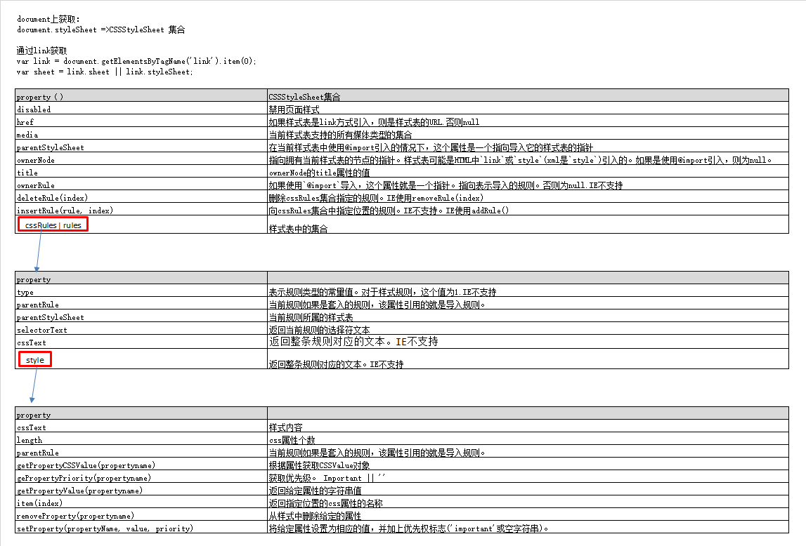
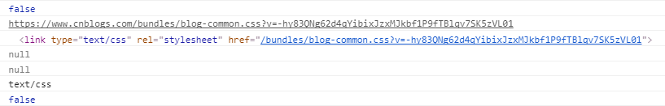
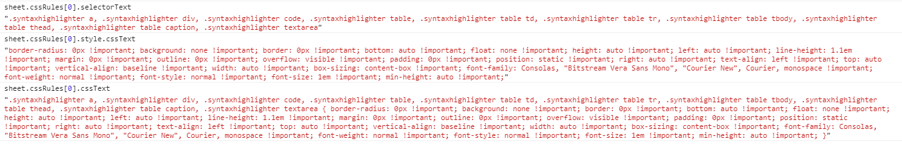
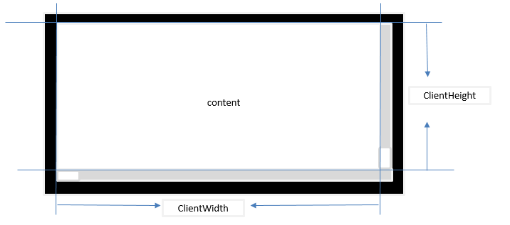
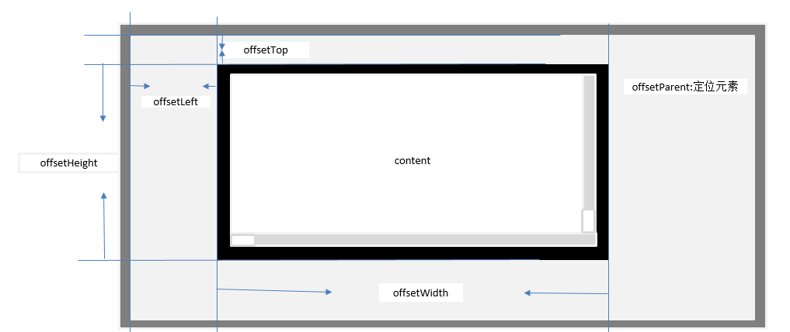

DOM2和DOM3拓展了DOM API.我们这里主要是针对HTML讲解。
# DOM 变化
## DocumentType 类型
- publicId：文档声明中的第一个信息段
- systemId：文档声明中的第一个信息段
- internalSubset: xml中使用的比较多
```html
<!DOCTYPE HTML PUBLIC "-//W3C/DTD HTML 4.0.1//EN" "http://www.w3.org/TR/html14/strict.dtd"> 
```
```javascript
console.log(document.publicId); // "-//W3C/DTD HTML 4.0.1//EN"
console.log(document.systemId); // "http://www.w3.org/TR/html14/strict.dtd"
```

## Document类型变化
- importNode(copyNode, bool): 从一个文档中取得一个节点(新节点，类似于Node的cloneNode方法)，然后倒入另外一个文档，成为新文档结构的一部分。当取得节点的时候。注意如果使用appendChild()传入的节点如果属于不同文档，则会抛出错误。第一个参数：需要复制的节点。第二个参数：是否复制子节点。
- defaultView: 保存一个指针，指向给定的文档窗口。 
- parentWindow: IE使用parentWindow。等价于defaultView
- document.implementation身上两个方法，用于创建新的文档。
    1. createDocumentType(fileTypeName, publicId, systemId): 文档类型名称，publicId, systemId
    1. createDocument(nameSpaceURI, fileTagName, fileType): namespaceURI,文档元素的标签名，新建文档的文档类型
    1. createHTMLDocument(): 创建一个完整的HTML文档。包括 <html> <head> <title> <body>。
```javascript

// 方法在XML中用的比较多
var newNode = document.importNode(oldNode, true);
document.body.appendChild(newNode);

var parentWIndow = document.defaultView || document.parentWindow;

// 创建一个HTML 4.0.1 Strict文档
var docType = document.implementation.createDocumentType('html', "-//W3C/DTD HTML 4.0.1//EN", "http://www.w3.org/TR/html14/strict.dtd");
var doc = document.implementation.createDocument("http://www.w3.org/1999/xhtml", "html", docType);

// 返回一个完整的HTML 文档，并且将title设置为title name
var doc2 = document.implementation.createHTMLDocument('title name');
console.log(doc2.title); // title name
console.log(typeof doc2.body); // object
```

## Node节点变化
- isSupport(feature, version):  检测是否支持feature特性的version版本
- isSameNode(node): 相同返回true,是同一个节点
- isEqualNode(node): 相等返回true,类型相等，属性相等。
- setUserData(operType, key, value, srcNode, destNode):  不是很懂
    1. operType: 1复制，2导入， 3删除，4重命名
    1. key: 数据键
    1. value: 数据值
    1. srcNode 源节点
    1. destNode: 目标节点
- contentDocument: 属性包含一个指针，指向框架内容的文档对象（HTMLFrameElemnt, HTMLIFrameElement:表示框架和内嵌框架）。以前只能通过frames集合进行获取。
```javascript
// 等价这个方法 ： document.implementation.hasFeature("Core","3.0");
if (document.body.isSupport('HTML', '2.0')) {

}

// isSameNode 和isEqualNode
var div1 = document.createElement('div');
div1.setAttribute('class', 'box');

var div2 = document.createElement('div');
div2.setAttribute('class', "box");
console.log(div1.isSameNode(div1)); // true
console.log(div1.isEqualNode(div2)); // true
console.log(div1.isSameNode(div2)); // false

var div = document.creatElement('div');
div.setUserData('name', "Nicholas", function(operation, key, value, src, dest) {
    if (operation == 1) {
        dest,setUserData(key, value, function(){};)
    }
});
var newDiv = div.cloneNode(true);
console.log(newDiv.getUserData('name'));

// 框架变化
var iframe = document.getElementById('myIframe');
var iframeDoc = iframe.contentDocument; // IE8以前无效
```

# 样式
<br>
```javascript
// 判断支持css的能力
document.implementation.hasFeature('css', '2.0');
document.implementation.hasFeature('css2', '2.0'); 
```
## js访问元素样式
css 中使用下划线分割,在js中使用驼峰大小写形式访问。但是特殊字符float浮动，由于是关键字，因此使用cssFloat进行访问,IE使用styleFlocat.
```javascript
var el = document.getElementById('myId');
// background-color
el.style.backgroundColor = '#fff';

// color
el.style.color = 'red';

// font-family
el.style.fontFamily = ''Arial;

// 对于float访问
 var value = el.cssFlocat || el.styleFlocat;
```
## Element 的 style
- cssText: 访问style特性中的css代码，修改情况会替换所有的style的内容。
- length: css属性的数量
- parentRule: 表示CSS信息的CSSRule对象
- getPropertyCSSValue(propertyName): 返回包含给定属性值得CSSValue对象
- getPropertyPriority(propertyName): 如果给定的属性使用了!important设置，则返回'important'，否则返回空字符串.
    1. CSStEXT: 返回值等于getPropertyValue()
    1. cssValueType: 0 继承的值，1基本的值， 2致列表， 3自定义的值
- getPropertyValue(propertyName): 返回给定属性的字符串值
- item(index): 返回给定位置的css属性的名称
- removeProperty(propertyName): 从样式中删除给定的属性
- setProperty(propertyName, value, priority): 将给定属性设置为相应的值，并加上优先权标志('important'或空字符串)。
```javascript
var el = document.createElement('myId');
el.style.cssText = 'width: 200px; height: 300px; color: red';
for(i = 0; i < el.style.length; i++) {
    console.log(el.style.item(i)) // 打印出width, height color
}
// console.log(el.style.getPropertyCSSValue('color')); // Chrome没有这个方法
```
## 计算样式
- document.defaultView.getComputedStyle(): 会计算出当前节点的样式(包括继承过来的最终样式)
- currentStyle: IE使用这个属性等价于getComputedStyle()
```javascript
var el = document.getElementById('myId');
var computedStyle = document.defaultView.getComputedStyle(el); 
console.log(computedStyle.width, computedStyle.height);

var currentStyle = el.currentStyle;
console.log(currentStyle.width, currentStyle.height);
```

## 操作样式表
CSSStyleSheet类型表示样式表，包括通过`link`元素包含的样式表和在`style`中定义的样式表。分别使用HTMLLinkElement, HTMLStyleElement类型表示。测试是否支持DOM2级样式表
```javascript
document.implemetation.hasFeature('StyleSheets', '2.0');
```
CSSStyleSheet继承于StyleSheet继承的属性如下
- disabled: 样式表是否被禁用，true被禁用。值可修改
- href: 如果样式表是link方式引入，则是样式表的URL.否则null
- media: 当前样式表支持的所有媒体类型的集合。与所有DOM集合类型一样，这个集合也有length和item()方法。可根据方括号获取集合中的值。如果集合为空，表示样式表适用于多有媒体。
- ownerNode: 指向拥有当前样式表的节点的指针。样式表可能是HTML中`link`或`style`(xml是`style`)引入的。如果是使用@import引入，则为null。
- parentStyleSheet：在当前样式表中使用@import引入的情况下，这个属性是一个指向导入它的样式表的指针。
- title：ownerNode的title属性的值。
- type: 表示样式表类型的字符串。样式表而言是`type/css`。
除了disabled属性之外，其他都是只读。除了以上基础的属性，CSSStyleSheet还支持下列属性和方法：
- cssRules: 样式表中包含的样式规则集合。IE使用rules。
- ownerRule: 如果使用`@import`导入，这个属性就是一个指针。指向表示导入的规则。否则为null.IE不支持。
- deleteRule(index): 删除cssRules集合指定的规则。IE使用removeRule(index)。
- insertRule(rule, index): 向cssRules集合中指定位置的规则。IE不支持。IE使用addRule()。
```javascript
// 引用于文档的所有样式表。length获取长度个数。item()或[]方式访问每一个样式表
var sheets = document.styleSheets; 
for(i = 0; i < sheets.length; i ++) {
    var sheet = sheet.item(i);
    console.log(sheet.disabled);
    console.log(sheet.href);
    console.log(sheet.ownerNode);
    console.log(sheet.parentStyleSheet);
    console.log(sheet.title);
    console.log(sheet.tyle);
}
```
<br>
可以直接在`link`上获取CSSStyleSheet。DOM规定属性名是`sheet`，IE使用`styleSheet`.
```javascript
var link = document.getElementsByTagName('link').item(0);
var sheet = link.sheet || link.styleSheet;
```

### CSS规则
CSSRule对象表示样式表中的每一条规则。CSSStyleRule继承于CSSRule.并且还有以下属性。常用属性是cssText,selectorText和style。 cssText和style.cssText属性类似，但并不相同。前者包含选择符文本和围绕信息的花括号（只读）。后者只包含样式信息（可写）。
- cssText: 返回整条规则对应的文本。IE不支持
- parentRule: 当前规则如果是套入的规则，该属性引用的就是导入规则。
- parentStyleSheet: 当前规则所属的样式表
- selectortText: 返回当前规则的选择符文本。
- style: 一个CSSStleDeclaration对象，可以通过它设置和取得规则中特定的样式值。
- type: 表示规则类型的常量值。对于样式规则，这个值为1.IE不支持
```javascript
var sheet = document.styleSheets[0];
var rules = sheet.cssRules || sheet.rules;
var rule = rules[0]; // 取得第一条规则
console.log(rule.selectorText);
console.log(rule.style.cssText);
console.log(rule.cssText);
rule.style.width = '100px';  // 直接在style上进行获取属性
```
selectorText + style.cssText = cssText
<br>
### 规则的创建与删除
使用insertRule(rule, index),IE使用addRule(sheet, selectorText, cssText, position)。
```javascript
var sheet = document.styleSheets[0];
function insertRule(sheet, selectorText, cssText, position) {
    if (sheet.insertRule) {
        sheet.insertRule(selectorText+ '{' + cssText + '}', position);
    } else if (sheet.addRule) {
        sheet.addRule(selectorText, cssText, position);
    }
}
```
删除使用deleteRule(index),IE使用removeRule(index):
```javascript
function deleteRule(sheet, index) {
    if (sheet.deleteRule) {
        sheet.deleteRule(index);
    } else if (sheet.removeRule) {
        sheet.removeRule(index);
    }
}
```
这种做法在Web开发中不是常见的使用方法，删除可能会影响到CSS的层叠效果，因此慎重使用。

# 元素大小
## 客户区大小
- clientHeight: 可见区域高度（内容+padding），不包含滚动条区域
- clientWidth： 可见区域宽度（内容+padding），不包含滚动条区域
<br>
```javascript
// 获取浏览器视觉窗口大小
var el = document.documentElment; // document.body(IE 7 之前的版本使用)
console.log(el.clientHeight);
console.log(el.clientWidth);
```

## 偏移量
偏移量包括元素在屏幕上占用的所有可见空间。元素的可见大小由其高度，宽度决定，包括内边距，滚动条，边框大小（不包含外边距）。通过下面四个属性可以获取元素的偏移量。
- offsetHeight: 元素垂直方向上占用的空间大小：高度 + 水平滚动条高度 + 上边框高度 + 下边框高度。
- offsetWidth: 元素在水平方向上占用的空间大小： 宽度 + 垂直滚动条宽度 + 左边框宽度 + 有边框宽度。
- offsetleft: 元素左外边框 到 该元素offsetParent左内边框之间的像素距离
- offsetTop: 元素上外边框 到 该元素offsetParent的上内边框之间的像素距离
offsetParent: 离当前元素最近的定位元素。没有则是body.
实验结果：
body内包含一个div,body作为div的offsetParent(margin=8默认有)。div之设置高宽boder,没有margin,此时div的offsetLeft值为8.如果给body添加boder,div的offsetLeft会等于8+body的boder宽度。这个就和上面讲的规则不一样了。这个问题还待研究。
<br>
```javascript
// 获取元素到文档顶部位置的偏移量
var getOffset = {
    left : function (obj) {
        return obj.offsetLeft + (obj.offsetParent ? this.left(obj.offsetParent):0);
    },
    top : function (obj) {
        return obj.offsetTop + (obj.offsetParent ? this.left(obj.offsetParent) : 0);
    }
};
```
## 滚动大小
滚动大小包含滚动内容的元素的大小。有些元素如html元素即使没有执行任何代码也能添加滚动条，但是有些元素则需要css的overflow设置才能滚动。下面是4个与滚动大小相关的属性：
- scrollHeight: 在没有滚动条的情况下，内容元素的总高度.
- scrollWidth: 在没有滚动条的情况下，内容元素的总宽度.
- scrollLeft: 被隐藏在内容区域左侧的像素数。可以设置这个属性改变元素的滚动位置.
- scrollTop: 被隐藏在内容区域上方的像素数。通过设置这个属性可以改变元素的滚动。
scrollWidth 和ScorllHeight用于确认内容的实际大小。当在确认文档的总高度的时候，必须取scrollWidth, clientWidth其中的最大值，scrollHeight,ClientHeight中的最大值。才能保证在跨浏览器的环境下得到精确的结果。
```javascript
// 兼容模式下处理 IE使用document.body.其他使用document.documentElement
var el;
if (document.compatMode == 'BackCompat') {
    el = document.body;
} else {
    el = document.documentElement;
}
var docHeight = Math.max(el.scrollHeight, el.clientHeight);
var docWidth = Math.max(el.scrollWidth, el.clientWidth);
```
# 文档遍历
DOM2级遍历和返回模块定义了两个辅助完成顺序遍历的DOM结构的类型，NodeIterator和TreeWalker.这两个类能够基于给定的起点对DOM结构进行深度优先的遍历操作(depth-first)。
```javascript
// 检查DOM2遍历能力支持情况
var supportsTraversals = document.implementation.hasFeature('Traversal', '2.0');
var supportsNodeIterator = (typeof document.creatNodeIterator == 'function');
var supportsTreeWalker = (typeof document.createTreeWalker == 'function');
```
## NodeIterator 
- createNodeIterator(root, whatToShow, filter, entityReferenceExpansion):
    1. root: 搜索起点的树节点
    1. whatToShow: 想要访问哪些节点的数字代码(下面列举)
    1. filter: 是NodeFilter对象，或者一个表示应该接受还是拒绝某种特定节点的函数
    1. entityReferenceExpansion： boolean值，表示是否扩展引用实体，html中不需要，应该设置为false
whatToShow是一位掩码，如下都是：
- NodeFilter.SHOW_ALL：所有类型节点；
- NodeFilter.SHOW_ELEMENT：元素；
- NodeFilter.SHOW_ATTRIBUTE：特性；
- NodeFilter.SHOW_TEXT：文本；
- NodeFilter.SHOW_COMMENT;
- NodeFilter.SHOW_DOCUMENT;
- NodeFilter.SHOW_DOCUMENT_TYPE;

另外还有对HTML页面没用的几个：
- NodeFilter.SHOW_CDATA_SECTION;
- NodeFilter.SHOW_ENTITY_REFERENCE：实体引用节点；
- NodeFilter.SHOW_ENTITY：实体节点；
- NodeFilter.SHOW_PROCESSING_INSTRUCTION：处理指令节点；
- NodeFilter.SHOW_DOCUMENT_FRAGMENT: 显示文档片段节点
- NodeFilter.SHOW_NOTATION：符号节点
可以用按位或操作符来组合多个选项如：
```javascript
var whatToShow = NodeFilter.SHOW_ELEMENT | NodeFilter.SHOW_TEXT;
```
可以使用createNodeIterator()方法的filter参数来指定自定义的NodeFilter对象，每个NodeFilter对象只有一个方法，应该访问的节点返回NodeFilter.FILTER_ACCEPT;不应该访问的节点返回NodeFilter.FILTER_SKIP;
对于遍历结果需要进行值得查询使用相关函数：前者用于向前前进一步；后者用于向后后退一步。
- nextNode(): 当遍历到DOM子树的最后一个节点时，nextNode()返回null
- previousNode(): 当遍历到DOM子树的最后一个节点，且previousNode()返回根节点以后，再次调用它就会返回null。
```javascript
var filter = function (node) {
    return (node.nodeName.toLowerCase() == 'p' || node.nodeName.toLowerCase() == 'span') ? NodeFilter.FILTER_ACCEPT : NodeFilter.FILTER_SKIP;
}

// 搜索ducment中的所有p元素
var iterator = document.createNodeIterator(document.body, NodeFilter.SHOW_ALL, filter, false);
var next = iterator.nextNode();
while (next != null) {
    console.log(next.nodeName);
    next = iterator.nextNode();
}
```

## TreeWalker
DOM结构的操作上相关方法，参数与NodeIterator一致：
- createTreeWalker(root, whatToShow, filter, entityReferenceExpansion)
但是提供更多的DOM结构操作方法：
- parentNode(): 遍历当前节点的父节点
- firstChild()：第一个子节点
- lasgChild(): 最后一个子节点
- nextSibling(): 相邻下一个兄弟节点
- previousSibling(): 相邻上一个兄弟节点
```html
<div id="div1">
    <p><b>Hello</b> world!</p>
    <ul>
        <li>List item 1</li>
        <li>List item 2</li>
        <li>List item 3</li>
    </ul>
</div>
```
```javascript
var div = document.getElementById('div1');
var walker = document.createTreeWalker(div, NodeFilter.SHOW_ELEMENT, null, false);
var node = walker.currentNode; // 返回当前节点
walker.firstChild(); // 到p节点
walker.nextSibling(); // 转到ul节点
node = walker.firstChild(); // 到li节点
while(node != null) {
    console.log(node.firstChild.nodeValue);
    node = walker.nextNode();
}
```