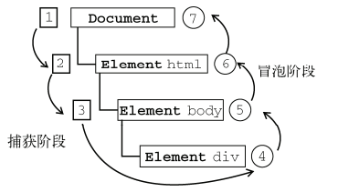
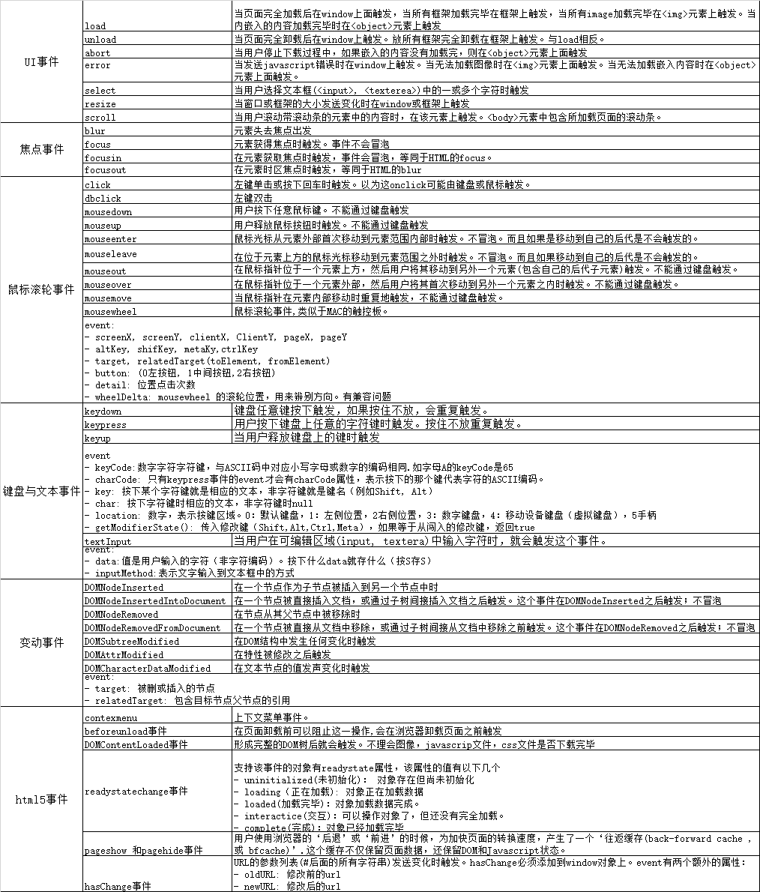
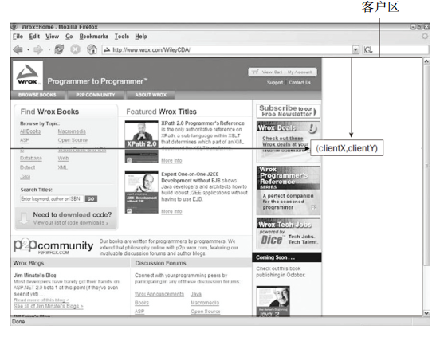
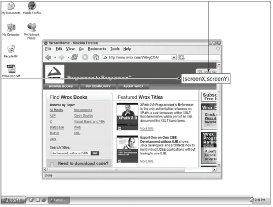
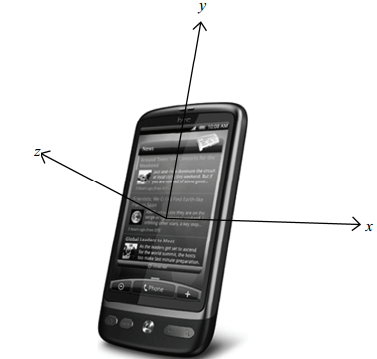
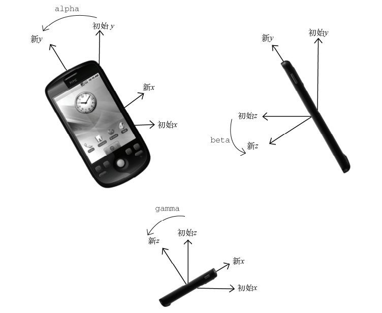

# 事件流
如果你单击了某个按钮，单击事件不仅仅发生在按钮上。在单击按钮的同时，你也单击了按钮的容器元素，甚至也单击了整个页面。IE的事件流是事件冒泡流。Netscape Communicator的事件流是事件捕获流。
## 事件冒泡
IE的事件流是时间冒泡（event bubbling）.当事情开始时由最具体的元素(文档中嵌套层次最深的节点)接收。然后逐级向上传播到不具体的文档。
```html
<!DOCTYPE html>
<html>
    <body>
        <div>Click me</div>
    </body>
</html>
```
如果单机了<div>元素，则click事件传入顺序： div => body => html => document.每一级都会发生直到传播到document对象上。
## 事件捕获
netscape Communicator提出另一种事件流：事件捕获（event capturing)。先从不具体的节点接收到事件，最具体的节点最后接收到事件。事件捕获意义：在事件到达预定目标前捕获它。上面的例子单机div后触发的click事件：document => html => body => div。
事件捕获使用的比较少，一般使用事件冒泡。

## DOM事件流
"DOM2级事件"规定的时间流包含三个阶段：
- 捕获阶段： 为截获事件提供机会。捕获是从下图 1-3 步骤，到达div之前停止。
- 处于目标阶段：到达div
- 时间冒泡阶段: 事件发生到div上，并且事件又传播到文档。4-7步骤
<br>

# 事件处理程序
事件就是用户或浏览器的某种动作，例如click, load, mouseover是事件名字.而响应某个事件就是事件处理程序。事件处理程序由`on`开头。因此click事件处理程序为onclick,load事件处理程序为onLoad。
## HTML事件处理程序
某个元素支持某种事件，使用一个与相应事件的事件处理程序同名的HTML特性来指定。
- event: 直接访问时间对象。不需要自己定义它，也不用从函数参数列表中读取。
- this: 等于时间目标元素，这里是input节点HTMLElement
```html
<input type="button" value="click me" onClick="alert(event.type + this.value);">

<!-- 拓展作用域 -->
<input type="button" value="click me" onClick="function() {
    with(this.form) {
        with(this) {

        }
    }
}">

<input type="button" value="click me" onClick="try {alert(event.type + this.value);} catch(e) {}">
```
缺点：
- 当html元素加载完毕，但是事件还未具备执行条件，点击按钮抛异常。使用异常捕获处理。
- HTML代码合js代码紧密耦合。
- 这样扩展事件处理程序的作用域链在不同浏览器中会导致不同结果。不同 JavaScript 引擎遵循的标识符解析规则略有差异，很可能会在访问非限定对象成员时出错。

## DOM0级事件处理程序
每个元素（包括window，document）都有自己的事件处理程序属性，通常属性都是小写。例如onclick.将这种属性的值设置为一个函数，就可以指定事件处理程序了。
- 在代码运行前，不会为元素指定事件处理程序。如果运行位于加载页面元素之后，可能有段时间点击没反应
- this: 事件处理程序被认为是元素方法，this指向当前元素
```javascript
var btn = document.getElementById('btn');
btn.onclick = function() {
    alert(this.id);
};
```
这种方式添加的处理程序会再事件流的冒泡阶段被处理。可以删除DOM0级指定的事件处理程序。
```javascript
btn.onclick = null;
```

## DOM2级事件处理程序
DOM2级事件处理程序定义了两个方法，用于处理指定和删除事件处理程序。有三个参数（要处理的事件名， 事件处理程序的函数， true捕获阶段调用事件处理程序false冒泡阶段调用事件处理程序[默认false]）。
- addEventListener(eventName, function, booleanValue)
- removeEventListener()(eventName, function, booleanValue)
```javascript
var btn = document.getElementById('btn');
btn.addEventListener('click', function() {
    alert(this.id);
});

btn.addEventListener('click', function() {
    console.log(this.value);
}, true);
```
上面添加了两个事件，会按照添加它们的顺序触发。通过addEventListener添加的时间，必须使用removeEventListener移除。匿名函数无法删除。
```javascript
// 没用
btn.removeEventListener('click', function() {
    alert(this.id);
});

var btn = document.getElementById('btn');
var handle = function() {
    alert(this.id);
};
btn.addEventListener('click', handle);
btn.removeEventListener('click', handle);
```
大多数情况下都是讲时间处理程序添加到事件流的冒泡阶段，最大限度兼容各种浏览器。如果不是特别需要，不建议在事件捕获阶段注册事件处理程序。

## IE事件处理程序
IE实现类似DOM中类似的两个方法，参数（事件处理程序名称，事件处理程序函数）。IE8及以前只支持事件冒泡，因此默认添加到事件冒泡阶段。
- attachEvent(eventName, function)
- detachEvent(eventName, function)
IE操作与DOM不一样的地方：
- 添加处理事件名称不一样
- 处理第一个参数，添加的与DOM事件处理程序参数不一样，IE是`onclick`.DOM是`click`.
- 事件处理程序作用域：DOM0级别程序会在其所属元素的作用域内运行。attachEvent会事件处理程序会在全局作用域中运行。this是window
- 添加事件与执行事件顺序不一致，最后添加的先运行。下面先'hello,handle2',然后打印出'true'
```javascript
var btn = document.getElementById('btn');
var handle = function() {
    console.log(this == window);  
};
var handle2 = function() {
    console.log('hello, handle2');
};
btn.attachEvent('onclick', handle);
btn.detachEvent('onclick', handle);
```
## 跨浏览器处理
这种方式只能说添加和移除事件功能成功，但是在函数内部调用this，IE是window,而其他的则是元素自身。
```javascript
var eventUtil = {
    addEvent: function(el, eventName, eventFunc) {
        if (el.addEventListener) {
            el.addEventListener(eventName, eventFunc);
        } else if(el.attachEvent) {
            el.attachEvent('on' + eventName, eventFunc);
        } else {
            el['on' + eventName] = eventFunc;
        }
    },
    removeEvent: function(el, eventName, eventFunc) {
        if (el.addEventLisremoveEventListenertener) {
            el.removeEventListener(eventName, eventFunc);
        } else if(el.detachEvent) {
            el.detachEvent('on' + eventName, eventFunc);
        } else {
            el['on' + eventName] = null;
        }
    },
};
```
# 事件对象
在触发DOM上的某个事件时，会产生一个事件对象event.这个对象包含事件的有关信息。例如鼠标事件会有鼠标位置信息，键盘操作事件会有按下的键有关信息。
## DOM中的事件对象
兼容DOM的浏览器会将一个event对象传入事件处理程序中。无论是DOM0还是DOM2.
```javascript
bar btn = document.getElementById('btn');
// DOM0
btn.onclick = function(event) {
    console.log(event.type); // click
};

// DOM2
btn.addEventListener('click', function(event) {
    console.log(event.type); // click
});
```
通过HTML特性制定的事件处理程序也会有event对象。
```html
<input type="button" value="click me" onclick="alert(event.type)"/>
```
event对象包含与创建它的特定事件有关的属性和方法。触发的事件类型不一样，可用的属性和方法也不一样，下面的是所有事件都有的：
| 属性/方法 | 类型 | 说明 |
| :--- | :--- | :--- | 
| bubbles | boolean | 事件是否冒泡 |
| cancelable | boolean | 是否可以取消事件的默认行为 |
| currentTarget | Element | 七事件处理程序当前正在处理事件的那个元素 |
| defaultPrevented | boolean | true表示调用了preventDefault()方法.DOM3新增 |
| detail | Integer | 与事件相关的信息细节 |
| eventPhase | Integer | 调用事件处理程序阶段：1捕获极端 2处于‘目标’阶段 ， 3冒泡阶段 |
| preventDefault() | Function | 取消事件默认行为，当cancelable为true才能使用 |
| stopImmediatePropagation() | Function | DOM3:取消事件进一步捕获或冒泡，同时阻止任何事件处理程序被调用 |
| stopPropagation() | Function |  取消事件进一步捕获或冒泡 ，bubbles为true才能调用 |
| target | Element | 事件目标 |
| trusted | boolean | 为true表示事件是浏览器生成的。false表示是开发人员通过JavaScript·1生成的 |
| type | String | 被触发的事件的类型 |
| view | AbstractView | 与事件关联的抽象视图。等同于发生事件的window对象 |

在事件处理内部，对象this始终等于currentTarget的值。而target则只包含实际目标。
```javascript
var btn = document.getElementById('btn');
btn.onclick = function(event) {
    console.log(event.target === this); // true
    console.log(event.currentTarget == this); // true
}
```
如果事件处理程序存在于按键的父节点中(例如document.body),那么这些值不相等
```javascript
var btn = document.getElementById('btn');
document.body.onclick = function(event) {
    console.log(event.currentTarget === document.body); // true
    console.log(this == document.body); // true

    //btn才是click事件真正的目标，由于按钮没有注册事件处理函数，结果click事件就冒泡到了document.body。在哪里进行了事件处理。
    alert(event.target === btn); // true
}
```
阻止特定事件的默认行为,当cancelable为true才能使用preventDefault()来阻止默认行为。下面如果alink的hre点击后应该跳转，但是这里却阻止了，因此跳转不会有效果。
```javascript
var link = document.getElementById('alink');
link.onclick = function(event) {
    event.preventDefault();
}
```
当bubbles为true时，stopPropagation()可以阻止事件捕获或冒泡。下面的情况如果不使用e.stopPropagation()，点击按钮会弹出两个提示框。
```javascript
var btn = document.getElementById('myBtn');
btn.onclick = function(event) {
    alert('clicked');
    e.stopPropagation();
};
document.body.onclick = function(event) {
    alert('body clicked');
};
```
事件流处于哪个阶段可以使用eventPhase属性来确认。如果是捕获阶段调用的事件处理程序，那么eventPhase等于1，如果事件处理程序处于目标对象上，eventPhase等于2，如果在冒泡阶段，eventPhase等于3.
下面的例子，当点击按钮时，首先执行的是被触发的事件处理程序是在捕获阶段添加到document.body的。然后会触发在按钮上注册的事件处理程序。最后一个触发在冒泡阶段才执行添加到document.body身上的那一个。
```javascript
var btn = document.getElementById('btn');
btn.onclick = function(event) {
    alert(event.eventPhase); // 2
}
document.body.addEventListener('click', function(event) {
    alert(event.eventPhase); // 1
}, true);
document.body.onclick = function(event) {
    alert(event.eventPahse);// 3
};
```

## IE中的事件对象
与访问DOM的event对象不一样。访问IE中的event对象有几种不同的方式。取决于制定处理程序的方法。
- DOM0级处理：event对象作为window对象的一个属性。this是对象自己
- DOM2级处理： event作为对象传入到处理函数中.但也可以使用window.event访问. this 是window
- HTML特性指定事件处理程序： 可以通过event变量访问。 this是元素对象自己。
```javascript
// DOM0
var btn = document.getElementById('btn');
btn.onclick = function() {
    console.log(this); // this是对象自己
    var event = window.event;
    console.log(event.type); // click
}

// DOM2
btn.attachEvent('onclick', function(event) {
    console.log(this == window); // true
    console.log(event.type);
    console.log(window.event.type);
});

```
HTML特性指定事件处理函数
```html
<!-- this是元素自己 -->
<input type="button" value="click me" onclick="alert(this);alert(event.type)"/>
```
IE的event对象同样包含属性和方法。
| 属性/方法 | 类型 | 说明 |
| :--- | :--- | :--- | 
| cancelBubble | boolean | 默认false,设置为true就可以取消事件冒泡，等同于DOM的stopPropagation() |
| returnValue | boolean | 默认值为true,设置为false可以取消事件的默认行为。等同于DOM的preventDefault() |
|srcElement | Element | 事件的目标(与DOM中的target属性相同) |
| type | String | 被触发的事件的类型 |
因为事件处理程序的作用域是根据指定它的方式来确定的，所以不能认为this会始终等于事件目标。最好还是使用event.srcElement比较保险：
```javascript
var btn = document.getElementById('btn');
btn.onclick = function() {
    alert(window.event.srcElement === this); // true
};
btn.attachEvent('onclick', function(event) {
    alert(event.srcElement === this); //false this是window
});
```
IE取消绑定的默认行为
```javascript
var link = document.getElementById('alink');
link.oncick = function() {
    window.event.returnValue = false;
};
```

IE中阻止冒泡事件
```javascript
var btn = document.getElementById('btn');
btn.oncick = function() {
    alert('clicked');
    window.event.cancelBulle = true;
}
document.body.onclick = function() {
    alert('body clicked');
};
```

## 跨浏览器的事件对象
虽然DOM和IE的event对象不同，但是还是可以实现相同的方法：
```javascript
var EventUtil = {
    addEvent: function(el, eventName, eventFunc) {
        if (el.addEventListener) {
            el.addEventListener(eventName, eventFunc);
        } else if(el.attachEvent) {
            el.attachEvent('on' + eventName, eventFunc);
        } else {
            el['on' + eventName] = eventFunc;
        }
    },
    removeEvent: function(el, eventName, eventFunc) {
        if (el.addEventLisremoveEventListenertener) {
            el.removeEventListener(eventName, eventFunc);
        } else if(el.detachEvent) {
            el.detachEvent('on' + eventName, eventFunc);
        } else {
            el['on' + eventName] = null;
        }
    },
    getEvent: function(event) {
        return event || window.event;
    },
    getTarget: function(event) {
        return event.target || event.srcElement;
    },
    preventDefault: function(event) {
        if (event.preventDefault) {
            event.preventDefault();
        } else {
            event.returnValue = false;
        }
    },
    stopPropagation: function(event) {
        if (event.stopPropagation) {
            event.stopPropagation();
        } else {
            event.cancelBulle = true;
        }
    }
};
```

# 事件类型
Web浏览器中可能发生的事件有很多类型，不同类型事件具有不同的信息。而DOM3级规定了以下几类事件：
- UI(User Interface,用户界面)事件：当用户与页面元素交互时触发的。
- 焦点事件：当元素获得或失去焦点时触发
- 滚轮事件：当使用鼠标滚轮（或类似设备）时触发
- 文本事件：当在文档中输入文本时触发
- 键盘事件：当用户通过键盘在页面执行操作时触发
- 合成事件： 当为IME(Input Method Editor,输入法编辑器)输入字符时触发
- 变动（mutation）事件： 当底层DOM结构发生变动时触发
- 变动名称事件：当元素或属性名变动时触发。已废弃

## UI事件
UI事件指的是那些不一定与用户操作有关的事件。在DOM规范出来之前都是以这种形式存在。DOM规范为保持兼容，所以支持。
- DOMActivate: DOM3已废弃。表示元素已经被用户操作(鼠标或键盘)激活
- load: 当页面完全加载后在window上面触发，当所有框架加载完毕在框架上触发，当所有image加载完毕在元素上触发。当内嵌入的内容加载完毕时在<object>元素上触发。
- unload: 当页面完全卸载后在window上触发。放所有框架完全卸载在框架上触发。与load相反。
- abort: 当用户停止下载过程中，如果嵌入的内容没有加载完，则在<object>元素上面触发
- error: 当发送javascript错误时在window上触发。当无法加载图像时在元素上面触发。当无法加载嵌入内容时在<object>元素上面触发。
- select: 当用户选择文本框(<input>, <texterea>)中的一或多个字符时触发。
- resize: 当窗口或框架的大小发送变化时在window或框架上触发
- scroll: 当用户滚动带滚动条的元素中的内容时，在该元素上触发。<body>元素中包含所加载页面的滚动条。
除了DOMActivate事件，其他事件都加入了HTML时间中。确认浏览器是否支持DOM2级事件规定的HTML事件：
```javascript
document.implementation.hasFeature('HTMLEevents', '2.0');
```
检测只是DOM3级：
```javascript
document.implementation.hasFeature('UIEvent', '3.0');
```
### load
当页面加载完全后（包含所有图像，javascrip文件，css文件等外部资源）就会触发在window上定义的load事件。
- 在window身上添加事件
```javascript
EventUtil.addEvent(window, 'load', function(event) {
    alert('loaded');
});
```
- 在body元素上添加
一般来说，在window上发生的任何时间都可以在body元素通过相应的特性来添加。因为HTML中无法访问window元素。
```html
<!DOCTYPE html>
<html>
    <body onload="alert(loaded);">

    </body>
</html>
```
下面例子等页面加载完毕后，添加一个图片，添加要给script,和link脚本
```javascript
EventUtil.addEvent(window, 'load', function(event) {
    var image = document.createElement("img");
    EventUtil.addEvent(image, 'load', function(event) {
        event = EventUtil.getEvent(event);
        console.log(EventUtil.getTarget(event));
    });
    document.body.appendChild(image);
    // 引入的图像不一定要从添加到文档后才开始下载，只要设置了src属性就会开始下载
    image.src = 'smile.gif';
});

EventUtil.addEvent(window, 'load', function(event) {
    var script = document.createElement("script");
    EventUtil.addEvent(script, 'load', function(event) {
        alert(Loaded);
    });
    // <script>是非标准的，但是很多浏览器都支持。与图像不同，只有设置了script元素的src属性并添加到文档后，才会开始下载javascript
    script.src = 'example.js';
    document.body.appendChild(script);
});

EventUtil.addEvent(window, 'load', function(event) {
    var link = document.createElement("link");
    EventUtil.addEvent(link, 'load', function(event) {
        alert(Loaded);
    });
    // <link>是非标准的，IE和Opera支持。与script一样，需要添加src并设置到文档中才会开始下载样式表
    link.src = 'example.css';
    document.body.appendChild(link);
});
```

### unload事件
与load事件对应，这个事件是在文档被完全卸载时调用。只要从一个页面切换到另一个页面，就会发生unload事件。利用这个事件可以清除引用避免内存泄漏。
使用script方式添加：
```javascript
EventUtil.addEvent(window, 'unload', function(event) {
    alert('unloaded');
});
```
HTML方式添加
```html
<!DOCTYPE html>
<html>
    <body onunload="alert('unloaded');"></body>
</html>
```
### resize事件
当浏览器窗口被调整到要给新的高度或宽度，就会触发resize事件。时在window上触发，也可以在<body>上的onresize特性来指定时间处理程序。
IE,Safari,Chrome，Opera会在浏览器比那花了1像素时触发resize时间，随着不断变化不断重复调用。Firefox是用户停止时才调用。因此resize处理程序不要写太多逻辑，会导致浏览器反应变慢。

### scroll事件
scorll事件是在window对象上发生，但是实际表示则是在页面相应的元素的变化。混杂模式下，<body>的scrollLeft,ScrollTop可以监控到变化。标准模式下，Safari 之外的浏览器通过<html>来反应这一变化(任然时根据body元素的scrollLeft, scrollTop滚动位置)。
```javascript
EventUtil.addEvent(window, 'scroll', function(event) {
    if (document.compatMode === 'CSS1Compat') {
        alert(document.documentElement.scrollTop);
    } else {
        alert(document.body.scrollTop);
    }
})
```
与resize类似，scroll事件在文档滚动的时候不不断重复触发，因此避免代码冗余复杂。

## 焦点事件
页面元素获得或失去焦点，可以使用document.hasFocus()获取焦点，document.activeElement获取当前已经获取的焦点元素。相关事件如下：
- blur: 元素失去焦点出发
- focus: 元素获得焦点时触发。事件不会冒泡
- focusin: 在元素获取焦点时触发，事件会冒泡，等同于HTML的focus。
- focusout: 在元素时区焦点时触发，等同于HTML的blur
- DOMFocusOut: 失去焦点触发，事件会冒泡.等同于HTML的blur,DOM3废弃
- DOMFoucsIn: 获取焦点时触发，等同于HTML的focus。DOM3废弃
当一个元素移动到另一个元素，依次触发的事件：
- focusout: 失去焦点的元素触发
- foucsin: 获取的焦点元素触发
- blur：失去焦点的元素触发
- DOMFocusOut：失去焦点的元素触发
- focus：获取的焦点元素触发
- DOMFocusIn：获取的焦点元素触发
即使blur和focus不冒泡，但是可以在捕获阶段侦听到他们。

## 鼠标和滚轮事件
DOM3级中定义了9个鼠标事件：
- click: 左键单击或按下回车时触发。以为这onclick可能由键盘或鼠标触发。
- dbclick: 左键双击。
- mousedown: 用户按下任意鼠标键。不能通过键盘触发
- mouseup: 用户释放鼠标按钮时触发。不能通过键盘触发
- mouseenter: 鼠标光标从元素外部首次移动到元素范围内部时触发。不冒泡。而且如果是移动到自己的后代是不会触发的。
- mouseleave: 在位于元素上方的鼠标光标移动到元素范围之外时触发。不冒泡。而且如果移动到自己的后代是不会触发的。
- mouseout: 在鼠标指针位于一个元素上方，然后用户将其移动到另外一个元素(包含自己的后代子元素)触发。不能通过键盘触发。
- mouseover: 在鼠标指针位于一个元素外部，然后用户将其首次移动到另外一个元素之内时触发。不能通过键盘触发。
- mousemove: 当鼠标指针在元素内部移动时重复地触发，不能通过键盘触发。
- mousewheel: 鼠标滚轮事件,类似于MAC的触控板。
除了mouseenter和mouseleave不支持冒泡，其他的都支持冒泡。mousedown + mouseup = click; click * 2 = dbclick;下面是检查是否支持DOM2级事件：
```javascript
var isSupport = document.implementation.hasFeature('MouseEvents', '2.0');
// DOM3 级feature名为MouseEvent
var isSupport = document.implementation.hasFeature('MouseEvent', '3.0');
```
### 客户区坐标位置
鼠标事件都是在浏览器视口中的特定位置发生，位置信息保存在event.clientX, event.clientY.

```javascript
EventUtil.addEvent('window', 'mouseenter', function(event) {
    event = event || window.event;
    console.log(event.clientX, event.clientY);
});
```
### 页面坐标位置
客户坐标获取鼠标事件在视口中发生的位置，页面中的事件发生位置通过事件对象的pageX, pageY属性获取(鼠标光标在页面中的位置)。
- 当页面非滚动，event.clientX 与event.pageX相等。event.clientY 与event.pageY相等
- 当页面滚动，则不相等。pageX,PageY会相对页面进行计算。包含scroll滚动的内容。IE8以前不支持，可以使用客户端坐标与滚动信息来获取。
```javascript
var div = document.getElementById('myId');
EventUtil.addEvent(div, 'click', function(event) {
    event = event || window.event;
    var pageX = event.pageX;
    var pageY = event.pageY;
    if (pageX == undefined) {
        pageX = event.clientX + (document.body.scrollLeft || document.documentElement.scrollLeft);
    }
    if(!pageY== undefined) {
        pageY = event.clientY + (document.body.scorllTop || document.documentElement.scrollTop);
    }
})
```
### 屏幕坐标位置
鼠标相对于整个屏幕的坐标位置使用screenX, screenY进行表示。
<btr>
```javascript
var div = document.getElementById('myId');
EventUtil.addEvent(div, 'click', function(event) {
    event = event || window.event;
    console.log(event.screenX, event.screenY);
});
```
### 修改键
虽然鼠标事件主要是由鼠标来触发的，但是在按下鼠标时键盘上的某些键的状态也可以影响到所要采取的操作。这些键是Shift,Ctrl, Alt, Meta(Window是Wndows键，苹果机中是Cmd键)。修改件在DOM中定义如下属性值：对应的值都是boolean。按键是相应的值返回true,否则返回false.
- shiftKey
- ctrlKey
- altKey
- metaKeyimplementation
```javascript
var keys = [];
EventUtil.addEvent(div, 'click', function(event) {
    event = event || window.event;
    event.shiftKey && keys.push('shift');
    event.ctrlKey && keys.push('ctrl');
    event.altKey && keys.push('alt');
    event.metaKey && keys.push('meta');
    console.log(keys.join(','));
});
```
### 相关元素
```html
<!DOCTYPE html>
<html>
    <head></head>
    <body>  
        <div id="myDiv" style="background-color:red;width:100px;height:100px"></div>
    </body>
</html>
```
从div移动到body,mouseout主目标(失去光标)是div,而body(获得光标)是mouseout的相关元素。而对mouseover来说，body(获得光标)是主目标，而div(失去光标)是相关元素。
DOM通过event的relatedTarget属性提供相关元素的信息。这个只有mouseover和mouseout事件才回包含的值。其他事件该属性是null。IE8之前不支持该属性，mouseover使用fromElement存相关元素.mouseout使用toElement存相关元素。
```javascript
// 添加到EventUtil中
var EventUtil = {
    getRelatedTarget: function(event) {
        return event.relatedTarget || event.toElement || event.fromElement || null;
    }
    ....
};
```
将跨浏览器的方法添加后，下面来进行使用：
```javascript
var div = document.getElementById('myDiv');
EventUtil.addEevent(div, 'mouseout', function(event) {
    event = EventUtil.getEvent(event);
    var target = EventUtil.getTarget(event);
    var reletedTarget = Event.getRelatedTarget(event);
    alert('mouse out of ' + target.tagName + ' to ' + relatedTarget.tagName);
})
```
### 鼠标按钮
党主鼠标按钮被点击或回车键被按，会触发click事件，因此检测按钮信息并不重要。对于mousedown和mouseup事件来说，event对象存在一个button属性，表示按下或释放按钮。DOM的button属性有三个值（IE8以前有9个值，相差比较大，这里不写了）：implementation
- 0: 表示主鼠标按钮
- 1：表示中间鼠标按钮
- 2：表示右鼠标按钮
```javascript
var EventUtil = {
    getButton: function(event) {
        if (document.implementation.hasFeature('MouseEvents', '2.0')) {
            return event.button;
        } else {
            switch(event.button) {
                case 0: // 没有按下按钮
                case 1: // 按下主鼠标
                case 3: // 主 + 次鼠标
                case 5: // 主 + 中间鼠标
                case 7: // 主 + 中间 + 次 鼠标
                    return 0;
                case 2: // 按下次鼠标
                case 6: // 次 + 中间鼠标
                    return 2;
                case 4: // 中间鼠标
                    return 1;
            }
        }
    }
};
```
### 更多的时间信息
detail中有一个数值：表示给定位置发生点击次数。mousedown + mouseup算一次。每次点击数量加1.mousedown和mouseup操作时如果移动了位置，detail会被重置为0.

### mousewheel鼠标滚轮事件
当通过鼠标滚轮与页面交互，在垂直方向上滚动页面时(不管向上还是向下)，都会触发mousewheel事件。事件可以在任何元素上触发，最终会冒泡到document(IE9)或window(IE9,Chrome，Safari,Opera)对象。与mousewheel对应的event对象除了包含鼠标所有标准信息外，还包含一个特殊属性wheelDelta属性。当用户向前滚动鼠标滚轮，wheelDelta是120的倍数。当用户向后滚动鼠标滚轮，wheelDelta是-120d的倍数。
```javascript
EventUtil.addEvent(document, 'mousewheel', function(event) {
    event = event || window.event;
    alert(event.wheelDelta);
})
```
- 一般获得事件的wheelDelta就可以判断滚轮的方方。
- Opera9.5以下版本有个bug,方向是反的。
- firefox支持一个名为DOMMouseScroll的类似事件，有关的滚轮信息保存在detail中，这个属性的值是向前是-3的倍数，向后是3的倍数。
跨浏览器解决：
```javascript
var EventUtil = {
    getWheelDelta: function(event) {
        event = event || window.event;
        if (event.wheelDelta) {
            // 获取浏览器，这个是错误写法
            var brower = client.engine.opera ;
            return brower && brower < 9.5 ? -event.wheelDelta : event.wheelDelta;
        } else {
            // 处理firefox
            return -event.detail * 40;
        }
    }
};
```

## 键盘与文本事件
键盘事件有三个，键盘这三个事件一般在文本输入框输入文本时才最常使用到。
- keydown: 键盘任意键按下触发，如果按住不放，会重复触发。
- keypress: 用户按下键盘上任意的字符键时触发。按住不放重复触发。
- keyup: 当用户释放键盘上的键时触发。
只有一个文本事件：textInput,是对keypress的补充。用意是将文本显示给用户之前更容易拦截，在文本插入文本框之前触发textInput事件。
当用户输入字符触发顺序如下：keydown => keypress =>  keyup
当用户输入非字符触发顺序：keydown => keyup
键盘事件与鼠标事件一样，都支持相同的修改键，也有shiftKey,altKey,ctrlKey，metaKey.
### 键码
当发送keydown和keyup事件时，event对象的keyCode属性中包含一个代码，与键盘上的特定键对应。
- 数字字符字符键： 与ASCII码中对应小写字母或数字的编码相同.因此数字键7的keyCode是55，字母A的keyCode是65.
```javascript
var textbox = document.getElementById('myText');
EventUtil.addEvent(textbox, 'keyup', function(event) {
    event = event || window.event;
    console.log(event.keyCode);
})
```
### 字符编码
只有keypress事件的event才会有charCode属性，表示按下的那个键代表字符的ASCII编码。此时的keyCode通常等于0也有可能等于所按键的编码。要想跨浏览器方式取得字符编码，必须先检查charCode然后再使用keyCode.
```javascript
var EventUtil = {
    getCharCode: function(event) {
        event = event || window.event;
        if (typeof event.charCode === 'number') {
            return event.charCode;
        } else {
            return event.keyCode;
        }
    }
};
```
DOM3级不再有charCode,新增了两个属性key,和char。
- key: 按下某个字符键就是相应的文本，非字符键就是键名（例如Shift, Alt）
- char: 按下字符键时相应的文本，非字符键时null
- location: 数字，表示按键区域。0：默认键盘，1：左侧位置，2右侧位置，3：数字键盘，4：移动设备键盘（虚拟键盘），5手柄
- getModifierState(): 传入修改键（Shift,Alt,Ctrl,Meta），如果等于从闯入的修改键，返回true

### textInput事件
当用户在可编辑区域中输入字符时，就会触发这个事件。与keypress事件行为不同，区别如下：
- 任何可以获得焦点的元素都可以触发keypress事件，但是只有可编辑区域才能触发textInput事件
- textInput事件只有用户按下能够输入实际字符的键才会被触发，而keypress事件则按下哪些能够影响文本显示的键时也会触发（例如退格键）
textInput事件主要考虑字符，拥有以下两个属性：
- data，值是用户输入的字符（非字符编码）。按下什么data就存什么（按S存S）
- inputMethod: 表示文字输入到文本框中的方式
    1. 0：浏览器不确定怎么输入
    1. 1：使用键盘输入
    1. 2：文本是粘贴的
    1. 3：文本是拖放进来的
    1. 4：文本是使用IME输入的
    1. 5：文本是通过再表单中选择某一项输入的
    1. 6：文本是手写输入的（使用手写笔）
    1. 7：文本是通过语音输入的
    1. 8：文本是通过几种方式组合输入的
    1. 9：文本是通过脚本输入的
```javascript
var textbox = document.getElementById('myText');
EventUtil.addEvent(textbox, 'textInput', function(event) {
    event = event || window.event;
    console.log(event.data);
})
```

## 复合事件
复合事件是DOM3级事件中新添加的，处理IME(Input Method Editor:输入法编辑器)的输入序列。复合事件有以下三中：
- compositionstart：要开始输入；
- compositionupdate：插入新字符；
- compositionend：复合系统关闭，返回正常键盘输入状态；
event.data data属性：
- compositionstart访问data：正在编辑的文本；
- compositionupdate访问data：正插入的新字符；
- compositionend访问data：插入的所有字符；

```html
<input type="text" id="name">
<input type="text" id="value" value="">
```
```javascript
var inputName = document.getElementById("name");
var value = document.getElementById("value");
// inputName.addEventListener("compositionstart", function () {
//     inputName.style.backgroundColor = "red";
//     value.value = event.data;
// });
inputName.addEventListener("compositionupdate", function () {
    inputName.style.backgroundColor = "yellow"; //开始编辑，背景变成黄色
    value.value = event.data; //第二个textbox显示正在编辑的字符
});
inputName.addEventListener("compositionend", function () {
    inputName.style.backgroundColor = "white"; //编辑完毕，背景变成白色
    value.value = event.data; //第二个textbox显示输入的最终字符
});
```
## 变动事件
变动事件，能在DOM中的某一部分发生变化时给出提示。主要有：
- DOMNodeInserted：在一个节点作为子节点被插入到另一个节点中时；
- DOMNodeInsertedIntoDocument：在一个节点被直接插入文档，或通过子树间接插入文档之后触发。这个事件在DOMNodeInserted之后触发；不冒泡。
- DOMNodeRemoved：在节点从其父节点中被移除时；
- DOMNodeRemovedFromDocument：在一个节点被直接从文档中移除，或通过子树间接从文档中移除之前触发。这个事件在DOMNodeRemoved之后触发；不冒泡。
- DOMSubtreeModified：在DOM结构中发生任何变化时触发；
- DOMAttrModified：在特性被修改之后触发；
- DOMCharacterDataModified：在文本节点的值发声变化时触发；
### 删除节点
当使用removeChild(), replaceChild()从DOM中删除节点时，触发DOMNodeRemoved事件。当触发事件时，节点还未删除。节点的parentNode == event.relatedTarget。事件会冒泡，可在DOM的任何层次处理。
- event.target: 被删除的节点
- event.relatedTarget: 包含目标节点父节点的引用
然后出发DOMSubtreeModified事件，event没有与事件相关的其他信息。
```html
<DOCTYPE html>
<html>
    <head><title>Node removal Event Example</title></head>
    <body>
        <ul id="myList">
            <li>item1</li>
            <li>item2</li>
            <li>item3</li>
            <li>item4</li>
        </ul>
    </doby>
</html>
```
在这个例子中，我们假设移除ul元素。触发事件依次如下：
- <ul>上触发DOMNodeRemove事件。relatedNode属性是document.body
- <ul>元素上触发DOMNodeRemovedFromDocument。
- <ul>的子元素触发DOMNodeRemoveFromDocument
- document.body上触发DOMSubtreeModified事件。因为<ul>元素是document.body的直接子元素。
```javascript
EventUtil.addEvent(window, 'load', function(event) {
    var list = document.getElementById('myList');
    EventUtil.addEvent(document, 'DOMNodeRemove', function(event) {
        alert(event.type, event.target, event.relatedNode);
    });
    EventUtil.addEvent(document, 'DOMSubtreeModified', function(event) {
        alert(event.type, event.target);
    });
    EventUtil.addEvent(list.firstChild, 'DOMNodeRemovedFromDocument', function(event) {
        alert(event.type, event.target);
    });
    list.parentNode.removeChild(list);
})
```

###插入节点
在使用appendChild(), replcaceChild(),insertBefore()向DOM插入节点时，首先触发DOMNodeInserted事件。
- event.relatedNode: 包含目标节点父节点的引用
紧接着会在新插入的节点上出发DOMInsertedIntoDocument.没有event相关的任何其他信息。
```javascript
EventUtil.addEvent(window, 'load', function(event) {
    var list = document.getElementById('myList');
    var item = document.createElement('li');
    item.appendChild(document.createTextNode('Item 4'));
   EventUtil.addEvent(document, 'DOMNodeInserted', function(event) {
        alert(event.type, event.target, event.relatedNode);
    });
    EventUtil.addEvent(document, 'DOMSubtreeModified', function(event) {
        alert(event.type, event.target);
    });
    EventUtil.addEvent(list.firstChild, 'DOMNodeInsertedIntoDocument', function(event) {
        alert(event.type, event.target);
    });
})
```

## HTML5事件
### contexmenu
上下文菜单事件。开发人员可以取消默认的上下文菜单提供自定义的菜单。是冒泡事件。因contextmenu事件属于鼠标事件，因此拥有与光标位置有关的所有属性。
```html
<DOCTYPE html>
<html>
    <head><title>Node removal Event Example</title></head>
    <body>
        <div id="myDiv">menu by myself</div>
        <ul id="myList" style="posotion: absolute; visibility: hidden; backgorund-color: silver;">
            <li>item1</li>
            <li>item2</li>
            <li>item3</li>
            <li>item4</li>
        </ul>
    </doby>
</html>
```
上面定义了一个自定义的menu,下面注册一个自定义contextmenu事件
```javascript
EventUtil.addEvent(window, 'load', function(event) {
    var div = document.getElementById('myDiv');
    EventUtil.addEvent(div, 'contextmenu', function(event) {
        event = event || window.event;
        EventUtil.preventDefault(event); // 如果时IE,则event.returnValue = false;
        
        var menu = document.getElementById('myList');
        menu.style.left = event.clientX + 'PX';
        menu.style.top = event.clientY + 'px';
        menu.style.visibility = 'visivle';
    });
    EventUtil.addEvent(document, 'click', function(event) {
        document.getElementById('myList').style.visibility = 'hidden';
    })
})
```
### beforeunload事件
在页面卸载前可以阻止这一操作。会在浏览器卸载页面之前触发。可以用来取消卸载并继续使用原来的页面。一般操作是将控制权交给用户，让用户决定是否要真的关闭页面：
```javascript
EventUtil.addEvent(window, 'beforeunload', function(event) {
    event = event || window.event;

    // 如果给event.returnValue设置一个字符串可以出现提示弹窗
    var message = 'I\'m really going to miss you if you go.';
    event.returnValue = message;
    return message;
})
```
### DOMContentLoaded事件
window的load事件会在页面中的一切都加载完毕后触发，但这个过程如果加载外部资源过多而颇费周折。DOMCotentLoaded事件则在形成完整的DOM树后就会触发。不理会图像，javascrip文件，css文件是否下载完毕。支持在页面下载的早期添加事件处理程序，意味着用户可以尽可能早地与页面进行交互。
可以在document, window上添加时间处理程序。event对象上不提供任何额外的信息。
```javascript
EventUtil.addEvent(document, 'DOMContentLoaded', function(event) {
    alert('content loaded');
})
```
### readystatechange事件
支持readystatechagne事件的每个对象都有一个readyState属性，可能包含下列5个值中的一个：
- uninitialized(未初始化)： 对象存在但尚未初始化
- loading（正在加载): 对象正在加载数据
- loaded(加载完毕)：对象加载数据完成。
- interactice(交互)：可以操作对象了，但还没有完全加载。
- complete(完成)：对象已经加载完毕
并不是所有对象都会经历readyState的几个阶段。如果某个阶段不适用某个对象，则会跳过该阶段。readyState属性的值也不总是连续的。对于document而言，值'interactive'的readyState会在DOMContentLoaded大致相同的时刻触发readystatechange事件。此时DOM树已经加载完毕，可以进行操作了。但是外部文件，图像等不一定可用。
readystatechange事件处理程序执行：当DOM外部文件较多，可能还没加载完就执行了，但是也可能外部文件少，文档已经加载完毕了，才执行。因此下面将readystate的范围设置的大一点，来判断文件是否执行完毕。达到DOMContentLoaded的处理效果。
```javascript
EventUtil.addEvent(document, 'readystatechange', function(event) {
    if (document.readystate === 'interactice' || document.readyState) {
    if (document.readystate === 'interactice' || document.readyState === 'complete') {
        // 当文档加载完毕，移除掉readystatechange监听事件
        EventUtil.removeEvent(document, 'readystatechange', arguments.callee)
        alert('content loaded');
    }
})
```
另外，`<script>`和`<link>`也会触发readystatechange事件，用来确认外部Javascript和css是否加载完毕。同前面讲的一样，需要将资源添加到页面中才回下载外部资源，基于元素触发的readystatechange也有同样的问题，即readyState属性无论等于`loaded`还是`complete`,表示资源可用。有时候readyState会停在`loaded`阶段永远不会`完成`，而有时候跳过`loaded`阶段直接`complete`.于是还需要像对待document一样采取相同的编码方式（以下方式也适用于CSS外部加载）：
```javascript
EventUtil.addEvent(window, 'load', function() {
    var script = document.createElement('script');
    EventUtil.addEvent(script, 'readystatechange', function(event) {
        event = event || window.event;
        var target = EventUtil.getTarget(event);
        if(target.readyState === 'loaded' || target.readyState === 'completed') {
            EventUtil.removeEvent(script, 'readystatechange', arguments.callee);
            alert('Script loaded');
        }
    });
    script.src = 'example.js';
    document.body.appendChild(script);
})
```
### pageshow 和pagehide事件
用户使用浏览器的‘后退’或‘前进’的时候，为加快页面的转换速度，产生了一个‘往返缓存(back-forward cache , 或 bfcache)’.这个缓存不仅保留页面数据，还保留DOM和Javascript状态。实际就是保留了整个页面在内存中。如果页面被保留在bfcache中，不会触发onloacd事件。pagehidepagehidepagehidepagehide
- pageshow: 无论页面来自bfcache还是load，都会触发（会在load事件触发完后触发。会在fbcache状态完全恢复时触发）。整个事件目标是document,但是事件程序需要添加到window上。
- pagehide: 如果页面卸载之后被保存在bfcache中，persisted的值也会被设置为true.
对于pageshow事件，如果页面从bfcache中卸载，persisted为true。对于pagehide来说，如果页面卸载之后被保存在bfcache中，persisted为true.
因此当第一次触发pageshow时，persisted值一定为false,当第一次触发pagehide时，persisted变为true.
```html
<!-- 我的是实验结果是pagehide没有触发 -->
<html>
	<script type="text/javascript">
	(function() {
        var showCount = 0;
        window.addEventListener('load', function(event) {
            alert('Load fired');
        });
        window.addEventListener('pageshow', function(event) {
            showCount++;
            alert('show has been fired ' + showCount + " times. " + "persisted:" + event.persisted);
        })
        window.addEventListener('pagehide', function(event) {
            alert('pagehide  ' + showCount + " times. " + "persisted:" + event.persisted);
        })
    }())
	</script>
    <body>
		<a href="www.baidu.com" id="btn">click me</a>
	</body>
</html>
```
### hasChange事件
URL的参数列表(#后面的所有字符串)发送变化时触发。hasChange必须添加到window对象上。event有两个额外的属性：
- oldURL: 修改前的url
- newURL: 修改后的url
```javascript
window.addEventListener('haschange', function(event) {
    alert('Old Url: ' + event.oldURL + " New Url: " + event.newURL);
    // 最好还是使用location.hash来确认url中的hash值。
    alert(location.hash);
});

// 检测是否支持haschange
var isSupport = ('haschange' in window) && (document.documentMode === undefined || document.documentMode > 7)
```

## 设备事件  不是特别懂
智能手机和平板的普及，新增了设备事件。
### orientationchange事件
苹果公司为Safari添加了orientationchange时间。能够查看设备横向，纵向切换模式查看。移动Safari的window.orientation属性包含三个值：
- 0：肖像模式，竖屏
- 90：顺时针旋转90度
- -90: 逆时针旋转90度
该事件的180度还没有支持。而orientationchange事件event对象没有其他信息，查看唯一相关的信息使用window.orientation。
```javascript
window.addEventListener('load', function(event) {
    var div = document.getElementById('myDiv');
    div.innerHTML = "Current orientation is " + window.orientation;
    window.addEventListener('orientationchange', function(event) {
        div.innerHTML = "Current orientation is " + window.orientation;
    })
})
```

### MozOrientation事件
Firefox为检测设备添加的MozOrientation事件(Moz表示特定于浏览器开发商的事件，不是标准事件)。当设备的加速计检测到设备方向变化，会触发这个事件。但这个事件与IOS的orientationchange事件不停，只提供一个平面的方向变化。该事件在window对象上触发。event对象有如下几个属性：
- x: 0 ,y : 0, z: 1(表示竖直状态)
设备向右倾斜，x变小，向左倾斜 x变大
设备原理用户的方向倾斜:y变小，接近用户方向倾斜，y变大。
z轴检测垂直加速度，1表示禁止不懂，设备移动时会减小。失重状态值为0.

### deviceorientation事件 
也是利用加速计检测设备方向变化时在window对象上触发。deviceorientation告诉开发人员设备在空间中朝向哪儿。而不是如何移动。设备在三维空间考x,y,z轴来定位。当设备禁止放在水平面上，三个值都是0.x从左往右。y轴从下到上。z轴从后到前。
<br>
deviceorientation事件的event对象包含以下5个属性：
- alpha: 围绕z轴旋转(左右旋转)，y轴的度数差（0 -360之间的浮点数）
- beta: 围绕x轴旋转(前后旋转)，z轴的度数差（-180 - 180 之间的浮点数）
- gamma: 围绕y轴旋转(扭转设备)，z轴的度数差(-90 - 90 之间的浮点数)
- absolute: 布尔值，表示设备是否返回一个绝对值
- compassCalibrated: 布尔值。表示设备的指南针是否校准过。
<br>

### devicemotion事件
告诉开发人员设备什么时候移动，而不仅仅是设备方向如何变化。例如通过devicemotion能够检测到设备是不是正在往下掉，或者是不是被走着的人拿在手里。event对象包含：
- acceleration: 一个包含x,y,和z属性的对象。不考虑重力情况，告诉你每个方向的加速度
- accelerationIncludingGravity:  一个包含x,y,和z属性的对象。考虑z轴自然重力加速度情况，告诉你每个方向的加速度
- interval: 以毫秒表示的时间值，必须在另一个devicemotion事件出发前传入。在每个事件中应该是一个常量
- rotationRate: 一个包含alpha, beta和gamma属性的对象。

## 触摸与手势事件
  ### 触摸事件
  - touchstart: 手指触摸屏幕时触发，即使已经有一个手指放在屏幕上也会触发。
  - touchmove: 当手指在屏幕上滑动时连续触发。在事件发生期间，可以preventDefault()阻止滚动
  - touchend: 当手指从屏幕上移开时触发
  - touchcancel: 当系统停止跟踪触摸时触发。
  这几个事件都可以冒泡。也都可以取消。虽然DOM中还未规范定义，但是它们以兼容DOM的方式实现。event对象提供了鼠标事件中常见的属性：bubbles, cancleable, view, clientX, clientY, screenX, screenY, detail, altKey, shiftKey, ctrlKey, metaKey。
  除了常见DOM的顺序，触摸事件还有三个用于跟踪触摸的属性：
  - touches: 表示当前跟踪的触摸操作的touch对象的数组。
  - targetTouched: 特定于事件目标的Touch对象的数组
  - changeTouches: 表示自上次触摸以来发送了什么改变的Touch对象的数组。
  每个Touch对象包含以下属性：
  - clientX: 触摸目标在视口中的x坐标
  - clientY: 触摸目标在视口中的y坐标
  - identifier: 标识触摸的唯一ID
  - pageX: 触摸目标在页面中的x坐标
  - pageY：触摸目标在页面中的y坐标
  - screenX: 触摸目标在屏幕中的x坐标
  - screenY: 触摸目标在屏幕中的y坐标
  使用这些属性可以跟踪用户对屏幕的触摸操作
  ```javascript
  function handleTouchEvent(event) {
      if(event.touches.length == 1) {
            var output = document.getElementById('output');
            switch(event.type) {
                case 'touchstart':
                    output.innerHTML = "Touch started:" + event.touches[0].clientX + "," + event.touches[0].clientY;
                    break;
                case 'touched':
                    output.innerHTML = "Touch end:" + event.touches[0].clientX + "," + event.touches[0].clientY;
                    break;
                case 'touchmove':
                    e.preventDefault(); // 阻止滚动
                    output.innerHTML = "Touch moved:" + event.touches[0].clientX + "," + event.touches[0].clientY;
          }
      }
  }
  window.addEventListener('touchstart', handleTouchEvent);
  window.addEventListener('touched', handleTouchEvent);
  window.addEventListener('touchmove', handleTouchEvent);
  ```
  这些事件会在文档的所有元素上面触发。因而可以分别操作页面的不同部分，在触发屏幕上的元素，这些（包含鼠标）的发生顺序如下：
  touchstart => mouseover => mousemove(一次) => mousedown => mouseup => click => touched

  ### 手势事件
  IOS2.0中的Safari引入了一组手势事件，当两个手指触摸屏幕时就会产生手势。手势通常会改变显示项的大小，或者旋转显示项。有三个手势事件如下：
  - getsturestart: 当一个手指已经按下屏幕，而另一个手指又触摸屏幕时触发
  - getsturechange: 当触摸屏幕的任何一个手指的位置发生变化时触发
  - gestureend: 当任何一个手指从屏幕上移开时触发
  触摸事件和手势事件之间存在某种关系，当一个手指放在屏幕上，触发touchstart事件。另一个手指放在屏幕上，触发gesturestart事件，随后触发touchstart事件。如果手指在屏幕上滑动，触发gesturechange事件，只要某个手指离开，触发gestureend事件，紧接着触发touchend事件。
  手势事件包含标准鼠标事件：bubbles,cancleable, view, clientX, clientY, ScreenX, ScreenY,detail, altKey, shiftKey, ctrlKey, metaKey.还包含额外两个属性：
  - rotation:表示手指变化引起的旋转角度，负值表示逆时针，正值表示顺时针，从0开始
  - scale: 两个手指间距离的变化。从1开始，距离变大而增长，距离缩短而变小
```javascript
function handleGestureEvent(event) {
var output = document.getElementById('output');
switch(event.type) {
    case 'gesturestart':
        output.innerHTML = "Gesture start rotation= " + event.rotation + ", scale = " + event.scale;
        break;
    case 'gestureend':
        output.innerHTML = "Gesture end rotation= " + event.rotation + ", scale = " + event.scale;
        break;
    case 'gesturechange':
        output.innerHTML = "Gesture change rotation= " + event.rotation + ", scale = " + event.scale;
        break;
    }
}
window.addEventListener('gesturestart', handleTouchEvent);
window.addEventListener('gestureend', handleTouchEvent);
window.addEventListener('gesturechange', handleTouchEvent);
```

# 内存和性能
## 事件委托
```html
<ul id="myUl">
    <li id="item1">item 1</li>
    <li id="item2">item 2</li>
    <li id="item3">item 3</li>
</ul>
```
我们想给每个li添加一个事件：
- 获取对象，需要获取3个对象，占用内存
- 新增事件处理函数： 3个，占用内存
- DOM访问次数：添加处理函数，访问3次，延迟整个页面交互就绪的时间
```javascript
var item1 = document.getElementById('item1');
var item2 = document.getElementById('item2');
var item3 = document.getElementById('item3');
item1.addEventListener('click', function(event) {alert('item1');})
item2.addEventListener('click', function(event) {alert('item2');})
item3.addEventListener('click', function(event) {alert('item3');})
```
利用事件委托技术解决，我们往DOM树中尽量最高的层次上添加一个事件处理函数：
- 获取对象： 1个
- 事件处理函数： 1个
```javascript
var myUl = document.geElementById('myUl');
myUl.addEventListener('click', function(event) {
    var target = event.target;
    switch(target.id) {
        case 'item1':
            alert('item1');
        case 'item2':
            alert('item2');
        case 'item3':
            alert('item3');
    }
})
```
##移除事件
当我们通过前后翻页，或者removeChild()，replaceChild()等方法进行移除界面的DOM元素时，DOM会消失，但是事件所占用的内存还是会存在。因此最好在卸载DOM之前将事件设置为null.解除引用。