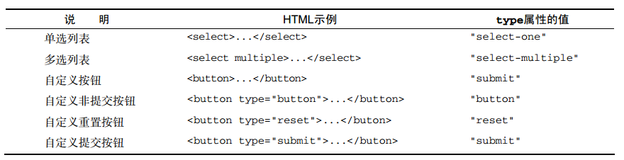

# 表单基础
在HTML中，表单是由`<form>`元素表示，时HTMLFormElement类型，继承与HTMLElement。因此拥有其他HTML元素具有的默认属性，而它也拓展了自己的独有属性和方法：
- acceptCharset: 服务器能够处理的字符集。等价于HTML中的accept-charset特性
- action: 接收请求的URL。等价于HTML中的action特性
- elements: 标案中所有控件的集合(HTMLCollection)
- enctype: 请求的编码类型。等价于HTML中的enctype特性
- length：表单中控件的数量
- method： 要发送的HTTP请求类型，通常'get'或'post'.等价于HTML的method特性
- name: 表单的名称，等价于HTML的name特性
- reset(): 将所有表单域重置为默认值
- submit(): 提交表单
- target: 用于发送请求和接收响应的窗口名称。等价于HTML的target特性
获取表单：
```javascript
var form = document.getElementById('form1');
var forms = document.forms; // 获取所有表单
//根据名字获取表单：不推荐
var form = document.forms['form1'];
// 根据索引获取表单
var fom = document.forms[0];
```
## 提交表单
对于`<input><button>`都可以廷议提交按钮。只要将type特性设置为`submit`即可。图片按钮则将type设置为`image`来定义。下面的按钮点击，或表单任意地方拥有焦点按回车键，都可以提交表单。
```javascript
<input type="submit" value="submit Form" />
<button type="submit">submit Form</button>
<input type="image" src="graphic.gif"/>
```
以这种方式提交表单，浏览器会在请求发送给服务器之前触发submit事件。可以通过事件处理函数来控制是否提交表单以及表单验证。
```javascript
var form = document.getElementById('myForm');
form.addEventListener('submit', function(event) {
    var username = document.getElementById('username');
    var isValidate = validate(username);
    if (!isValidate) {
        event.preventDefault();
    } 
    form.submit();
})
```
当用户重复点击按钮时，会出现重复提交的情况，处理方式有两种：
- 当第一次提交就禁用按钮，等有结果返回再恢复
- 利用onsubmit事件处理程序取消后续的表单提交操作
## 重置表单
当用户点击充值按钮，表单会被重置。可以在`<input><button>`将type特性设置为reset，就可以创建重置按钮。点击后，所有表单字段都会恢复到页面刚加载完毕时的初始值。
```javascript
// 通用重置按钮
<input type="reset" value="reset form"/>
// 自定义重置按钮
<button type="reset"> reset form </button>
```
下面利用点击充值按钮表单时，触发reset事件。可以在必要的时候取消重置表单操作。
```javascript
var form = document.getElementById('form');
form.addEventListener('reset', function(event) {
    event.preventDefault();
})
```
## 表单字段
表单字段访问方式
- 通过document.getElementById()
- 通过form的elements属性： 包含一个所有表单的集合
```html
<html>
    <body>
		<form id="myform">
			<input name="username"/>
			<input name="password"/>
			<input name="age"/>
			<input name="age"/>
		</form>
	</body>
	<script type="text/javascript">
        (function() {
        var form = document.forms[0];
            var elements = form.elements;
            // first element
            console.log(elements.item(0));
            console.log(elements[0]);

            // 表单中包含的字段的数量
            console.log(elements.length);
            
            // 返回age的NodeList集合
            console.log(elements['age']);
        }())
	</script>
</html>
```
### 共有属性
除了`<filedset>`元素之外，所有表单字段都拥有相同的一组属性。由于`<input>`类型可以表示多种表单字段，因此有些属性只适用于某些字段。但有一些属性是所有字段所共有的。共有属性如下：
- disabled: 表示当前字段是否被禁用
- form：表示当前字段所属表单的指针
- name: 当前字段的名字
- readOnly: 当前字段是否只读
- tabIndex：当前字段的切换(tab)需要
- type：当前字段的类型。如checkbox, textera, radio
- value: 当前字段将被提交给服务器的值
除了form属性，可以使用javascript动态修改值
```javascript
var form = document.getElementById('myform');
var inputEl = form.elements[0];
// 获取焦点
inputEl.focus();

// 修改值
inputEl.value = "update my world";

// 禁用当前字段
inputEl.disabled = true;

// 修改type属性
inputEl.type = 'checkbox';
```


### 共有方法
- blur(): 失去焦点，从元素身上移除属性
- foucs(): 获取焦点,激活表单字段(当type是hidden,或css的visibility是true，那么会报错)
- autofocus: HTML5的自动聚焦属性。只要支持这个属性，javascript会自动把焦点移动到相应字段
```javascript
<input type="text" autofoucs/>
```
### 共有的表单字段事件
- blur: 当前字段失去焦点时触发
- change: 对于`<input><textera>`来说：失去焦点并且value值改变触发。对于`<select>`：其选项改变时触发
- focus:当前字段获得焦点时触发

# 文本框脚本
在HTML中，有两种方式表现文本框，第一种`<input>`元素的单行文本框。一种是`<textera>`的多行文本框。`<input>`的属性：
- type: 等于text
- size: 文本框中能够显示的字符数
- value: 文本框的初始值
- maxlength: 文本框可接受的最大字符数
```html
<input type="text" value="enter" size="25" maxlength="50"/>
```
<textera>不能指定最大字符数。的属性：
- cols: 列数
- rows: 行数
```html
<textera name="textbox1" cols="2" rows="3">init value </textera>
<script>
    var textbox = document.forms[0].elements['textbox1'];
    textbox.value = "updatevalue";
</script>
```
建议在修改文本框的值时，对value特性进行修改，不要使用DOM的setAttribute()方法。因为对value做的修改，不一定会反应到DOM中(解释不是很懂)

## 选择文本 
- select()方法： 上面两种文本框都支持。选择文本框中的所有文本.大多数浏览器将焦点设置到文本框中
- select事件：选择文本框的文本时会触发select事件。
- selectionStart: 保存选中文本范围开始索引（配合select()方法）
- selectionEnd: 保存选中文本结束索引（配合select()方法）
```javascript
var textbox = document.forms[0].elements['textbox1'];
textbox.select();

textbox.addEventListener('select', function(event) {
    console.log('select input text');
})

// 获取被选中的文本
var selectText = textbox.value.substring(textbox.selectionStart, textbox.selectionEnd);
```
IE8及更早将文本选择的内容保存在一个document.selection对象中。要取得文本，需要创建一个范围，然后将文本从其中提取出来
```javascript
var selectText = document.selection.createRange().text;
```
- setSelectionRange(startIndex, endIndex): 选择部分文本。
- createTextRange(): IE8使用，创建一个范围，然后使用moveStart(), moveEnd()两个范围方法将范围移动到位。调用这两个方法之前，需要使用collapse()将范围折叠到文本框的开始位置。此时，moveStart()将范围的起点和终点移动到相同的位置，只要再给moveEnd()传入要选择的字符总数即可。最后一步使用范围的select()方法选择文本。
```javascript
var textbox = document.forms[0].elements['textbox1'];
textbox.value = "hello, word";
textbox.setSelectionRange(1, 3); // ell
```
兼容IE的方法
```javascript
function selectText(textbox, starIndex, endIndex) {
    if (textbox.setSelectionRange) {
        textbox.setSelectionRange(startIndex, endIndex);
    } else if(textbox.createTextRange){
        var range = textbox.createTextRange();
        range.collapse();
        range.moveStart('character', startIndex);
        range.moveEnd('character', endIndex - startIndex);
        range.select();
    }
    textbox.focus();
}
```
## 过滤输入
当我们输入的内容希望是数字的时候才显示，可以通过下面的操作处理：
```javascript
var textbox = document.forms[0].elements['textbox'];
textbox.addEventListener('keypress', function(event) {
    event = event || window.event;
    var charCode = event.charCode || event.char;

    // 输入内容必须是数字。 safafi 3以前对应的字符编码全部是8. Ctrl + C, Ctrl + v是可以的，因此排除ctrl键
    if (/!\d/.test(String.formCharCode(charCode)) && charCode > 9 && !event.ctrlKey) {
        event.preventDefault(); // event.returnValue = false;
    }
})
```
## 操作剪贴板
HTML5把剪贴板事件纳入规范。以下是6个剪贴板事件。
- beforecopy: 在发生复制操作前出发
- copy: 在发生复制操作时触发
- beforecut: 在发生剪切操作前触发
- cut: 在发生剪切时触发
- beforepast: 在发生粘贴操作前触发
- paste: 在发生粘贴操作时触发
要访问剪贴板中的数据，可以使用clipboardData对象。IE在window中。其他的浏览器在event对象中。clipboardData对象有三个方法：
- getData(type): 从剪贴板中获取数据.type:IE支持`text` `URL`。 Safari和Chrome任然支持 MIME类型。
- setData(type, value)： Safari和Chrome不能识别`text`类型。当正确将内容放入剪贴板返回true。否则返回false
- clearData()
```javascript
var EventUtil = {
    getClipboardText: function(event) {
        var clipboardData = (event.clipbloardData || window.clipboardData);
        return clipboardData.getData('text');
    },
    setClipboardText: function(event, value) {
        if (event.clipbloardData) {
            event.clipboardData.setData('text/plain', value);
        } else {
            window.clipboardData.setData('text', value);
        }
    }
};
```
当我们在进行粘贴操作，但是只允许粘贴数字类型的内容。那么可以通过下面方式处理。
```javascript
var inputbox = document.getElementById('inputbox');
inputbox.addEventListener('past', function(event) {
    var content = event.clipboradData.getData('text');
    if (!/^\d$/.test(content)) {
        e.preventDefault();
    }
})
```

## 自动切换焦点
当有几个输入框，第一个输入框输入完毕，自动切换到下一输入框。实现方式：在切换焦点之前，需要知道用户已经输入的既定长度的数据(例如电话号码 = 区号3位 + 局号3位 + 4位数字)。
```html
<input type="text" name="name1" id="text1" maxlength="3"/>
<input type="text" name="name2" id="text2" maxlength="3"/>
<input type="text" name="name3" id="text3" maxlength="4"/>
```
实现自动切换焦点
```javascript
(function() {
    function tabForward(event) {
        event = event || window.event;
        var target = event.target || event.srcElement;
        var maxLength = target.maxLength;
        if (maxLength === target.value.length) {
            var nextSibling = target.nextElementSibling;
            nextSibling && nextSibling.focus();
        }
    }
    var text1 = document.getElementById('text1');
    var text2 = document.getElementById('text2');
    var text3 = document.getElementById('text3');
    text1.addEventListener('keyup', tabForward);
    text2.addEventListener('keyup', tabForward);
    text3.addEventListener('keyup', tabForward);
}());
```
## HTML约束验证API
为了将表单提交到服务器之前验证数据，HTML5新增了一些功能。浏览器自己根据标记中的规则执行验证，然后自己显示适当的错误信息。
- 必填字段:提交表单时不能空着。适用于`<input>, <textera>, <select>`
```html
<input type="text" name="username" required/>
```
- 其他输入类型
- email: email类型要求输入文本必须是电子邮件地址格式
- url: 输入文本必须要求符合URL格式。
```html
<input type="email" name="email"/>
<input type="url" name="homeoage"/>
```
校验是否支持该类型
```javascript
var input = document.createElement('input');
input.type = 'email';
var isEmailSupport = (input.type === 'email');
```
## 数值范围
除了上面的email和url之外，HTML5还定义了type支持几个元素要求填写某种基于数字的值。但是以下的兼容性不是特别好。
- number: 
- range
- datetime
- datetime-local
- date
- month
- week
- time
对上面几个输入类型，可以指定min属性，max属性，step属性(从min 到max两个刻度间的差值)
```html
<!-- 输入的只能是5-100的值，并且是5的倍数 -->
<input type="number" min="5" max="100" step="5"/>
```
通过下面两个方法修改step梯度
- stepUp(num): 在现在的梯度 + num
- stepDown(num) : 在现在的梯度 - num
```javascript
var input = document.getElementById('input');
input.stepDown(10); // step = step - 10;
input.stepUp(11); // setp = step + 11;
```
## 输入模式
HTML5新增pattern。正则表达式。用于匹配文本框中的值。
- 如果模式开始使用`^`结尾使用`$`(假设两个都有了)，这两个符号表示输入的值必须从头到尾都与模式匹配。
- 虽然指定了pattern，但是还是不能阻止输入无效的值
```html
<input type="text" id="myInput" pattern="\d+" name="count"/>
```
## 检查有消息
- checkValidity(): 检测表单中的某个字段是否有效。所有表单字段都有这个方法，如果字段的值有效，返回true,无效范围false。用在form表单上，检测整个表单是否有效，都有效返回true,否则返回false.
- validity属性： 告诉你为什么字段有效或无效。这个对象包含一系列属性，每个属性返回布尔值。
    1. customError: 如果设置了setCustomValidity(), 则为true, 否则为false
    1. patternMismatch: 如果值与指定的pattern属性不匹配，返回true
    1. rangeOverflow: 如果值比max值大。返回true
    1. rangeUnderflow: 如果值比min值小，返回true
    1. stepMisMatch: 如果min 和max之间的步长值不合理，返回ture
    1. valid: 如果这里其他属性都是false,返回true.与checkValidity()也要求相同的值。
    1. valueMissing: 如果标注为required的字段中没有值，返回true.
```javascript
// 判断上面那个pattern模式
(function() {
	   var input = document.getElementById('myInput');
       // 使用textinput事件：感觉时keydown就触发了，有问题。所以这里使用keypress
		input.addEventListener('keypress', function() {
			console.log(input.checkValidity());
            console.log(input.validity.valid);
		})
}());
```
## 禁用验证
- novaliate: 告诉表单不进行验证
- formnovalidate: 如果表单中有多个提交按钮，为指定某个提交按钮不进行表单验证，则在相应的按钮上添加formnovalidate属性。
```html
<form method="post" action="sigup.php" novalidate>
    <input type="submit" value="regular submit"/>
    <input type="submit" formnovalidate name="btnNoValidate" value="Non-validating Submit"/>
</form>
```
使用javascript吸怪
```javascript
document.forms[0].noValidate = true;
```

# 选择框脚本
选择框通过`<select>`和`<option>`元素创建，为方便和这个控件交互，除了所有表单共有的属性和方法外，HTMLSelectElement类型还提供下面的属性和方法
- add(newOption, relOption): 向控件的relOption位置前面插入newOption元素
- multiple: 表示允许多项选择，等价于HTML中的multiple特性
- options: 空间中所有的`<option>`元素的HTMLCollection
- remove(index): 移除掉给定位置的选项
- selectedIndex: 被选中的option的索引。没选中为-1
- size: 选择框中可见的行数。等价于HTML中的size特性
选择框的type属性:取决于HTML代码中有没有multiple特性：
- select-one
- select-mutiple
选择框的value属性：
- 没有选中，value为空字符串
- 选中一个：并且选中的option有value特性， 则选择框的value值等于选中项的value特性。
- 选中一个：并且选中的option没有value特性，则选择框的value属性等于该项的文本
- 选择多项： 则选择框的value属性根据前两条规则取得第一个选中项的值

```html
<select name="location" id="sellocation" multiple="multiple">
    <option label="1" value="1" selected>1</option>
    <option label="2" value="2" selected>2</option>
    <option label="3" value="">1</option>
</select>
<script>
    var location = document.getElementById('sellocation');
    // 点击第2个option, select的value = 2
    // 点击第三个option, select的value = ''
</script>
```
选择框的`<option>`是HTMLOptionElement对象，该对象也有自己的属性：
- index: 当前options集合中的所在索引
- label: 当前选项的标签，等价于HTML中的label特性
- selected: 布尔值，当前选项是否被选中。如果将这个属性设置为true，可以选中当前选项
- text: 选项的文本
- value: 选项的值(等价于HTML中的value特性)
```javascript
var option1 = document.getElementById('sellocation').options[0];
// DOM 标准方法，不推荐
var text = option1.nodeValue; 
var value = option1.getAttribute('value');

// 使用选项的属性
var text = option1.text;
var value = option1.value;
```
### 选择选项
```javascript
// 单项选择获取被选择项
var location = document.getElementById('sellocation');
var selectedOption = location.options[location.selectedIndex];

// 单项选择设置被选择项
location.selectedIndex = 2; // 或者 location.options[1].selected = true;

// 多项选择设置被选择项
location.options[2].selected = true;
location.options[1].selected = true;

// 获取多选项背选择的项
Array.prototype.filter.call(location.options, function(item) { return item.selected == true;})
```
### 添加选项
- Option(text, value)构造函数： 文本(text), 值(value)
- add(newOption, positionOption)：将newOption添加到positionOption前面
```javascript
var location = document.getElementById('sellocation');

// DOM方式添加
var newOption = document.createElement('option');
newOption.appendChild(document.createTextNode('add option'));
newOption.setAttribute('value', '3');
location.appendChild(newOption);

// Option构造函数创建（IE使用不了）
var newOption = new Option('optionText', 'option value');
location.appendChild(newOption);

// 使用add方法新增
var newOption = new Option('optionText', 'option value');
location.add(newOption, null);
```

## 移除选项
- remove(itemIndex)
```javascript
var location = document.getElementById('sellocation');
// DOM方式
location.removeChild(location.options[0]);

// remove()方法
location.remove(0);

// 将内容设置为null
location.options[0] = null;
```
## 表单序列化
- 对表单名称和值进行URL编码，使用&隔开
- 不发送禁用字段
- 只发送勾选的复选框和单选按钮
- 不发送type=reset和type=button的按钮
- 多选选择框中的每个选中的值单独一个条目
- 在单击提交按钮提交表单的情况下，也会发送提交按钮。否则不发送提交按钮。也包括type=image的input元素
- `<select>`元素的值，也就是选中的`<option>`的value特性的值。如果选中的`<option>`元素没有value特性，则是`<option>`元素的文本值
```javascript
	function serialize(form) {
		var parts = [], 
		field = null, 
		i,
		len = form.elements.length;
		for (i = 0; i < len; i++) {
			field = form.elements[i];
			switch(field.type) {
				case 'select-one':
				case 'select-multiple':
					if (field.name.length) {
						var selectedOpts = Array.prototype.filter.call(field.options, function(item) {
							return item.selected == true
							});
						selectedOpts.map(function(item) {
							var value = item.value || item.text;
							parts.push(encodeURIComponent(field.name) + "=" + encodeURIComponent(value));
						})
					};
					break;
				case undefined:
				case 'file':
				case 'submit':
				case 'reset':
				case 'button':
				case 'image':
					break;
				case 'radio':
				case 'checkbox':
					if (!field.checked) {
						break;
					}
				default:
					if (field.name.length) {
						parts.push(encodeURIComponent(field.name) + "=" + encodeURIComponent(field.value));
					}
			}
		}
		return parts.join('&');
	}
```