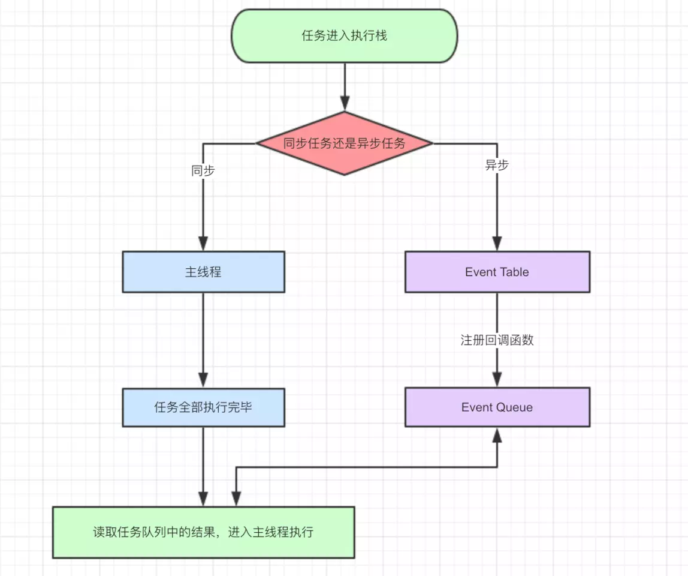
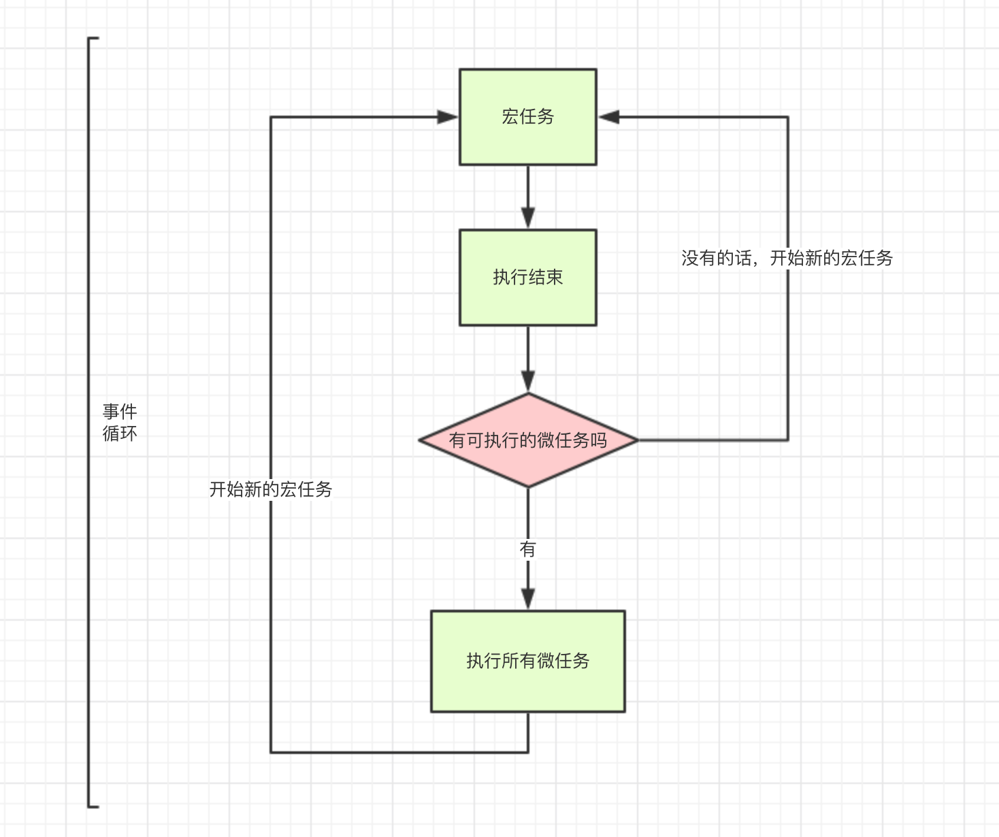

# 1. 浏览器渲染简介

## 1.1 浏览器渲染流程
<br>

## 1.2 浏览器渲染中的部分线程
<br>
- GUI渲染线程： 负责渲染浏览器界面，解析HTML，CSS，构建DOM树和RenderObject树，布局和绘制等。
- JS引擎线程: 负责处理Javascript脚本程序。GUI渲染线程与JS引擎线程是互斥的，所以如果JS执行的时间过长，这样就会造成页面的渲染不连贯，导致页面渲染加载阻塞。
- 事件触发线程: 归属于浏览器而不是JS引擎，用来控制事件循环（Event Loop）。
- 定时触发器线程: 传说中的setInterval与setTimeout所在线程, 通过单独线程来计时并触发定时（计时完毕后，添加到事件队列中，等待JS引擎空闲后执行）
- 异步http请求线程: 将检测到状态变更时，如果设置有回调函数，异步线程就产生状态变更事件，将这个回调再放入事件队列中。再由JavaScript引擎执行。

# 2. Event Loop

## 2.1 JS 是单线程的
JS 最初设计是用于浏览器中。假如JS是多线程的，我们试想会发生什么问题呢？<br>
- 多线程操作dom A 时，process1向 A 添加数据，process2 删除A。那么此时浏览器到底遵循哪个命令呢，自此产生矛盾。<br>

为了利用多核CPU的计算能力，HTML5提出Web Worker标准，允许JavaScript脚本创建多个线程，但是子线程完全受主线程控制，且不得操作DOM。所以，这个新标准并没有改变JavaScript单线程的本质。

## 2.2 JS 分为同步和异步
假如JS 只是同步的，会产生哪种场景呢？<br>
如果JS 不存在异步，只能自上而下执行，假如我们异步请求数据时，那么界面就会阻塞，对于用户而言，页面就会卡死。这样就会导致很差的用户体验。当我们打开网站页面，网页的渲染就是一堆同步任务，例如页面骨架和DOM元素的渲染。而图片和数据等占用资源耗时久的任务，就是异步任务。因此JS的任务分为两种： 同步任务 和 异步任务<br>
<br>
- 当任务进行执行时，同步任务进行主线程，异步任务进入Event Table,并注册回调函数
- 当主线程任务执行完毕，回到Event Table中读取函数到主线程中执行
- 不断重复以上步骤，直到事件执行完毕，该循环也就是常说的`Event Loop`

## 2.3 主进程如何知道执行栈为空？

```
事件触发线程
```

# 3. JS Event Loop 实例探索
JS 本质就是单线程的，线程中只拥有一个唯一的事件循环，一切`javascript 版本`的多线程都是使用单线程模拟的。事件循环是JS实现异步的的一种方法，也是JS的运行环境的机制。
## 3.1 异步请求
```javascript
    let data = [1, 2, 3]; // 1. 执行data赋值
    $.ajax({    // 2. ajax 请求，注册Event Table, 
        url:www.test.url.com,
        data:data,
        success:() => { // 4. ajax完成事件，success进入event Queue。主进程读取该任务进入 主进程
            console.log('发送成功!');  // 5. 打印 `发送成功`
        }
    })
    console.log('代码执行结束'); // 3. 打印 `代码执行结束 `，主进程无任务，读取 event Queue
```

## 3.2 setTimeout 
以下的结果看起来有点匪夷所思，效果与期待的不一样，根据HTML的标准，最低是4毫秒。<br>
```javascript
    setTimeout(() => { // 1.函数进入event Table
    console.log(2)
    }, 2); 
    setTimeout(() => { // 2.函数进入event Table
    console.log(1)
    }, 1);
    setTimeout(() => { // 3.函数进入event Table
    console.log(0)
    }, 0);

    // firefox: 0, 1, 2
    // chrome: 1, 0, 2
    // ie: 0, 1, 2
```
按照同步任务和异步任务来说，以上为三个异步任务，分别在2,1，0毫秒后，将事件注册到event Queue,等待主线程进行调用。但是当由于时间间隔太短，浏览器的处理机制看起来是不一样的。

```javascript
    setTimeout(() => { // 1.函数进入event Table, 5毫秒后，函数进入event queue
    console.log(2)
    }, 5); 
    setTimeout(() => { // 2.函数进入event Table 4毫秒后，函数进入event queue
    console.log(1)
    }, 4);
    setTimeout(() => { // 3.函数进入event Table 4毫秒后，函数进入event queue
    console.log(0)
    }, 4);

    // 因为都大于了4毫秒，因此结果没有特殊性。 结果都为：1， 0， 2
```
当混合同步code时，setTime的效果又是怎样的？
```javascript
    setTimeout(() => { // 1.函数进入event Table, 
        console.log(2)
    }, 5); // 2. 5毫秒后，函数进入event queue。由于sleep主线程一直没有完成，因此 5ms后，不会被执行。直到主线程空闲了，才会进行调用
    sleep(10000); // 同步代码执行
```
因此，可以知道，setTimeout这个函数，是经过指定时间后，把要执行的任务加入到Event Queue中，直到主线程空闲后，从Event Queue中取出事件执行。

# 3.3 setInterval
setInterval与setTimeout是一样的，只不过是每隔一定时间将事件放入到Event Queue。如果主线程的时间等待太久，会出现 完全看不出的时间间隔。
```javascript
var i = 10; 

// 间隔500毫秒，将事件放入event Queue中
var interval = setInterval(() => { 
    console.log('interval:',i++);
}, 500); 

// 主线程阻塞，导致interval的事件执行不了
for(var j = 0; j<10000; j++) { 
    console.log(i); 
} 
// 主线程for循环结束，取消interval的事件，会从event Queue中拿出之前存放的事件执行。并且看不出间隔事件
setTimeout(function(){clearInterval(interval)}, 5000);
```

# 4. Event Loop 的 macrotask 和 microtask
我们对Promise不会感到陌生，也是实现异步的一种方式。下面我们来看一下下面的例子。<br>
```javascript

setTimeout(function() {
    console.log('setTimeout');
})
new Promise(function(resolve) {
    console.log('promise');
}).then(function() {
    console.log('then');
})

console.log('console');
```
如果把Promise 按照以上规则来，我以为结果是（console => promise => setTimeout => then ），结果却不一样（console => promise => then => setTimeout）。为什么呢？<br>

因为JS对任务不仅仅只是 同步任务 与 异步任务。还分为：
- macro-task(宏任务)，例如 Script(整体代码)、setTimeout、setInterval、UI交互事件
- micro-task(微任务),例如 Promise、MutaionObserver<br>
<br>


# 5. 测试题
tip: 需要注意的是，立即resolve()的 Promise 对象，是在本轮“事件循环”（event loop）的结束时执行，而不是在下一轮“事件循环”的开始时。
- 1题
```javascript
setTimeout(() => {
  console.log(0);
})

new Promise(resolve => {
  resolve(1);
  Promise.resolve().then(t => {
    console.log(2);
    Promise.resolve().then(t => {
      console.log(4);
    })
  })
  console.log(3);
})
.then(t => {
  console.log(t);
})
console.log(5);
```

- 2 题
```javascript
setTimeout(() => {
  console.log(0);
})

new Promise(resolve => {
  setTimeout(function(){resolve(1);}, 5000);
  Promise.resolve().then(t => {
    console.log(2);
    Promise.resolve().then(t => {
      console.log(4);
    })
  })
  console.log(3);
})
.then(t => {
  console.log(t);
})
console.log(5);
```

- 3题
```javascript
console.log('1');

setTimeout(function() {
    console.log('2');
    new Promise(function(resolve) {
        console.log('4');
        resolve();
    }).then(function() {
        console.log('5')
    })
})
new Promise(function(resolve) {
    console.log('7');
    resolve();
}).then(function() {
    console.log('8')
})

setTimeout(function() {
    console.log('9');
    new Promise(function(resolve) {
        console.log('11');
        resolve();
    }).then(function() {
        console.log('12')
    })
})
```
# 7 event loop 与浏览器的渲染机制参考
https://github.com/aooy/blog/issues/5
https://www.html5rocks.com/zh/tutorials/internals/howbrowserswork/
http://www.dailichun.com/2018/01/21/js_singlethread_eventloop.html