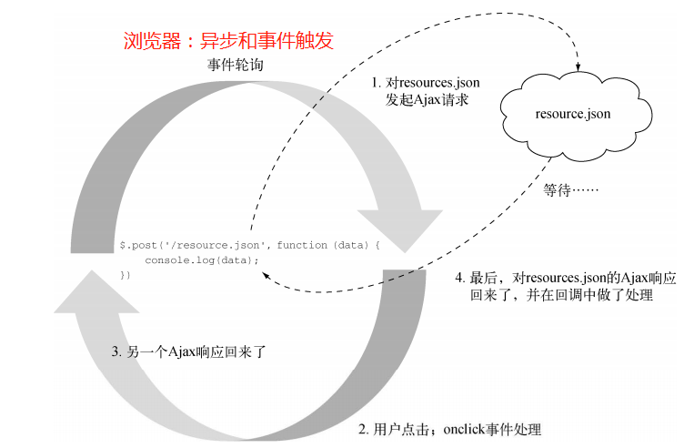
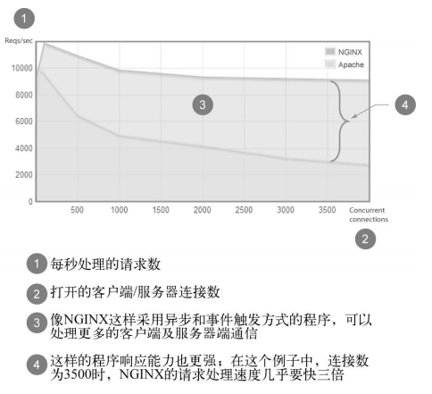
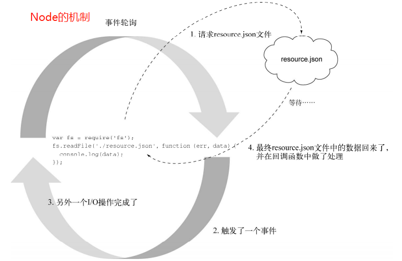

# 1. node 定义
一个搭建在Chrome Javascript运行时上的平台，用于构建高速，可伸缩的网络程序。Node.js采用的事件驱动，非阻塞I/O模型，使它既轻量又高效，并成为构建运行在分布式设备上的数据密集型实时程序的完美选择。
#2. 构建于javascript之上
在服务端编程，Node使用的是未Google Chrome提供动力的V8虚拟机，V8让Node在性能上得到了巨大的提升，因为省掉了中间环节，执行的不是字节码，也不是解释器，而是直接编译成本地机器码。Node在服务器端使用javascript还有其他好处。
- 使用一种语言就能编写整个web应用。减少了开发客户端与服务端的语言切换。代码也可以在客户与服务端共享(表单校验等)。
- JSON是流行的数据交换格式，并且还是javascript原生的。
- 有些NoSQL数据库中用的就是JavaScript语言（比如CouchDB和MongoDB），所以跟它们简直是天作之合（比如MongoDB的管理和查询语言都是JavaScript）
- Javascript是一门编译目标语言，现在嗯好的诺可以编译为javascript的语言
- Node用虚拟机(V8)会紧跟ECMAScript标准，换句话说：在node中如果想使用新的JS的语言特性，不需要等到所有浏览器都支持。<br>
#3 异步和事件触发(浏览器与服务器)
- 浏览器
```javascript
// I/O操作（Ajax请求）会“阻塞”脚本继续执行，直到数据准备好,因为浏览器是单线程的。
let data = $.post('url');
console.log(data);

// 当浏览器中有I/O操作时，该操作会在事件轮询的外面执行（脚本执行的主顺序之外），然后当这个I/O操作完成时，它会发出一个“事件”， 会有一个函数（通常称作“回调”）处理它。I/O是异步的，并且不会“阻塞”脚本执行，事件轮询仍然可以响应页面上执行的其他交互或请求。这样，浏览器可以对客户做出响应，并且可以处理页面上的很多交互动作。
$.post('url', function(data) {
    console.log(data);
});
```
<br>
- 服务器
下面是服务端的脚本，按照传统的服务端编程的I/O模型，由于下列某个原因，这个例子是会被阻塞的。
- 负载增加，数据库查询变慢
- 硬盘正在执行维护操作，读写暂停
- 某与其他原因，拉去资源非常缓慢
传统的处理方式：当程序在I/O上阻塞了，其他请求过来时，一般都是使用多线程方式处理。设置一个线程池，将空闲的线程分配给过来的请求。当需要大量的线程处理并发服务器连接时，线程就会消耗额外的操作系统资源。因为线程需要CPU和额外的RAM来做上下切换。
```javascript
$result = mysql_query('select * from myTable');
print_r($result);
```
传统服务器是阻塞I/0的多线程方式，而Node则是使用异步I/O的事件轮询(就像浏览器中的I/O事件轮询一样)。I/O事件轮询在主事件之外进行(例如通过回调处理)，使服务器能够一直处于高效并且随时可以做出响应状态。这样进行不会受限于I/O,而I/O延迟也不会拖垮服务器，也不会像阻塞方式下那样占用更多资源。因此让服务器上曾经的一些重量级操作可以在Node服务器上是轻量级的。Nginx服务器也是这样事件轮询的方式。<br>
<br>
Node是javascript程序的平台，不要把它和框架弄混淆了。Node从构建开始就是事件驱动和异步的模型。Javascript常见的宿主环境是浏览器，而浏览器也是事件驱动和异步的。Node重新实现了宿主中的常用对象，尽量让浏览器和服务器保持一致。例如：
- 计时器API(setTimeout)
- 控制台API(console.log)<br>
Node拥有处理多重网络和文件I/O的核心模块(http,https,TLS,文件系统(POSIX),数据报(UDP)和NET(TCP))的模块。Node也有很多第三方模块，都是基于这些核心模块，针对常见问题进行了更高的抽象。<br>
```javascript
// 使用node的fs模块进行文件读取
var fs = require('fs');
// 从硬盘中读取resource文件，当数据读取后，调用回调函数: er（如果出现错误）,data（文件中的数据）
// 基于事件轮询与异步的模型，不会进行阻塞，可以任意在读取其他文件或进行其他操作。
fs.readFile('./resource.json', function(er, data) {
    console.log(data);
});
```
<br>
# 4. 简单的Node Http服务器
传统的服务器部署：将PHP或java程序放入到Apache HTTP服务器上。而Node中的部署非常简单，服务器和程序是一样的。下面是一个简单HTTP服务器的实现。
```javascript
var http = require('http');
http.createServer(function(req, res) {
    res.writeHead(200, {'Content-Type': 'text/plain'});
    res.end('hello world\n');
}).listen(3000);
console.log('Server running at http://localhost:3000');
```
# 5. 数据流
Node在数据流和数据流动上很强大，我们可以把数据流看成是特殊的数组，只是数组中的数据分散在空间上，而数据流中的数据分散在时间上，例如读取一个文件时，数据是一块一块地传送，每当收到一块数据就开始处理，不需要等待数据全出到了再做处理。
- 当新的数据库准备好，就会激发data事件
- 当所有数据加载后，会激发end事件<br>
有了对读取流的底层访问，程序可以边读取边处理，这比等待所有数据缓存到内存中再处理效率高得多。
```javascript
var http = require('http');
var fs = require('fs');

http.createServer(function(req, res) {
    res.writeHead(200, {'Content-Type': 'text/plain'});
    res.end('hello world\n');
    var stream = fs.createReadStream('./1.node初识.md');
    stream.on('data', function(chunk) {
        console.log(chunk + '---------------------------------------------------------');
    });
    stream.on('end', function() {
        console.log('finished');
    });
}).listen(3000);
console.log('Server running at http://localhost:3000');
```
Node中也有可写数据流，往文件中写入数据。可读与可写数据流可以连起来形成管道，就像shell脚本用的 `|`管道操作符一样。这是一种高效的数据处理方式，不用等待数据准备好就可以将读取中的资源写出去。
```javascript
var http = require('http');
var fs = require('fs');

http.createServer(function(req, res) {
    res.writeHead(200, {'Content-Type': 'text/plain'});
    // 设置一个从读取流到写出流的管道
    // 数据从文件中读进来（fs.createReadStream），然后数据随着进来就被送到（.pipe）客户端（res）。在数据流动时，事件轮询还能处理其他事件
    fs.createReadStream('./1.node初识.md').pipe(res);
    res.end('hello world\n');
}).listen(3000);
console.log('Server running at http://localhost:3000');
```