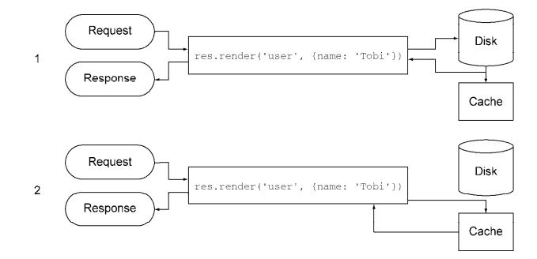
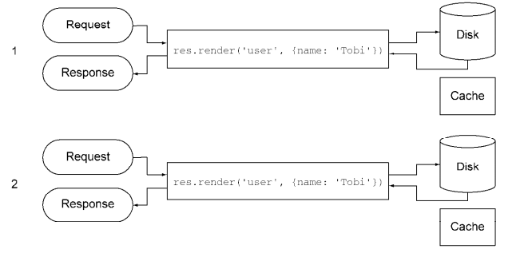
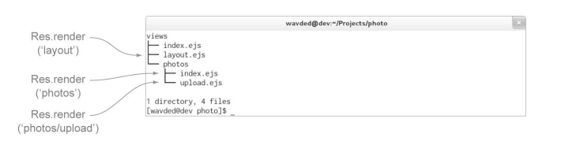
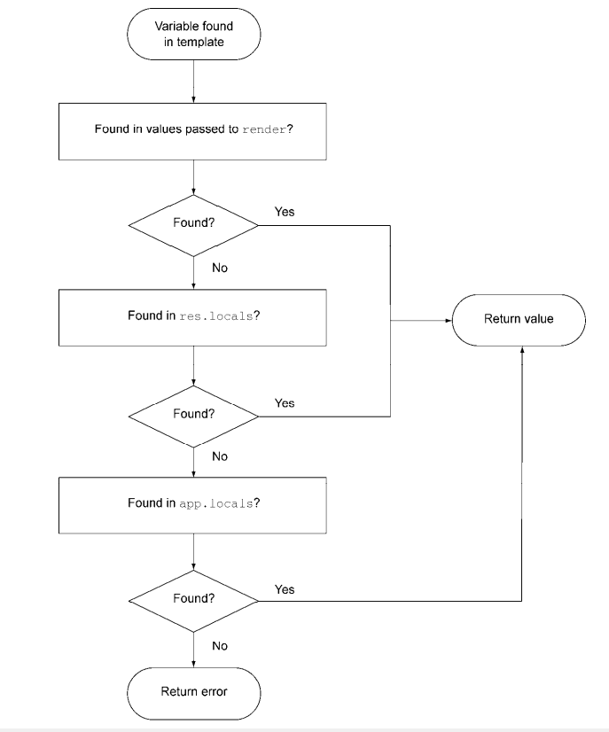

# 1. Express 简介
Web框架Express是构建在Connect之上的，它提供的工具和结构让编写Web程序变得更容易、更快速、更有趣。 Express提供了统一的视图系统，你几乎可以使用任何你想用的模板引擎，还有一些小工具，让你可以用各种数据格式返回响应，实现传送文件，路由URL等各种功能。<br>
Express的主导思想是程序的需求和实现变化非常大，使用轻量的框架可以打造出你恰好需要的东西，不会引入任何你不需要的东西。Express和整个Node社区都致力于做出更小的，模块化程度更高的功能实现，而不是一个整体式框架。
Express 4 不再依赖于 Connect，从其核心移除了所有内置的中间件（除了 express.static 函数）。这意味着 Express 现在是独立的路由和中间件 Web 框架，Express 的版本控制和发行不受中间件更新的影响。

# 2. 基于环境配置
Express有一个极简的环境驱动配置系统，由5个方法组成，全部由环境变量NODE_ENV驱动。
```javascript
// 安装
npm install -g  express 
npm install express-generator
```
- NODE_ENV
这些环境变量会出现在你程序里的process.env对象中
```javascript
// - unix 设置环境变量
$ NODE_ENV=production node app
// - window：设置环境变量
$ set NODE_EN=production
$ node app
```
在程序中使用
```javascript
var env = process.env.NODE_ENV || '';

//  所有环境会调用
app.set('views', __dirname + '/views'); 
app.set('view engine', 'ejs');
...
// 仅开发环境，
if('development' === env) {
    app.use(express.errorHandler())
}
```
# 3. 视图渲染
渲染视图有两种方法，在程序层面用app.render(),在请求或者响应层面用res.render()[它在内部用的也是前者]。
```javascript
// server.js
//  指定了Express在查找视图时所用的目录。用__dirname是个好主意，这样你的程序就不会依赖于作为程序根目录的当前工作目录
app.set('views', __dirname + '/views'); 
// 设置模板引擎,后面加载的页面文件：没有后缀名就会是ejs,有则忽略
app.set('view engine', 'ejs');
// 当请求/,使用routerIndex处理
app.use('/', routerIndex);


// routerIndex.js
var router = express.Router();
/* GET home page. */
router.get('/', function(req, res, next) {
    // 渲染的页面路径：__dirname + '/views/index.ejs'
    res.render('index', { title: 'Express' });
});

router.get('/a', function(req, res, next) {
    // 提供了拓展名，所以使用index.jade
    res.render('index.jade', { title: 'Express' });
});
exports.routerIndex = routerIndex;
```
## 3.1 视图缓存
生产环境默认启用view cache设定，并防止后续的render()调用执行硬盘I/O。模板的内容保存在内存中性能能够显著提升。但是副作用是只用重启服务器才能使模板文件的编辑生效。因此在开发阶段需要禁用。
- 启用view cache:每个模板只会读取一次硬盘<br>
<br>
- 禁用view cache:无需重启程序就可以让模板的修改生效<br>
<br>

# 4. 视图查找
还是按照3小结中的例子，分析查找试图过程
- 请求`/`时，使用routerIndex路由进行解析
- 当res.render('index')被调用时，由于设置了`view engine`为`ejs`，Express会先检查`index.ejs`是否有文件在这个绝对路径上<br>
<br>
- app.locals传递程序层面的变量
- res.locals传递请求层面的本地变量<br>
Express默认只会向视图中输出一个程序级变量：settings，这个对象中包含所有用app.set()设定的值。
```javascript
app.set('title', 'myTitle');

// 可以从settings.title中获取。
<html>
    <head>
        <title><%=settings.title%></title>
    </head>
</html>
```
<br>
程序层面的变量，我们可以将其提取出来，然后一起设置到app.locals中
```javascript
var helpers = {
    h1: function() {},
    h1: function() {},
    name: 'xxx'
};
app.locals(helpers);
```
在Express中，用户被重定向后， res.locals中的内容会被重置。如果你把发给用户的消息存在res.locals中，这些消息在显示之前就已经丢失了。然而如果把消息存在会话变量中，就可以解决这个问题。消息可以在重定向后的最终页面上显示。