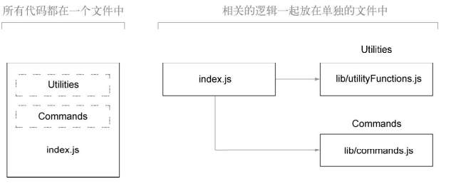
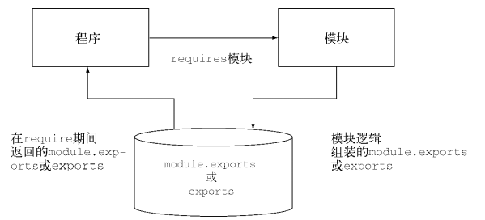
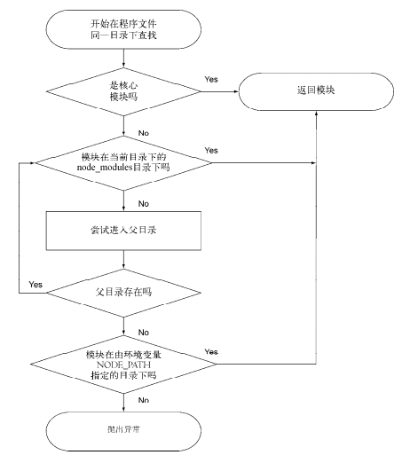
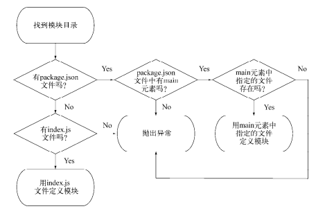

# 1 功能的组织与重用
模块是Node让代码易于重用的一种组织和包装方式。通常写代码，不肯能将所有代码放入到一个文件中，而是按照逻辑相关性对代码进行分组，分解为多个文件。<br>
<br>
PHP和Ruby语言，引用另一个文件，一般使用`include`方式。但是当命名变量与引入文件命名冲突，会被覆盖。例如下面的例子。会收到一条错误的消息。处理这个问题：PHP使用了命名空间避免这个问题。
```php
// string_handlers.php 文件
function uppercase_strim($text) {
    return trim(strtoupper($text));
}

// include_file.php文件： 抛出异常：Fatal error:Cannot redeclare uppercase_trim()
include('string_handlers.php');  
function uppercase_strim($text) {

}
```
Node从根本上解决了这个问题，允许你将引入的文件内容，暴露给程序的函数和变量。如果模块返回的函数或变量不只一个，可以通过设置exports对象的属性来指明它们。如果模块只返回一个函数或变量，则可以设定module.exports属性<br>
<br> 

## 2 创建模块(exports)
模块可以是一个文件，也可能是一个或多个文件目录(node会找到目录下的index.js作为模块的入口)。
```javascript
// a.js: 定义了add和multi两个函数进行导出，而num变量只能作为内部私有属性，外部程序不能直接访问。
var num = 10;
exports.add = function() {
    return num++;
};
exports.multi = function(count) {
    return num * count;
}


// b.js: a包含了导出的add和multi方法
var a = require('a.js');
```
require是Node中少数的同步I/O中的操作方法之一，经常在文件顶部引入。但不要在I/O密集的地方使用，因为同步会阻塞Node,知道调用完成才回做其他事。例如如果在运行一个HTTP服务器，如果每个请求进来都需要用require，则可能会遇到性能瓶颈。通常在程序加载初期才使用require以及其他同步操作。

## 3 微调模块(module.exports)
尽管用函数和变量组装的exports对象能够满足大多数模块创建的需要，但是有时需要不同的模型来创建该模块。Node不允许将函数，变量或对象直接复制给exports。
```javascript
// 错误的使用方式
var current = function() {}
exports = current;
```
要创建只返回一个变量或者函数的模块，我们需要使用module.exports替换exports。用它可以对外提供单个变量，函数或者对象。如果既有exports和module.exports，会忽略到exports而使用module.exports。
```javascript
function Current() {}
Current.prototype.say = function(){}
module.exports = Current;
```
- module.exports与exports的关系
程序最终导出的都是moudle.exports。而exports实际是moudle.exports的全局引用，最初被定义为可以添加属性的空对象。所以exports.func 是module.exports.func的简写。这也是为什么直接将某个函数(或变量，对象)赋值给exports会报错的缘故。
```javascript
// 可以通过这种方式，将exprots和module.export的链接维持一致，则可以使用
module.exports = exports = Current;
```
## 4 node_modules
Node的模块引入机制，不必知道模块在文件系统的具体位置，这个机制就是使用node_modules目录。例如我们之前引入`./Current`目录，如果省略掉了路径，直接使用`Current`，Node的查找规则如下：<br>
<br> 
用环境变量NODE_PATH可以改变Node模块的默认路径。如果用了它， NODE_PATH在Windows中应该设置为用分号分隔的目录列表，在其他操作系统中用冒号分隔。
- 如果模块是目录： 模块目录下必须有一个index.js作为模块的文件，否则需要在目录下的package.json中特别指明。
```javascript
{
    "main": "./index_replace.js"
}
```
<br> 
如果同一个模块在A，B地方都引入了，那么A引入的时候会将模块内容缓存起来，而B访问的是缓存中的内容。B引入时可以有机会修改缓存的数据，这种`猴子补丁`让一个模块可以改变另一个模块的行为，开发人员可以不用创建它的新版本。