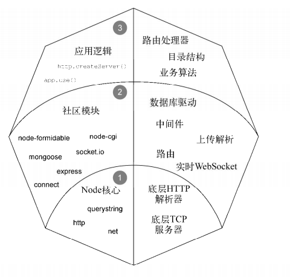
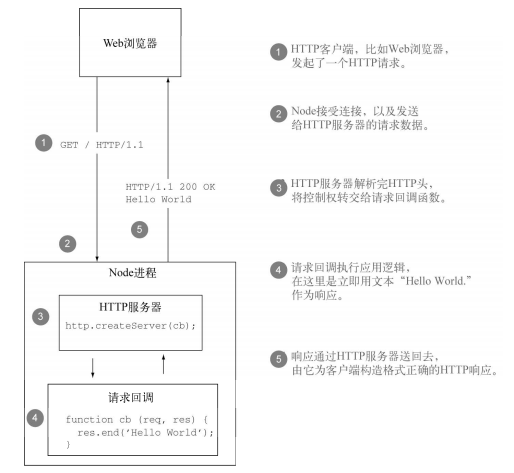
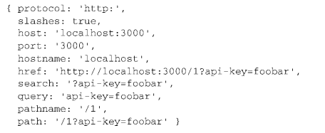
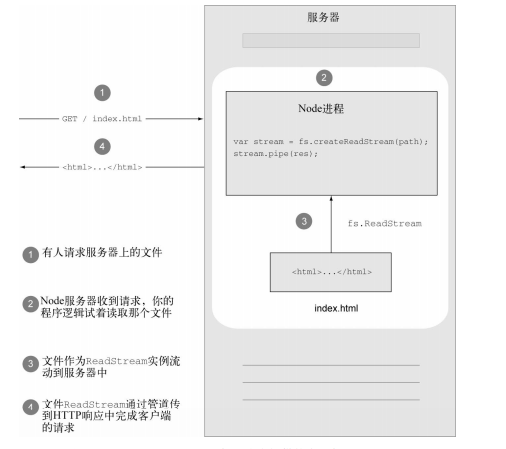

# 1. HTTP服务器基础
Node的API相对来说比较底层，它的HTTP接口一样也比较底层，这也保证了它的速度与灵活性。下图时给出了Node Web程序的内部结构，其核心为底层API,抽象层和实现曾都是构建在这些核心构建的基础之上。
- Node的核心：API都是轻量和底层的，而想法、语法糖和具体细节的实现都是交给社区去实现
- 社区模块：是node最兴盛的部分，社区成员利用底层核心API创造出有趣有易用的模块，帮你把任务轻松搞定。
- 应用逻辑层：由你的层序实现的，这一层的大小是由你所用的社区模块数量，以及程序的复杂程度决定的。<br>
<br>

# 2. HTTP服务解析原理
http服务器每收到一条HTTP请求，都会用新req和新的res对象来触发函数。
- 触发函数之前，Node会解析请求的HTTP头，并将他们作为req对象的一部分提供给请求回调。
- 不会在回调触发前，对请求体进行解析（PHP就是程序逻辑运行前就会解析请求头与请求体）
- Node提供这个底层借口，所以你想要的话，可以在请求体正在被解析时处理其中的数据。<br>
<br>

# 3. 第一个HTTP服务器
- req.setHeader():设置请求头
- req.setEncoding(): 最好设置解析请求的字符编码，否则是Buffer类型。
- 设置响应头需要在res.write()方法之前
- 设置HTTP响应的状态吗也需要在res.write()之前
```javascript
// 引入http模块
var http = require('http');
// 创建一个服务，毁掉函数中的req(请求头已经解析)和res作为参数
var server = http.createServer(function(req, res) {
    var body = 'hello, world';
    // 设置响应头
    res.setHeader('Content-Length', body.length);
    res.setHeader('Content-type': 'text/html');
    // 设置状态吗
    res.statusCode = 200;
    // 编写输出内容
    res.write(body);
    // 结束响应
    res.end();
    // res.write() 肯res.end()可以省略方式：
    // res.end(body);
});
// 绑定监听端口
server.listen(3000);
```
# 4. 构建RESTful Web服务器
典型的Web服务器都具有CRUD操作。这种操作的方式有很多，这里我们创建一个Restful Web服务。可以从req.method属性获取是哪个类型的请求。
- POST: 向待办事项清单中添加事件
- GET: 显示当前事项列表或者显示某一条详细信息
- DELETE: 从待办事项中删除事项
- PUT: 修改已有事项<br>

设置Content-length请求头:<br>
如果响应内容实在缓存中提前备好的，为了提高响应速度，在响应中可以带着Content-Length一起发送。对于响应清单而言，响应主体在内存中提前构建好，可以得到一长串的字符串一次性发出去去，设置了Content-Length域会隐含禁用Node的块编码，因为传输的数据更少，所以可以提高性能。设置的长度应该是`字节长度`,不是`字符长度`，Node提供了`Buffer.byteLength()`<br>

URL解析：<br>
`req.url`:是客户端请求的URL,Node提供了`.parse()`函数，可以解析出Url内容。包含了一下的属性。参数值都是字符串，需要其他类型自行转型。
- protocol: 协议类型(http, https)
- host: 主机地址
- port: 端口
- hostname: 主机名
- href: 整个url(http://localhost:3000/search?a=1&b=2)
- search: 查询字符串(?a=1&b=2)
- qeury: 查询参数对象(a=1&b=2)
- pathname: 查询url(/search)
- path: url+参数(/search?a=1&b=2)
<br>

# 4.1 服务器实现
- 通过POST，提交的数据村放入items缓存中
- 通过GET请求，将缓存中的数据获取回来
- 通过DELETE请求，删除数据
```javascript
var http = require('http');
var url = require('url');
var items = []; // 用一个常规的JavaScript数组存放缓存数据(响应清单)

// 处理POST请求
function dealPost(req) {
    var item = '';
    req.on('data', function(chunk) {
        item += chunk;
    });
    req.on('end', function() {
        items.push(item);
        res.end('OK\n');
    });
}

// 处理get请求
function dealGet(req) {
    var body = items.map(function(item, i) {
        return i + ') ' + item;
    }).join('\n');
    res.setHeader('Content-Type', 'text/plain; charset="utf-8"');
    res.setHeader('Content-Length', Buffer.byteLength(body));
}

// 处理delete请求
function dealDelete(req, res) {
    var path = url.parse(req.url).pathname;
    var id = paseInt(path.slice(1), 10);
    if (isNaN(id)) {
        res.end('invalid id');
    }
    if(!items[id]) {
        res.statusCode = '404';
        res.end('Item not found');
    }
    item.splice(i, 1);
    res.end('OK\n');
}
var server = http.createServer(function(req, res) {
     req.setEncoding('utf8');
     switch (req.method) {
        case 'POST':
            dealPost(req);
            break;
        case 'GET':
            res.end(items.join(','));
            break;
        case 'DELETE':
            dealDelete();
            break;
    }

}).listen(3000);
console.log('server start');
```
# 5. 提供静态文件服务器
- 创建一个静态服务器
- 处理服务器错误<br>
静态服务器都有一个根目录，提供文件服务的基础目录。Node中`__dirname`是当前文件所在目录的路径。
```javascript
var http = require('http');
var parse = require('url').parse;
var join = require('path').join;
var fs = require('fs');
// 存放当前目录到root变量，作为根路径
var root = __dirname;
var server = http.createServer(function(req, res) {
    var url = parse(req.url);
    var path = join(root, url.pathname);
    var stream = fs.createReadStream(path);
    // 将文件数据写入到响应中
    stream.on('data', function(chunk) {
        res.write(chunk);
    });
    stream.on('end', function() {
        res.end();
    });
}).listen(3000);
```
## 5.1 Stream.pipe()理解
这是一个管道方法，将来自于源头`ReadableStream`的数据，`流动`到目的地`WritableStream`，此时就可以用pipe()方法将源头于目的地连接起来，而pipe()方法就是管道。<br>
例如读取一个文件的内容，将其写入另外一个文件。
```javascript
var readStream = fs.createReadStream('./a.txt');
var writeStream = fs.createWriteStream('./b.txt');
readStream.pipe(writeStream);
// HTTP请求中的req对象其实就是一个ReadableStream对象，我们可以将其流入到文件中
req.pipe(fs.createWriteStream('./a.txt'));
```
那么上面的文件服务器就可以改变为一下内容
```javascript
var server = http.create(function(req, res) {
    var url = parse(req.url);
    var path = join(root, url.pathname);
    var stream = fs.createReadStream(path);
    // res.end()方法会在stream.pipe()内部进行调用
    stream.pipe(res);
});
```
<br>
# 6. 异常处理
当上面的静态服务器请求一个不存在的文件资源时，或者遇到了任何与文件I/O的问题，服务器会抛出异常。在Node中，所有集成了EventEmitter的类都会发出error事件，像fs.ReadStream这样的流是专用的EventEmitter类，它预先定义了data，end等事件。如果没有设置监听器，error事件就会抛出，搞垮你的服务器。
```javascript
var server = http.create(function(req, res) {
    var url = parse(req.url);
    var path = join(root, url.pathname);
    var stream = fs.createReadStream(path);
    stream.on('error', function(err) {
        res.statusCode = 500;
        res.end('Internal Server error');
    });
    stream.pipe(res);
});
```
##6.1 使用fs.stat实现先发制人的错误处理
传输的文件是静态的，我们可以使用fs.stat()来获取文件的相关信息，例如修改时间、字节数等。在提供Get支持时这些信息很重要，浏览器可以发起请求检查它的缓存是否过期。使用它进行异常预防处理。
- 查询文件大小与其他相关信息
- 检查文件是否存在
```javascript
var server = http.createServer(function(req, res) {
    var url = parse(req.url);
    var path = join(root, url.pathname);
    // 预先检查文件
    fs.stat(path, function(err, stat) {
        if (err) {
            if ('ENOENT' === err.code) {
                res.statusCode = 404;
                res.end('Not Found File');
            } else {
                res.statusCode = 500;
                res.end('Internal Server Error');
            } else {
                res.setHeader('Content-Length', stat.size);
                var stream = fs.createReadStream(path);
                stream.pipe(res);
                stream.on('error', function(err) {
                    res.statusCode = 500;
                    res.end('Internal Server Error');
                });
            }
        }
    });
});
```
# 7 从表单中接受用户输入
Web程序通常会通过表单收集用户的输入，Node不会帮你承担处理工作(例如表单验证),只是把请求数据主题交给你。表单提交请求的Content-Type通常有两种：
- application/x-www-form-urlencoded: 表单默认提交方式
- multipart/form-data:表单中含有文件或者非ASCII或者二进制数据时使用<br>

## 7.1 表单输入
- querystring: `parse()`方法返回内容`{item: 'content'}`
```JavaScript
var http = require('http');
var url = require('url');
var qs = require('querystring');
var items = []; // 用于存放所有添加的数据
// 处理get请求
function show(res) {
    var content = items.map(function(item, i) {
        return `<li>${item}</li>`;
    }).join('');
    var html = `<html>
        <head>
            <title>todo list</title>
        </head>
        <body>
            <h1>ToDo List</h1>
            <ul>
                ${content}
            </ul>
        </body>
    </html>`;
    res.setHeader('Content-Type', 'text/html');
    res.setHeader('Content-Length', Buffer.byteLength(html));
    res.end(html);
}

//  errorDeal
function errorDeal(res, code, text) {
    res.setStatus = code;
    res.setHeader('Content-Type', 'text/plain');
    res.end(text);
}

// add item
function add(req, res) {
    // 不用处理二进制数据，所以设置为utf-8
    // 默认表单提交的Content-Type:application/x-ww-form-urlencoded
    req.setEncoding('utf-8');
    var body = '';
    req.on('data', function(chunk) {
        body += chunk;
    });
    req.on('end', function() {
        var obj = qs.parse(body); 
        console.log('----------', obj);
        items.push(obj.item);
        show(res);
    });
}
var server = http.createServer(function(req, res) {
    var path = url.parse(req.url).pathname;
     if ('/' === path) {
        switch(req.method) {
            case 'GET':
                show(res);
                break;
            case 'POST':
                add(req, res);
                break;
           default:
           errorDeal(res, 400, 'Bade Request');
        }
     } else {
        errorDeal(res, 404, 'Not found');
     }
}).listen(3000);
console.log('server start');
```
## 7.2 文件上传例子
formidable: 处理上传文件，会随着数据库的上传接收它们，解析它们并吐出特定部分，这种方式比较快，并且不会需要大量缓冲而导致内存膨胀。即使像视频这种大型文件也不会将进程拖垮。<br>
formidable本身有很多事件，上传的文件流默认会到`/temp`目录下，载处理完表单元素后，formidable会发出事件。例如在收到文件并处理好后会发出file，收到输入域后会发出field事件。
```javascript
var http = require('http');
var url = require('url');
var formidable = require('formidable');
// 处理get请求
function show(res) {
    var html = `<html>
        <head>
            <title>todo list</title>
        </head>
        <body>
            <h1>ToDo List</h1>
            <form method="post" enctype="multipart/form-data">
                <p><input type="text" name="namekey"/></p>
                <p><input type="file" name="file"/></p>
                <p><input type="submit" value="Upload"/></p>
            </form>
        </body>
    </html>`;
    res.setHeader('Content-Type', 'text/html');
    res.setHeader('Content-Length', Buffer.byteLength(html));
    res.end(html);
}

//  errorDeal
function errorDeal(res, code, text) {
    res.setStatus = code;
    res.setHeader('Content-Type', 'text/plain');
    res.end(text);
}

function upload(req, res) {
   if(!isFormData(req)) {
       errorDeal(res, 400, 'Bad request: expecting multipart/form-data')
       return;
   }
   var from = new formidable.IncomingForm();
    // parse函数，如果传入第二个参数，是回调处理
    form.parse(req);
    form.on('field', function(field, value) {
        console.log(field, valu);
    });
    form.on('file', function(name, file) {
        console.log(name, file);
    });
    form.on('end', function() {
        res.end('upload complete!');
    });

   
}
function isFormData(req) {
    var type = req.headers['content-type'] || '';
    return 0 === type.indexOf('multipart/form-data');
}
...
```
Formidable提供了比较高级的api,就是把上面处理文件和字段的几个API封装到了一个回调函数冲，作为第二个参数传入parse()方法中。
```javascript
function upload(req, res) {
    // 初始化一个新的formidable.IncomingForm表单，解析req请求对象，然后就可以在formidable的data事件中进行解析文件数据
   var form = new formidable.incomingForm();
   form.parse(req, function(err, fields, files) {
       // err: 发生错误出现
       // fields: 提交的表单中其他表单的字段信息（{namekey: 'xxx'}）
       // files: 上传的文件信息
   });
}
```
### 7.3 进度条
Formidable的progress事件可以接收到字节数，以及期望收到的字节数，可以通过这个做一个进度条。
```javascript
form.on('progress', function(byteReceived, byteExpected) {
    var percent = Math.floor(byteReceived / byteExpected * 100);
    console.log(percent);
});
```