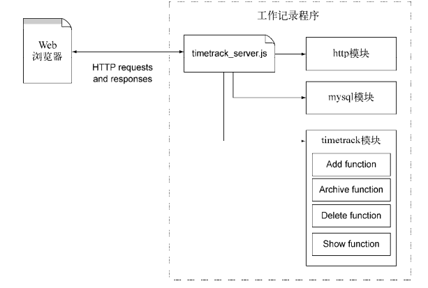

# 1. 存储数据的方式
- 缓存存储和本地文件存储，不需要安装和配置DBMS
- 关系型数据库存储数据，例如M有SQL，PostgreSQL
- NoSQL数据库存储数据，例如Redis,MongoDB和Mongoose

# 2. 无服务器数据存储
## 2.1 内存存储
内存存储使用变量存放数据，这种方式读取和写入都比较快。缺点：服务器和程序重启后数据会丢失。<br>
内存存储的理想用途是存放少量经常使用的数据。例如追踪一个网站访问次数计数。
```javascript
var http = require('http');
var counter = 0;
var server = http.createServer(function(req, res) {
    counter++;
    res.write('I have been accessed ' + counter + 'times.');
    res.end();
}).listen(3000);
```
## 2.2 基于文件的存储
文件存储通常用于配置程序的配置信息，但是也可以用它做数据持久化，在程序和服务器重启后依然有效。<br>
下面完成一个连接服务器后，控制台输入内容，将内容保存到文本数据中.
```javascript
var net = require('net');
var fs = require('fs');
var server = net.createServer(function(client) {
    client.on('data', function(data) {
        fs.writeFile('./a.txt', data, 'utf-8',function(err) {
            if (err) {
                console.log('err', err);
            };
            console.log('success');
        });
    });
    client.on('close', function() {
        console.log('leave触发');
    });
});
server.listen(3000);
```
# 3. 基于关系型数据库存储(Mysql)
这里我们使用mysql进行数据存储，例子模块设计为如下<br>
<br>
- 安装mysql模块
- 创建程序逻辑，timetrack_server.js：启动server, timetrack.js：包含程序相关功能
```javascript
// timetrack_server.js
// - 包含Node的HTTP的API,程序逻辑和Mysql Api
var http = require('http');
var work = require('./lib/timetrack');
var mysql = require('mysql');
// 链接mysql
var db = mysql.createConnection({
    host: 'localhost',
    user:'root',
    password: '123456',
    database: 'timetrack'
});

var server = http.createServer(function(req, res) {
    switch(req.method) {
        case 'POST':
            work.add(db, req, res);
            break;
        case 'GET':
            work.get(db, res);
            break;
        case 'PUT': 
            work.put(db, req, res);
            break;
        case 'DELETE':
        default:
            works.delete(db, req, res);
    }
});
// 初始化数据库
db.query(`CREATE TABLE IF NOT EXISTS work {
    id INT(10) NOT NULL AUTO_INCREATEMENT,
    value LONGTEXT
}`, function(err) {
    if (err) {
        throw err;
    }
    server.listen(3000);
});


// timetrack.js文件：具体的相关功能
import qs = require('querystring');
// 解析参数
function parseParam(req, cb) {
    var body = '';
    req.on('data', function(chunk) {
        body += chunk;
    });
    req.on('end', function() {
        var data = qs.parse(body);
        cb(data);
    });
}
function add(db, req, res) {
    parseParam(req, function(param) {
        db.query(`INSERT INTO work (value) VALUES(?)`, [param.value], function(err) {
            if (err) throw err;
            // 返回list页面
            ...
        });
    })
}
function get(db, res) {
    var sql = 'SELECT * FROM work';
    db.query(sql, function(err, rows) {
        // row是保存返回的查询结果
        // 填充数据到页面并响应返回
    });
}
function put(db, req, res) {
    parseParam(req, function(param) {
        db.query(`UPDATE work set value = ? where id = ? `, [param.value, param.id], function(err) {
            if (err) throw err;
            // 返回list页面
            ...
        });
    })
}
function delete(db, req, res) {
    parseParam(req, function(param) {
        db.query(`DELETE FROM work where id = ? `, [param.id], function(err) {
            if (err) throw err;
            // 返回list页面
            ...
        });
    })
}
module.exports = {
    add,
    get,
    put,
    delete
};
```
# # 4. 基于NoSQL数据库
现在，非关系型DBMS比较流行了，它们的能力拓展与易用性比关系型数据库更具有优势。被称之为`NO SQL`.
- 关系型数据库为了可靠性牺牲了性能，而很多noSql数据库将性能放在了第一位，因此对实时分析或者消息传递而言，NOSQL是更好的选择。NOSQL不需要预先定义数据schema,对于那种需要把数据存储在层次结构中，但是层次结构却发生改变的程序而言使用NOSQL很有帮助。
##4.1 Redis
适合处理那些不需要长期访问的简单数据存储，比如短信和游戏中的数据。Redis把数据存储在RAM中，并在磁盘中记录数据的变化。日你怕Redis服务器崩溃，RAM中的内容丢失，则可以用磁盘中的日志恢复数据。
- 缺点是它的存储空间有限，优点是数据操作非常快。

....具体操作跳过