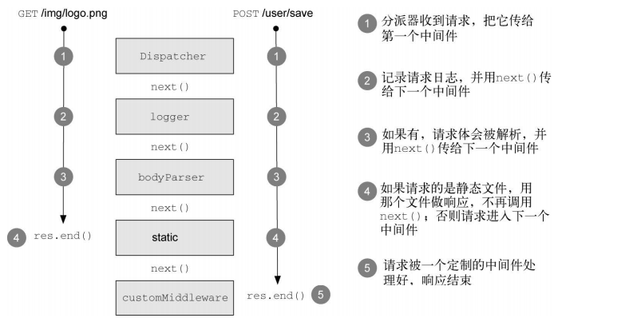
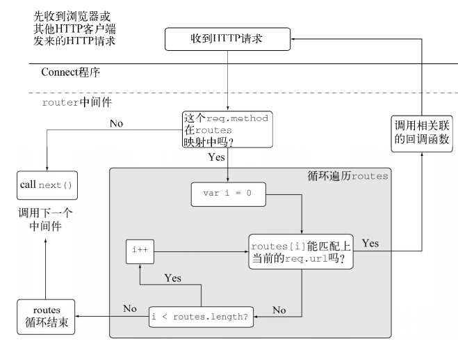

# 1. connect简介
Connect是一个框架，它使用中间件的模块化组件，以可可用的方式实现web程序逻辑。
# 2. 什么是中间件
中间件是一个函数，它拦截HTTP服务器提供的请求和响应对象，执行逻辑后，结束响应或传递给下一个中间件组件。Connect用分派器把中间件`链接`在一起。<br>
可以自己编写中间件，也可以使用Connect中提供的常用组件，用来做请求日志，静态文件服务，请求体解析，回话管理。<br>
Express是Connect之上的拓展，添加了更高层次的糖衣。<br>
<br>
# 3. 搭建第一个Connect程序
安装connect:npm install connect<br>
下面的例子已经是一个最基本的connect程序，也知道分派器是如何工作的，接下来，我们需要定义和添加中间件让程序做事情。
```javascript
// 创建并启动服务器：当发送一个http请求，会看到`Cannot GET /`,表明这个程序还不能处理请求的URL
var connect = require('connect');
var app = connect();
app.listen(3000);
```
# 4. Connect的工作机制
在Connect中，中间件是一个JavaScript函数，并且有三个参数：
- 一个请求对象
- 一个响应对象
- 一个next参数(回调函数)，表明当前组件已经完成工作，可以知晓下一个中间组件<br>
next使用毁掉函数，而不是从方法中返回：是因为可以在中间组件里运行异步逻辑，这样分派器就只能等着前一个中间组件完成后才能进入下一个中间组件，用next()处理中间组件之间的流程是不错的机制。(我想的就是串行的异步)
# 4.1 完成自己的中间件(日志组件与响应内容组件)
- 日志文件： 记录服务器的请求方法和URL，准备一个logger的函数。将日志内容打印到控制台，然后将控制权交给下一个组件。
- hello组件：响应http请求，返回`hello,world`内容。没有next()回调函数，因为用它来结束HTTP响应。不需要把控制权交还给分派器，next()就变成可选则了。
```javascript
var connect = require('connect');
var app = connect();
// 定义日志中间件
function logger(req, res, next) {
    console.log('%s, %s', req.method, req.url);
    next();
}
// 用hello,world响应HTTP请求
function hello(req, res) {
    res.setHeader('Content-Type', 'text/plain');
    res.end('hello, world');
}
// 使用中间件
app.use(logger);
app.use(hello);
app.listen(3000);
```
# 4.2 中间件的顺序很重要
- next(): 当中间件没有next()方法时，表示不再需要把控制权交还给分派器，因此最后一个中间件可以没有next()参数
- 按照对程序的有利顺序安排中间件，比如需要做认证时，几乎所有程序都会做认证：页面权限需要防止未登录的人访问。
```javascript
// 登录权限访问
var connect = require('connect');
function auth(req, res, next) {
    // 获取cookie查看登录用户信息
    var isLogin = getLoginMessage();
    if (!isLogin) {
        res.setHeader('Content-Type', 'text/html');
        res.end('no auth);
    } else {
        next();
    }
}
```
# 5. 挂载中间件与服务器<br>

##5.1 路径前缀通用中间件
 Connect中的挂载：对于博客来说，有些权限需要admin才能访问。因此我们需要确认被授权的用户才能访问`/admin/*`。其他区域对用户开放。挂载可以为`路径前缀(挂载点)`内的请求，调用中间件或者程序。<br>
下例子中：我们在权限验证的中间件中没有检查req.url，因为Conenct已经帮我们处理好了。这个中间件就可以当做通用的而不是为某个具体的url编写的中间件。
```javascript
var connect = require('connect');
// 从HTTP请求头中的authorization字段进行认证
function restrict(req, res, next) {
    var ahthorization = req.headers.authorization;
    var parts = ahthorization.split(' ');
    var scheme = parts[0];
    var auth = new Buffer(parts[1], 'base64').toString().split(':');
    var user = auth[0];
    var pass = auth[1];
    // 从数据库中查找账号信息
    authDatabase(user, pass, function(err) {
        // 告诉分发器，出错了
        if (err) throw next(err);
        // 验证通过，不带参数的next()
        next();
    });
}
connect()
    .use(logger)
    .use('/admin', restrict) // 确保访问页面的是有效用户
    .use('/admin', admin) // 给用户呈现管理区域
    .use(hello)
    .listen(3000)
```
#5.2 路径前缀变化后中间件处理
- urlDeal中间件是一个原始路由处理器。作为路径前缀通用的url处理。`/admin`和`/blog`都同时使用了它，因此使用`/admin/users`与`blog/users`都会到urlDeal中间件的第二个case处理。URL被Connnect处理过了，在中间件中是没有前缀的。
```javascript
var connect = require('connect');
function urlDeal(req, res, next) {
    switch(req.url) {
        case '/':
            res.end('try /uses');
            break；
        case '/users':
            res.setHeader('Content-Type', 'application/json');
            res.end(JSON.stringify(['a', 'b']));
    }
}
connect.use('/admin', urlDeal);
connect.use('/blog', urlDeal);
connect.listen(3000);
```
# 6. 可配置中间件
提供一个配置函数，通过传入配置等信息就可以返回不同的中间件。这也是JavaScript中闭包的思想：函数中返回一个函数。基本结构如下：
```javascript
funciton setup(options) {
    // ...设置逻辑
    // 中间件初始化
    return function(req, res, next) {
        // 中间件逻辑
    }
}

// 中间件使用
app.use(setup({some: 'options'}));
```
## 6.1 创建可配置的logger中间件
之前写的logger中间件是将内容写死，打印写死，毫无拓展能力。不能适应于不同场景的logger。我们需要从传入额外的参数，来改变它的行为。
- 定义setup函数，接受一个字符串参数
- setup调用后，返回一个函数，是真正的中间件组件<br>
```javascript
function setup(format) {
    // 冒号后面跟多个字符单词
    var regexp = /:(\w+)/g;
    return function(req, res, next) {
        var indexs = format.match(regexp});
        var strs = indexs.map(function(index) {
            return req[index.slice(1)];
        });
        console.log(strs);
        next();
    }
}

// 调用
connect()
    .use(setup(":method :url"));
```
## 6.2 创建路由中间组件
这里我们构建一个路由中间件。当我们项目比较庞大，路由可以分为`userRoutes`,`adminRoutes`,`loggerRoutes`模块，我们就可以使用中间件组件来完成分发处理。
<br>
- 路由中间件：参数obj表示路由模块的对象,例如{'get': ['/a': function(){}, '/b':function(){}]}
```javascript
var parse = require('url').parse;
moudle.export = function route(obj) {
    return function(req, res, next) {
        // 判断请求的method是否在obj中
        let routes = obj[req.method];
        if (!routes) {
            next(); // 如果未定义，调用next()进入下一个中间件
            return;
        }
        var url = parse(req.url);
        // 获取所有url集合
        var paths = Object.keys(routes);
        for(var i = 0; i < paths.length; i++) {
            var path = paths[o];
            var fn = routes(path);
            // 构造routes中的url的正则表达式
            path = path.replace(/\//g, '\\/').replace(/:(\w+)/g, '([^\\/]+)');
            var re = new RegExp('^' + path + '$');
            // re 生成的正则：/^\/admin\/name\/([^\/]+)$/
            // '/admin/name/12'.match(re)：匹配结果： [/admin/name/12, 12]

            // 匹配http请求
            var captures = url.pathname.match(re);
            if (captures) {
                var args = [req, res].concat(captures.slice(1));
                fn.apply(null, args);
                return
            }
        }
        next();
    }
}
// 调用
app.use(route(userRoutes));
app.use(route(adminRoutes));
app.use(route(loggerRoutes));
```
## 6.3 构建重写URL的中间件组件
当我们接受一个`/blog/posts/titles_NAME`的查询请求，根据`title_NAME`取得文章id,然后将url转换为`/blog/posts/1`。
```javascript
var connect = require('connect');
var url = require('url');
function reviewUrl(req, res, next) {
    // 只针对/blog/posts请求执行查找
    var match = path.match(/^\/blog\/post\/(.+)/);
    if (match) {
        findBlog(match[1], function(err, id) {
            if (err) return next(err);
            if (!!id) return next(new Error('USER NOT EXIST'));
            req.url = '/blog/posts/' + id;
            next();
        })
    }
}   
```
# 7. 使用错误处理中间件
## 7.1 Connect默认错误处理器
下面在中间件中的foo()是不存在的方法，Connect会默认抛出`ReferenceError`，响应状态码为500，包含文本`Internal Server Error`以及错误自身详细信息的响应主体。
```javascript
var connect = require('connect');
connect()
    .use(function(req, res) {
        // 不存在的方法
        foo();
        ....
    });
```
## 7.2 自行处理异常
例如，当发生异常时，在开发的时候，我们只想通过JSON格式把错误发送到客户端，做简单快捷的错误报告。在生产环境中，我们可能想隐藏敏感的内部信息，只是抛出`服务器错误`的异常。<br>
- Connect通常通过`NODE_ENV`(progress.env.NODE_ENV)在不同的服务器环境之间切换。比如生产和开发环境。
- 错误处理中间件必须包含4个参数：err, req, res,next<br>
<br>
```javascript
function errorHandler() {
    var env = progress.env.NODE_ENV || 'deployement';
    return function(err, req, res, next) {
        res.statusCode = 500;
        switch(env) {
            case 'deployement':
                res.setHeader('Content-Type', 'application/json');
                res.end(JSON.stringify(err));
                break;
            default:
                res.end('Server error');
        }
    }
}
```
##7.3 多个异常处理中间件
这里简略写一下步骤：
- hello 组件：给出响应`hello,world\n`类农
- userss中间件：用户不在，user组件会抛出notfound异常
- pets中间件：引发一个ReferenceError异常
- errorHandler: 处理来自api的所有错误
- errorPage：处理来自app的所有错误<br>
<br>
```javascript
// 请求/hello url,出现异常，errorPage会处理
// 不是/ hello url, 控制权交给下一个中间件
function hello(req, res, next) {
    if (req.url.match(/\/hello/)) {
        res.end('hello');
    } else {
        next();
    }
}

// 查询user,没有查到抛出 ‘user not exist’
function users(req, res, next) {
    if (req.url.match(/\/users/)) {
        var user = queryUser();
        if (user) {
            res.end('success user');
        } else {
            var err = new Error('user not exist');
            err.notFound = truel
            next(err);
        } else {
            next();
        }
    }
}

function pets(req, res, next) {
    if (req.url.match(/\/pets/)) {
        //方法不存在， 会抛出引用异常
        foo();
    } else {
        next();
    }
}

// 自定义错误类型处理，否则就是服务器错误
function errorHandler(err, req, res, next) {
    console.log(err.stack);
    res.setHeader('Content-Type', 'application/json');
    if(err.notFound) {
        res.statusCode = 404;
        res.end(JSON.stringify({error: err.message}));
    } else {
        res.statusCode = 500;
        res.end(JSON.stringify({error: 'Internal Server Error'}));
    }
}

// 由于前一个errorHandler没有调用过next(err),因此这个组件只有hello组件出现错误时才会被调用
function errPage(err, req, res, next) {
    // deal
}
```