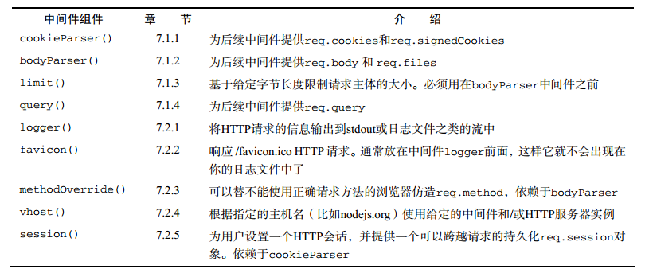
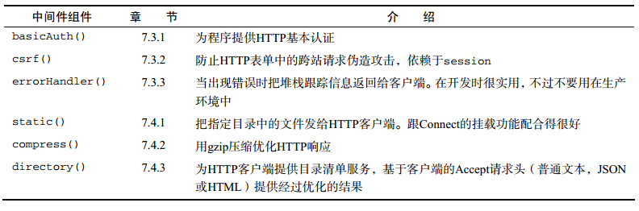

# 1. Connect自带中间件列表
Connect有很多自带中间件，可以满足Web程序开发需要。例如会话管理，cookie解析，请求主体解析，请求日志等。下面的表格中接下来学习的中间件汇总。<br>
<br>
<br>
# 2. 解析cookie,请求体与查询字符串的中间件
Node没有解析cookie,请求体和查询字符串之类的高层Web程序概念的核心模块，因此Connect提供了这些功能的中间件。<br>
- cookieParser(): 解析来自浏览器的cookie，放到req.cookies中（模块已经从Connect中脱离，需要自己安装cookie-parser）
- bodyParser(): 读取并解析请求体，放入到req.body中
- limit(): 与bodyParser()联手防止读取过大的请求
- query(): 解析请求URL的查询字符串，放到req.qeury中
## 2.1 cookieParser()
cookieParser()支持常规的cookie、签名cookie和特殊的JSON cookie。req.cookies默认是用常规未签名cookie组成的。如果想支持session()中间件要求的签名cookie,在创建cookieParser()实例时要传入一个加密字符串。
### 在服务端设置cookie
中间件cookieParser()不会为设置cookie提供任何帮助，因此需要用res.setHeader()函数设置`set-Cookie`的响应头。
### 基本用法
传给cookieParser的参数，作为cookie签名和解签的秘钥，让Coonect确认cookie的内容是否被篡改过。秘钥应该是长度合理的并且随机生成的字符串。

```javascript
var connect = require('connect');
var cookieParser = require('cookie-parser');
var app = connect();
app.use(cookieParser('miyao'));
app.use(function(req, res) {
    // cookie解析后，如果有则会赋值到这两个属性上，没有则两个对象为空
    console.log(req.cookies); // 普通cookie
    console.log(req.signedCookie);
});
app.listen(3000);
```
- 普通cookie<br>
通过下面的HTTP请求，带着普通cookie,通过cookieParser的解析，从req.cookies中获取
```javascript
curl http://localhost:3000 -H "Cookie: foo=bar, bar=baz"
```
- 签名cookie（还没怎么理解）<br>
签名cookie更适合敏感数据，用它可以验证cookie数据的完整性，有助于防止中间人攻击。有效签名放在re.signedCookies对象中。签名cookie格式如下。如果cookie的值或HMAC被改变，cookieParser解签就会失败。
```javascript
value.服务器用SHA-1 HMAC生成的加密哈希值（tobi.DDm4AcVxE9oneYnbmpqxoyhyKsk）
curl http://localhost:3000 -H "Cookie: foo=bar:DDm4AcVxE9oneYnbmpqxoyhyKsk）"
```
请求与返回：当cookie值被改变，虽然无效，但是还是可以解析，只不过解析的值为空。
- JSON Cookie
JSON Cookie带有前缀`j:`,来告知解析器，它是一个串行化的JSON，JSON Cookie既可以是签名的，也可以是未签名的。
```javascript
curl http://localhost:3000 -H \"Cookie: foo= j:{"bar": "value" }\"
```
### 设定出站cookie
cookieParser()中间件没有提供任何Set-Cookie响应头向HTTP客户端写出站cookie。但是Connect可以通过res.setHeader()写入多个SET-Cookie响应头。
```javascript
var connect = require('connect');
var cookieParser = require('cookie-parser');
var app = connect();
app.use(function(req, res) {
    req.setHeader('Set-Cookie', 'foo1=bar');
    req.setHeader('Set-Cookie', 'foo2=bar2');
    res.end('end');
}).listen(3000);
```
## 2.2 bodyParser():解析请求主体
从web应用中接收用户的输入(表单，上传文件内容)，只要添加bodyParser()中间件即可。它整合了(json(),urlencoded(), multipart())三个小组件。
- 解析的内容存放到req.body属性中。
- 可以解析JSON,x-www-w-urlencodded和multipart/form-data请求。如果是文件上传，则还有req.files对象。
### 基本使用
```javascript
var connect = require('connect');
app.use(bodyParser());
var bodyParser = require('body-parser');
var app = connect();
app.use(bodyParser());
app.use(function(req, res) {
    // 获取用户的信息
    res.end('Registered new user:' + req.body.usrname);
}).listen(3000);
```
### 解析数据
```javascript
// json数据
curl http://localhost:3000 -d '{"username": "yeziTesting"}' -H 'Content-Type: application/json' 

// 常规form表单数据
curl http://localhost:3000 -d username=yezi
```
### multipart <form>数据
bodyParser解析multipart/form-data数据，底层处理是由第三方模块formidable完成，之前有提到过。
```javascript
// ....
app.use(function(req, res) {
    console.log(req.body.username);
    console.log(req.body.password);
    // 存放文件信息
    console.log(req.files);
    res.end('thanks');
}).listen(3000);
```
## 2.3 limit():请求主题限制
只解析主题不够的，当攻击者拦截请求，产生一个巨大的字符串发现服务器进行攻击，我们可以通过`limit`中间件进行限制，设置请求主体大小，达到过滤巨型请求。<br>
- 使用方法：在bodyParser()中间前之前添加limit()组件。
- 参数：限制大小，可以是下面任意一种方式：`1gb, 25mb, 50kb`<br>
```javascript
var app = connect();
app.use(limit('32kb'));
app.use(bodyParser());
....
```
但是在实际中，我们并不是对所有的限制大小都是相等的，例如文件大小限制为10M,图片大小限制为10kb.因此我们写一个配置函数，来适应多重情况。
```javascript
function(type, fn) {
    return function(req, res, next) {
        var ct = req.headers('Content-Type') || '';
        // 不是该类型，继续next组件
        if (0 !== ct.indexOf(type)) {
            return next();
        }
        // 是该类型，使用limit中间件处理
        fn(req, res, next)
    }
}

// 使用
connect()
    .use(type('application/x-www-form-urlencoded', limit('64kb')))
    .use(type('application/json', limit('24kb')))
    .use(type('multipart/form-data', limit('10mb')))
    .use(bodyParser())
    ...
```
## 2.4 query(): 查询字符串解析
解析GET请求的查询字符串。在req.query()对象中获取。用法与bodyParser()一样，并且和bodyParser()一样都内部都用到了第三方模块`qs`。
- 基本用法
```javascript
var app = connect()
    .use(connect.query()) // 我在实验过程中发现该方法用不起了
    .use(function(req, res, next) {
        res.setHeader('Content-Type', 'application/json');
        res.end(JSON.stringify(req.query));
    })
```