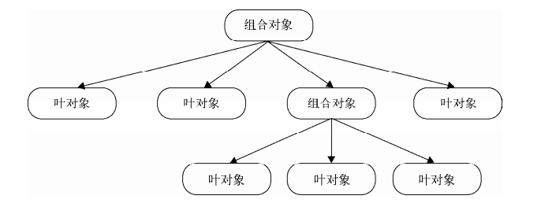
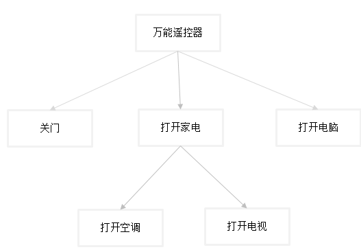

# 1 组合模式的定义
组合模式：用小的子对象来构成更大的对象，而这些小的对象本身也许是由更小的`孙对象`构成的。<br>
我理解的例如：一个人，是由肌肉+肥肉+骨头+器官构成。而肌肉，肥肉等又是又化学物质构成，化学物质里面还分为很多细小的钙铁锌硒等元素组成....。由小到大最终组成了一个人。

# 2 宏命令例子
宏命令是一组命令的集合，通过执行宏命令的方式，可以一次执行一批命令。家里有一个万能遥控器，每天回家的时候，只要按一个特别的按钮，它就会帮我们关上房间门，顺便打开电视，开始煮饭。
```javascript
var closeDoorCommand = {
    execute: function() {
        console.log('close door');
    }
};
var openTVCommand = {
    execute: function() {
        console.log('open TV');
    };
};
var cookCommand = {
    execute: function() {
        console.log('cook');
    }
};

var MacroCommand = function() {
    var cache = [];
    return {
        add: function(command) {
            cache.push(command);
        },
        execute: function() {
            cache.map(function(command) {
                command.execute()
            });
        }
    };
}

var macroCommand = MacroCommand();
macroCommand.add( closeDoorCommand );
macroCommand.add( openTVCommand );
macroCommand.add( cookCommand );
macroCommand.execute();
```
通过观察这段代码，我们很容易发现，宏命令中包含了一组子命令。看起来像是在执行macroCommand的execute方法，表现的像一个命令，但是实际只是一组命令的‘代理’，并非正真的代理，虽然结构相似，但是macroCommand只负责传递请求给叶子对象，不低不在于控制对叶子对象的访问。

# 3 组合模式传递
- 组合模式将对象组合成为`树形结构`，以表示`部分-整体`的层次结构。通过调用组合对象的execute方法，程序便会递归调用组合对象下面的叶对象的execute方法。
- 组合对象与叶对象有对象多态性，客户端可以忽略组合对象与单个对象的不同。在组合模式中，客户将统一使用组合对象结构中的所有对象，而不需要关系它究竟是组合对象还是单个对象。
实际开发中，我们往组合对象中添加一个命令时，并不会关心这个命令时宏命令还是普通名，只要它是一个命令并拥有execute方法，那么就能被添加到组合对象(例如上面的万能遥控器)中。当宏命令和子命令接收到执行请求时，它们就会做自己认为正确的事。这些差异隐藏在客户背后。对于客户来说，只看到了组合对象(万能遥控器)<br>

组合模式的`树形结构`，让它的调用遵循一种自上而下的请求顺序规则。例如上面的宏命令对象调用后，就会将它下面的子命令一个一个调用。如果子命令中还有子命令，也会继续往下传递，直到不再有其他子节点。<br>
<br>

# 4 更强大的宏命令
- 基本对象可以被组合成为复杂的组合对象，组合对象又可以被组合，这样不断地递归下去，这棵树可以支持任意多的复杂度。而想让这棵树运行起来很简单，只需要执行execute方法就可以了。<br>
- 组合模式的透明性让客户不用顾忌树中组合对象与叶子对象的区别，但是实际叶子对象不能再添加子节点。因此为了保证一致性，可以为叶子节点也添加add方法并抛出不能添加的提示信息。<br>
<br>
上面的万能遥控器只有一层子节点。现在我们来实现一个多层节点的遥控器。
```javascript
// 定义一个组合命令的功能函数
var MachroCommand = function() {
    var cache = [];
    return {
        add: function(command) {
            cache.push(command);
        },
        execute: function() {
            cache.map(function(command) {
                command.execute()
            });
        }
    };
};

var closeDoorCommand = {
    execute: function() {
        console.log('close door');
    },
    add: function() {
        throw Error('can\'t add child node');
    }
};
var openTVCommand = {
    execute: function() {
        console.log('open TV');
    },
     add: function() {
        throw Error('can\'t add child node');
    }
};

var openAirConditionCommand = {
    execute: function() {
        console.log('open 冰箱');
    },
     add: function() {
        throw Error('can\'t add child node');
    }
};

var openComputerCommand = {
    execute: function() {
        console.log('open computer');
    },
     add: function() {
        throw Error('can\'t add child node');
    }
};

// 组合命令（打开家电）
var openApplianceCommand = MachroCommand();
openApplianceCommand.add(openTVCommand);
openApplianceCommand.add(openAirConditionCommand);

// 组合命令(万能遥控器)
var machroCommand = MachroCommand();
machroCommand.add(openApplianceCommand);
machroCommand.add(openComputerCommand);
machroCommand.add(closeDoorCommand);

// 调用万能遥控器
machroCommand.execute();
```
# 5 组合模式扫描文件夹
当我们将文件夹从A处复制到B处， 只需要使用`Ctrl + C`, `Ctrl + v` 命令就可以了。而这里来的复制和粘贴就是组合命令，文件的层级关系是：
- 文件夹（组合对象）可包含文件夹(组合对象)和文件(子节点)
- 文件不能包含文件或文件夹<br>
```javascript
// 文件
Var File = function(name) {
    return {
        add: function() {
            console.log('can not add child file');
        },
        execute: function() {
            console.log('复制文件: ' + name);
        },
        scan: function() {
            console.log('扫描文件: ' + name);
        }
    }
};

// 文件夹
var Folder =function(name) {
    var cache = [];
    return {
        add: function(file) {
            cache.push(file);
        },
        execute: function() {
            console.log('复制文件夹: ' + name);
        },
        scan: function() {
            console.log('扫描文件夹: ' + name);
        }
    }
};

// 创建文件夹和文件对象,让他们组成一棵树
var folder = new Folder( '学习资料' );
var folder1 = new Folder( 'JavaScript' );
var folder2 = new Folder ( 'jQuery' );

var file1 = new File( 'JavaScript 设计模式与开发实践' );
var file2 = new File( '精通 jQuery' );
var file3 = new File( '重构与模式' );

folder1.add( file1 );
folder2.add( file2 );
folder.add( folder1 );
folder.add( folder2 );
folder.add( file3 );
```
此时在我们的目录中已经有了一颗完整的树了，那么我希望将folder文件夹复制到另一个位置，会有扫描文件，和复制文件的过程：
```javascript
// 将键盘按下CTRL + C的时候，注册事件执行
foler.scan();
// 将键盘按下CTRL + V的时候，注册事件执行
folder.execute();
```
当我们希望添加新的节点的时候，我们可以直接增加新增件节点到folder中，我们改变了树的结构，增加了新的数据，却不用修改任何一句原有的代码，这是符合开放-封闭原则的。
```javascript
var folder3 = new Folder( 'Nodejs' );
var file4 = new File( '深入浅出 Node.js' );
folder3.add( file4 );
var file5 = new File( 'JavaScript 语言精髓与编程实践' );
// 添加到folder结构树中，修改了整体结构
folder.add( folder3 );
folder.add( file5 );
```
# 6 组合模式小结
- 组合模式不是父子关系(继承)<br>
组合模式是一种`HAS-A(聚合)`关系，不是`IS-A`。组合对象包含一组叶对象，但是叶对象并不是Composite(组合)的子类。组合对象最终会将请求委托给所有的叶子对象，它们能够合作关键按是拥有相同的接口。
- 对叶对象的操作一致<br>
组合对象与叶对象拥有相同的接口外，对同一组叶子对象的操作必须是一致的。例如上面的我要`扫描文件`，不能在组合对象中出现调用`复制文件`的接口。
- 双向映射关系<br>
例如公司给员工发放福利卡。公司给各个部分发放，部分给员工发放。组合模式就很适合，但是如果员工A是一个架构师，既属于A部门也属于B部门，那么很有可能被发放两次。就不适合了。
- 用职责链模式提高组合模式性能<br>
组合模式中，如果树结构比较复杂，节点较多，那么遍历过程中性能就不好了。我们可以借助职责链：手动设置链条，将组合对象与子节点之间性能职责链。让请求从组合象到子对象，或从子对象到父对象都能传递。<br>
- 组合模式缺点：因为组合的内容都是代码中已存在的，会让系统中的对象看起来和其他的对象差不多，只有在运行的时候才能显示出来。如果组合模式创建太多对象，可能让系统负担不起。<br>
利用职责链思想在子节点保持对父节点的引用。可以从自己子节点往父节点冒泡。
```javascript
var File = function(name) {
    this.parent = undefined;
	this.name = name;
};
File.prototype.add = function(file) {
    console.log('can not add child file');
}
File.prototype.remove = function() {
    // 根节点或则游离无组织的节点
   if (!this.parent) {
       return;
   }
	var self = this;
   this.parent.cache = this.parent.cache.filter(function(f) {
       return f != self;
   });

}

// 文件夹
var Folder = function(name) {
    this.parent = undefined;
    this.cache = [];
	this.name = name;
};
Folder.prototype.add = function(file) {
    file.parent = this; // 设置父对象
    this.cache.push(file);
}

Folder.prototype.remove = function() {
    // 根节点或则游离无组织的节点
   if (!this.parent) {
       return;
   }
      console.log(' 移除文件夹' + this.name,    this.parent.cache );
   var self = this;
   this.parent.cache = this.parent.cache.filter(function(f) {
       return f != self;
   });
   console.log(' 移除文件夹' + this.name,    this.parent.cache );
}

// 移除文件夹
var folder = new Folder( '学习资料' );
var folder1 = new Folder( 'JavaScript' );
var file1 = new File ( '深入浅出 Node.js' );
folder1.add( new File( 'JavaScript 设计模式与开发实践' ) );
folder.add( folder1 );
folder.add( file1 );
folder1.remove(); //移除文件夹
```
