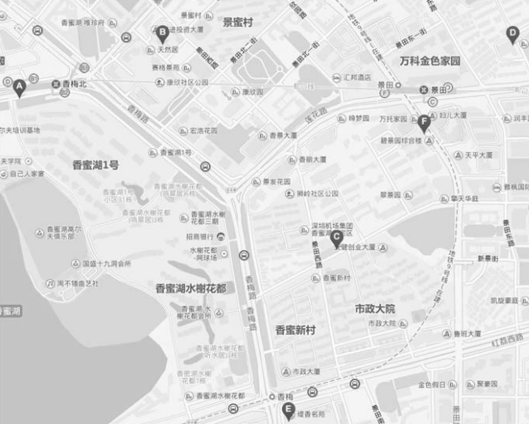

# 1 亨元模式的定义
亨元模式(flyweight)是一种性能优化的模式，fly是苍蝇的意思，意为蝇量级。亨元模式核心在于运用共享技术来有效地支持大量细粒度的对象。<br>
如果系统中出现了大量类似的对象而导致内存占用过高，亨元模式就比较有用了。

# 2 初识亨元模式
假设内衣厂，目前生产了50件男士T恤和50件女士T恤。现在要请模特穿上T恤并拍照。不使用亨元模式情况下，每件衣服都需要1个模特。
```javascript
// 模特类
var Model = function(sex, tShirt) {
    this.sex = sex;
    this.tShirt = tShirt;
}

Model.prototype.takePhoto = function() {
    console.log('sex:' + this.sex + ", tShrit: " + this.tShirt);
}

for ( var i = 1; i <= 50; i++ ){
    var maleModel = new Model( 'male', 'tShrit' + i );
    maleModel.takePhoto();
};
for ( var j = 1; j <= 50; j++ ){
    var femaleModel= new Model( 'female', 'tShrit' + j );
    femaleModel.takePhoto();
};
```
在这里创建了100个Model对象。但是实际情况我们只需要找一个男模特和一个女模特就够了。男模特穿50件T恤拍照，女模特穿50件T恤拍照。只需要2个对象便能够完成同样的功能。
```javascript
var Model = function(sex) {
    this.sex = sex;
    this.tShirt = null;
}

Model.prototype.takePhoto = function() {
    console.log('sex:' + this.sex + ", tShrit: " + this.tShirt);
}

var maleModel = new Model( 'male');
for ( var i = 1; i <= 50; i++ ){
    maleModel.tShirt = 'tShrit' + j;
    maleModel.takePhoto();
};
var femaleModel= new Model( 'female');
for ( var j = 1; j <= 50; j++ ){
    femaleModel.tShirt = 'tShrit' + j;
    femaleModel.takePhoto();
};
```
# 3 内部状态与外部状态
上面的例子中有了亨元模式的雏形，亨元模式要求将对象的属性划分为内部状态和外部状态。亨元模式的目标旨在减少共享对象的数量，关于如何划分内部状态和外部状态，下面有点经验指引：
- 内部状态存储于对象内部
- 内部状态可以被一些对象共享
- 内部状态独立于具体的场景，通常不会改变
- 外部状态取决于具体的场景，并根据场景而变化，外部状态不能被共享
这样我们可以把所有内部状态(性别)相同的对象(例如性别为女的一类50个人)指定为同一个共享独享(最终只需要以一个人)，外部对象可以从对象上脱离出来（T恤被脱离），并存储于外部。
- 剥离了外部状态(T恤)的对象成为共享对象（maleModel），外部状态在必要时被传入共享对象然后组装成为一个完整的对象。虽然耗时，但是减少了内存占用，亨元模式就是以时间换空间的优化模式。

# 4 利用亨元模式文件上传
`1小结`中的亨元模式例子存在两个问题：
- 通过构造函数new出来的男女两个model对象，在其他系统中，也许并不不是一开始就需要所有的共享对象
- 给model手动设置的外部状态，在复杂的系统中，这不是一个好的方式，因为外部对象可能相当复杂，它们与共享对象的联系变的困难。<br>
解决第一个问题：可以使用对象工厂的方式来创建，当真正需要的时候才在工厂对象创建出来。<br>
解决第二个问题：用一个管理器来记录对象相关的外部状态，使这些外部状态通过某个钩子与共享对象联系起来。

## 4.1 文件上传问题描述
- 上传一个文件需要创建一个文件对阿宁，当同一个操作需要支持多个文件上传时，每一个文件需要创建一个对象，如果1000个文件那么就需要new 1000个对象。
- 当项目支持多种上传方式：浏览器插件上传，Flash上传和表单上传。当用户选择上传文件之后，插件或者Flash都会通知window的一个全局javascript函数，名字叫startUpload。用户选择的文件列表被组合成为一耳光数组files塞进该函数的参数列表中。
```javascript
var i = 0;
// fileType: 区分是控件，flash还是表单上传
window.startUpload = function(fileType, files) {
    files.map(function(file) {
        var uploadFile = new Upload(uploadType, file.fileName, file.fileSize);
        // 初始化文件到页面中
        uploadFile.init(id++);
    })
};
// 文件对象接收三个参数：插件类型，文件名，文件大小
var Upload = function(uploadType, fileName, fileSize) {
    this.uploadType = uploadType;
    this.fileName = fileName;
    this.fileSize = fileSize;
    this.dom = null;
}
// 将文件初始化到界面上
Upload.prototype.init = function(id) {
    var that = this;
    this.id = id;
    this.dom = document.createElement('div');
    this.dom.innerHTML = '<span>文件名称:'+ this.fileName +', 文件大小: '+ this.fileSize +'</span>' + '<button class="delFile">删除</button>';
    this.dom.querySelector('.delFile').onclick = function() {
        that.delFile();
    }
    document.body.appendChild(this.dom);
};
// 文件如果小于3000直接删除，否则给与提示
Upload.prototype.delFile = function() {
    if (this.fileSize < 3000) {
        return this.dom.parentNode.removeChild(this.dom);
    } else {
        if (window.confirm('你确定要删除文件吗？' + this.fileName)) {
            return this.dom.parentNode.removeChild(this.dom); 
        }
    }
}
```
下面上分别创建三个插件对象和三个flash对象。每个文件都被创建了一个Upload对象。总共6个对象。
```javascript
startUpload( 'plugin', [
    {
    fileName: '1.txt',
    fileSize: 1000
    },
    {
    fileName: '2.html',
    fileSize: 3000
    },
    {
    fileName: '3.txt',
    fileSize: 5000
    }
]);
startUpload( 'flash', [
    {
    fileName: '4.txt',
    fileSize: 1000
    },
    {
    fileName: '5.html',
    fileSize: 3000
    },
    {
    fileName: '6.txt',
    fileSize: 5000
    }
]);
```
## 4.2 亨元模式完成文件上传
第一版本的文件上传功能，需要上传多少个文件，就需要创建多少个对象。我们利用亨元模式的来重构。
- 找到内部状态（存储于对象内部，能被多个对象共享，独立于具体场景不被改变）：上传类型即为内部状态
- 找到外部状态（取决于具体场景，根据场景变化而变化，不能被共享）：文件大小和文件名称
- 使用工厂方法创建上传对象（同意上传类型只需要创建一个对象）
- 管理器封装外部状态
```javascript
// 只有uploadType才是内部状态
var Uplaod = function(uploadType) {
    this.uploadType = uploadType;
}
// 文件如果小于3000直接删除，否则给与提示
Upload.prototype.delFile = function() {
    // 获取自己的属性（fileSize，fileName）
    uploadManager.setExternalState( id, this);
    if (this.fileSize < 3000) {
        return this.dom.parentNode.removeChild(this.dom);
    } else {
        if (window.confirm('你确定要删除文件吗？' + this.fileName)) {
            return this.dom.parentNode.removeChild(this.dom); 
        }
    }
}

// 工厂进行对象实例化
var UploadFactory = function() {
    var createFlyWeight = {};
    return {
        create: function(uploadType) {
            if (!(uploadType in createFlyWeight)) {
                createFlyWeight[uploadType] =  new Upload(uploadType);
            }
            return createFlyWeight[uploadType];
        }
    };
};

// 管理器封装外部状态
var uploadManager = (function() {
    var uploadDatabase = {};
    return {
        add: function(id, uploadType, fileName, fileSize) {
            var flyWight = UploadFactory.create(uploadType);
            this.dom = document.createElement('div');
            this.dom.innerHTML = '<span>文件名称:'+ this.fileName +', 文件大小: '+ this.fileSize +'</span>' + '<button class="delFile">删除</button>';
            this.dom.querySelector('.delFile').onclick = function() {
                that.delFile();
            }
            document.body.appendChild(this.dom);
            uploadDatabase[id] = {
                fileName: fileName,
                fileSize: fileSize,
                dom: dom
            };
            return flyWight;
        },
        setExternalState: function(id, flyWight) {
            var uploadData = uploadDatabase[ id ];
            for ( var i in uploadData ){
                flyWight[ i ] = uploadData[ i ];
            }
        }
    }
})();

// 调用
var id = 0;
window.startUpload = function( uploadType, files ){
    for ( var i = 0, file; file = files[ i++ ]; ){
    var uploadObj = uploadManager.add( ++id, uploadType, file.fileName, file.fileSize );
    }
};
```
和上面一样的方式创建三个插件对象和三个flash对象。最终在代码中只会产生`2个对象`，通过工厂方法创建的。
```javascript
startUpload( 'plugin', [
    {
    fileName: '1.txt',
    fileSize: 1000
    },
    {
    fileName: '2.html',
    fileSize: 3000
    },
    {
    fileName: '3.txt',
    fileSize: 5000
    }
]);
startUpload( 'flash', [
    {
    fileName: '4.txt',
    fileSize: 1000
    },
    {
    fileName: '5.html',
    fileSize: 3000
    },
    {
    fileName: '6.txt',
    fileSize: 5000
    }
]);
```
# 5 亨元模式再谈
亨元模式用于性能优化，但是需要额外维护factory和manager对象。在大部分不必要使用亨元模式的环境下，这部分开销可以避免。亨元模式主要用于以下情况：
- 一个程序使用了大量相似的对象
- 由于使用大量对象造成内存开销
- 对象的大多数状态为外部状态
- 剥离对象外部状态之后，可以使用相对较少的共享对象来取代大量对象。<br>
可以看出文件上传完全符合这四点。我们也知道了实现亨元模式就是讲外部对象与内部对象分离出来，有多少种内部状态的组合，系统中便最多产生多少个共享对象。而外部对象在需要的时候传入共享对象组装成为要给完整的对象。现在考虑一下两种极端情况：完全没有外部状态 和 完全没有内部状态
## 5.1 完全没有内部状态
在文件上传的例子中，我们内部状态是插件和flash。因此创建了两个对象。
- startUpload('plugin', []);
- startUpload('flash', []);<br>
有些网站支持极速上传(plugin)，也支持普通上传(flash)。当极速上传不好使就使用普通上传。但是也有很多网站并不需要做的如此复杂，只支持单一的上传方式。那么内部状态`uploadType`实际上就不存在。没有了内部状态意味着我们只需要唯一一个共享对象。改写我们的工厂方法：
```javascript
// 工厂进行对象实例化
var UploadFactory = function() {
    var flyWeight;
    return {
        create: function() {
            if (!flyWeight) {
                flyWeight =  new Upload();
            }
            return flyWeight;
        }
    };
};
```
虽然生产共享对象的工厂方法编程了一个单例工厂，这从共享对象没有了内部状态的区别，但是还是有剥离状态的过程，我们依然倾向于称之为亨元模式。

## 5.2 完全没有外部状态
对于上面的工厂化创建的对象obj1, obj2，通过判断`obj1 === obj2`，会返回true。但是单纯只有这两个对象并不能说明是亨元模式的结果。亨元模式关键区分于内部状态和外部状态。亨元模式的过程是剥离外部状态。把外部状态保存在其他地方，并在合适的时候将外部状态组装进入共享对象。这里的obj1 和obj2完全是同一个对象。如果没有外部状态的剥离，即使有共享数据，但是不是一个纯粹的亨元模式。
```javascript
var obj1 = UploadFactory.create();
var obj2 = UploadFactory.create();
```

# 6 对象池
对象池维护这一个装载空闲对象的池子，如果需要对象时，不是直接new对象，而是从池子中获取对象。如果池子中没有空闲对象，则状态一个新的对象，当获取的对象完成了它的职责后，再进入池子等待下一次被获取。<br>
对象池的应用情况：<br>
- HTTP连接池和数据库连接池
- web前端开发，对象池使用最多的场景是DOM有关的操作。
## 6.1 对象池的实现
例如在地图上，我们搜索的时候，页面会出现2个小气泡。当搜索兰州拉面时，会出现6个气泡，当搜索新巴克时，出现3个气泡。这里的气泡就可以使用对象池实现<br>
<br>
```javascript
var ToolTipFactrory = (function() {
    var toolTips = []; // 存储toolTip对象池
    return {
        create: function() {
            // 如果对象池不为空，取出一个返回
            if (toolTips.length > 0) {
                return toolTips.shift();
            } else  {
                // 创建一个dom返回
                var div = document.createElement('div');
                return div;
            }
        },
        recover: function(toolTipDom) {
            toolTips.push(toolTipDom);
        }
    };
})();
```
点击按钮，创建toolTip。将上一次创建的节点共享于下一次的操作。对象池的思想与亨元模式的思想有点相似，el的innerHTML是外部状态，而封装内部el节点是内部状态。但是我们没有主动分离内部状态和外部状态。
- 第一次点击创建n个（随机）
- 第二次点击，销毁之前创建的内容，在重新根据返回的数据创建（n个，随机）
```javascript
var button = document.getElementById('id');
var arr = [];
button.onclick = function() {
    // 新的一轮创建个数 > 当前个数，则在现有基础上新增（newLength - oldLength）个
    // 新的个数 < 当前个数，则在当前基础上移除(oldLength - newLength)个
	var length = parseInt(Math.random() * 10);
	var differ = length - arr.length;
	if (differ < 0) {
		recoverToolTip(Math.abs(differ));
	} else {
		 getToolTip(differ);
	}
}
// 移除
function recoverToolTip(length) {
	for(i = 0; i< length; i++) {
		var el = arr.shift();
		ToolTipFactrory.recover(el);
		document.body.removeChild(el);
	}
}
// 新增
function getToolTip(length,) {
    for (var i = 0; i < length; i++) {
			var el = ToolTipFactrory.create();
			el.innerHTML = i + 'div';
			document.body.appendChild(el);
			arr.push(el);
    }
}
```
# 6.2 通用对象池
上面的对象池只能作用于toolTip的创建。我们可以将该对象池改造一下，实现一个通用的对象池。
```javascript
var ObjPoolFactory = (function(createObjFn) {
    var objectPool = [];
    return {
        create: function() {
            if (objectPool.length === 0) {
                return createObjFn.apply(this, arguments);
            }
            return objectPool.shift();
        },
        recover: function(obj){
            objectPool.push(obj);
        }
    }
})();
```
# 7 小结
享元模式是为解决性能问题而生的模式，这跟大部分模式的诞生原因都不一样。在一个存在大量相似对象的系统中，享元模式可以很好地解决大量对象带来的性能问题。