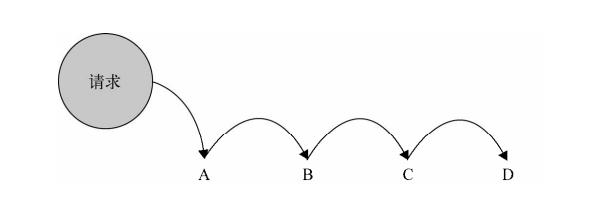

# 1 职责链模式的定义
使多个对象都有机会处理请求，从而避免请求的发送者和接收者的耦合关系。将这些对象连在一条链上，并沿这条链传递该请求，直到有一个对象处理它为止。我们把这些对象称为链中的节点。<br>
<br>

# 2 现实中的职责链
我们希望实现一个流程，商场预定手机：
- 预定定金500并已付款， 购买时打印`500 元定金预购, 得到 100 优惠券`
- 预定定金200并已付款， 购买时打印`200 元定金预购, 得到 50 优惠券`
- 否则是普通购买或者预定没有付款：stock有库存`普通购买, 无优惠券`,stock === 0时`手机库存不足`
```javascript
var order = function( orderType, pay, stock ){
if ( orderType === 1  && pay === true) { // 500 元定金购买模式
    console.log( '500 元定金预购, 得到 100 优惠券' );
} else if ( orderType === 2 && pay === true) { // 200 元定金购买模式
   console.log( '200 元定金预购, 得到 50 优惠券' );
} else if ( orderType === 3 || pay === false) {
    if ( stock > 0 ){
        console.log( '普通购买, 无优惠券' );
    } else {
        console.log( '手机库存不足' );
    }
}
};
order( 1, true, 500); // 输出： 500 元定金预购, 得到 100 优惠券
```
# 4 使用职责链重构代码
- 分别表示 3 种购买模式的节点函数，我们约定，如果某个节点不能处理请求，则返回一个特定的字符串 'nextSuccessor'来表示该请求需要继续往后面传递。
- 把函数包装进职责链节点，我们定义一个构造函数 Chain，在 new Chain 的时候传递的参数即为需要被包装的函数， 同时它还拥有一个实例属性 this.successor，表示在链中的下一个节点。
```javascript
// 500预定
var order500 = function(orderType, pay, stock) {
    if ( orderType === 1  && pay === true) { // 500 元定金购买模式
        console.log( '500 元定金预购, 得到 100 优惠券' );
    } else {
        return 'nextSuccessor'; // // 我不知道下一个节点是谁，反正把请求往后面传递
    }
}
// 200预定
var order200 = function(orderType, pay, stock) {
    if ( orderType === 2  && pay === true) { // 500 元定金购买模式
        console.log( '100 元定金预购, 得到 50 优惠券' );
    } else {
        return 'nextSuccessor'; // // 我不知道下一个节点是谁，反正把请求往后面传递
    }
}
// 普通购买
var orderNormal = function(orderType, pay, stock) {
    if ( stock > 0 ){
        console.log( '普通购买，无优惠券' );
    } else {
        console.log( '手机库存不足' );
    }
}

// 定义作用域链
var Chain = function(fn) {
    this.fn = fn;
    this.nextSuccessor = null;
}
Chain.prototype.setNextSuccessor = function(fn) {
    return this.nextSuccessor = fn;
};
Chain.prototype.passRequest = function() {
    var ret = this.fn.apply(this, arguments);
    if (ret === 'nextSuccessor') {
        return this.nextSuccessor && this.nextSuccessor.passRequest.apply(this.nextSuccessor, arguments);
    }
    return ret;
}

```
作用域链已经创建好了，下面就开始来调用：
```javascript
var chain500 = new Chain(order500);
var chain200 = new Chain(order200);
var chainNormal = new Chain(orderNormal);
chain500.setNextSuccessor(chain200).setNextSuccessor(chainNormal);
chain500.passRequest(3, false, 20);
```
通过改进，我们可以自由灵活地增加、移除和修改链中的节点顺序，假如某天网站运营人员又想出了支持 300 元定金购买，那我们就在该链中增加一个节点即可.
```javascript
var order200 = function(orderType, pay, stock) {
    if ( orderType === 4  && pay === true) { // 300 元定金购买模式
        console.log( '300 元定金预购, 得到 80 优惠券' );
    } else {
        return 'nextSuccessor'; // // 我不知道下一个节点是谁，反正把请求往后面传递
    }
}
var chan300 = new Chian(order300);
chain500.setNextSuccessor(chan300);
chan300.setNextSuccessor(chain200);
```
# 5 使用AOP实现职责链
在高阶函数部分我们使用了AOP.我们改写函数的Function.prototype.after函数，使其前一个函数返回`nextSuccessor`时，我们继续将请求传递给下一个函数。
```javascript
Function.prototype.after = function(fn) {
    var self = this;
    return function() {
        var ret = self.apply(this, arguments);
        if (ret === 'nextSuccessor') {
            return fn.apply(this, arguments);
        }
        return ret;
    }
}
order500.after(order200).after(orderNormal)(2, true, 20);
```
# 6 使用职责链获取文件上传对象
```javascript
var iEUpload = function() {
    try{
        return new ActiveXObject("TXFTNActiveX.FTNUpload"); // IE 上传控件
    } catch(e) {
        return false;
    }
}

var flashUpload = function() {
    // if (supportFlash()) { // supportFlash 函数未提供
    if (parseInt(Math.random() * 10) % 2 === 0) { 
        var str = '<object type="application/x-shockwave-flash"></object>';
        return document.body.append(str);
    } 
    return false;
}

var getFormUpload = function() {
    var str = '<input name="file" type="file"/>'; // 表单上传
    return $( str ).appendTo( $('body') );
}

Function.prototype.after = function(fn) {
    var self = this;
    return function() {
        var ret = self.apply(this, arguments);
        if (!ret) {
            return fn.apply(this, arguments);
        }
        return ret;
    }
}

// 使用职责链调用
console.log(iEUpload.after(flashUpload).after(flashUpload)());
```
# 小结
职责链运用好了，可以帮助我们很好管理代码，降低发起请求的对象和处理对象之间的耦合性。职责链中的节点数量和顺序是自由变化的。无论在作用域链还是原型链，还是DOM节点的冒泡事件，都能够看到职责链的影子。
- 首次使用职责链模式后，链中的节点可以自由组合，增加或删除一个节点都是轻而易举的（我觉得就是单向链表）
- 可以手动指定起始节点，不一定必须从第一个节点开始传递。
- 弊端：不能保证某个请求一定会被链中的节点处理
- 弊端：职责链模式会多出节点对象，可能在某一次的请求中大部分节点没有起到实质性的作用。它们唯一的功能就是向下传递。从性能考虑，需要避免过长的职责链带来的性能损耗。

# 使用策略模式完成相同的功能
我觉得使用策略模式显得更简洁。
```javascript
function buy(stock) {
    if (stock > 0) {
        console.log( '普通购买, 无优惠券' );
    } else {
        console.log( '手机库存不足' );
    }
}

var stratege= {
    1: function() {
        console.log('500 元定金预购, 得到 100 优惠券');
    },
    5: function () {
        console.log('500 元定金预购, 得到 50 优惠券')
    }
};

// context 类
function order(type, pay, stock) {
    if (stratege && pay) {
        stratege[type]();
    } else {
       buy(stock)
    }
}
order(1, true, 100)
```