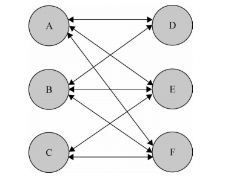
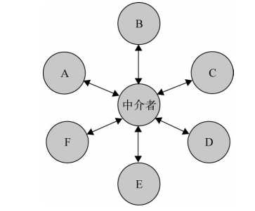
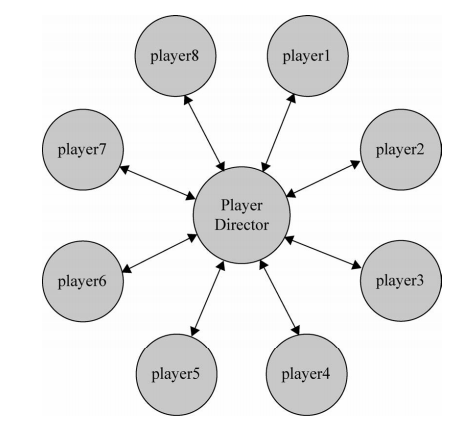

# 1 中介者的定义
中介者模式使网状的多对多关系编程变成相对简单的多对一关系。<br>
在程序中，一个对象如果使用到了另外10个对象，那么会在自己内部保留其他对象的引用。而如果其他的对象也对其有引用，也需要在内部保留它。那么当程序也来越多，对象越来越多，对象之间的关系引用变的相当复杂时，假如某一个对象需要删除，则需要修改所有引用到它的对象内部。<br>
<br>
使用中介者模式：解耦对象与对象之间的紧耦合关系，增加要给中介者，所有相关的对象都通过中介者对象来通信，而不是相互引用。所以当某一个对象发生了改变，只需要通知中介对象即可。中介者使对象之间的耦合松散，而且可以独立地改变它们之间的交互。<br>
<br>

# 2 泡泡堂游戏
##2.2 普通实现
在一个游戏中，有2个玩家。彼此是彼此的敌人。当其中一个玩家死亡游戏结束。
```javascript
// 玩家对象
function Player(name) {
    this.name = name;
    this.enemy = null; // 敌人
}
Player.prototype.win = function() {
    console.log(this.name + ': win');
};
Player.prototype.lose = function() {
    console.log(this.name + ': lose');
}
Player.prototype.die = function() {
    console.log(this.name + ': die');
    console.log(this.enemy.win());
}

// 给玩家设置敌人
var player1 = new Player( '皮蛋' );
var player2 = new Player( '小乖' );
player1.enemy = player2;
player2.enemy = player1;

player2.die();
```
此时只有两个玩家，当玩家达到4个时，就应该是这样:
- 创建成员的时候，根据颜色组队
- 当同一队的成员全部死亡，则敌方胜利
```javascript
// 玩家对象
function Player(name, teamColor) {
    this.name = name;
    this.enemies = []; // 敌人
    this.partners = []; // 队友
    this.state = 'live'; // 玩家状态：live, die
    this.teamColor = teamColor; // 队伍颜色

}
Player.prototype.win = function() {
    console.log(this.name + ': win');
};
Player.prototype.lose = function() {
    console.log(this.name + ': lose');
}
// 标记当前成员为die状态，遍历看是否所有队友die,如果都die结束战斗，并通知所有成员失败。敌人全部通知胜利
Player.prototype.die = function() {
    var all_dead = true;
    this.state = 'die';
    this.partners.map(function(partner) {
        if (partner.state === 'live') {
            all_dead = false;
            return;
        }
    });
    if (all_dead) {
        this.lose();
        this.partners.map(function(partner) {
            partner.lose();
        });
        this.enemies.map(function(enemy) {
            enemy.win();
        });
    }
}

// 写一个工厂方法创建玩家，并添加对头与敌人
var createPlayerFactory = (function() {
    // 存放所有玩家
    var players = [];
    return function(name, teamColor) {
        var player = new Player(name, teamColor);
        players.map(function(_player) {
            if (_player.teamColor === teamColor) {
                _player.partners.push(player);
                player.partners.push(_player);
            } else {
                _player.enemies.push(player);
                player.enemies.push(_player);
            }
        });
        players.push(player);
        return player;
    }
    
})();
var player1 = new createPlayerFactory( '皮蛋1', 'red');
var player2 = new createPlayerFactory( '小乖1', 'red');
var player3 = new createPlayerFactory( '皮蛋2', 'blue');
var player4 = new createPlayerFactory( '小乖2', 'blue' );
// 调用
player4.die();
player3.die();
```
## 2.2 中介者模式实现
此时，我们能够随意增加玩家个数或队伍。但是每个玩家和其他玩家紧密地联系在一起。在this.partners和this.enemies中保存着其他玩家的引用。当其中一个玩家的状态发生改变（死亡），则需要显示遍历通知其他对象。这看起来不是一个问题。但是当真正的有游戏中，玩家成千上万，游戏还会有解除队伍，添加到其他队伍，红色玩家可以变成蓝色变价。这就再仅仅是循环解决的问题了。现在我们使用中介者模式解决这个问题：
<br>
- 定义Player构造函数
- 定义中介者

```javascript
// 定义Player构造函数
function Player(name, teamColor) {
    this.name = name; // 角色名称
    this.teamColor = teamColor; // 队伍颜色
    this.state = 'live'; // 玩家状态
}
Player.prototype.win = function() {
    console.log(this.name + ': win');
};
Player.prototype.lose = function() {
    console.log(this.name + ': lose');
}

Player.prototype.die = function() {
    this.state = 'dead'; // 改变玩家状态
    playerDirector.reciveMessage('playDead', this); // 给中介者发送消息，玩家死亡
}

Player.prototype.remove = function(){
    playerDirector.reciveMessage( 'removePlayer', this ); // 给中介者发送消息，移除一个玩家
};

Player.prototype.changeTeam = function( color ){
    playerDirector.reciveMessage( 'changeTeam', this, color ); // 给中介者发送消息，玩家换队
};

// 假如使用发布订阅模式(fn是playerDirecto传入的处理函数：通知其他对象该对象已经死亡的处理函数)
// Player.prototype.remove = function(fn){
//     fn();
// };
```
我们需要实现一个中介者playerDirector对象，一般有两种方式,这两种方式没有本质区别，这里选择第二种。
- 发布订阅模式(观察者模式)：将playerDirector实现为订阅者，player作为发布者。一旦player状态发生改变，便推送消息给playerDirector。playerDirector处理消息后将反馈发送给其他player。
- 在playerDirector中开放接收消息接口，各个player通过调用该接口来给palyerDirector发送消息（将自己座位参数传递，便于中介者识别身份）。同样playperDirector接收到消息后通知反馈给其他player。
```javascript

var playerFactory = function( name, teamColor ){
    var newPlayer = new Player( name, teamColor ); // 创造一个新的玩家对象
    playerDirector.reciveMessage( 'addPlayer', newPlayer ); // 给中介者发送消息，新增玩家
    return newPlayer;
};

var playerDirector = (function() {
    // 存放所有的玩家
    var players = {};
    // 存放所有的玩家操作
    var operations = {
        addPlayer: function(player) {
            var teamColor = player.teamColor;
            if (!(teamColor in players)) {
                players[teamColor] = [];
            }
            players[teamColor].push(player);
        },
        // 移除玩家
        removePlayer: function(player) {
            var teamPlayers = players[player.teamColor] || [];
            teamPlayers = teamPlayers.filter(function(_player) {
                return _player !== player;
            });
        },
        // 玩家换队
        changeTeam: function( player, newTeamColor ){ // 玩家换队
            operations.removePlayer( player ); // 从原队伍中删除
            player.teamColor = newTeamColor; // 改变队伍颜色
            operations.addPlayer( player ); // 增加到新队伍中
        },
        playDead: function(player) {
            var teamColor = player.teamColor;
            var teamPlayers = players[teamColor];   
            var all_dead = true;
            teamPlayers.map(function(_player) {
                if (_player.state === 'live') {
                    all_dead = false;
                    return;
                }
            });
            if (!all_dead) {
                return;
            } 
            for (var color in players) {
                if (teamColor !== color) {
                    var teamPlayers = players[ color ]; // 其他队伍的玩家
                        for ( var i = 0, player; player = teamPlayers[ i++ ]; ){
                        player.win(); // 其他队伍所有玩家 win
                    }
                }
            }
        },
    };

    return {
        reciveMessage: function(){
            var message = Array.prototype.shift.call( arguments ); // arguments 的第一个参数为消息名称
            operations[ message ].apply( this, arguments );
        }
    }
})();
```
可以看到，除了中介者，没有一个玩家知道其他任何的玩家的存在。玩家与玩家之前完全解耦。某个玩家的任何操作也不需要通知其他玩家，只需要给中介发送一个消息。中介就会完成消息处理后把处理结果反馈给其他玩家。我们可以拓展中介者来扩展其他功能。下面进行结果测试：
```javascript
// 红队：
var player1 = playerFactory( '皮蛋', 'red' ),
player2 = playerFactory( '小乖', 'red' ),
player3 = playerFactory( '宝宝', 'red' ),
player4 = playerFactory( '小强', 'red' );
// 蓝队：
var player5 = playerFactory( '黑妞', 'blue' ),
player6 = playerFactory( '葱头', 'blue' ),
player7 = playerFactory( '胖墩', 'blue' ),
player8 = playerFactory( '海盗', 'blue' );
player1.die();
player2.die();
player3.die();
player4.die()
```

# 3 中介者小结
优点：中介者模式使各个对象之间得以解耦，以中介者和对象之间的一对多关系取代了对象之间的网状多对多关系。各个对象只需关注自身功能的实现，对象之间的交互关系交给了中介者对象来实现和维护。<br>
缺点：系统会新增一个中介者对象，对象之间的复杂性转移到了中介者对象。使得中介者对象经常巨大。中介者对象自己容易成为一个难维护的对象。<br>

程序中模块或对象之间有一些依赖关系是正常的，关键在于如何去衡量对象之间的耦合成都，如果对象之间的复杂耦合导致了调用和维护出现了困难，这些耦合度随着项目的变化呈指数增长曲线，可以考虑中介者模式来重构代码。

# 中介者和观察者区别
发布订阅模式(观察者)：没有封装约束的单个对象，而是观察者Observer和具体类Subject是一起配合维护约束。沟通是通过多个观察者和多个具体类来交互的。每个具体类通常可以包含多个观察者，而有时候具体类的一个观察者也是另一个观察者的具体类。
中介者：所做的不是简单的分发，而是扮演着维护这些约束的职责。