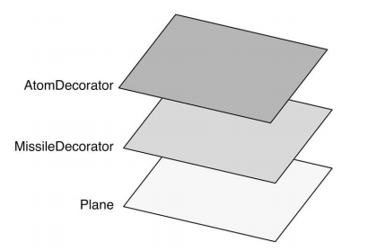

# 1 装饰模式的定义
在程序开发中，许多时候并不希望某个类天生就非强庞大，一次性包含许多职责。可以使用装饰者模式：动态地给某个对象添加一些额外的职责，而不会影响到这个类中派生的其他对象。
# 2 模拟传统面向对象语言的装饰类模式
作为一门解释性语言，javascript天生就可以很方便实现装饰类。只需要在创建的新对象上添加或则改变职责，就只是改了自身，不会影响到其他对象。我们并不太介意改动对象自身。
```javascript
var obj = {
    name: 'steven',
    address: '成都市'
};
obj.address = obj.address + '高新区'; 
```
装饰者(Decorator)其实也可以被成为包装器(Wrapper)。装饰模式将一个对象嵌入另一个对象之中，实际上相当于这个对象被另一个对象包裹起来，形成了一条包裹链。请求会随着这条链的调用依次传递到所有的对象。每个对象都有机会处理这条请求。<br>
<br>
我们这里模拟一下传统语言的装饰类模式。假设我们在编写飞机大战游戏，随着经验值增加，操作的飞机可以变得更厉害。从一级(普通子弹) => 二级(发射导弹) => 3级(发射原子弹)。
```javascript
// 普通飞机
function Plane() {
}
Plane.prototype.fire = function() {
    console.log('发射普通子弹');
}

// 装饰器(二级)
function MissileDecorator(plane) {
    this.plane = plane;
}
MissileDecorator.prototype.fire = function() {
    this.plane.fire();
    console.log('发射导弹');
}

// 装饰器(三级)
function AtomDecorator(plane) {
    this.plane = plane;
}
AtomDecorator.prototype.fire = function() {
     this.plane.fire();
    console.log('发射原子弹');
}
```
这种给对象动态添加职责的方式，并没有正真改变对象自身，而是将对象放入另一个对象中。这些对象以一条链的方式进行引用，形成一个聚合对象。并且这些对象拥有相同的接口(fire)。当请求到达链中的某个对象，这个对象会执行自身的操作，然后将请求传递给链中的下一个对象。
```javascript
var plane = new Plane();
plane = new MissileDecorator( plane );
plane = new AtomDecorator( plane );
plane.fire();
// 分别输出： 发射普通子弹、发射导弹、发射原子弹
```

# 3 javascript的装饰者
javascript语言动态改变对象相当容易，可以直接修改对象或者对象的某个方法，并不需要使用`类`来实现装饰者模式。实现模式如下：
- 使用临时变量a保存原始对象
- 创建新函数替换原始对象，并将a放入新函数中，再添加希望添加的操作
```javascript
var obj = {
    method: function() {}
};

// 创建临时变量
var temp = obj.method;

// 用新函数替换原函数
obj.method = function() {
    // 新函数中调用之前的内容
    temp();
    // 添加你需要新增的操作步骤
    console.log('xxxx');
}
```
下面我们使用上述方式来实现飞机发送子弹的javascript版本：
```javascript
var plan = {
    fire: function() {
        console.log('发射普通子弹');
    }
};
var mssileDecorator = function() {
    console.log('发射导弹');
}

var atomDecorator = function() {
    console.log('发射原子弹');
}

var fire1 = plan.fire;
plan.fire = function() {
    fire1();
    mssileDecorator();
}

var fire2 = plan.fire;
plan.fire = function() {
    fire2();
    atomDecorator();
}

plan.fire(); // 分别输出： 发射普通子弹、发射导弹、发射原子弹
```
这样做的缺点：
- 需要维护中间变量，fire1, fire2 ,增加额外开销。如果装饰链比较长，装饰函数变多，那么中间变量会越来越多
- 会遇到this被劫持的状态。例如下面的例子
```javascript
var name = 'windowName';
var plan = {
    name: 'planName',
    fire: function() {
        console.log(this.name + ': 发射普通子弹');
    }
};
var mssileDecorator = function() {
    console.log('发射导弹');
}

var fire1 = plan.fire;
plan.fire = function() {
    // 此时的fire1的函数中，this是指向了window。可以通过修改上下文：fire1.apply(plan, arguments);
    fire1();
    mssileDecorator();
}

plan.fire(); // windowName: 发射普通子弹, 发送导弹
```
# 4 使用AOP实现装饰者模式
页面有一个按钮，我们点击后需要弹出一个浮层。我们队弹出浮层这个方法进行了加强。
- 弹出界面之前，通过ajax获取浮层界面的消息，将请求参数修改
- 弹出后，将登录的用户信息上报给后端。
```html
<html>
    <script>
        // 编写AOP before
        Function.prototype.before = function(beforefn) {
            var self = this;
            return function() {
                beforefn.apply(this, arguments);
                return self.apply(this, arguments)
            }
        };
        // 编写AOP after
        Function.prototype.after = function(afterfn) {
            var self = this;
            return function() {
                var ret = self.apply(this, arguments);
                afterfn.apply(this, arguments);
                return ret;
            }
        };
        // 弹出层弹
        var showAlert = function() {
			console.log('弹出登录浮层', [...arguments]);
        };
        // ajax请求函数
        var ajaxData = function() {
			console.log('请求后端数据', [...arguments]);
        }
        // 用于修改ajax请求的参数
        var changeParam = function() {
            arguments[0].number += 10;
        }
        // 登录上报函数
        var report = function() {
            console.log('登录上报',  [...arguments]);
        }
        // 实现点击按钮后，请求数据（需要修改请求参数），弹出层显示，然后登录上报函数执行
		showAlert.before(ajaxData.before(changeParam)).after(report)({number: 1});
    </script>
</html>
```
# 5 装饰者模式和代理模式区别
这两种模式：都描述了怎样为对象提供一定程度的间接引用，他们的实现分别保留了对另外一个对象的引用，并且向那个对象发送请求。<br>
区别：
- 代理模式：当直接访问本体不方便或则不符合需要时，为这个本体提供一个替代者。本体定义关键功能，而代理提供货拒绝它的访问，或则在访问本体之前做额外的事情
- 装饰者模式：为对象动态加入行为。<br>
代理模式强调一种关系(proxy),这种关系一开始就被确认，只有一层`代理-本体`的引用，装饰者模式一开始无法确认对象的全部功能，会形成一条长长的装饰链。