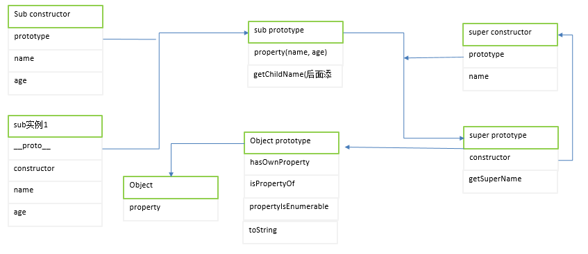

# 1. 动态类型语言 与 鸭子类型
语言分为动态类型语言与静态类型语言。
- 静态类型语言：在编译的时候已经确认变量类型，再编译阶段就能检测出不匹配的错误。
- 动态类型语言：在程序运行的时候，等到变量比赋予某个值之后，才具有某种类型。无法保证变量的类型，在程序运行时可能发生与类型相关的错误。
动态类型语言编程的灵活性比较大，我们可以不进行类型校验就可以尝试调用任意对象的任意方法，而无需考虑它原本是否设计了该方法。这一切都建立在duck typing（关注HAS_A, 不是IS_A）的基础上。
- duck typing: 鸭子类型。描述语言为`如果它走起来像一只鸭子，叫起来也是鸭子，那么它就是鸭子`。<br>

从下面的例子可以看出，对于加入合唱团的动物，我们没有检查它的类型，只是保证了它有duckSinging方法。加入下次加入是一只小狗，但是只要拥有duckSinging方法，那么还是能够顺利加入。
- 在动态类型的面向对象设计中，鸭子类型的概念比较重要。利用鸭子类型的思想，我们不需要借助超类型的帮助，就能够实现"面向接口编程，而不是面向实现编程"。
- 在静态类型语言中，如果要实现面向接口编程需要抽象类或者接口，并将对象进行向上转型，然后隐藏对象的真正类型，才能够在类型检查中进行相互被替换使用，只有当对象能够相互替换使用，那么才能体现出对象的多态。
```javascript
var duck = {
    duckSinging: function() {
        console.log('嘎嘎');
    }
};
var chicken = {
    duckSinging: function() {
        console.log('嘎嘎');
    }
};
var choir = [];
var joinChoir = function(animal) {
    if (animal && typeof animal.duckSinging === 'function') {
        choir.push(animal);
        console.log('恭喜加入合唱团，当前已有：' + choir.length + '只duck成员');
    }
}
joinChoir(duck);
joinChoir(chicken);
```

# 2. 多态
什么时多态？我所理解的就是：对于同一个操作作用于不同对象，不同对象给出了不一样的反应。例如：有一个类为动物，当动物发出叫声。鸭叫‘嘎嘎’，鸡叫‘咯咯’。但是狗和鸡都是动物，对于相同的`叫`操作给出了不同的反应。
```javascript
var Duck = function() {};
var Chicken = function() {};

var makeSound = function(animal) {
    if (animal instanceof Duck) {
        console.log('嘎嘎');
    } else {
        console.log('咯咯');
    }
}
```
上面的表现其实就是多态。鸭子叫‘嘎嘎’，鸡叫‘咯咯’。但是如果我们需要新增一个狗叫‘汪汪’，那么我们则需要修改makeSound方法。当动物越来越多，makeSound方法则变成一个巨大的函数。而多态的思想是将`做什么`和`谁去做如何做`分离。也就是将`不变的事物`与`可变的事物`分离。这个例子中，动物是会叫是不可变的，但是不同动物叫声不同是可变的。把不可变的部分隔离，把可变的部分封装起来，程序的拓展能力会增强。也符合`开放-封闭`原则。相对于修改代码来说，仅仅增加代码就能够完成同样的功能，这显得优雅与安全得多。

## 2.1 对象的多态性
下面将不变的隔离出来，将可变的部分各自封装起来。
```javascript
// 不可变的
var makeSound = function(animal) {
    // 动物都会叫
    animal.sound();
};

// 鸭子
var Duck = function() {};
Duck.prototype.sound = function() {
    console.log('嘎嘎');
};

// 鸡
var Chicken = function() {};
Chicken.prototype.sound = function() {
    console.log('咯咯');
};

// 新增一个狗叫
var Dog = function() {};
Dog.prototype.sound = function() {
    console.log('汪汪');
};
// 让动物叫
makeSound(new Duck());
makeSounc(new Chicken());
makeSounc(new Dog());
```
## 2.2 类型检查与多态
在静态语言中，在编译时就会对类型进行匹配检查。不能给变量设置不同类型的值。不能直接完成上面的功能。这里使用java举例。
```java
// 鸭子
public class Duck {
    public void sound() {
        System.out.println('嘎嘎');
    }
}
// 鸡
public class Chicken {
    public void sound() {
        System.out.println('咯咯');
    }
}

// 叫功能
public class  MakeSound{
    // 静态语言参数是强类型，只能传入Duck的对象
    public void sound(Duck duck) {
        duck.sound();
    }
}
public class Test {
    public static void man(String args[]) {
        MakeSound makeSound = new MakeSound();
        // 成功
        makeSound.sound(new Duck());
        // 失败
        makeSound.sound(new Chicken());
    }
}
```
例子中，鸭子能够正常地叫，但是鸡不能叫。为了解决这个问题，静态语言通常是向上转型，当给一个变量赋值时，这个类型既可以是类本身，也可以是超类。这里我们可以思考将Duck和Chicken对象隐藏在超类Animal身后，将Duck对象和Chicken对象与Animal交换。这就是让对象表现出多态性。而多态性的表现正是实现众多设计模式的目标。下面我们通过继承来实现多态(java)。
```java
// 超类
public abstract class Animal {
    abstract sound();
}
// 鸡
public class Chicken extends Animal {
    public void sound() {
        System.out.println('咯咯');
    }
}
// 鸭子
public class Duck extends Animal {
    public void sound() {
        System.out.println('嘎嘎');
    }
}
// 叫功能
public class  MakeSound{
    // 静态语言参数是强类型，这里接收Animal类型的参数
    public void sound(Animal animal) {
        animal.sound();
    }
}
public class Test {
    public static void man(String args[]) {
        MakeSound makeSound = new MakeSound();
        // 成功
        makeSound.sound(new Duck());
        // 成功
        makeSound.sound(new Chicken());
    }
}
```
## 2.3 javascript 多态
上面都是通过对静态类型语言对多态进行描述。可以知道多态的事项其实就是讲`做什么`和`谁去做`区分开来。归根到底就是消除类型之间的耦合关系。如果类型之间的耦合关系没有被消除，那么在MakeSound方法中指定了Duck对象，就无法再被替换为Chicken对象。Java中通过向上转型来实现多态。
而javascript的变量类型在运行期间是可变的，一个javascript对象既可以表示为Duck类型的对象，也能够表示为Chicken类型的对象。那么意味着javascript对象的多态性是与生俱来的。因此在javascript中，某一种动物是否发出叫声，取决于它有没有sound方法，而不是取决于是否是某种类型的对象。在javascript中不存在‘类型耦合’。这正式上一节中的‘duck typing’的道理。在javascript中并不需要向上转型的技术来取得多态的效果。
下面通过javascript来实现一个例子：地图有google和百度。通过条件语句分支方式实现：
```javascript
var googleMap = {
    show: function() {
        console.log('google渲染地图');
    }
};
var baiduMap = {
    show: function() {
        console.log('baidu渲染地图');
    }
};
var renderMap = function(type) {
    if (type === 'google') {
        googleMap.show();
    } else if(type === 'baidu') {
        baiduMap.show();
    }
}
renderMap('google');
```
当我们需要添加一个搜搜地图，那么不仅需要定义sousouMap,还需要修改renderMap。下面我们按照多态思想将`做什么`和`谁去做`区分开来。如下所示，只需要新增一个sousouMap就可以了，不再需要修改`做什么的操作`
```javascript
var googleMap = {
    show: function() {
        console.log('google渲染地图');
    }
};
var baiduMap = {
    show: function() {
        console.log('baidu渲染地图');
    }
};
var renderMap = function(map) {
    if (map.show instanceof 'function' ) {
        map.show();
    }
}
```
- 多态的好处：你不需要向对象询问`你是什么类型`,而是根据得到的答案调用对象的某个行为。只需要调用该行为，其他的一切多态机制都会为你安排妥当。
- 多态的实现形式：将过程化的条件分支语句转化为对象的多态性，消除掉了这些条件语句分支。

# 3. 封装
在许多语言的对象系统中，封装数据由语法解析来实现的。通过private,protected,public等关键字来提供不同的访问权限。但是javascript并没有提供这些关键字的支持，因此只能依赖变量的作用域来实现封装特性。而且只能模拟public与private两种封装特性。
```javascript
var myObj = (function() {
    var __name = 'steven'; // 私有private变量
    return {
        getName: function() { // public变量
            return __name;
        }
    };
})();
console.log(myObj.getName());
console.log(myObj.__name);
```
上面的例子，是数据层面的封装，是对封装比较狭隘的定义。封装的目的是将信息隐藏，不仅包括数据的隐藏，还应该影藏实现细节，设计细节以及隐藏对象的类型等。
- 封装应该使得对象内部的变化对其他对象而言是透明的，也就是不可见。对象对它自己的行为负责。其他对象不需要关心它内部实现。
- 封装使得对象之间的耦合变松散，对象之前只需暴露API接口来通信。
- 当修改一个对象时，可以随意修改它内部实现，只要对外接口没变化，就不影响程序的其他功能。

封装类型是静态语言中的重要封装方式。一般是通过抽象类和接口来进行的。把对象的真正类型影藏在抽象类或接口之后。相比对象类型，用户更关心对象的行为。这也就是很多模式诞生的原因之一。例如工厂方法模式，组合模式。而javascript并没有对抽象类和接口的支持。

# 4 原型模式
在以类为中心的面向对象编程语言中，对象总是从类中创造出来的。在原型编程的思想中，类并不是必须的，对象未必需要从类中创造而来。一个对象是通过克隆另外一个对象所得到的。而克隆的和本体看不出任何区别。
从设计模式来讲，原型模式属于创建对象的一种模式。一般要创建一个对象需要首先指定它的类型，然后通过类型创建这个对象。而原型模式选择另外一种方式，我们不需要关心对象的具体类型，首先找到一个对象，然后克隆一个完全一模一样的对象。
```javascript
function Super(name, age) {
    this.name = name;
    this.age = age;
}
Object.create = Object.create || function(obj) {
    var Child = function() {};
    Child.prototype = obj;
    return new Child();
}

var supper = new Super('yezi', 20);
// 克隆
var child = Object.create(supper);
console.log(child);
```
对于javascript这种类型模糊的语言来说，创建对象非常容易，也不存在类型耦合的问题，从设计模式角度来说，原型模式的意义并不大。但是javascript本身是一门基于原型的面向对象语言，它的对象系统就是使用原型模式来搭建。

# 原型编程范性
Javascript如何实现对象的集成呢？我们顶层对象是Object,假如我们需要创建一个Animal,则克隆一个Object。如果需要要给DOg，则从Animal中克隆一个Dog。这样看起来Dog的父类是Animal，Animal的父类是Object。当在Dog身上查找sing方法时，不存在该方法，会顺着原型链到Animal身上查找。加入Animal身上没有这个属性，则会到Object对象身上去查找。基于原型链的委托机制就是原型继承的本质。
```javascript
// 克隆Animal
var Animal = Object.create(new Object());
Animal.sing = function() {
    console.log('sing');
}
// 克隆Dog
var Dog = Object.create(Animal);
Dog.eat = function() {
    console.log('eat');
}
```
原型编程的规则：
- 所有数据都是对象
- 要得到要给对象，不是通过实例化类，而是找到要给对象座位原型并克隆它。
- 对象会记住它的原型
- 如果对象如法响应某个请求，它会把这个请求委托给自己的原型

# 5 javascript中的原型继承
上面已经讨论了原先编程的规则，下面接着分析javascript是如何在这些规则的基础上构建它的对象系统的。
## 所有数据都是对象
javascript语言有大类数据类型：原始类型（undefined， string, number, boolean）和引用类型（object, function, constructor,字面量，Array）。原始类型中除了undefined，也可以通过`包装类`的方式安装对象处理。
我们不能说javascript所有的数据都是对象，但是大部分数据都是对象，那么javascript中也一定会存在`根对象`，是所有对象的来源。而这个`根对象`就是`Object.prototype对象`。`Object.prototype`是一个空对象，在javascript中遇到的每个对象，都是由`Object.prototype`克隆而来的，也就是它们的原型。
```javascript
var obj1 = new Object();
var obj2 = {};

console.log(Object.getPrototypeOf(obj1) === Object.prototype); // true
console.log(Object.getPrototypeOf(obj2) === Object.prototype); // true
```
## 要得到对象，不是通过实例化类，而是找到一个对象座位原型并克隆它
我们不需要关心克隆的细节，因为引擎内部负责实现的。我们只需要显示调用`var obj1 = {}; var obj2 = new Object()`。引擎内部就会从Object.prototype上面克隆一个对象出来。系main我们看一个如何通过new运算符从构造器中获得一个对象。
```javascript
var User = function(name) {
    this.name = name;
}
User.prototype.getName = function() {
    return this.name;
}

var user = new User('yezi');
console.log(user.name);
console.log(user.getName()); 
```
上面看起来就像是有一个类，然后使用new关键字对类创建了一个对象。但是我们要记住，javascript中并没有类的概念，这里的User知识要给`函数构造器`,javascript的`函数构造器`能够作为普通函数调用，也能座位构造器被调用，当使用`new`关键字调用函数时，此时的函数就是作为`函数构造器`。用new运算符创建对象的过程，实际就是先克隆`Object.prototype`,然后在进行一些额外的操作（javascript并不是每次都需要真正克隆，从内存考虑javascript还做了额外的处理，具体不讨论）。下面的代码模拟了javascript如何创建的新对象
```javascript
var User = function(name) {
    this.name = name;
}
User.prototype.getName = function() {
    return this.name;
}

var objectFactory = function() {
    var temp = new Object(); // 从Object.prototye上克隆要给空对象
    Constructor = [].shift.call(arguments); // 获取到外部传入的构造函数，此例子为User
    temp.__proto__ = Constructor.prototype; // 将对象的原型指向真确的原型
    var ret = Constructor.apply(temp, arguments); // 此处的argument时外部传入的参数（上面取出了constructor）
    return typeof ret === 'object' ? ret : temp; // 确保每次构造器总是返回一个对象
}

var user = objectFactory(User, 'yezi');
console.log(user.name);
console.log(user.getName()); 
console.log(Object.getPrototypeOf(user) === User.prototype);
```
我们可以看出，使用new关键字创建的对象与objectFactory创建的对象一样。

## 对象会记住它的原型
如果请求可以在一个链条中一次往后传递，那么每个节点必须知道它的下一个节点，也就是说在原型链查找机制中，每个对象至少应该记住它自己的原型。
目前我们讨论`对象的原型`，对于javascript真正的实现来说，实际时对象的构造器有原型，对于`对象把请求委托给它自己的原型`，实际是对象把请求委托给它的构造器的原型。下面我引用一个图解：<br>
<br>

## 如果对象无法响应某个请求，它会把这个请求委托给它的构造器的原型
javascript中的对象最初都是由Object.prototype克隆的，但是对象的构造器的原型并不仅仅限于Object.prototype。a对象克隆于Object.prototype,此时创建一个b对象，将b.prototype指向a的对象，从而达到了一个链式的继承效果。
```javascript
var a = { name: 'yezi'}; 
var B = function() {};
B.prototype = a;
var b = new B(); 
console.log(b.name);
```
这段代码的执行过程如下：
- 创建了一个a对象，克隆与Object.prototype
- 创建了一个B对象，克隆于Object.prototype
- 修改B对象的prototype，指向a对象
- 从b对象身上查找name属性，不存在
- 顺着原型链查找a身上，存在


