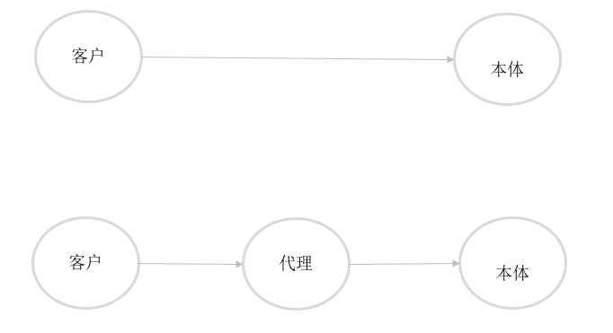
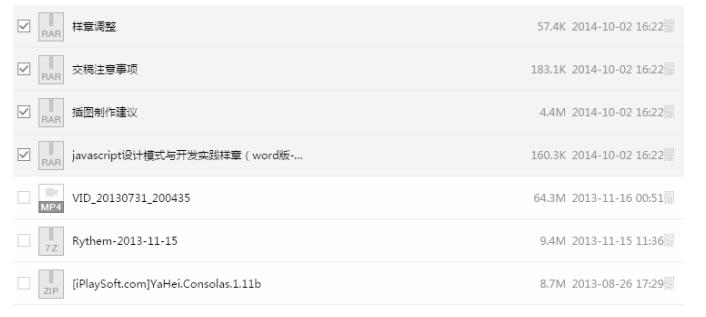

# 1 代理模式的定义
代理模式：为一个对象提供一个代理用品或者占位符，以便控制对它的访问。生活中有很多这样的例子：
- 请明星代言，实际是联系明星的经纪人，来建立商户 与 明星的关系
- 二手市场买房，实际联系的是中介公司来搭建买房与买房之间的桥梁
因此，可以这样理解：当客户不方便直接访问一个对象或者不满足需要的时候，提供一个替身对象来控制这个对象的访问，客户实际访问的是替身对象。替身对象对请求做出一些处理后，再讲请求转交给本体对象。<br>
<br>

#2 代理example
我们这里使用小明送花给小美来举例子。
- 小明找到他与小美两个共同的好朋友小丑，让她帮忙送花
- 小丑不会直接送给小美，而是会找小美心情好的时候送，增加成功几率
- 小美收到鲜花接收了小明
```javascript
function Flower(name) {
    this.name = name;
}
// 小明使用面向对象的方式创建
var Xiaoming = function() {

}
Xiaoming.prototype.sendFlower = function(xiaochou) {
    var flower = new Flower('玫瑰花');
    xiaochou.recieveFlower(flower);
}

// 小丑使用javascript的对象即类的概念创建
var xiaochou = {
    recieveFlower: function(flower) {
        var goodDay = xiaomei.listenerGoodDay();
        if (goodDay) {
            xiaomei.recieveFlower(flower);
        } else {
            console.log('小美心情不好，因此没有送');
        }
    }
};

var xiaomei = {
    // 小美心情随机
    listenerGoodDay: function() {
        var random = parseInt(Math.random() * 10);
        return random % 2 === 0 ? true : false;
    },
    recieveFlower: function(flower) {
        console.log(`小美看到是${flower.name}, 接收了小明`);
    }
};

var xiaoming = new Xiaoming();
xiaoming.sendFlower(xiaochou);
```

# 3 保护代理和虚拟代理
从上面的例子中，我们可以知道xiaochou可以帮助小美过滤掉小美不喜欢的类型：例如没有宝马车，长得矮，长得丑的，小丑可以直接拒绝。这种代理叫做保护代理。
假如鲜花价格比较昂贵，new Flower()代价很高，可以把new Flower()操作交给代理xiaochou,她可以根据xiaomei的心情好的时候再去new Flower(),避免鲜花枯萎浪费。这叫做虚拟代理。虚拟代理把一些开销很大的对象，延迟到真正需要它的时候才创建。
```javascript
var xiaochou = {
    recieveFlower: function() {
        var goodDay = xiaomei.listenerGoodDay();
        if (goodDay) {
            var flower = new Flowe();
            xiaomei.recieveFlower(flower);
        } else {
            console.log('小美心情不好，因此没有送');
        }
    }
};
```
保护代理用于控制不同权限的对象对目标对象的访问，在javascript中并不容易实现保护代理，因为我们无法判断谁访问了某个对象。而虚拟代理是常用的一种代理模式。

# 4 虚拟代理加载图片
在web开发中，图片预加载是一种常用的技术。如果给某个img标签直接添加src属性，如果某个图片过大或者网速差，则图片的位置会有一段时间是空白的。常见的做法是在加载图片完毕之前使用一个loading图片。等到图片加载完毕后替换。下面我们使用虚拟代理来完成。
- 创建一个本体ImageSrc方法
- 创建一个代理ProxyImageSrc方法
```javascript
// 本体
var ImageSrc = (function () {
    var imgNode = document.createElement('img');
    document.body.appendChild(imgNode);
    return {
        setSrc: function(src) {
            imgNode.src = src;
        }
    };
})();

// 代理
var ProxyImageSrc = (function ProxyImageSrc() {
    var img = new Image();
    // 页面加载完毕后，将img上存放的src设置到ImageSrc对象上
    img.onload = function() {
        ImageSrc.setSrc = this.src;
    };
    return {
        setSrc: function(src) {
            // 加载中使用loading图片
            ImageSrc.setSrc('http://img4.imgtn.bdimg.com/it/u=1972873509,2904368741&fm=27&gp=0.jpg'); 
            img.src = src;
        }
    };
})();
// 调用，设置src
ProxyImageSrc.setSrc('http://img05.tooopen.com/images/20150820/tooopen_sy_139205349641.jpg');
```
其实实现该功能，即使不引入任何模式也能够办到，例如通过下面的方式：
```javascript
var ImageSrc = (function() {
    var imgNode = document.createElement('img');   
    document.body.appendChild(imgNode);

    var img = new Image();
    img.onload = function(src) {
        imgNode = this.src;
    }

    return {
        setSrc: function(src) {
            imgNode.src = 'loading.png';
            img.src = src;
        }
    }
})();

ImageSrc.setSrc('complete.png');
```
该对象承担了多项职责。负责了图片的预加载处理，图片完成后的设置。违背了面向对象设计的原则`单一职责原则`。当对象承担更多职责，意味着对象会变的巨大，引起它变化的情况会变的很多。在设计代码的时候应该高内聚低耦合，尽量符合单一职责。

# 5 代理和本体接口一致
当某一天我们不再需要预加载，那么就不需要设置代理对象，可以直接请求本体。其中关键点是：代理对象与本体都对外提供setSrc。在客户看来，本体与代理是一致的。代理接收的请求过程对于用户来说是透明的，用户不清楚代理与本体的区别，这样的好处是：
- 用户可以放心请求代理，他只需要关心是否能够得到预期的结果
- 在任何使用本体的地方都能够替换成为使用代理<br>
在java语言中，代理和本体需要显示实现同一个接口，在保证它们拥有同样的方法的同时，面向接口编程迎合依赖倒置原则，通过接口向上转型，避开编译器的类型检查，使得代理与本体将来能够被替换使用。
javascript语言是动态类型语言，我们可以通过`duck typing`来检查代理和本体是否拥有setSrc方法，而大多数时候不会检查。

# 6 虚拟代理合并http请求
下图是我们在网页中上传文件的列表，当点击checkbox则上传文件。加入手速比较快的人，1秒钟点击4,5次是不成问题的。那么相当于1秒以内，就需要与服务器进行4次请求，频繁的网络请求会带来相当大的开销。因此我们可以等待2秒以后，将2秒以内点击了的文件一起发送给服务器，如果对实时要求不是非常高的系统，2秒的延迟不会出现太大的副作用，却能大大减轻服务器的压力。<br>
<br>
```javascript
// 本体，同步文件的方法
var synchronousFile = function(ids) {
    console.log(`开始同步${ids} 文件`);
}
// 代理，异步调用方法
var proxySynchronousFile = (function() {
    var cacheIds = [];
    var timer = null;
    return function(id) {
        cacheIds.push(id);
        if (timer) {
            return;
        }
        timer = setTimeout(function() {
            synchronousFile(cacheIds.join(',')); // 2秒后向服务器发送请求
            clearTimeout(timer);
            timer = null;
            cache.length = 0; // 清空集合。
        },2000);
    }
})();

// 注册上传文件点击事件
var checkboxs = document.getElementsByTagName('input');
checkboxs.map(function(checkbox) {
    checkbox.onclick = function(event) {
        if (this.checked === true) {
            proxySynchronousFile(this.id);
        }
    }
});
```
# 7 虚拟代理实现缓存
缓存代理可以为一些开销大的运算结果提供暂时存储，在下次传递进来的参数如果与之前某一次的一致，直接返回存储的结果。上面存储一个通过ajax请求获取的数据。
```javascript
// 本体
var getAjaxData = function(arg) {
    $.ajax('url', function(data) {
        return data;
    });
}

// 代理
var proxyData = (function() {
    var cache = [];
    return function(arg) {
        if (arg in cache) {
            return cache[arg];
        } else {
            return cache[arg] = getAjaxData(arg);
        }
    }
})();

// 调用,第一次调用会将数据存放在cache中，第二次调用会直接使用缓存中的数据
var returnData = proxyData(1);
var retrunData2 = proxyData(1);
```

# 8 用高阶函数创建代理
通过传入高阶函数这种更加灵活的方式，可以为各种计算方法创建缓存代理。
```javascript
// 本体
var mult = function() {
    return [].reduce.call(arguments, function(x, y) {
        return x * y;
    }, 1)
}
// 本体
var plus = function() {
    return [].reduce.call(arguments, function(x, y) {
        return x + y;
    }, 0)
}

// 代理
var calculateProxy = function(fn) {
    var cache = [];
    return function() {
        var args = [].join.call(arguments, ',');
        if (args in cache) {
            return cache[args];
        } else {
            return cache[args] = fn.apply(this, arguments);
        }
    };
};

// 调用
var proxyMult = calculateProxy(mult);
var proxyPlus = calculateProxy(plus);
console.log(proxyMult(2, 4, 5));
console.log(proxyPlus(2, 4, 5));
```
# 9 小结
代理模式包括许多小分类，在javascript中常用的是虚拟代理与缓存代理。虽然代理模式非常有用，但是我们在编写业务代码的时候，往往不需要去预先猜测是否需要使用代理模式。而是当真正发现不方便直接访问某个对象的时候，再编写代理不迟。