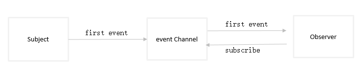

# 1 发布-订阅模式的定义
发布-订阅模式又称为观察者模式。它定义了对象之间的一种一对多的依赖关系。当一个对象发生改变时，所有依赖于它的对象都将得到通知。在javascript开发中，我们一般用事件模型来替代传统的发布-订阅模式。

## 1.1 观察者模式（发布订阅模式） 与 中介者模式的区别
发布订阅模式是最常用的一种观察者模式的实现，并且从解耦和重用角度来看，更优于典型的观察者模式<br>
在观察者模式中，观察者需要直接订阅目标事件；在目标发出内容改变的事件后，直接接收事件并作出响应。<br>
<br>
在中介者模式中，发布者和订阅者之间多了一个发布通道；一方面从发布者接收事件，另一方面向订阅者发布事件；订阅者需要从事件通道订阅事件,以此避免发布者和订阅者之间产生依赖关系。<br>
<br>

# 2 现实中的发布-订阅模式
现实中的售楼部就是一个发布-订阅模式的例子。想要买房子的顾客会去售楼部查看房源情况，但是不一定都遇到此时有房源，因此留下了自己的电话号码，向售楼部订阅了最新房源的消息。而售楼部就是发布者，当有房源就会立马通知所有订阅了消息的用户，房源已经出来了。这样的好处在于：
- 顾客不用每天都去售房部看是否有房源，顾客就是订阅者，售楼部是发布者。
- 顾客与售房部不会强耦合在一起，当有新的购房者出现，只需要向售楼部订阅即可。售楼部不会管用户是人还是鬼，而顾客也不会管售楼部内部职员变动情况，只要售楼部即使发送消息。<br>

第一点在异步编程中有体现，例如我们订阅了ajax请求的error,succ事件。当ajax请求完毕后，一定会通知error或succ执行。我们无需关心ajax异步运行期间的内部状态，只需要订阅感兴趣的事件发生点。<br>
第二点可以取代对象之间的硬编码通知机制，一个对象不再需要显示调用另一个对象的某个接口。发布订阅模式将发布者和订阅者松耦合地联系在一起，不需要知道彼此之间的实现细节，也能够相互通信。当新的订阅者出现，发布者不需要有任何修改。同样发布者有修改时，订阅者也不会有任何影响。只要之前约定的事件名没有发生任何变化，就可以自由改变它们。

# 3 DOM事件
编写代码的过程中，我们队DOM结构上的div注册事件也是一个发布订阅模式。发布者DOM的div,向该发布者订阅了click事件，当发布者发生了click事件后，之前订阅的click函数都会触发。
```javascript
var div = document.getElementById('myDiv');
div.addEventListener('click', function() {
    console.log('消息通知过来了1');
});
div.addEventListener('click', function() {
    console.log('消息通知过来了2');
});
div.click();
```

# 4 自定义事件
下面我们就以现实中的售楼部与客户的关系，来实现一个发布-订阅模式的例子。
- 有一个售楼部对象，拥有存放客户信息的仓库，拥有发布消息的方法
- 不同的用户向售楼部订阅不同的消息
- 售楼部在适当的时候发布消息
```javascript
var saleOffices = {
    // 用户数据中心
    customerDatas: {}, 
    // type：订阅类型， messageFunc:用户感兴趣的内容
    subscribe: function(type, messageFunc) {
        // 如果没有订阅过，则在数据中心是不存在的，需要为其创建一个存放订阅内容
        var customerData = this.customerDatas[type];
        if (!customerData) {
            this.customerDatas[type] = [];
        }
        // 订阅的消息添加到消息缓存列表
        this.customerDatas[type].push(messageFunc);
    },
    notify: function() {
         // 获取消息类型
        var type = [].shift.call(arguments);
        // 取出消息类型的消息集合
        var funcs = this.customerDatas[type];
        // 不存在的消息返回
        if (!funcs || funcs.length === 0) {
            return false;
        }
        // 存在则调用
        funcs.map(function(fn) {
            fn.apply(this, arguments);
        })
    }
};

// 用户1：订阅
saleOffices.subscribe('squareMeter88', function(price) {
    console.log('88平米的价格：' + price);
});
// 用户2：订阅
saleOffices.subscribe('squareMeter120', function(price) {
    console.log('120平米的价格：' + price);
});

// 发布者发布
// 用户1才能收到
saleOffices.notify('squareMeter88', 8000);
// 用户2才能收到
saleOffices.notify('squareMeter120', 9000);
```

# 5 发布订阅的通用实现
上例中，加入客户1不仅去售楼部A出订阅了，也去售楼部B处订阅了消息。那么相当于我们需要给售楼部B处也写一个发布订阅功能。那么如何使售楼部都能够使用呢？
- 提取发布-订阅方法
- 拥有售楼部类，创建售楼部A,售楼部B
- 在售楼部A处订阅消息，在售楼部B处订阅消息
```javascript
// 提取观察订阅方法
var observer = {
    // 用户数据中心
    customerDatas: {}, 
    // type：订阅类型， messageFunc:用户感兴趣的内容
    subscribe: function(type, messageFunc) {
        // 如果没有订阅过，则在数据中心是不存在的，需要为其创建一个存放订阅内容
        var customerData = this.customerDatas[type];
        if (!customerData) {
            this.customerDatas[type] = [];
        }
        // 订阅的消息添加到消息缓存列表
        this.customerDatas[type].push(messageFunc);
    },
    notify: function() {
         // 获取消息类型
        var type = [].shift.call(arguments);
        var params = arguments;
        // 取出消息类型的消息集合
        var funcs = this.customerDatas[type];
        // 不存在的消息返回
        if (!funcs || funcs.length === 0) {
            return false;
        }
        // 存在则调用
        funcs.map(function(fn) {
            fn.apply(this, params);
        })
    },
    // 订阅了的内容，可以取消
    remove: function(type, fn) {
        var fns = this.customerDatas[type];
        // 如果不存在订阅内容返回
        if (!fns || fns.length === 0) {
            return false;
        }
        // 如果没有传入具体的需要退订的内容，则取消所有该类型的订阅
        if (!fn && fns) {
            fns.length = 0;
            return;
        }
        fns.map(function(_fn, index) {
            if (fn === _fn) {
                fns.splice(index, 1)
            }
        });
    }   
};

// 创建售楼部类
var SaleOffice = function() {
    return Object.create(observer);
}

// 售楼部1 订阅消息 
var saleOfficeA = SaleOffice();
saleOfficeA.subscribe('squareMeter88', f1 = function(price) {
    console.log('88平米的价格：' + price);
});

// 售楼部2 订阅消息 
var saleOfficeB = SaleOffice();
saleOfficeB.subscribe('squareMeter120', f2 = function(price) {
    console.log('120平米的价格：' + price);
});
 
// 售楼部A通知，售楼部B通知 都能够收到
saleOfficeA.notify('squareMeter88', 8000);
saleOfficeB.notify('squareMeter120', 9000);

// 移除订阅
saleOfficeA.remove('squareMeter88', f1);

// 售楼部A的通知不能收到
saleOfficeA.notify('squareMeter88', 8000);
saleOfficeB.notify('squareMeter120', 9000);
```

# 6 全局的发布-订阅模式（已经引入了中介者模式）
刚刚的发布订阅模式中，我们给售楼处对象和登录对象都添加了订阅和发布的功能。但是还有2个小问题：
- 我们给每一个售楼部都添加了subscrible和notify方法，以及一个缓存customerDatas对象。这其实是一种资源浪费
- 购买者与售楼部有一定的耦合，购买者必须要知道售楼部，售楼部也必须要知道购买者，才能顺利订阅事件<br>
现实中，我们一般不回去售楼部，我们会把订阅事件的请求交给中介公司，而不同的售楼部会将信息发布在中介公司。这样就消除了购买者与售楼部的耦合关系。只需要购买者与售楼部知道中介公司就可以了。<br>
因此发布-订阅模式可以使用一个`Observer全局`的对象来实现。订阅者不需要知道是哪个发布者，发布者也不知道消息会推送给哪些订阅者。`Observer对象`作为`中介`的角色，把发布者和订阅者关联起来。
```javascript
var Observer = (function() {
    // 用户数据中心
    var customerDatas = {};

    // 订阅
    function subscribe(type, fn) {
        if (!(type in customerDatas)) {
            customerDatas[type] = [];
        }
        customerDatas[type].push(fn);
    }

    // 发布
    function notify() {
        var type = [].shift.call(arguments);
        var param = arguments;
        var fns = customerDatas[type];
        if(fns.length === 0) {
            return false;
        }
        fns.map(function(fn) {
            fn.apply(this, param);
        });
    }

    function remove(type, fn) {
        var fns = this.customerDatas[type];
        // 如果不存在订阅内容返回
        if (!fns || fns.length === 0) {
            return false;
        }
        // 如果没有传入具体的需要退订的内容，则取消所有该类型的订阅
        if (!fn && fns) {
            fns.length = 0;
            return;
        }
        fns.map(function(_fn, index) {
            if (fn === _fn) {
                fns.splice(index, 1)
            }
        });
    }
    return {
        subscribe: subscribe,
        notify: notify,
        remove: remove
    };
})();

// 用户1 注册
Observer.subscribe('squareMeter88', f1 = function(price, tel) {
    console.log(tel + '用户您好：' + '88平米的价格：' + price);
});
Observer.subscribe('squareMeter120', f2 = function(price, tel) {
    console.log(tel + '用户您好：' + '120平米的价格：' + price);
});

// 中介通知
Observer.notify('squareMeter88', 8000, 18784578444);
Observer.notify('squareMeter120', 9000, 18784578444);

```

# 7 网站登录-发布订阅模式
假如我们正在开发一个商城网站，网站有header头部，nav导航，消息列表，购物车等等。而这几个模块的渲染有一个共同的条件：登录用户的信息(用户名，昵称等)。而用户信息需要通过ajax请求获取结果。然后将信息填写到各个模块中。
```javascript
var getUserInfo = function() {
    $.ajax('url', function(data) {
        header.setAvata(data.avata); // 设置header的头像
        nav.setAvata(data.avata); // 设置导航模块的头像
        message.refresh(); // 刷新消息
        cart.refresh(); // 刷新购物车
    });
};
```
各个模块的设置都依赖于用户信息的获取，导致模块与用户信息产生了强烈的耦合性。<br>
假如项目中还要添加一个收货地址模块。也需要在用户信息获取后刷新。雇员A负责获取用户信息，雇员B负责收货地址模块，此时雇员B就会找雇员A又去修改用户获取模块。而不愿B也需要添加收货地址模块代码
```javascript
var getUserInfo = function() {
    $.ajax('url', function(data) {
        header.setAvata(data.avata); 
        nav.setAvata(data.avata); 
        message.refresh();
        cart.refresh();
        // 雇员A：为了收货地址模块需要修改代码
        address.refresh();
    });
};

// 雇员B需要添加收货地址模块代码
var address = (function() {

    function refresh() {
        console.log('地址模块完成');
    }
    return {
        refresh: refresh
    };
})();
```
假如后面还需要添加其他模块，也需要依赖于用户信息，那么雇员A就会发脾气了：“为什么你们的模块老是让我来修改，增加我的工作量”。那么此时雇员A就思考，是不是我的代码有问题？因此就想到了重构代码。这时他引用了发布订阅模式。我只管告知你们，我登录成功了，你们爱做什么做什么。我不再管你们的业务了，自己玩去。而其他模块收到消息后就处理自己的业务。
```javascript
var Login = (function() {
    // 存放所有的订阅事件
    var registerFunc = {};
    // 发布
    function notify(userInfo) {
        // 遍历存放在Login中的订阅事件，依次触发
        for ( var type in registerFunc) {
            var fns = registerFunc[type];
            if(!fns || fns.length === 0) {
                return false;
            }
            fns.map(function(fn) {
                fn.call(this, userInfo);
            });
        }
    }
    // 订阅
    function subscribe(type, fn) {
        if (!(type in registerFunc)) {
            registerFunc[type] = [];
        }
        registerFunc[type].push(fn);
    }

    // 获取用户信息后发布消息
    function getUserInfo() {
        $.ajax('url', function(data) {
            notify({avata: 'yezi'});
        });
    }
    
    return {
        getUserInfo: getUserInfo,
        subscribe: subscribe
    };
})();

// 地址模块
var address = (function() {

    function refresh() {
        console.log('地址模块完成');
    }
    // 订阅
    Login.subscribe('address', refresh);
})();

var header = (function() {

    function setAvata() {
        console.log('头部头像完成');
    }
    // 订阅
    Login.subscribe('header', setAvata);
})();

// 登录
Login.getUserInfo();
```
# 8 模块之间的通信
根据第7小节中编写的中介Observer对象，其实可以提取出来作为一个完整的发布订阅对象。例如页面上有两个模块，点击A模块的按钮后B模块的内容进行修改。<br>
- B模块向观察者(Observer)订阅事件：如果A模块的count修改则通知自己count的内容，B会显示count内容
- A模块通过观察者(Observer)发布消息：我的count修改了，你帮我通知一下订阅的模块
[](./assets/4.png)<br>
```html
<html>
    <body>
   <body>
	<button id="count">点我</button>
	<div id="show"></div>
    <script>
    var Observer = (function() {
        // ...和上面的一样
        return {
            subscribe: subscribe,
            notify: notify,
            remove: remove
        };
    })();

    var Button = (function() {
        var count = 0;
        var el = document.getElementById('count');
        el.onclick = function() {
            Observer.notify('addCount', count++);
        }
    })();	

    var Div = (function() {
        var el = document.getElementById('show');
        Observer.subscribe('addCount', function(count) {
            el.innerHTML = count;
        });
    })();
    </script>
    </body>
</html>
```
这里我们需要注意一点：如果模块与模块之间使用太多的发布订阅模式，那么模块与模块之间的联系被隐藏，最终我们自己都会搞不清楚消息来自哪个模块，会在维护的时候带来麻烦。

# 9 先发布再订阅
一直以来我们都是通过先订阅后发布，然后消息都会发送出来，但是如果我们先发布后订阅那么由于没有人订阅它，这条消息就会石沉大海。<br>
某些情况下，我们需要先将消息保留下来，等有对象订阅它，再重新将消息发送给订阅者。
- 就像QQ消息在离线时，消息被保留在服务器，接收人下次登录上线则可以重新收到这条消息。
- 就像商城登录后需要渲染导航模块的用户图片。假如出现导航还没渲染完毕，而用户ajax数据已经返回，那么导航模块就无法渲染图片。因此需要建立一个离线事件的堆栈，将事件发布时，将没有订阅者的事件的动作包裹在一个函数中，然后将包裹的函数放入堆栈，等到有对象来订阅事件，依次遍历堆栈并且依次执行这些包装的函数，也就是重新发布里面的事件。当然离线事件的生命周期只有一次，就像QQ未读消息纸杯重新阅读一次。
```javascript
var Observer = (function() {
    // 用户数据中心
    var customerDatas = {};
	
	// 存放已发布但是未订阅的事件
	var enquene = {};
    // 订阅
    function subscribe(type, fn) {
        if (!(type in customerDatas)) {
            customerDatas[type] = [];
        }
        customerDatas[type].push(fn);

		// 获取该类型未真正发布的事件队列
		var noNotifyParanms = enquene[type];
		// 如果已经存在订阅未发布，需要重新发布，并从未发布队列中移除
		if (noNotifyParanms && noNotifyParanms.length > 0) {
			noNotifyParanms.map(function(noNotifyParam) {
				fn.apply(this, noNotifyParam);
			});
			// 移除在为订阅事件队列中的事件
			delete enquene[type];
		}
    }

    // 发布
    function notify() {
        var type = [].shift.call(arguments);
        var param = arguments;
        var fns = customerDatas[type];
		// 如果发布时候订阅数为0，则按照订阅类型放入未订阅事件队列，并直接返回
        if(!fns || fns.length === 0) {
			enquene[type] = enquene[type] || [];
			enquene[type].push(param);
            return false;
        }
        fns.map(function(fn) {
			fn.apply(this, param);
			
        });
		
    }

    function remove(type, fn) {
        var fns = this.customerDatas[type];
        // 如果不存在订阅内容返回
        if (!fns || fns.length === 0) {
            return false;
        }
        // 如果没有传入具体的需要退订的内容，则取消所有该类型的订阅
        if (!fn && fns) {
            fns.length = 0;
            return;
        }
        fns.map(function(_fn, index) {
            if (fn === _fn) {
                fns.splice(index, 1)
            }
        });
    }
    return {
        subscribe: subscribe,
        notify: notify,
        remove: remove
    };
})();
// 先发布
Observer.notify('add', 10);
Observer.notify('add', 20);

// 订阅，会收到前两次的通知
Observer.subscribe('add', function(num) {
	console.log('订阅的value：' + num);
});
```
# 10 全局事件的命名冲突
全局的发布-订阅对象里只有一个customerDatas来存放消息名和回调函数，大家都通过它来订阅和发布各种消息，久而久之，难免会出现事件名冲突的情况。因此可以给Observer对象提供创建命名空间的功能。
```javascript
var Observer = (function() {

    var _default = 'default';

    var Event = (function() {
        // 缓存命名空间对象
        var namespaceCache = [];

        var _listener = function(key, fn, cache) {
            if (!(key in cache)) {
                cache[key] = [];
            }
            cache[key].push(fn);
        }

        var _remove = function(key, cache, fn) {
            if (!(key in cache)) {
                // 如果移除fn没有传入，则移除所有该key类型的订阅
                if (fn) {
                    cache[key] = cache[key].filter(function(_fn) {
                        return _fn != fn;
                    })
                } else {
                    cache[key] = [];
                }
            }
        }

        var _notify = function() {
            var cache = [].shift.call(arguments);
            var key = [].shift.call(arguments);
            var args = arguments;
            var stack = cache[key];
            if (!stack || stack.length === 0) {
                return;
            }
            return stack.map(function(fn) {
                fn.apply(this, args);
            });
        }

        var _create = function(nameSpace) {
            var nameSpace = nameSpace || _default;
            // 缓存注册的事件
            var cache = [];
            // 离线事件
            var offlineStack = [], ret;
            
            if (!(nameSpace in namespaceCache)) {
                ret = {
                    // 订阅事件
                    subscribe: function(key, fn, last) {
                        // 基本的订阅事件
                        _listener(key, fn, cache);
                        // 离线事件不存在返回
                        if (offlineStack === null) {
                            return;
                        }
                        // 执行最后一个离线事件
                        if (last === 'last') {
                            offlineStack.length && offlineStack.pop()();
                        } else {
                            // 执行所有的离线事件
                            offlineStack.map(function(_fn) {
                                _fn();
                            });
                        }
                        // 清空离线事件
                        offlineStack = null;
                    },
                    // 移除订阅
                    remove: function(key, fn) {
                        _remove(key, cache, fn);
                    },
                    // 发布
                    notify: function() {
                        var _self = this;
                        // 将注册的所有事件cache插入到参数前面
                        [].unshift.call(arguments, cache);
						var args = arguments;
                        var fn = function() {
                            return _notify.apply(_self, args);
                        }
                        // 如果是被订阅了的，则离线offlineStack对象等于null。如果没有订阅则offlineStack为[]
                        if (offlineStack) {
                            return offlineStack.push(fn);
                        }
                        return fn();
                    }
                };
                namespaceCache[nameSpace] = ret;
            }
            
            return namespaceCache[nameSpace];
        }

        return {
            create: _create,
            remove: function() {
                var event = this.create();
                event.remove(key, fn);
            },
            subscribe: function(key, fn, last) {
                var event = this.create();
                event.subscribe(key, fn, last);
            },
            notify: function() {
                var event = this.create();
                event.remove.apply(this, arguments);
            }
        };
    })();
    return Event;
})();

// 定义namespace1, 先订阅再发布
var a = Observer.create('nameSpace1');
a.subscribe('onclick', function(value) {
	console.log('nameSpace1: ' +  value);
});
a.notify('onclick', 20);

// 定义namespace2, 先发布再订阅
var b = Observer.create('nameSpace2');
b.notify('onclick', 10);
b.notify('onclick', 30);
b.subscribe('onclick', function(value) {
	console.log('nameSpace2: ' +  value);
});
```

# 11 小结
在java语言中实现发布订阅模式，需要将订阅者对象自身当成引用传入到发布对象中，同时订阅者需要提供一个诸如update的方法，供发布者对象在适当的时候调用。javascript中，使用注册回调函数的形式代替传统的发布定语模式，更简洁优雅。<br>
在javascript中不需要选择`推模型`还是`拉模型`。一般都是`推模型`。
- 推模型指当事件发生，发布者一次性将所有的改变的状态和数据都推送给订阅者
- 拉模型：发布者仅仅只通知订阅事件已经发生了，此外发布者需要提供一些公开的接口供订阅者主动拉去数据。好处在于`按需获取`，但是会让发布者变成一个`门户大开`的对象，同时增加代码量和复杂度<br>
发布订阅模式的缺点：
- 创建订阅者需要消耗一定的时间和内存（当订阅一个消息后，也许消息从未发生，但是订阅者始终都存在于内存中）
- 弱化了定于这与创建者之间的关系，但是如果过度使用的话，对象与对象之间的关系也将被掩盖，难以维护跟踪。