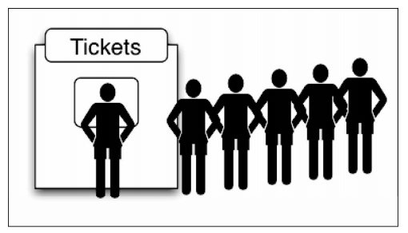
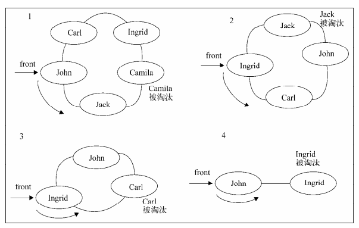

# 1. 定义
队列遵循先进先出(FIFO)的原则的一组有序的项。队列在尾部添加新元素，并在顶部移除元素。最新添加的元素必须排在队列的末尾。<br>
<br>
# 2. 队列实例
我们使用数组来存储数据，然后再为它编写一些特性的方法:<br>
- enqueue(elements): 向队列尾部添加一个(或多个)新的项
- dequeue(): 移除队列中的第一项，并返回被移除的元素
- front(): 返回队列中中的第一个元素(最先被添加的)，队列不做任何改动
- isEmpty(): 如果队列中不包含任何元素，返回true,否则返回false
- size(): 返回队列个数<br>
```javascript
function Queue() {
    var items = [];
    this.enqueue = (item) => {
        if (typeof item === 'number') {
            items.push(item);
        } else {
            items.push(...item);
        }
    };
    this.dequeue = () => (items.shift());
    this.front = () => (items[0]);
    this.isEmpty = () => (items.length === 0);
    this.clear = () => (items = []);
    this.size = () => (items.length);
}

let queue = new Queue();
queue.enqueue([1,2,3]);
console.log(queue.dequeue());
console.log(queue.size());
console.log(queue.isEmpty());
console.log(queue.clear());
console.log(queue.size(), queue.isEmpty());
```
Queue类和Stack类非常类似。唯一的区别是dequeue方法和front方法，这是由于先进先出和后进先出原则的不同所造成的。

# 3. 优先队列
优先队列条件要求如下:<br>
- 同等优先级，维持先进先出
- 不同优先级，1=>6 (或更大)， 数字越小，优先级越高 => 不管谁先进，在出队列时，数字越小更先出
```javascript
function Queue() {
    let items = [];
    
    // 一个包含优先级和值的item类
    function QueueElement(element, priority) {
        this.element = element;
        this.priority = priority; 
    }

    this.enqueue = (element, priority) => {
        var queueElement = new QueueElement(element, priority);
        if (!this.isEmpty()) {
            items.push(queueElement);
        } else {
            let add = false;
            for (let i = 0; i < items.length; i++) {
                if (priority < items[i].priority) {
                    add = true;
                    items.splice(i, 0, queueElement);
                    break;
                }
            }
            // add 为false，代表items中的优先级都优先于element
            if (!add) {
                items.push(queueElement)
            }
        }
    };
}
```

# 3. 循环队列(丢手绢游戏)
一群人围成一个圈， 手绢丢到谁的背后谁就淘汰。那么利用队列实现如下：<br>
- 存放队列初始化数据(7个人)
- 当`经过`某个人后面，将该人移除队列，并放到队列的最后,达到循环的作用
- 当`丢到`某一个人后面，移除队列<br>
<br>
```javascript
function PlayGames() {

    // 利用队列来存储数据
    let queue = new Queue();

    // 初始化数据
    this.setPeople = (people) => (queue.enqueue(people));

    // 每次移除的对象
    this.remove = (removeIndex) => {
        while(queue.size() > 0) {
            for ( let i = 0; i < removeIndex; i++) {
            queue.enqueue(queue.dequeue());
            }
            let eliminated = queue.dequeue();
            console.log(`${eliminated} 被移除了！`, queue.size());
        }
    };
}

var p = new PlayGames();
p.setPeople([1,2,3,4]);
p.remove(7);
```