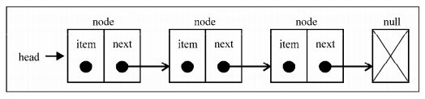
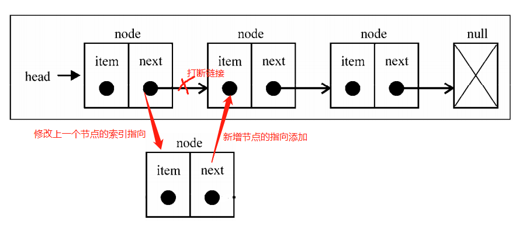
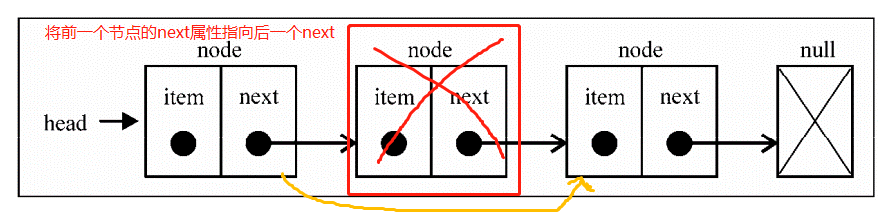
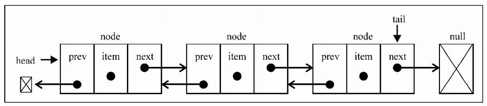
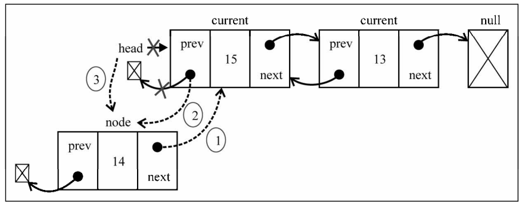
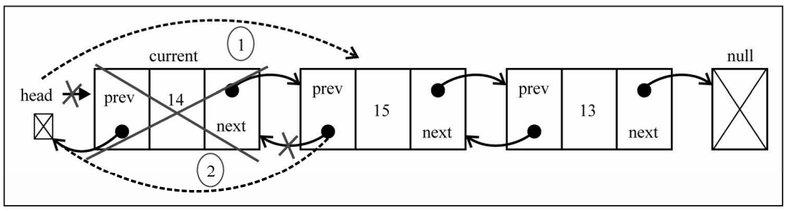
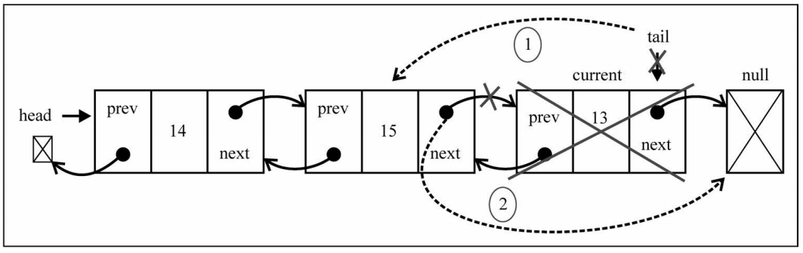
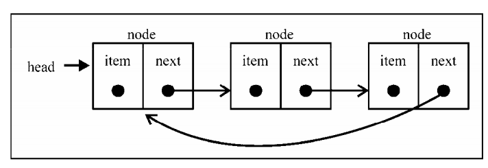
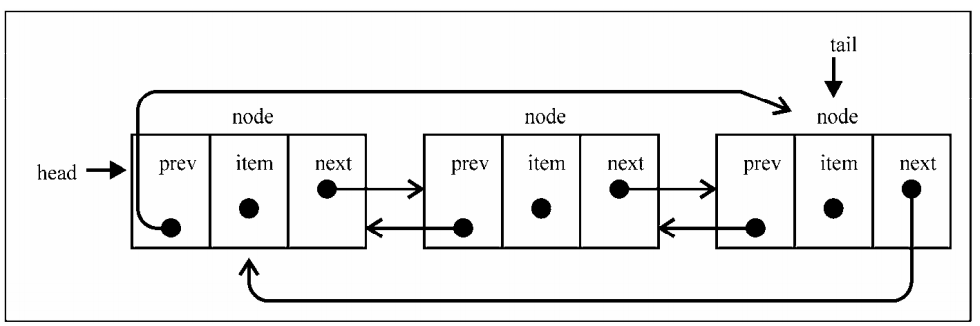

# 1. 定义
在栈和队列中，存储对象都是通过数组来实现的。但数组也有一个缺点：数组是`定长`的。如果从素组的起点或中间插入或移除数据，那么成本会很高(表面看不出来，但是实际是Array类方法在背后帮我们进行移动了)。<br>

而链表存储有序的数据结构，不同于数组，链表的元素在内存中不需要连续放置，而是将相关的两个元素a、b，通过a节点的指针指向b节点的地址来进行引用。<br>
<br>
链表好处在于新增元素，不需要移动元素，只需要将插入位置的前后元素的指针修改即可。<br>
<br>
当移除元素也是一样的，将需要移除元素的前后节点 关联起来<br>
<br>
# 2. linkList实例
链表是一个类，它包含了以下的方法属性：
- 节点node是一个单独的对象，它应该拥有自己的属性，不可缺少的是`next属性`：指向下一个节点。
- append(element): 向链表中添加node，`添加到链表的尾巴上，但可能存在链表为空的情况`
- insert(position, element): 向指定位置插入新node，`插入给定的位置，但可能存在插入位置是第一个位置`
- remove(element): 从列表中移除node
- indexOf(element): 返回node在链表中的索引，没有则返回-1
- removeAt(position): 移除特定位置的node，`移除特定位置，但可能移除的位置是头部`
- isEmpty(): 链表不包含元素，则为空
- size(): 链表的元素个数
- toString(): 重写toString()方法，让其输出你想要的值<br>
```javascript
function LinkList() {
    // 定义链表对象
    // 定义链表长度
    // 当前遍历选择的对象
    let head, length, current;
     
    // 定义Node节点类
    function Node(element, next) {
        this.element = element;
        this.next = next;
    }
    this.append = function(element) {
       
        let node = new Node(element);
        // 如果链表中还没有对象，添加的节点就是第一个
        if (!head) {
            head = node;
        } else {
            // 获取链表最尾巴上的节点
            current = head;
            while (current.next) {
                current = current.next;
            }
            // 将新增节点添加到尾巴上
            current.next = node;
        }
        // 链表长度加1
        length++;
    };

    this.insert = function(position, element) {
        // position 不能小于0，并且不能大于链表长度
        if (0 > position || position > length) {
            return false;
        }
        let node = new Node(element);
        let index = 0, previous; // 记录current对象的索引，找到需要插入的位置
        current = head;
        // 如果插入位置是第一个位置，则直接将head赋值给node.next。并将node 设置为head
        if (position === 0) {
            node.next = head;
            head = node;
        } else {
            while(index++ < position) {
                // 记录current所在位置的前一个对象
                previous = current;
                // 设置current
                current = current.next;
            }
            // previous 应当是插入node的前一个节点，current应该是被插入node的后一个节点
            previous.next = node;
            node.next = current;
        }
        length++;
        return true;
    };

    this.removeAt = function(position) {
         // position 不能小于0，并且不能大于链表长度
        if (0 > position || position > length) {
            return null;
        }
        // 如果是移除头部
        if (position === 0) {
            head = head.next;
        } else {
            // 移除中间的或者尾部
            current = head;
            let index = 0, previous;
            // 找到需要移除的位置（current）
            while (index++ < position) {
                previous = current;
                current = current.next;
            }
            // 将current的前一个node节点的next属性指向current的下一个node节点
            previous.next = current.next;
        }
        length--;
        return current.element;
    };

    this.indexOf = function(element){
        var current = head,
        index = -1;
        while (current) { 
            if (element === current.element) {
                return index;
            }
            index++;
            current = current.next; 
        }
        return -1;
    };

    this.remove = function(element){
        var index = this.indexOf(element);
        return this.removeAt(index);
    };

    this.isEmpty = function() {
        return length === 0;
    };

    this.size = function() {
        return length;
    };
    this.toString = function() {
        console.log(head)
    }
};
```

# 3. 双向链表
<br>
双向链表和单向链表的区别在于：
- 单向链表只能链向下一个节点，而双向链表中next属性链向下一个节点，prev属性链向上一个节点
- insert(position, element): 不仅要控制next，还得控制prev指针。`插入指定位置，但可能存在插入位置是第一个位置,最后一个位置`<br>
<br>
<br>
- removeAt(postion): 同单项链表一样，只是多设置一个prev指针。`移除特定位置，但可能移除的位置是头部`<br>
<br>
<br>

```javascript
function DoudlyLinkedList()  {

    // Node节点增加prev属性，指向前一个node节点
    function Node(element) {
        this.element = element;
        this.next = null;
        this.prev = null;
    }

    // 新增tail，存放链表中最后一个节点
    let length = 0, head = null, tail = null, current = null;

    this.insert = function(element, position) {
        if (position < 0 || position > length) {
            return false;
        }
        // 需要插入的节点
        let node = new Node(element);

        // 如果插入节点是头节点
        if (position === 0) {
             current = head;
            // 第一次插入，没有node
            if (!head) {
                head = node;
                tail = node;
            } else {
                // 修改原head的prev 指向新node。 新node的next 等于原head
                // 并将新node设置为head
                node.next = current;
                current.prev = node;
                head = node;
            }
            // 插入位置为尾巴
        } else if (position === length) {
            current = tail;
            current.next = node;
            node.prev = current;
            tail = node;

        // 插入位置是任意中间位置
        } else {
            let previous = head;
            current = head;
            let i = 0;
            while (i++ < position) {
                previous = current;
                current = current.next;
            }
            // previous 是需要插入位置的前一个node, current是后一个节点
            node.prev = previous; // 新增的
            node.next = current;
            previous.next = node;
            current.prev = node; // 新增
        }

        length++;
        return true;
    };

    this.removeAt = function(position) {
        if (position > length || position < 0) {
            return null;
        }

        current = head;

        // 如果移除的是第一个
        if (position === 0 ) {
            
            head = current.next;
            // 如果只有一项，那么tail 也得设置为null
            if (length === 1) {
                tail = null;
            } else {
                // 将head的prev索引设置为null
                head.prev = null;
            }

            // 移除的是末尾的元素
        } else if (position === length-1) {
            current = tail;
            tail = tail.prev;
            tail.next = null;
        } else {
            let index = 0, previous;
            while (index++ < position) {
                previous = current;
                current = current.next;
            }
            // 移除current,就是讲current前后两个节点联系在一起
            previous.next = current.next;
           current.next.prev = previous;
        }

        length--;
        return current.element;
    };

    this.toString = function() {
        console.log(head)
    }
}
```
# 4. 循环链表
循环链表 分为单项循环链表与双向循环链表。不再编写代码
- 单项循环链表： 最后一个节点`tail`的`next属性` 指向 第一个节点`head`<br>

<br>

- 双向循环链表：最后一个节点`tail`的`next属性`指向第一个节点`head`。第一个节点`head`的`prev`属性指向最后一个节点`tail`。<br>
<br>
