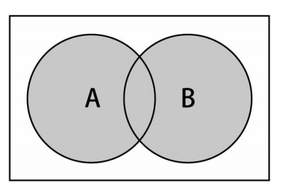
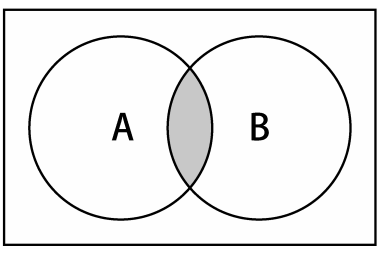
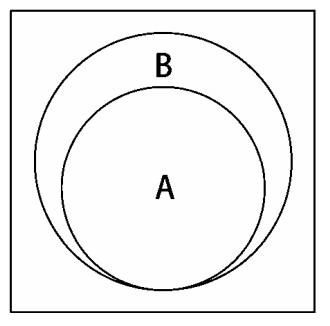

# 1. 定义
集合是一组`无序`且`唯一`(即不能重复)的项组成。使用`[值，值]`的形式存储数据。存储不重复的值。

# 2. Set实例
Es6中，已经有了Set类型。这里我们自己实现Set类。<br>
- Set类中数据存储，不再是使用数组，而是使用`对象`
- add(value): 新增项
- remove(value): 移除集合中的一个值
- has(value): 集合中是否存在该值，true存在，false不存在
- clear(): 清除所有项
- size(): 集合包含元素个数
- values(): 返回一个包含集合中所有值的数组<br>
```javascript
function Set() {
    // 使用对象保存数据
    let items = {};
    let size = 0;
    this.has = (item) => ( item in items); // items.hasOwnProperty(item)

    //  添加成功返回true,已存在不进行添加直接返回false
    this.add = (item) => {
        if (!this.has(item)) {
            items[item] = item;
            size++;
            return true;
        }
        return false;
    };

    // 移除成功返回true
    this.remove = (item) => {
        if (this.has(item)) {
            delete items[item];
            size--;
            return true;
        }
        return false;
    };

    // 清空集合
    this.clear = () => (items = {});

    // 返回集合长度
    this.size = () => (size);
    
    // 获取所有的value值，作为一个数组返回，这里的key和value是相同的
    this.values = () => {
        let ret = [];
        for (let key in items) {
            ret.push(key);
        }
        return ret;
    }
}

var set = new Set();
set.add(1);
console.log(set.values()); //输出["1"]
console.log(set.has(1)); //输出true
console.log(set.size()); //输出1
set.add(2);
console.log(set.values()); //输出["1", "2"]
console.log(set.has(2)); //true
console.log(set.size()); //2
set.remove(1);
console.log(set.values()); //输出["2"]
set.remove(2);
console.log(set.values()); //输出[]
```
# 3. 集合操作
对集合进行如下操作：<br>
- 并集：给定两个集合，返回一个包含两个集合中的`所有`元素的新集合<br>
<br>
- 交集：给定两个结合，返回一个包含两个集合中的`共有`元素的新集合<br>
<br>
- 差集：给定两个集合，返回一个包含所有`存在于第一个集合`且`不存在于第二个集合`的元素的新集合。<br>
<br>
- 子集：验证一个给定集合是否是另一个集合的子集<br>
<br>
```javascript
function Set() {
    // .....: 上面的实现

    // 并集
    this.union = (otherSet) => {
        let unionSet = new Set();
        let values = this.values();
        values.map((value) => {unionSet.add(value)});
        values = otherSet.values();
        values.map((value) => {unionSet.add(value)});
        return unionSet;
    };

    // 交集
    this.intersection = (otherSet) => {
        let intersectionSet = [];
        otherSet.values().map((item) => {
            console.log(this.has(item), '0---', item)
            if (this.has(item)) {
                intersectionSet.push(item);
            };
        });
        return intersectionSet;
    };

    // 差集
    this.difference = (otherSet) => {
        let diffSet = [];
        this.values().map((item) => {
            if (otherSet.has(item)) {
                return;
            }
            diffSet.push(item);
        });
        return diffSet;
    };

    //  子集合
    this.subSet = (otherSet) => {
        if (this.size() > otherSet.size()){
            return false;
        } else {
        var values = this.values();
        for (var i=0; i<values.length; i++){
            if (!otherSet.has(values[i])){
                return false;
                }
        }
        return true;
        }
    }
}
```