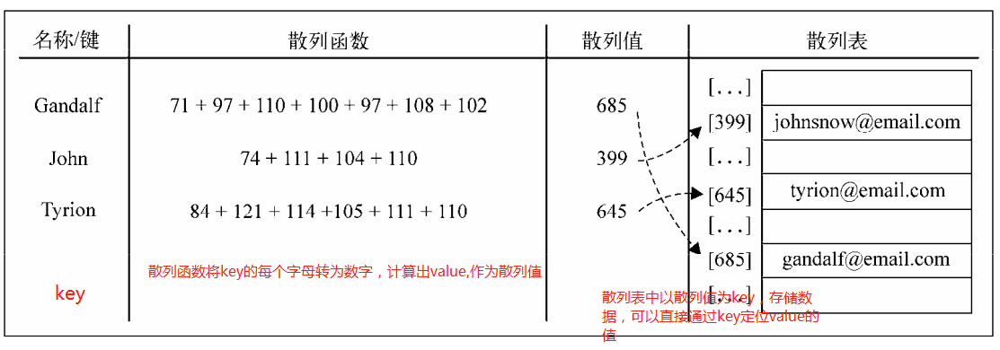
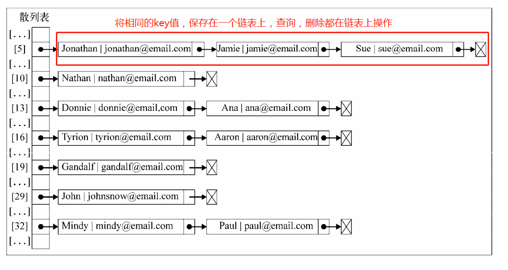
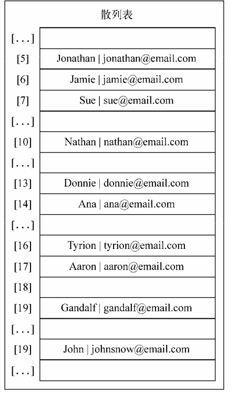

# 1. 定义
字典：使用`[键，值]`的形式存储数据。存储不重复的值。字典也称作`映射`。<br>

# 2. 字典实例（Map）
在Es6中，已经包含了一个Map类的实现，也就是所说的字典。这里是自己实现一个Map类。<br>
- 使用一个Object实例，而不是数组来存储元素
- set(key, value): 像字典中添加元素
- remove(key): 通过键值一处键值对应的数据值
- has(key): 是否包含该key，存在返回true,否则返回false
- get(key): 根据键，获取对于的值并返回
- clear(): 将字典中的元素全部删除
- size(): 获取字典元素数量
- keys(): 将字典包含的所有键以数组的形式返回
- values(): 将字典包含的所有值以数组的形式返回<br>
```javascript
function Map() {
    let items = {};
    
    // 是否存在key
    this.has = (key) => (key in items);

    // 添加或更新：key,value
    this.set = (key, value) => {
        items[key] = value;
    };

    // 删除值
    this.remove =(key) => {
        if (this.has(key))  {
            delete items[key];
            return true;
        }
        return false;
    };

    // 获取值
    this.get = (key) => {
        return this.has(key) ? items[key] : undefined;
    };

    // 清除所有
    this.clear = () => {
        items = {};
    }

    // size(): 获取字典元素数量
    this.size = () => {
        let length = 0;
        for(let item in items) {
            if (items.hasOwnProperty(item)) {
                length++;
            }
        }
        return length;
    };

    // 将字典包含的所有键以数组的形式返回
    this.keys = () => {
        let ret = [];
        for(let item in items) {
            if (items.hasOwnProperty(item)) {
                ret.push(item);
            }
        }
        return ret;
    }

    // 将字典包含的所有值以数组的形式返回
     this.values = () => {
        let ret = [];
        for(let item in items) {
            if (items.hasOwnProperty(item)) {
                ret.push(items[item]);
            }
        }
        return ret;
    }
} 
```
# 3. HashMap 定义
HashMap 也是一种Dictionary类的一种散列表实现方式。<br>
散列算法: 是为了尽可能快地在数据结构中找到一个值。<br>
# 3.1 散列函数
使用散列函数，可以知道值的具体位置，能够快速地检索到该值，散列函数的作用是:给定一个键值，然后返回值在表中的地址。<br>
我们有一组数据,某个人的邮箱地址:<br>
```javascript
{
    Gandalf: 'gandalf@email.com',
    John: 'johnsnow@emal.com',
    Tyrion: 'tyrion@email.com'
}
```
- 我们使用散列函数，将每个键中的字母相加，计算出`散列值`(可以想象为地址索引)<br>
- 在散列表中：以散列值为存储索引，并存储相应的value。那么我们在通过key进行查询value时，就不再需要一个一个循环，而直接根据散列值获取。<br>
<br>
# 4. 散列表实例
和之前一样，我们需要准备数据存储对象，添加相应的方法:<br>
- 我们将使用数组来表示数据结构。
- getHashCodeKey(key): 根据key生成散列表的key。该方法不会暴露到外部
- put(key, value): 向散列表增加一个新的项
- remove(key): 根据键从散列表中移除值
- get(key): 返回根据键值检索的特定的值<br>
```javascript
function HashTable() {
    // 使用数组保存数据
    let table = [];

    // 根据key生成散列表的key
    function getHashCodeKey(key) {
        let hash = 0;
        for (let i = 0; i < key.length; i++) {
            hash += key.charCodeAt(i);
        }
        return hash % 37;
    }

    // 添加散列数据
    this.put = (key, value) => {
        let position = getHashCodeKey(key);
        console.log(position + ' - ' + key);
        table[position] = value;
    };

    // 获取数据
    this.get = function (key) {
        return table[getHashCodeKey(key)];
    };

    // 移除
    this.remove = function(key) {
        table[getHashCodeKey(key)] = undefined;
    };
}
```
# 5. 散列集合
散列集合是由一个集合构成，但是插入、移除、获取元素时，使用的是散列函数。我们可以重用上面所有的代码，区别在于：我们添加的key值就是插入的值：[value转化为key, value]。和集合相似，散列集合之存储`唯一不重复`的值。<br>

# 6. 散列表冲突
按照上面的顺序，会出现相同key的情况，不同的值在散列表中对应相同位置的时候表示冲突了。解决该问题可用以下方法：<br>
- 分离链接（需要重写get,remove,put方法）:<br>
<br>
```javascript
function HashTable() {
    let items = [];

    // 链表每一个对象对应的item类
    function ValuePair(key, value) {
        this.key = key;
        this.value = value;
        this.toString = () => {
            console.log(`[${this.key} - ${this.value}]`)
        };
    }

    this.put = (key, value) => {
        let position = getHashCodeKey(key);
        if (table[position] === undefined) {
            table[position] = new LinkedList();
        }
        table[position].append(new ValuePair(key, value));
    };

    this.get = function(key) {
        var position = getHashCodeKey(key);
        if (table[position] !== undefined){ 
            //遍历链表来寻找键/值
            var current = table[position].getHead();
            while(current.next){ 
                if (current.element.key === key){ 
                    return current.element.value; 
                }
                current = current.next; 
                }
                //检查元素在链表第一个或最后一个节点的情况
                if (current.element.key === key){ 
                    return current.element.value;
                }
            }
        return undefined; 
    };
    this.remove = function(key){
        var position = getHashCodeKey(key);
        // 如果位置为空，那么不存在该元素，返回false
        if (table[position] !== undefined){
            // 获取该位置的链表的head
            var current = table[position].getHead();
            // 链表有不只一个item, 通过循环遍历查找后进行移除
            while(current.next){
                if (current.element.key === key){
                    table[position].remove(current.element);
                    // 删除后，如果链表长度为0，则从散列表中移除该key
                    if (table[position].isEmpty()){
                        table[position] = undefined;
                    }
                    return true; 
                }
                current = current.next;
            }
            // 链表只有一个item: 检查是否为第一个或最后一个元素
            if (current.element.key === key){ 
                table[position].remove(current.element);
                if (table[position].isEmpty()){
                    table[position] = undefined;
                }
                return true;
            }
            }
        return false; 
    };
}
```
- 线性探查（需要重写get,remove,put方法）<br>
当想向表中某个位置加入一个新元素的时候，如果索引为index的位置已经被占据了，就尝试index+1的位置。如果index+1的位置也被占据了，就尝试index+2的位置，以此类推。<br>
<br>

# 7. 创建更好的散列函数
上面的散列函数会产太多的冲突，应该尽量避免冲突。
```javascript
var djb2HashCode = function (key) {
    // 初始化一个hash值，并赋值为一个质数
    var hash = 5381; 
    // 迭代key，将hash与33相乘，并和当前迭代到的字符的ASCII码值相加
    for (var i = 0; i < key.length; i++) {
        hash = hash * 33 + key.charCodeAt(i);
    }
    // 最后将hash与另一个随机质数相除的余数
    return hash % 1013; 
    };
```