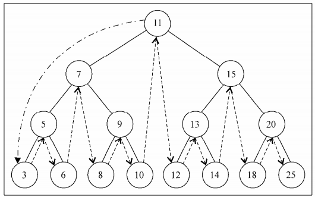

# 1. 树的定义
什么是树？最常见的树就是`家谱`或`公司组织架构`。<br>
<br>
- 一个树结构，包含一系列存在`父子关系`的节点。除了顶层(0层：第一个节点)都有父节点。<br>
- 顶层元素：叫做`根节点`(11)
- 每个元素：叫做`节点`
- `至少`有一个子节点的元素：叫做`内部节点`
- `没有`子元素节点：叫做`外部节点`或`叶节点`
- 由节点和它的子元素构成：叫做`子树`。
- 节点有一个属性: `深度`(由它的祖先节点数量确定)。比如3的深度是3(祖先节点有三个：11,7,8)
- 树的`高度`： 取决于所有节点深度的最大值。<br>
<br>

# 2. 二叉树/二叉搜索树
二叉树中的节点最多只能有`两个`子节点：一个是`左侧子节点`，一个是`右侧子节点`。这些定义有助于我们写出更高效的从树中插入、删除、查找节点的方法。<br>

二叉搜索树(BST[Binary Search Tree])。但是它只允许`左侧节点`存储`小`比父节点的值。在`右侧节点`存储比父节点`大`的值。上图则是二叉搜索树的存储方式。<br>

# 3. 二叉搜索树实例
<br>

如图在树的结构中，有指向左节点的指针，有指向右节点的指针。同LinkedList一样，我们会声明一个变量，来控制此数据结构第一个节点(根节点)。<br>
还有一点：以前链表中，我们将一个节点称之为节点或项， 在这里我们将其称为`键`。<br>
- insert(key): 想树中插入一个新的键。分为`root未空节点`和`root为非空`。
- search(key): 在树中查找一个键，存在返回true,不存在返回false
- inOrderTraverse: `中序遍历`方式(从`最小`到`最大`的顺序访问所有节点，先左，再本身，再右），中序遍历的一种应用是一种对树的排序操作。<br>
<br>
- preOrderTraverse: `先序遍历`方式(`优先于后代`节点的顺序访问每个节点，先本身，后左，再右),先序遍历的一种应用是打印树的结构。<br>
<br>
- postOrderTraverse: `后序遍历`方式(先访问节点的后代节点，再访问节点本身=> 先左，后右，在本身),后续遍历的一种应用是计算一个目录和它的子目录中所有文件所占空间的大小<br>
<br>
- min: 返回树中`最小`的键。
- max: 返回树中`最大`的键。<br>
<br>
- remove(key): 从树中移除某个键 <br>
<br>
<br>
<br>
```javascript
function BinarySearchTree() {
    // 节点类
    function Node(key) {
        this.key = key;
        this.left = null;
        this.right = null;
    }

    // root 根节点： 存放顶层节点
    let root = null;

    // 插入节点
    // 1. 创建新节点Node实例
    // 2. 实例是树中第一个节点：直接赋值给 root 对象
    // 3. 实例是非根节点位置： 使用辅助函数 insertNode 来帮助插入
    this.insert =  (key) => {
        let node = new Node(key);
        if (!root) {
            root = node;
        } else {
            insertNode(root, node);
        }
    };

    // 辅助函数 insertNode
    // 1. 树非空，需要查找到新节点的位置。因此需要传入树的 根节点 和 插入的新节点
    // 2. 新节点的键 < 当前节点的键(当前节点就是根节点)，检查当前节点左节点是否为空，为空则插入新节点。如果有左侧子节点，则递归调用insertNode，继续找树的下一层，下一次比较的将会是当前节点的左侧子节点
    // 3. 新节点 > 当前节点，当前节点右侧节点为空，则插入到右侧节点，不为空，继续递归调用insertNode方法，下一次要比较的节点是右侧子节点
    let insertNode = (node, newNode) => {
        if (newNode.key < node.key) {
            // 如果current node 节点没有左节点，直接将newNode赋值
            if (!node.left) {
                node.left = newNode;
            } else {
                // 递归处理新node和node.left
                insertNode(node.left, newNode);
            }
        } else {
            if (!node.right) {
                node.right = newNode;
            } else {
                insertNode(node.right, newNode);
            }
        }
    };

    // 从最小到最大的访问顺序，通过内部方法 inOrderTraverseNode 实现
    this.inOrderTraverse = (callback) => {
        inOrderTraverseNode(root, callback);
    };

    // 如果node不为空
    // 1. 先递归node的左侧节点，深度递归下去，会从最小的值执行
    // 2. 调用callback值
    // 3. 再递归处理node的右侧节点
    let inOrderTraverseNode = (node, callback) => {
        if (node) {
            inOrderTraverseNode(node.left, callback);
            callback(node.key);
            inOrderTraverseNode(node.right, callback);
        }
    };

    // 先序遍历
    this.preOrderTraverse = (callback) => {
        preOrderTraverseNode(root, callback);
    };
    let preOrderTraverseNode = (node, callback) => {
        // 先打印节点，再递归处理左节点，递归处理右节点
        if (node) {
            callback(node.key);
            preOrderTraverseNode(node.left, callback);
            preOrderTraverseNode(node.right, callback);
        }
    };

    // 后续遍历
    this.postOrderTraverse = (callback) => {
        postOrderTraverseNode(root, callback);
    };
    let postOrderTraverseNode = (node, callback) => {
        // 先左，再后，再自身
        if (node) {
            postOrderTraverseNode(node.left, callback);
            postOrderTraverseNode(node.right, callback);
            callback(node.key);
        }
    };

    // 最小值
    this.min = () => {
    return findMinNode(root).key;        
    };
    let findMinNode = (node) => {
        if (node) {
            while(node && node.left) {  
                node = node.left;
            };
            return node;
        } else {
            return null;
        }
    }
    // 最大值
    this.max = () => {
        let node = root;
        if (node) {
            while(node && node.right) {
                node = node.right;
            }
            return node.key;
        } else {
            return null;
        }
    };

    // 搜索指定值
    this.search = (key) => {
        return searchNode(root, key);
    };
    let searchNode = (node, key) => {
        if (node === null) {
            return false;
        }
        // 查询的key大于当前key,则从右边查询
        if (node.key < key) {
            return searchNode(node.right, key);
        } else if (node.key > key) {
            return searchNode(node.left, key);
        } else {
            return true;
        }
    };

    // 移除节点
    this.remove = (key) => {
        root = removeNode(root, key);
    };
    let removeNode = (node, key) => {
        if (node === null) {
            return null
        }
        // 每一次对比，都会将处理完后的node返回，方便将更新后的node赋值到父节点的指针上（也可以将父节点传入，在内部进行赋值）
       if (key < node.key) {
           node.left = removeNode(node.left, key);
           return node;
       } else if (key > node.key) {
           node.right = removeNode(node.right, key);
           return node;
       } else {
           // 当key相等时，分为三种情况（currentNode）
           // 1. 叶子节点，无任何子节点，需要将currentNode移除【设置为null,并返回】
           if (node.left === null && node.right === null) {
               node = null;
               return node;
           }
           // 2. 节点只有一个子节点【左节点或右节点】，将父节点指向 curretNode的left（左节点存在指向左节点） / right（右节点存在指向右节点）
           if (node.left === null) {
               node = node.right;
               return node;
           } else if (node.right === null) {
               node = node.left;
               return node;
           }
           // 3. curretNode节点存在两个节点
             // 3-1. 查找node.right 最小的节点
             // 3-2. 将最小节点赋值给currentNode
             // 3-3. 移除之前的currentNode(将修改后返回,currentNode的父节点的指向会重新指向修改后的currentNode )
           let aux = findMinNode(node.right);
           // 将最小值更改到currentNode
           node.key = aux.key;
           // 从node.right中移除掉最小值（因为已经复制了被删除的node中）
           node.right = removeNode(node.right, aux.key);
           // 返回最新的node
           return node;
       }
    }
}
``` 
想要插入出上面途中的树来，可以通过下面的插入方式:<br>
```javascript
let tree = new BinarySearchTree();
// 创建顶层root节点
tree.insert(11);
// 存放root节点left
tree.insert(7);
// 存放root节点right
tree.insert(15);
// 第一次11比较，第二次7比较，存放7的left
tree.insert(5);
// 第一次11比较，第二次7比较，第三次5比较，存放5的left
tree.insert(3);
// 第一次11比较，第二次7比较，第三次5比较，存放5的right
tree.insert(6);
// 第一次11比较，第二次7比较，存放7的 right
tree.insert(9);
// 第一次11比较，第二次7比较，第三次9比较，存放9的 left
tree.insert(8);
// 第一次11比较，第二次7比较，第三次9比较，存放9的 right
tree.insert(10);
// 第一次11比较，第二次15比较，存放15的left
tree.insert(13);
// 第一次11比较，第二次15比较，第三次13比较，存放13的left
tree.insert(12);
// 第一次11比较，第二次15比较，第三次13比较，存放13的right
tree.insert(14);
// 第一次11比较，第二次15比较，存放15的right
tree.insert(20);
// 第一次11比较，第二次15比较，第三次20比较，存放20的left
tree.insert(18);
// 第一次11比较，第二次15比较，第三次20比较，存放20的right
tree.insert(25);


function printNode(value){
console.log(value);
}


// 中序遍历
tree.inOrderTraverse(printNode);

// 先序遍历
tree.preOrderTraverse(printNode);

// 后续遍历
tree.postOrderTraverse(printNode);

console.log(tree.min());
console.log(tree.max());
console.log(tree.search(15));

// 移除节点
// 移除不带子节点的节点
tree.remove(6);
tree.inOrderTraverse(printNode);
// 移除带有一个子节点的节点
tree.remove(5);
tree.inOrderTraverse(printNode);
// 移除带有2个子节点的节点
tree.remove(15);
tree.inOrderTraverse(printNode);
```

# 4 红黑树
# 5 堆积树
# 6. AVL树