# 1. 定义
图是`网络结构`的抽象模型，是一组由`边`链接的`节点`(或定点)。<br>
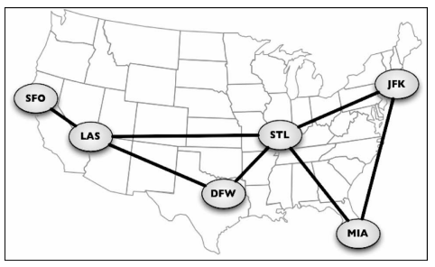<br>

## 1.1 图的表示
一个图 G = (V, E)由以下元素组成。下图表示一个`图`<br>
- V: 一组定点
- E: 一组边，连接V中的定点<br>
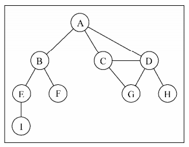<br>

## 1.2 图的术语
下面我们先熟悉一下`图`的术语：<br>
- 由一条`边`链接在一起的`顶点`,称为`相邻节点`。上图中 `A`和`B`是相邻节点，`A`和`D`是相邻节点。
- 一个定点的`度`是其`相邻节点`的`数量`。 上图中`A`的`度`是`3`。=>【有向图才会有入度和出度】
- `路径`是顶点`v1,v2,v3...vk`的一个连续序列。其中`vi`和`vi+1`是相邻的。上图中包含有`ABEI,ABF,ACGDH,ACDG,ACDH,ADG,ADH`,这些都是简单路径
- `简单路径`：不包含重复的定点。例如：`ADG`是一条简单路径。`环`除去最后一个节点，也是一个简单路径。例如`ADCA`（除去最后一个顶点只剩ADC)。

## 1.3 有向图 / 无向图
图分为`无向图`(边没有方向)和`有向图`(边有方向)。上面的图是`无向图`。下图是`有向图`:<br>
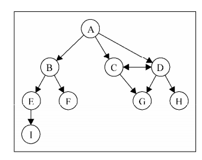<br>

不对称矩阵是有向图<br>

如果图中每两个顶点间在`双向`都存在路径，则该图为`强联通`的。例如下图：`A`和`C`不是强联通，而`C`和`D`是强联通的。<br>
图还可以使`加权`或`未加权`的。`加权图`的边被赋予了权值。下图是为加权的。<br>
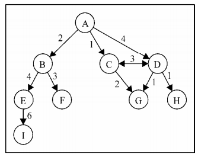<br>

# 2. 图的表示
图的正确表示法取决于待解决的问题和图的类型。<br>

## 2.1 邻接矩阵
图最常见的实现是`邻接矩阵`。<br>
- 通过`二维数组`来表示`顶点`之间的`关系`
- 每个`节点` 和 一个`整数`相关，该整数作为数组的`索引`
- 索引为`i`的节点 和索引为`j`的节点相邻，则`array[i][j] === 1`，不相邻时`array[i][j] === 0`<br>

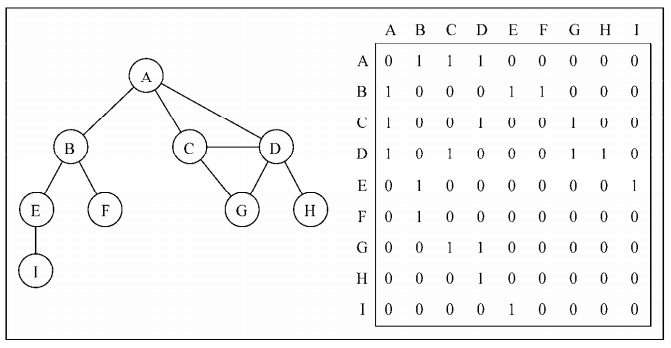<br>

特性：<br>
- 不是`强联通的图` （稀疏图）使用邻接矩阵表示，矩阵中存储了很多`0`。`浪费`了计算机`存储空间`来存储不存在的边。
- 图的定点的数量可能会改变，二维数组不太灵活
- 查询具体`两个顶点`是否是`相邻节点`，比较`快`
- 查询某个顶点的`所有相邻节点`，比较`慢`

## 2.2 邻接表
我们可以使用一种叫`邻接表`的动态数据结构表示图。`领接表`由图的每个`顶点`的`相邻顶点的列表`所组成。`相邻顶点的列表`数据结构可以通过`列表(数组)`、`链表`、`字典`、`散列表`来表示。<br>
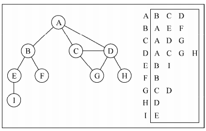<br>

特性：<br>
- 查询具体`两个顶点`是否是`相邻节点`，比较`慢`，需要获取所有相邻节点列表，再查询具体顶点
- 查询某个顶点的`所有相邻节点`，比较`快`，直接获取列表

```javascript
function Graph() {
    // 使用数组存放所有顶点
    let vertices = [];
    // 使用字典存放 相邻顶点 的列表
    let adjList = new Map(); // 这里使用ES6的Map，也就是之前的字典类型数据

    // 用于初始化一个顶点：该顶点需要添加到vertices中，并在adjList中创建一个保存相邻节点的数据
    this.addVertex = (v) => {
        vertices.push(v);
        adjList.set(v, []);
    };

    // 实现添加两个顶点之间的路径(互相添加，表示无向图, 只添加一个顶点，则表示有向图)
    this.addEdge =(v, w) => {
        adjList.get(v).push(w);
        // 有向图：不需要这条设置
        adjList.get(w).push(v);
    };

    this.toString = function(){
        var s = '';
        for (var i=0; i<vertices.length; i++){ //{10}
            s += vertices[i] + ' -> ';
            var neighbors = adjList.get(vertices[i]); //{11}
            for (var j=0; j<neighbors.length; j++){ //{12}
                s += neighbors[j] + ' ';
            }
                s += '\n'; //{13}
            }
        return s;
    };
}

// 测试
var graph = new Graph();
var myVertices = ['A','B','C','D','E','F','G','H','I']; //{7}
for (var i=0; i<myVertices.length; i++){ //{8}
graph.addVertex(myVertices[i]);
}
graph.addEdge('A', 'B'); //{9}
graph.addEdge('A', 'C');
graph.addEdge('A', 'D');
graph.addEdge('C', 'D');
graph.addEdge('C', 'G');
graph.addEdge('D', 'G');
graph.addEdge('D', 'H');
graph.addEdge('B', 'E');
graph.addEdge('B', 'F');
graph.addEdge('E', 'I');

console.log(graph.toString);
```
结果：<br>
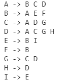<br>
## 2.3 关联矩阵
关联矩阵： 矩阵的`行`表示`顶点`，矩阵的`列`表示`边`。我们使用二维数组来表示`顶点`与`边`的连通性。<br>
如果`v 顶点`是`边 e` 的入射点(任意一个连接的定点)，则`array[v][e] === 1`,否则`array[v][e] === 0`。<br>
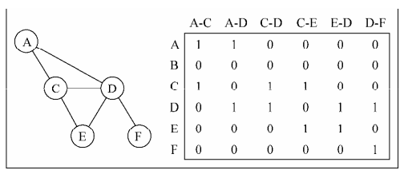<br>
关联矩阵通常用于`边的数量`比`顶点多`的情况下，以`节省空间和内存`。<br>

# 3. 图的遍历
图的遍历方式有两种：`深度优先`(Breadth-First Search,BFS)和`广度优先`(Depth-First Search,DFS)。<br>
图的用途：寻找特定的顶点、寻找两个顶点之间的路径、检查图是否联通、检查图是否含有环等等。<br>
图遍历算法思想： 
- 必须追踪`每个第一次`访问的节点，并且追踪哪些节点没有被`完全探索`
- 两种算法需要明确指出`第一个`被访问的顶点<br>

完全探索一个顶点：要求我们查看该顶点的每一条边，对于每一条边连接而未被访问的顶点，标注为`发现`并添加进`待访问`顶点列表<br>
为保准效率：每个顶点务必访问至多`两次`。连通图中每条边和顶点都会被访问到<br>
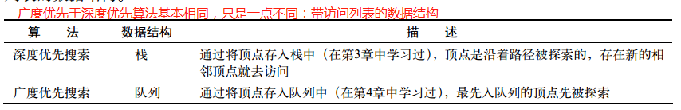<br>

当标注已访问的顶点时，使用三种颜色反应它们的状态，这也是为什么上面说一个顶点务必最多访问2次的原因：
- 白色： 表示该顶点 未被访问
- 灰色： 表示该顶点 被访问但未被探索过
- 黑色： 表示该顶点 被访问且被探索过<br>

## 3.1 广度优先(Breadth-First-Search, BFS)
从上面可以知道：从顶点v开始广度优先的步骤如下：
1. 创建一个队列Q: 用于存放`被访问，未被探索【灰色】`的顶点
1. 从顶点v开始，将v设置为`灰色`，存放如Q
1. 如果Q为非空【处理队列数据】：
    - 将w从Q队列中中取出
    - 将w的所有相邻节点（白色）标记为`灰色`，放入Q队列
    - 将w标记为黑色<br>

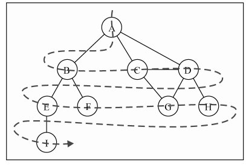<br>
```javascript
// --- 该部分代码 直接复制到Graph中

// 将所有的顶点颜色初始化为白色
let initializeColor = () => {
    // 存储所有带颜色的顶点
    let colors = [];
    vertices.map(vertice => {
        colors[vertice] = 'white';
    })
    return colors;
};

// BFS
this.bfs = (v, callback) => {
    // 存放所有访问但未被探索过的节点
    let queue = new Queue();
    let colors = initializeColor();
    queue.enqueue(v);

    // 循环处理所有顶点
    while(!queue.isEmpty()) {
        let u = queue.dequeue();
        colors[u] = 'grey';
        let neighbors = adjList.get(u);
        neighbors.map(w => {
            if (colors[w] === 'white') {
                colors[w] = 'grey';
                queue.enqueue(w);
            }
        });
        colors[u] = 'black';
        if (callback) {
            callback(u);
        }
    }
}


// --- 测试遍历
function printNode(value){ //{16}
console.log('Visited vertex: ' + value); //{1
}
graph.bfs(myVertices[0], printNode); //{18}
```

## 3.2 通过 BFS 计算最短路径
通过上面的遍历，我们可以通过小的改造，添加两个属性来记录 传入节点`v[被计算的开始节点]` 和 任意其他节点`w[任意其他节点]`之间的距离。
- distance[w]: 存放v节点到w节点的距离。 初始化distance[w] = 0
- predecessors[w]: 存放w节点的前辈。 初始化predecessor[w] = null<br>

```javascript
this.bfs = (v) => {
    console.log(this.toString())
    let colors = {},  // 初始化颜色，后续变化中：未被访问 白色，访问未被探索 grey, 被探索 black
        distance = {}, // 初始化每个顶点离v的距离
        predecessors = {}, // 初始化每个顶点的前辈顶点
        queue = new Queue(); // 存放待探索的节点
    
    
    let init = () => {
        vertices.map(w => {
            colors[w] = 'white';
            distance[w] = 0;
            predecessors[w] = null;
        });
    };

    // 需要被探索的v
    queue.enqueue(v);
    init();

    while(!queue.isEmpty()) {
        let u = queue.dequeue();
        colors[u] = 'grey';
        let neighbors = adjList.get(u); 
        neighbors.map(w => {
            if (colors[w] === 'white') {
                queue.enqueue(w);
                distance[w] = distance[u] + 1; // v => w 的具体，通过前辈节点+1
                predecessors[w] = u; // 添加组件节点
            }
            colors[w] = 'grey';
        });
        colors[u] = 'black';
    }

    return {
        distance,
        predecessors
    };
}
}

// 获取所有的定点的最短路径的所经过的点
this.getRoutes = (v) => {
    // 根据bfs获取 图中各个祖先节点的关系
    let { predecessors } = this.bfs(v);
    // 存放所有最短路径 
    let allRoute = {};

    vertices.map((w) => {
        // 除去顶点自己，不需要计算 自己到自己的轨迹
        if (w != v) {
            // 存放当前 v -> w 的路径
            let route = [w], item = w;

            // 从 predecessors 中获取祖先节点，直到最顶层祖先节点为v,表示v -> w的路径统计完毕
            while (item != v) {
                // 获取自己的祖先顶点
                let preW = predecessors[item];
                route.push(preW);
                item = preW;
            }
            allRoute[w] = route.reverse().join('-');
        }
    });
    return allRoute;
}
```
按照这种算法：例如查找A -> D 的距离：看起来有两种， AD, ACD。 但是在遍历A的邻接点时，D已被探索过，因此当探索C顶点时，C的D邻接点为黑色，表明已经先到达了D顶点，因此不再探索。最终结果为AD路径。<br>
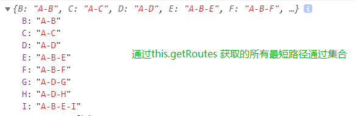<br>
## 3.3 DFS 深度优先
深度优先搜索算法：将会从第一个指定的顶点开始遍历图，沿着`路`径`直到`这条路径的`最后`一个`顶点`被`访问`，按着原路返回并探索下一条路径。<br>
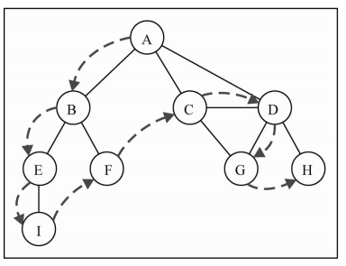<br>
访问途中的v顶点的步骤如下：<br>
- 所有顶点，初始化颜色为`white`
- 开始访问v顶点，标记`v`顶点为`grey`。此时记录`顶点v`的`发现时间`
- 访问`v`所有未被访问的`邻接点w`
    1. 访问`w`,此时记录`w`的`前溯点`
- `v`被探索完毕，标记`v`为黑色。 此时记录`顶点v`的`完成探索时间`
```javascript
// --- 该部分代码 直接复制到Graph中

this.dfs =() => {
    let colors = {}, // 初始化所有节点颜色： key：顶点， value: grey, white, black
    d = [], // 记录 发现时间 集合
    f = [], // 记录 完成探索时间 集合
    p = {}, // 记录 前溯点 
    time = 0; // 计时开始时间
    // 初始化颜色
    let init = () => {
        vertices.map(w => {
            colors[w] = 'white';
        });
    };

    // 访问处理
    let dfsVisit = (u) => {

        // 当被访问，修改为grey,表示开始访问，但邻接点未访问完毕
        colors[u] = 'grey';

        // 记录u的开始时间
        d[u] = ++time;
         console.log('discovered ' + u);

        // 当邻接点访问完毕，自己才算完成
        let neighbors = adjList.get(u);
        neighbors.map(w => {
            if (colors[w] === 'white') {
                dfsVisit(w);
                // 记录w的前溯点
                p[w] = u;
            }
        });
        // 自己访问完毕，修改为black
        colors[u] = 'black';
        // 记录u的完成时间
        f[u] = ++time;
        console.log('explored ' + u);
    };

    init();
    vertices.map(w => {
        if (colors[w] === 'white') {
            dfsVisit(w);
        }
    })
    return {
        discovery: d,
        finished: f,
        predecessors: p
    };
}
```
访问路径:<br>
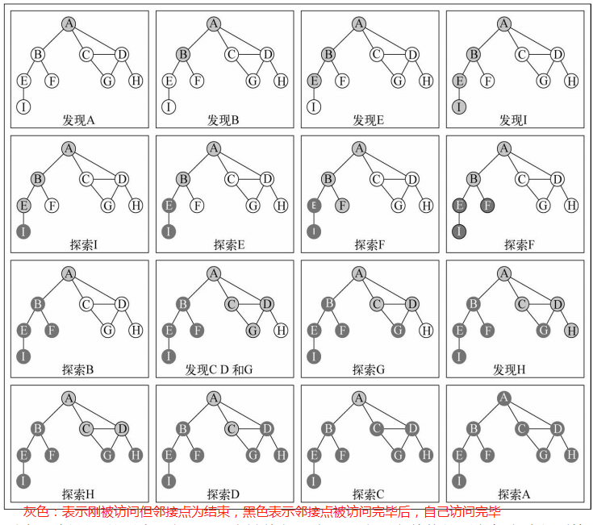<br>
深度搜索结果：<br>
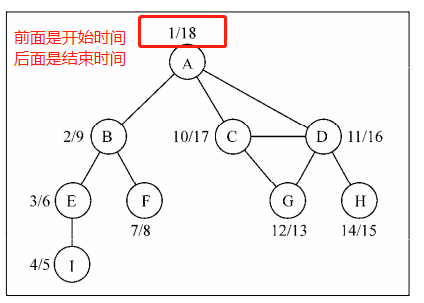<br>
