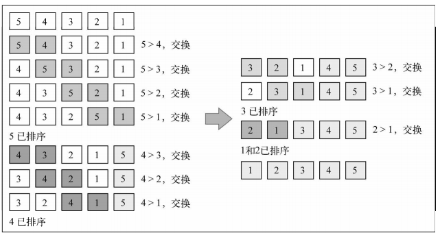
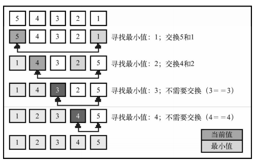
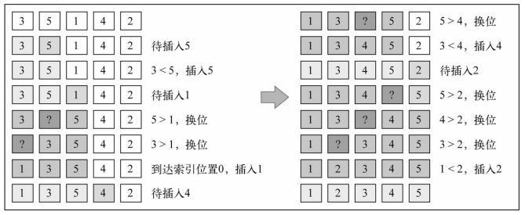
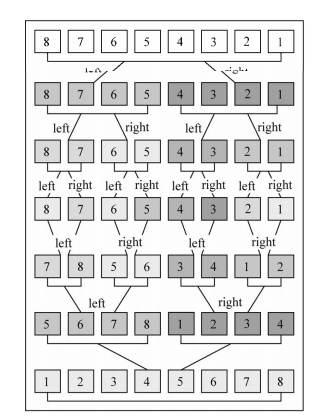

# 1. 排序算法
排序算法就是讲一组杂乱无章的数据，按照`从小到大`或`从大到小`的方式，变成一组有序的数据。首先，我们编写一个数组函数，用于产生数组和打印数组。
```javascript
function ArrayList() {
    let arr = [];

    // 插入数据
    this.insert = (item) => {
        arr.push(item);
    };

    // 打印数据
    this.toString = () => {
        return arr.join(',');
    };

    // 交换两个元素的位置
    let swap = (index1, index2) => {
        let aux = arr[index1];
        arr[index1] = arr[index2];
        arr[index2] = aux;
    }
}
```
# 2. 冒泡排序
冒泡是算法中最简单的，但是从时间上来看，是`最慢`的。<br>

什么是冒泡排序？<br>
- 冒泡排序就是 取出数组中的`第n个元素`a，将该元素与 其`后面所有的元素`（b）依次比较，如果 `a > b`，交换它们的位置
- 但在实际过程中，当`a`元素被放到最后，它就不应该再参与比较<br>
<br>
```javascript
this.bubbleSort = () => {
    let length = arr.length;
    for (let j = 0; j < length; j++) {
        // 因为 i 要与 i + 1 比较，因此 i <length -1; 不然会越界
        for (let i = 0; i < length - 1 - j; i++) {
            if (arr[i] > arr[i+1]) {
                swap(i, i+1);
            }
        }
    }
};
```

# 3. 选择排序
选择排序：先找到数据结构中最小的值，并将其放在第一位，接着找到数据中第二小的值，放在第二位，依次类推。<br>
<br>
```javascript
this.selectSort = () => {
    let length = arr.length, min;
    for (let i = 0; i < length; i++) {
        // 将当前位置设置为min
        min = i;
        for (let j = i; j < length; j++) {
            if (arr[min] > arr[j]) {
                min = j;
            }
        }
        if ( i !== min) {
            swap(min, i);
        }
    }
}
```
选择排序同样也是一个复杂度为O(n2)的算法。和冒泡排序一样，它包含有嵌套的两个循环，这导致了二次方的复杂度。
# 4. 插入排序
插入排序是每次排一个数组项。
- 排第一个值，就保留在第一个位置
- 排第二个值，看它放在第一个位置，还是第二个位置
- 排第三个值，看它是放在第一个位置，还是第二个位置，还是第三个位置
- ...

总结一句话：当计算`a`的正确位置，与比`a`的`索引小的值`比较，将比`a`大的值全部往后移动，腾出位置，将`a`插入
<br>
```javascript
// for 循环做法
this.insertSort = () => {
    let length = arr.length;
    for (let i = 0; i < length; i++) {
        let insertIndex = i;
        for(let j = i-1; j >=0; j--) {
            if (arr[j] > arr[insertIndex]) {
                swap(j, insertIndex);
                insertIndex = j;
            } else {
                break;
            }
        }
    }
}

// while循环
 this.insertSort = () => {
    let length = arr.length,
        j;
    for (let i = 0; i < length; i++) {
        j = i, // 会改变，用于存储当前需要对比的索引
        temp = arr[i]; // 存储需要移动的value
        while(j > 0 && arr[j-1] > temp) {
            // 将大于temp的值往后移动，给temp腾出位置
            arr[j] = arr[j-1];
            j--;
        }
        // 将temp 赋值给腾出来的位置
        arr[j] = temp;
    }
}
```
排序小型数组时，此算法比选择排序和冒泡排序性能要好。
# 5. 归并排序
归并排序是一种`分治算法`。将元是数组切分成较小的数组，直到每个小数组只有一个位置，接着将小数组归并成为较大的数组，直到最后，只有一个排序完毕的大数组。<br>
由于分治法：归并排序也是递归<br>
<br>
```javascript
let mergeSortRec = (array) => {
    let length = array.length;
    if(length === 1) { //{1}
        return array; //{2}
    }
    // 将数组分为左右两组
    let mid = Math.floor(length / 2),
    left = array.slice(0, mid),
    right = array.slice(mid, length);
    // 递归调用，将数组拆分为只有一个长度的数组，通过merge（排序）
    return merge(mergeSortRec(left), mergeSortRec(right));
}
let merge = (left, right) => {
    // 记录 left的索引，right的索引
    let iL = 0, 
    iR = 0, 
    lLength = left.length, 
    rLength = right.length;
    let result = [];
    // 如果 left或right其中某个被循环处理完毕，跳出循环
    while(iL < lLength && iR < rLength) {
        if (left[iL] < right[iR]) {
            result.push(left.shift());
            iL++;
        } else {
            result.push(right.shift());
            iR++;
        }
    }
    // 将剩下的没被处理的数据，追加到结果集中
    if (iL < left.length) {
        result.push(...left);
    }
    if (iR < right.length) {
        result.push(...right);
    }
    return result;
}
```
归并排序的性能比前三个好，是O(nlog^n)。
# 6. 快速排序
快速排序也是分治方法，将原始数组分为较小的组（但并没有像归并排序那样将它们分开）。<br>
- 找到数组中间一项 作为`主元`
- 创建`两个`指针，指向数组`第一项`和最`后一项`
- 向右移动`左指针`，直到找到元素比`主元`大的值a，停止
- 向左移动`右指针`，直到找到元素比`主元`小的值b，停止
- 交换a,b两个值，并将指针继续移动
- 当左指针 > 右指针，结束比较。将`左指针`作为下一次`主元`的索引，。

```javascript
this.quickSort = () => {
    quick(arr, 0, arr.length - 1);
};

//  排序arr, 左指针， 右指针
let quick = (sortArr, left, right) => {
    if (sortArr.length <= 0) {
        return;
    } 
    // 排序： 最终生成一个数组，按照步骤，以主元为基准，移动左右指针处理一遍后的数据
     let index = partition(sortArr, left, right);
    // 以主元为基准，左边的再一次排序
    if (left < index - 1) {
        quick(sortArr, left, index - 1);
    } 
    // 以主元为基准，右边的再一次排序
    if (index < right) {
        quick(sortArr, index, right);
    }
};
let partition = (sortArr, left, right) => {
    // 本轮循环的 主元
    let pivot = sortArr[Math.floor((left + right)/2)];
    // 左索引，右索引
    let lI = left, lR = right;
    // 当左索引 > 右索引时，结束本轮排序
    while( lI <= lR) {
        // 找到 主元 左边 大于它的值
        while (sortArr[lI] < pivot) {
            lI++;
        }
        while(sortArr[lR] > pivot) {
            lR--;
        }
        if (lI <= lR) {
            swap(lI, lR);
            lI++;
            lR--;
        }
    }
    // 返回左索引，作为下一次分组的 `主元`
    return lI;
}
```

快速排序步骤：<br>
- 在数据集之中，选择一个元素作为"基准"（pivot）。
- 所有小于"基准"的元素，都移到"基准"的左边；所有大于"基准"的元素，都移到"基准"的右边。
- 对"基准"左边和右边的两个子集，不断重复第一步和第二步，直到所有子集只剩下一个元素为止。

快速排序的虽然也是O(nlog^n)，但是性能比其他O(nlog^n)的好。

# 7 顺序查找
在一个数组中查找某一个具体值位置的实现
```javascript
this.sequentialSearch = (item) => {
    for ( let i = 0; i < arr.length; i++) {
         if (arr[i] === item) {
             return i;
         }
    }
    return -1;
}
```

# 8. 使用二分搜索查找方式
该算法要求：被搜索的数据结构是已排序结构。<br>
1. 选择数组的中间值
1. 如果选中值是待搜索值，返回结果
1. 如果搜索值比选中值小，则到第一步：并从选中值的左边的子数组中查找
1. 如果搜索值比选中值大，则到第一步：并从选中值的右边的子数组中查找
```javascript
this.binarySearch = (item) {
    // 先排序
    this.quickSort();

    // 左边开始索引
    let low = 0, 
    // 右边开始索引
    high = arr.length -1, 
    // 中间索引
    mid, 
    // 当前选中被比较的值
    element;
    while (low < high) {
        mid = Math.floor((mid + high) / 2);
        element = arr[mid];
        // 代表被查询值在mid的左边
        if (element > item) {
            high = mid;

        // 代表被查询的值在mid的右边    
        } else if (element < item) {
            low = high;
        } else {
            return mid;
        }
    }
    return -1;
}
```