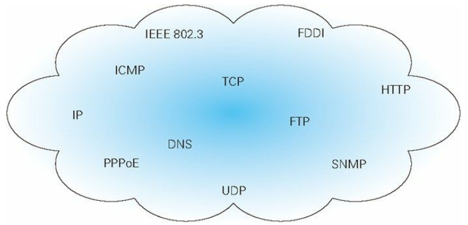
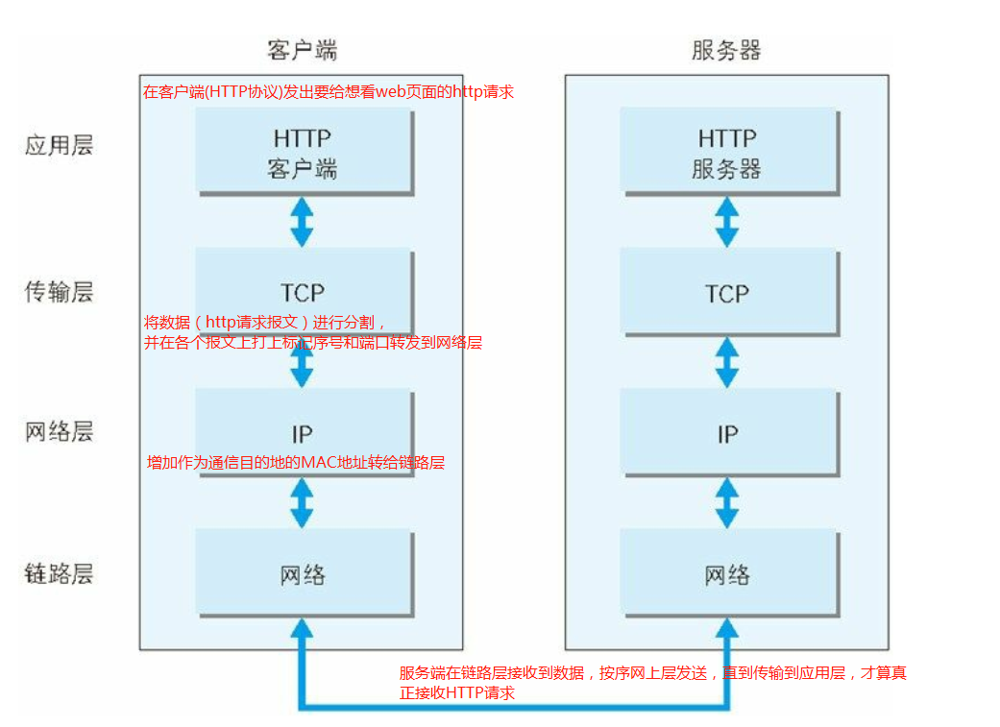
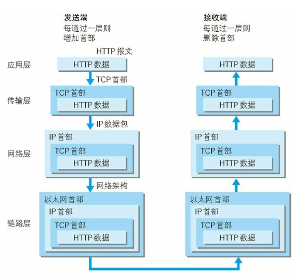
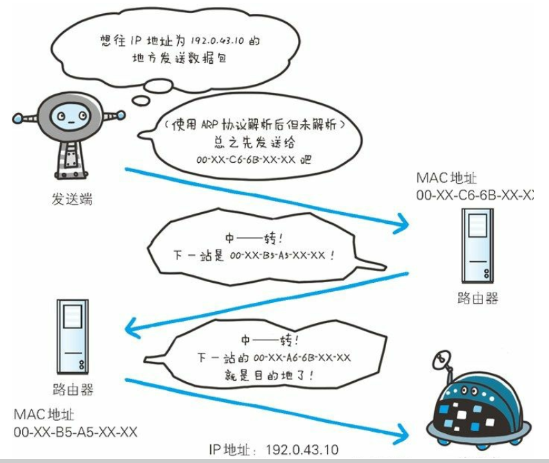
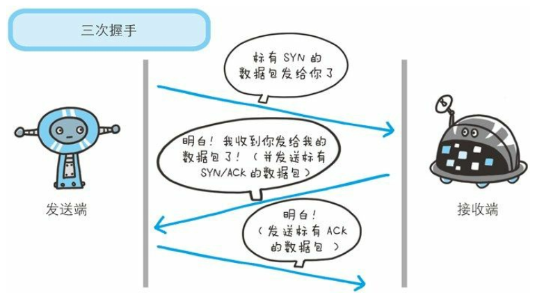
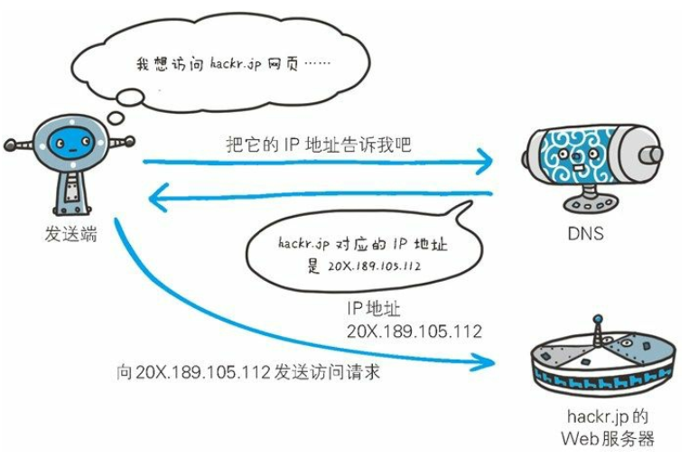

# 1. 什么是http
http（HyperText Transfer Protocol，`超文本船速协议`):是一种`协议规范`，完成从客户端到服务器端等一系列运作流程。而`协议`是指规则的约定。可以说：Web是建立在HTTP协议上通信的。

# 2. TCP/IP 网络基础
通常使用的网络是在`TCP/IP`协议族的基础上运作的，而HTTP属于它内部的一个子集。 

## 2.1 协议(protocol)
协议(protocol): 当计算机与网络设备需要通信，双方需要基于相同的方法（例如：如何探测到通信目标，哪边先发起通信，使用哪种语言通信，怎样结束通信等），这些遵循的的一种规则就是`协议(protocol)`。 
 
把互联万相关的协议集合起来统称`TCP/IP`。也可以认为`TCP/IP`是`TCP`和`IP`两种协议。

## 2.2 TCP/IP 模型
`应用层`：决定向用户提供应用服务时的通信活动。`TCP/IP`协议族内预存各类通用的应用服务。例如`FTP[File Transfer Protocol]`和`DNS[Domain Name System]`在改成，`HTTP`协议也处于该层。 
`传输层`： 提供网络连接中的两台计算机之间的数据传输。`TCP(Transmission Control Protocol)传输控制协议`和`UDP(User Data Protocol)用户数据报协议`处于该层。 
`网络层`:处理网络上流动的数据包。数据包是网络传输的最小数据单位。该层对定了通过怎样的传输路线（`在众多的路径中选择一条数据路线`）到达对方计算机，并把数据传送给对方。`IP（Internet Protocol）`属于该层 
`数据链路层`：用于处理联通网络的硬件部分。包括控制操作系统、硬件的设备驱动、NIC(Network Interface Card，网络适配卡[网卡])、光纤等物理可见部分。 
 
`发送端`在层与层之间传输数据时，每经过一层必定会`打上`该层所属的`首部信息`。`接收端`在曾与层传输数据时，每经过一层，会把`对应的首部消去`。 
这种把数据信息包装起来的做法叫做`封装（encapsulate）`。 
 

#3. 与HTTP关系密切的协议：IP、TCP和DNS

## 3.1 负责传输的IP协议
`IP`(Internet Protocol,网际协议):所有的网络系统都会用到IP协议（TCP/IP协议族中的IP）。不要将`IP`和`IP地址`搞混淆。 
`IP协议`：作用是将各种数据包传送给对方。传送正确的条件：
- IP地址： 节点被分配到的地址
- MAC地址： 网卡所属的固定地址(IP地址可以和MAC地址进行匹配，IP地址可变换，MAC地址基本不会变化) 

`ARP协议(Address Resolution Protocol)`： 地址解析协议。根据通信方的IP地址，反查出对应的MAC地址。 
IP间的通信依赖MAC地址。在网络上，正常的双方通信是需要经过多台计算机和网络设备中转才能连接。在中转时，会利用下一站中转设备的MAC地址来搜索下一个中转目标。这是就会采用`ARP协议`。 
 

## 3.2 确保可靠性的TCP协议
`TCP协议`属于`传输层`，提供可靠的字节流服务，将数据准确可靠地传送给对方 

字节流服务(Byte Stream Service)： 为了方便传输，将大块数据分割成以`报文段(segment)`为单位的`数据包`进行管理。 

为了准确无误地将数据送达目的地，`TCP协议`采用`三次握手`(three-way handshaking)策略。当`数据包`发送后，会向对方确认`是否成功送达`。握手标志(`flag`):
- SYN(synchronize): `发送端` 发送`SYN`标志给服务器端
- ACK(acknowledgement): `服务端` 返回`SYN/ACK` ，代表传达确认信息
- 最后 `发送端` 再次回传`ACK`的数据报，代表`握手结束`。如果握手过程某个阶段`中断`，TCP协议会`再次`以`相同顺序`发送`相同数据包`。 
 

## 3.3 负责域名解析的DNS服务
`DNS(Domain Name System)`: 应用于`应用层`的协议，提供`域名`到`IP地址`之间的解析服务 或 逆向从IP地址反查询域名的服务。 
 

# 4. URI 和URL
`URI（Uniform Resource Identifier）`: 统一资源标识符。由`某个协议方案表示的资源`的`定位标识符`。`协议方案`是指访问资源所使用的`协议类型名称`,例如`HTTP协议`的协议方案就是`http`。 
- Uniform: 规定`统一的格式`方便`处理`多种`不同类型`的资源。
- Resource: 可标识的任何东西。
- Identifier: 可标识的对象，也称为标识符。 

`URL(统一资源定位符)`表示资源的地点(互联网所处位置)，可知URL是URI的子集。

# URI 格式
 

上图是绝对URI的格式，其中每个具体属性描述如下： 
- 通过 协议方案名`http:` 或 `https:` 获取 访问资源时 `指定的协议类型`，也可使用`data:`或`javascript:`指定数据或脚本程序的方案名
- 登录认证： 从服务获取资源时需要的登录信息（可选项）
- 服务器地址：可以是域名（使用DNS解析），可以是IP地址
- 服务器端口号：链接服务器的网络端口号，可选。
- 带层次的文件路径： 指定服务器上的文件路径来定位特指的资源
- 查询字符串： 可以使用查询字符串传入任意参数
- 片段标识符：标记处以获取资源中的子资源（文档内的某个位置）