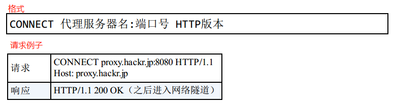

HTTP协议规定：请求从客户端触发，最后服务端响应请求并返回。<br>

# 1. 客户端请求
```javascript
请求报文 =  请求方法(GET,POST,PUT,DELETE..) + 请求URI(例如/index.html) + 协议版本(HTTP/1.1) + 可选的请求首部字段 + 内容实例
```
<br>

# 2. 服务端响应
```javascript
响应报文 =  协议版本(HTTP/1.1) + 状态码 + 解释性状态码的原因短语(ok) + 可选的响应首部字段 + 实体主体构成
```
<br>

# 3. HTTP 是无状态协议（stateless）
HTTP协议`不`对请求和响应之间的通信状态进行保存: 为了更快地处理大量事务，确保协议的可伸缩性。

# 4. HTTP Method
GET: 获取资源，指定的资源经服务器端解析后返回响应内容。<br>
<br>

POST: 用来传输实体的主体(告诉服务器信息)。虽然GET也可以传输实体，但一般不用GET而用POST.<br>
<br>

PUT: 用于传输文件，像FTP协议的文件上传一样，在请求报文的主体中包含文件内容，然后保存到请求的URI指定位置。HTTP/1.1的PUT不带验证机制，存在安全问题，因此一般不采用。在`REST(Representational State Transfer,表征状态转移)`中可能开放PUT方法。<br>
<br>

HEAD: 获取报文首部。用于确认URI的有效性及资源更新的日期时间等。(同GET一样，只是不返回报文主体部分)<br>
<br>

DELETE: 删除文件。删除请求的URI指定的资源。HTTP/1.1中DELETE也不带验证机制，因此一般Web网站不使用。在`REST`中可能开放DELETE方法。<br>
<br>

OPTIONS: 查询针对请求URI指定的资源支持的方法。<br>
<br>

TRACE: 追踪路径，让Web服务器端将`之前`的请求通信`环回`给客户端的方法。在发送请求时，在`Max-Forwards`首部字段中填写数值，经过一个服务器`-1`,当数值刚好到`0`时停止传输，最后接收到请求的服务器返回状态码`200`。容易引发`XST(Cross-Site Tracing,跨站追踪)`攻击。<br>
<br>

CONNECT: 要求在与代理服务器通信时建立隧道，实现用隧道协议进行TCP通信。主要使用`SSL(Secure Sockets Layer,安全套接字)`和`TLS(TransportLayer Security, 传输层安全)`协议把通信内容加密后在网络隧道中传输。<br>
<br>

# 5. 持久链接节省通信量

## 5.1 keep-alive
HTTP是无状态的，不会保持连接状态。当一个网站请求量比较大的时候，每次请求都会造成TCP连接建立和断开，增加通信量的开销。HTTP/1.1和部分HTTP/1.0中出现了`keep-alive(HTTP Persistent Connection)`,只要任意一段没有明确提出断开连接，则保持TCP连接状态。<br>
在 HTTP/1.1 中， 所有的连接默认都是持久连接。<br>
<br>

## 5.2 管线化(pipelining)
持久连接让多数请求以管道化的方式发送成为可能。每一个请求不再需要等待响应结束后再发起另外一个请求，可以`并行`发送多个请求。<br>
<br>

# 6. 使用Cookie进行状态管理
HTTP是无状态的，因此无法对之前发生的请求和响应进行管理。而Cookie通过在`请求`和`响应报文`中写入Cookie信息来控制客户端的状态。<br>
- 客户端发起请求(例如包含账号，密码)
- 服务器端接收，校验，并在`响应报文`内添加`Set-Cookie`的首部字段，保存相关授权信息
- 客户端接收后，在下一次请求中，在`请求报文`的`cookie`值中将授权信息传递给服务器，便于服务器识别<br>
<br>