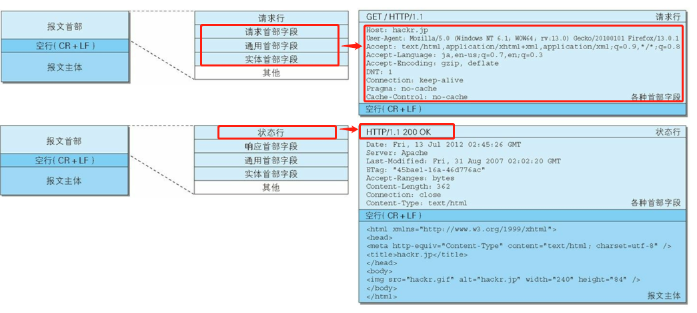
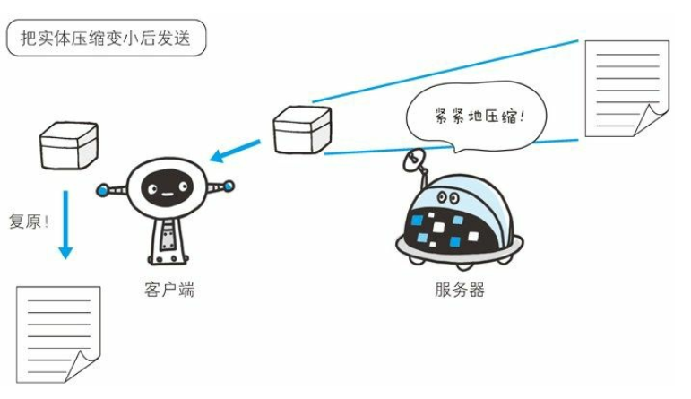
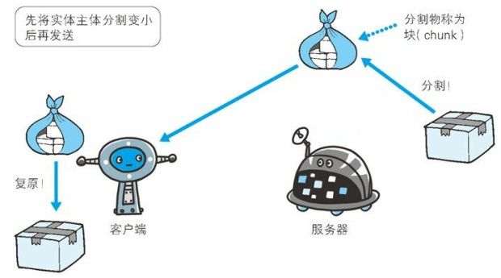
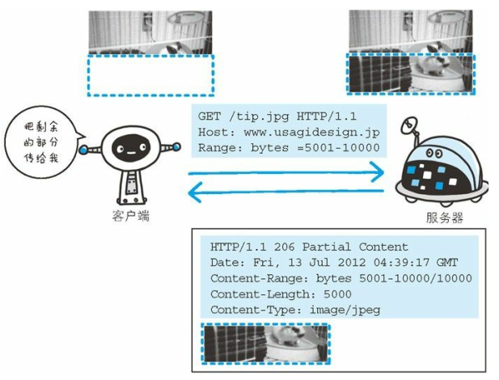

# 1. HTTP 报文
用于HTTP协议交互的信息被称为`HTTP报文`。请求端的叫`请求报文`，服务端的叫`响应报文`。是由多行(CR+LF作为换行符)数据构成的`字符串文本`。<br>
```javascript
HTTP报文= 报文首部 + 报文主体(非必要)
```
- 请求行： 包含请求的方法，请求的URI, HTTP 版本
- 响应行： 响应结果的状态码，原因短语，HTTP 版本
- 首部字段： 包含表示请求和响应的各种条件和属性的各类首部（通用首部，响应首部，请求首部和实体首部）
- 其他：可能包含HTTP的RFC（`Request For Comments`,征求意见稿）里未定义的首部(Cookie等)<br>

<br>

# 2. 报文主体和实体主体
报文（message）: 是HTTP通信基本单位，由8位组字节流组成，通过HTTP通信传输<br>
实体(entity): 作为请求和响应的有效载荷数据(补充项)被传输，其内容由`实体首部`+`实体主体`组成。<br>

- HTTP报文的主体：用于传输请求和响应的实体主体。
- 报文主体通常等于实体主体，如果传输过程中进行了编码操作，实体内容发生变化，才回导致和报文主体产生差异

# 3. 压缩传输的内容编码
内容编码：实体内容上的编码格式，并保存实体信息`原样压缩`。内容编码后的实体由客户端接收并负责解码。<br>
- gzip(GNU zip)
- compress(UNIX 系统的标准压缩)
- deflate(zlib)
- identify(不进行编码)<br>

<br>

# 4. 分割发送的分块传输编码
分块传输编码(`Chuncked Transfer Coding`): 在HTTP通信中，请求的编码实体为全部传输完毕之前，页面时无法显示的。因此在传递大容量数据时，将数据分割为多块，每一块都会使用十六进制进行标记块大小，最后一块实体主体使用`0(CR+LF)`标记，客户端负责接收解码，恢复编码前的实体主体，让浏览器`逐步`显示。<br>
<br>

# 5. 发送多种数据的`多部分对象集合(Multipart)`

多部分对象集合(Multipart): 容纳多份不同类型的数据,发送的一份报文主体内科含有多类型实体。通常在图片或文本文件等上传时使用。<br>
相关首部字段是`Content-type`,多部分对象集合包含的对象如下：<br>
- multipart/form-data: 在Web表单上传时使用
- multipart/byteranges: 状态码 206（Partial Content， 部分内容） 响应报文包含了多个范围的内容时使用

# 6. 获取部分内容的范围请求
`范围请求(Range Request)`：如果下载一个较大的资源，但是到中途中断，需要一种`恢复机制`，从之前的下载中断处恢复下载。要实现该功能，需要指定下载的实体范围。<br>
例如请求一个10000字节的图片，分范围获取:<br>
<br>
```javascript
// 请求：
// 表示图片的50001 - 10000 字节（ 5001- ：表示5001到最后， -5000: 表示开始到5000字节）
Range: bytes=5001-10000

// 响应：对于多重范围的范围请求， 响应会在首部字段 ContentType 标明 multipart/byteranges 后返回响应报文
```

# 7. 内容协商返回最合适的内容
`内容协商机制(Content Negotiation)`:当一个Web网站存在多分相同内容的页面（英文版和中文版），当浏览器默认语言为英文，则会显示英文版。<br>
内容协商会以响应资源的语言、字符集、编码方式等作为基准。包含在请求报文中的某些字段就是判断基准：<br>
- Accept
- Accept-Charset
- Accept-Encoding
- Accept-Language
- Content-Language<br>
内容协商技术有三种方式：<br>
- 服务器驱动协商：以请求的首部字段为参考，在服务端自动处理（对于用户来说，是以浏览器发送的信息为基准，不一定是最优的）
- 客户端驱动协商：用户从浏览器显示的可选择列表中自动选择。 还可以利用 JavaScript 脚本在 Web 页面上自动进行上述选
择。
- 透明协商：服务端驱动和客户端启动结合，由服务端可客户端各自进行内容协商的一种方法