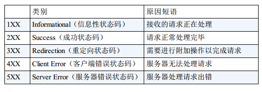
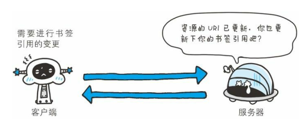
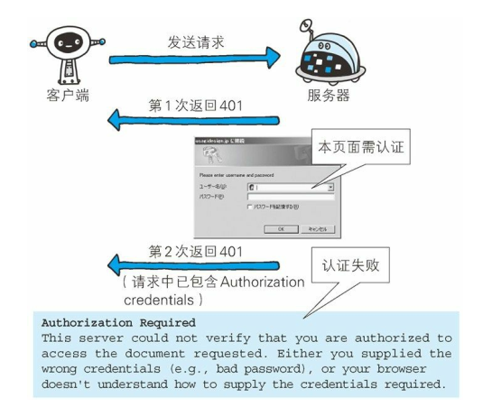
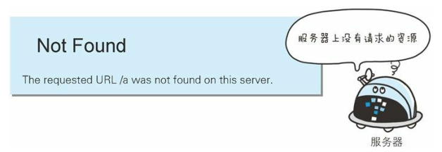
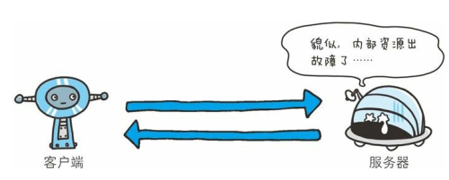

`HTTP状态码`是表示客户端HTTP请求的`返回结果`。标记服务器端的处理是否正常、通知出现的错误等。 
 

# 1. 200 成功
表示客户端的请求被服务器端`正常处理`。 
 

# 2. 204 No Content
表示客户端请求被服务器端成功处理，但是返回的响应报文中`不含实体的主体部分`。也不允许返回任何实体的主体。 
当浏览器接收到的请求时`204`，浏览器页面不发生更新。 
 

# 3. 206 Partial Content
该状态表示客户端进行了范围请求，而服务器端成功执行了这部分的GET请求，响应报文中包含由`Content-Range`指定范围的实体内容。 
 

# 4. 301 Moved Permanently
`永久性重定向`：
- 对于资源请求，`原来的url`和`响应头中location的url`而言，资源应该对应`location中的url`。
- 对于post请求的重定向，还是需要用户确认之后才能重定向，并且应该以post方法发出重定向请求。
- 资源对应的路径应该是location中返回的url，而不再是原请求地址 
 

# 5. 302 Found

`临时性重定向`：
- location中的地址不应该被认为是资源路径，在后续的请求中应该继续使用原地址
- 原请求是post，则不能自动进行重定向；原请求是get，可以自动重定向 
 

# 6. 303 See Other
`临时性重定向`： 同302一致，区别在于：原请求不论是GET,还是POST,都能自动进行重定向

# 7. 304 Not Modified（与重定向无关）
客户端发起`附带条件请求`时，服务器端允许访问请求资源，但未满足条件的情况。304 状态码返回时， 不包含任何响应
的主体部分。
- 附带条件请求: 指采用 GET方法的请求报文中包含 If-Match， If-ModifiedSince， If-None-Match， If-Range，If-Unmodified-Since 中任一首部。 
 

# 8. 307 Temporary Redirect
`临时性重定向`： 同302意义相同，307 会遵照浏览器标准：
- 原请求是post，则不能自动进行重定向；原请求是get，可以自动重定向

# 9. 400
该状态表示`请求报文`存在`语法错误`。 
 

# 10. 401 Unauthorized
该状态表示发送的请求需要通过HTTP认证的认证信息。 
 

# 11. 403 Forbidden
表明请求资源的访问被服务器拒绝。未获得文件的访问授权、访问权限出现某些问题等都会出现403。 
 

# 12. 404 Not Found
表明服务器上无法找到请求的资源。或者服务器端拒绝请求且不想说明理由时使用。 
 

# 14. 500 Internal Server Error
表明服务器端在执行请求时发生了错误，也可能是Wrb应用存在的bug或面临的故障。 
 

#  15. 503 Service Unavaliable
该状态码表明服务器暂时处于超负载或正在停机维护，现在无法处理请求。如果事先得知解除以上状况需要的时间， 最好写入
RetryAfter 首部字段再返回给客户端。 
 

