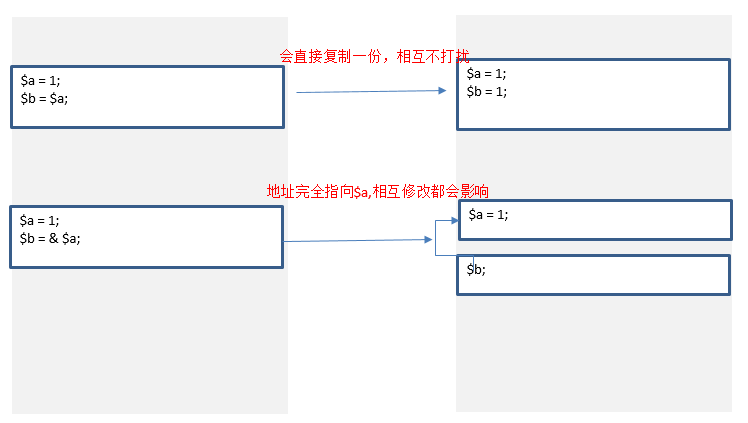

不同的名字访问同一个变量的内容。

# 1. 变量的引用
PHP 的引用允许你用两个变量来指向同一个内容。除了对象都遵循该规则，包括数组也遵循<br>
- a = & b;  是指a直接指向b在栈中的地址
- a = c; 直接拷贝一份值
<br>
```php
 $a="ABC";
$b =&$a;
echo $a;//这里输出:ABC
echo $b;//这里输出:ABC
$b="EFG";
echo $a;//这里$a的值变为EFG 所以输出EFG
echo $b;//这里输出EFG
```
# 2. 函数的引用传递
要注意的是，在这里`test(１)`的话就会出错。
```php
复制代码
<?php
function test(&$a)
{
    $a=$a+100;
}
$b=1;
echo $b;//输出１
test($b);   //这里$b传递给函数的其实是$b的变量内容所处的内存地址，通过在函数里改变$a的值　就可以改变$b的值了
echo "<br>";
echo $b;//输出101
?>
```
面的“ test($b); ” 中的$b前面不要加 & 符号，但是在函数“call_user_func_array”中，若要引用传参，就得需要 & 符号，如下代码所示：
```php
function a(&$b) {
    $b++;
}
$c = 0;
call_user_func_array('a', array(&$c));
echo $c;
```
# 3. 函数的引用返回
调用引用返回的函数`$a = test()`: 得到的结果并不是函数的引用返回，和普通函数调用没区别<br>
调用引用返回的函数`$a = &test()`: 得到的结果是 函数的引用返回
```php
function &test() {
    static $b = 0; // 声明静态变量
    $b = $b + 1;
    echo $b;
    return $b;
}

$a = test(); // 得到计算结果1，$a 没有得到引用返回
$a = 5; // 修改$a 不会影响$b的值
$a = test(); // 输出结果为2

$a = &test(); // 得到引用返回
$a = 5; // 修改$a 的值
$a = test(); // 同时也修改了$b的值
```
## 3.1 函数的引用返回（用在类上）
```php
class talker{

    private $data = 'Hi';

    public function & get(){
        return $this->data;
    }
   
    public function out(){
        echo $this->data;
    }   

}

$aa = new talker();
$d = &$aa->get();

$aa->out();
$d = ' How';
$aa->out();
$d = ' Are';
$aa->out();
$d = ' You';
$aa->out();

// 输出结果： Hi How Are You
```
# 4. 对象的引用
类对象赋值的时候，默认`引用赋值`。
- a = & b;  是指a直接指向b在栈中的地址
- a = c; 是a和c的栈中地址不一样，但指向的堆中的对象是同一个
<br>
```php
class SimpleClass
{
    // property declaration
    public $var = 'a default value';

    // method declaration
    public function displayVar() {
        echo $this->var;
    }
}

$instance = new SimpleClass();
$reference  =& $instance;
$assigned   =  $instance;

$instance->var = '$assigned will have this value';

$instance = null; 

var_dump($instance); // NULL
var_dump($reference); // NULL
var_dump($assigned); // 能打印出结果
```
clone：对象的复制(`浅复制 shallow copy`),对象的属性如果是`引用属性`，任然会指向原来的变量的引用。如果`对象有__clone()`方法，该`__clone()`方法会被间接调用。
```php
class OtherClass {
    public $name = "hello";
    public $value = "value";
}
class CloneTest {
    private $otherObj;
   
    public function __construct(OtherClass $obj, $name) {
        $this->otherObj = $obj;
    }
    public function __clone() {
        $this->otherObj = clone $this->otherObj;
    }
}
$other = new OtherClass(); // 对象内部的引用属性
$base = new CloneTest($other);
$clone = clone $base; // 
var_dump($clone);

$other->name = "change name"; // 当没有编写__clone()时，由于浅复制，引用属性 的指向仍然是相同的
var_dump($clone);
```
# 5. 取消引用
当你 unset 一个引用，只是断开了变量名和变量内容之间的绑定。这并不意味着变量内容被销毁了。例如：
```php
$a = 1;
$b =& $a;
unset ($a);
echo $b; // 1
echo $a; // undefined variable
```
当用 global $var 声明一个变量时实际上建立了一个到全局变量的引用。也就是说和这样做是相同的： 
```php
$GLOBALS["var"] = 'hello,world';
$b =& $GLOBALS["var"];
echo $b;
unset($b);
echo $GLOBALS["var"];
echo $b; // Undefined variable: b
```
函数内部给一个声明为 global 的变量赋于一个引用，该引用只在函数内部可见。
自我理解：global 是在函数内部创建一个变量，和global的变量指向同一个值，当值修改时，都会受影响。但如果只是修改内部变量的地址引用，则不会影响到外部的值。`global 声明变量`类似于对象的`默认地址引用`，指向堆中相同的值，而不是地址相同。
```php
$var1 = "Exanple var1";
$var2 = "Exanple var2";

function global_references($use_globals) {
    global $var1, $var2;
    if ($use_globals === 1) {
        $var2 = & $var1; // 地址改变，不会影响到全局变量的值
        echo "局部var2引用改变：$var2 \n";
    } else if($use_globals === 2){
        $var2 = "覆盖var2的值"; // 值改变，会影响外部的值
         echo "局部var2值改变：$var2 \n"; 
    } else {
        $GLOBALS['var2'] = & $var1; // 通过全局对象修改，绝对会改变
        echo "全局var2引用改变， 局部var2地址没有改变：$var2 \n";
    }
}
global_references(1); // 局部var2引用改变 ：Exanple var1
echo $var2."\n"; // Exanple var2

global_references(2); // 局部var2值改变 ：覆盖var2的值
echo $var2."\n"; // 覆盖var2的值


global_references(3); // 全局var2引用改变， 局部var2地址没有改变：覆盖var2的值
echo $var2."\n"; // Exanple var1
```
# 6. global 引用
