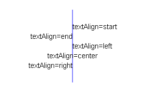
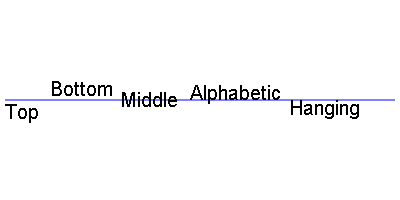

# 1. canvas 常用 method 属性:

- ctx.moveTo(x, y)<br>
  x,y 都是相对于 canvas 盒子的最左上角，从 x,y 的位置绘制一条直线到起点或者上一个线头点。<br>

- ctx.beginPath()/ctx.closePath():<br>
  路径开始和闭合.如果是绘制不同状态的线段或者形状，必须使用开始新路径的方法把不同的绘制操作隔开。闭合路径会自动把最后的线头和开始的线头连在一起。<br>

- ctx.stroke()<br>
  描边,根据路径绘制线。路径只是草稿，真正绘制线必须执行 stroke<br>

- ctx.fill()<br>
  填充，是将闭合的路径的内容填充具体的颜色。默认黑色<br>

- ctx.rect(x, y, width, height)<br>
  创建矩形，x, y 是矩形左上角坐标， width 和 height 都是以像素计,只是规划了矩形的路径，并没有填充和描边<br>

- ctx.strokeRect(x, y, width, height)<br>
  绘制完路径后立即进行 stroke 绘制<br>

- ctx.fillRect(x, y, width, height)<br>
  立即对当前矩形进行 fill 填充<br>

- ctx.clearRect(x, y, width, hegiht)<br>
  清除某个矩形内的绘制的内容，相当于橡皮擦<br>

- ctx.arc(x,y,r,sAngle,eAngle,counterclockwise)<br>
  创建弧/曲线（用于创建圆或部分圆）， x,y：圆心坐标，r：半径大小，sAngle:绘制开始的角度，terclockwise：是否逆时针，转换弧度规则：rad = deg\*Math.PI/180"图片线 表示坐标,所有基准都是基于 x,y 的相对位置（ctx.fillText(""tex"", (x)50, (y)48);）如果文字的宽度设置了，但是文字内容超出来，会将文字缩小

- ctx.font = "18px '微软雅黑'"

- ctx.textAlign<br>
  设置或返回文本内容的当前对齐方式<br>

  - start : 默认。文本在指定的位置开始。
  - end : 文本在指定的位置结束。
  - center: 文本的中心被放置在指定的位置。
  - left : 文本左对齐。
  - right : 文本右对齐<br>
<br>

- ctx.textBaseline<br>
  设置或返回在绘制文本时使用的当前文本基线<br>
  - alphabetic ： 默认。文本基线是普通的字母基线。
  - top ： 文本基线是 em 方框的顶端。。
  - hanging ： 文本基线是悬挂基线。
  - middle ： 文本基线是 em 方框的正中。
  - ideographic： 文本基线是 em 基线。
  - bottom ： 文本基线是 em 方框的底端。<br>
<br>

- context.drawImage(img,x,y，width，height)<br>
  x,y 绘制图片左上角的坐标 width 绘制图片的宽度， height：绘制图片的高度.宽高不必须，如果指定宽高，最好成比例，不然图片会被拉伸<br>

- context.drawImage(img,sx,sy,swidth,sheight,x,y,width,height)<br>
  sx,sy 裁剪的左上角坐标，swidth：裁剪图片的高度。 sheight:裁剪的高度<br>

- context.fillStyle<br>
  设置或返回用于填充绘画的颜色，可以接受颜色名,16 进制数据，rgb 值，甚至 rgba. 一般先进行设置样式然后进行绘制<br>

- context.strokeStyle<br>
  设置或返回用于笔触的颜色<br>

- context.scale(scalewidth,scaleheight)<br>
  缩放的是整个画布，缩放后，继续绘制的图形会被放大或缩小<br>

  - scalewidth： 放当前绘图的宽度 (1=100%, 0.5=50%, 2=200%, 依次类推)
  - 缩放当前绘图的高度 (1=100%, 0.5=50%, 2=200%, etc.)"

- ctx.translate(x,y)<br>
  发生位移后，相当于把画布的 0,0 坐标 更换到新的 x,y 的位置，所有绘制的新元素都被影响。位移画布一般配合缩放和旋转等<br>

  - x： 添加到水平坐标（x）上的值
  - y： 添加到垂直坐标（y）上的值

- context.rotate(angle)<br>
  旋转当前的绘图，如需将角度转换为弧度，请使用 degrees\*Math.PI/180 公式进行计算<br>

- save() / restore()<br>

```
let saveIndex = ctx.save() 保存当前环境的状态。可以把当前绘制环境进行保存到缓存中。不是内容，是canvas设置（一般配合位移画布使用）
ctx.restore() 返回之前保存过的路径状态和属性，获取最近缓存的 ctx（一般配合位移画布使用）
restoreToCount 恢复到特定的保存点(上面的saveIndex)。
```

- canvas.toDataURL(type, encoderOptions)<br>
  把 canvas 绘制的内容输出成 base64 内容 <br>

  - canvas.toDataURL(""image/jpg"",1) - type，设置输出的类型，比如 image/png image/jpeg 等<br>
  - encoderOptions： 0-1 之间的数字，用于标识输出图片的质量，1 表示无损压缩，类型为： image/jpeg 或者 image/webp 才起作用。"<br>

- ctx.drawImage(img,x,y)<br>
  img 参数也可以是画布，也就是把一个画布整体的渲染到另外一个画布上。<br>

- context.measureText(text).width<br>
  文本的宽度<br>

- canvas 清空方式
- 重新设置宽度或者高度
```
var c = document.getElementById("myCanvas");
c.width=c.width;
```

- clearRect
```
创建一个大画布，然后再 clearRect
```

# 2. tips
不要用 CSS 控制它的宽和高,会走出图片拉伸.<br>
重新设置 canvas 标签的宽高属性会让画布擦除所有的内容。<br>
可以给 canvas 画布设置背景色<br>
如果没有 moveTo,则第一个 lineTo 作为 moveTo<br>

# 3. 参考链接
https://malun666.github.io/aicoder_vip_doc/#/pages/canvas?id=_31-canvas-%e9%a2%9c%e8%89%b2%e6%a0%b7%e5%bc%8f%e5%92%8c%e9%98%b4%e5%bd%b1<br>
https://developer.mozilla.org/zh-CN/docs/Web/API/CanvasRenderingContext2D/save
